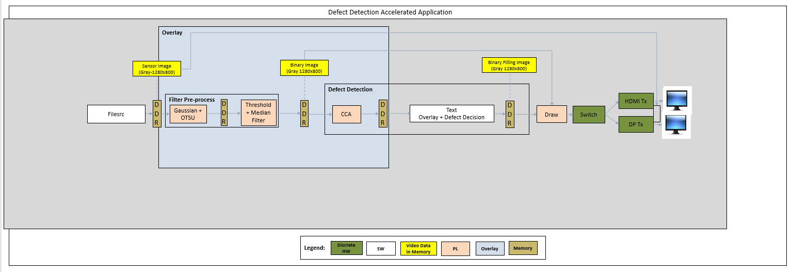
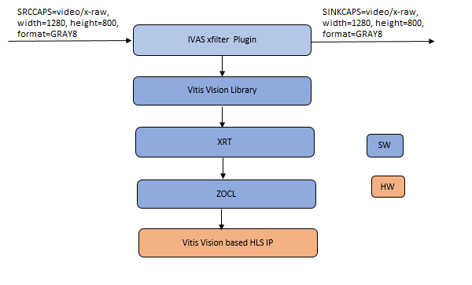
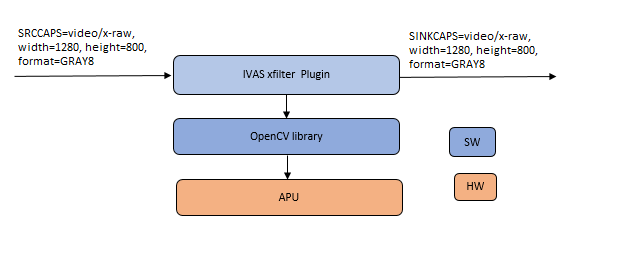

# Software Architecture of the Accelerator


## Introduction


This document describes the software architecture of the Defect Detection accelerator application.


### Software Architecture

In the Defect Detection application, the Computer Vision Starter Kit can take video inputs from a file. As shown in the following figure, the video inputs will be in the Luma(Y) format, processed and displayed. Vitis overlay includes Vitis Vision libraries that process the frames and try to detect defects in mangoes.

In this reference design, the resolution on the input frames is 1280 x 800, and the outputs are 3x1280x800 on a 4K display.

---
**NOTE**

1280x800p is the resolution that the application supports.

---



The parts before pre-process plugin and after mixer for data source and sink respectively, use purely official GStreamer plugins, such as *filesrc* for file input, and *Kmssink* for the display. Refer to the [GStreamer documentation](https://gstreamer.freedesktop.org/documentation/tutorials/index.html?gi-language=c) for detailed usage.

The core acceleration tasks are performed by the Pre-Process, Canny, and Edge Tracer plugins, which are developed by XILINX.

<details>
 <summary><b>The following table lists the GStreamer plugins used in the application.</b></summary>


| GStreamer Plugins| Definition|Note|
| ----------- | ----------- |------ |
| filesrc     | Image capturing from the file      |Upstream GStreamer |
| Kmssink  | For the display        |Upstream GStreamer|
|Queue | Simple data queue | Upstream GStreamer|
|Tee|1-to-N pipe fitting|Upstream GStreamer|
|IVAS xfilter|Kernel Library: *pre-process*. Linking Vitis Vision library to do color space conversion and perform filtering to remove the salt and pepper noise for defect detection.|Xilinx Plugin|
|IVAS xfilter|Kernel Library: *canny_edge*. Linking Vitis Vision library to the Canny edge detector is an edge detection operator that uses a multi-stage algorithm to detect a wide range of edges in images.|Xilinx Plugin|
|IVAS xfilter|Kernel Library: *edge_tracer*. Linking Vitis Vision library to trace the edge for defect calculation.|Xilinx Plugin|
|IVAS xfilter|Kernel Library: *defectcalc*. Linking *OpenCV* software library to find the contour, fill the contour, and embed text as result into output images.|Xilinx Plugin|
____

</details>

<details>
 <summary><b>The following table lists the Component types used in the application.</b></summary>


| Pipeline| Component|Component Type|
| ----------- | ----------- |------ |
| Pre-Process  | Threshold Binary |PL|
|  | Median Filter |PL |
|Defectdetection | Canny Accelerator | PL
| |Edge Tracer Accelerator|PL|
| |Defect Calculation|SW|

____

</details>


### In-House Plugins

The following are the in-house plugins:

#### Pre-process

<details>
 <summary><b>Click here to view details</b></summary>


The pre-process pipeline is shown in the following image:


The grey-scale image should be converted to a binary image with an appropriate threshold value. The threshold function in the Vitis Vision library can perform the thresholding operation on the input image. This should yield an image that has a black background with the mango area in white.

The median blur filter acts as a non-linear digital filter that reduces noise. A filter size of N outputs the median of the NxN neighborhood pixel values, for each pixel. In this design, N is 3.

This plugin accepts the 1280x800 Y8 image as input. The plugin applies the threshold binary algorithm to convert the Y8 image to binary image by using the threshold value of the pixel. Later, it applies the Median filter to remove salt and pepper noise.

The following figure depicts the Pre-Process plugin software stack.


The following figure depicts the Pre-Process plugin data flow.


Threshold and Median Blur kernels are connected together using AXI Stream interface.

</details>

#### Canny

<details>
 <summary><b>Click here to view details</b></summary>

The Canny edge detector finds the edges in the video frame. In this algorithm, the noise in the image is reduced first by applying a Gaussian mask. The Gaussian mask used here is the average mask of size 3x3. Thereafter, gradients along *x* and *y* directions are computed using the Sobel gradient function. The gradients are used to compute the magnitude and phase of the pixels. The phase is quantized, and the pixels are binned accordingly. Non-maximal suppression is applied on the pixels to remove the weaker edges.

Canny algorithm aims to satisfy three main criteria:

1. Low error rate: Good detection of only existent edges.

2. Good localization: The distance between edge pixels detected and real edge pixels must be minimized.

3. Minimal response: Only one detector response per edge

The following figure depicts the Canny plugin software stack.



The following figure depicts the Canny plugin data flow.


</details>

#### Edge Tracer

<details>
 <summary><b>Click here to view details</b></summary>

The Edge Tracer is applied on the remaining pixels to draw the edges on the image. In this algorithm, the Canny up to non-maximal suppression is in one kernel, and the edge linking module is in another kernel.   The Contour Filling function, which is the final function required to detect defects in the mango, is done in the PS. After non-maxima suppression, the output is represented as 2-bits per pixel, where:

* 00 - represents the background
* 01 - represents the weaker edge
* 11 - represents the strong edge

The output is packed as 8-bit (four 2-bit pixels) in 1 pixel per cycle operation and packed as 16-bit (eight 2-bit pixels) in 8 pixel per cycle operation. For the edge linking module, the input is 64-bit, in which 32 pixels of 2-bit are packed into a 64-bit image. The Edge Tracer is applied on the pixels and returns the edges in the image.

Canny, Edge Tracer HLS' IP works in memory mapped fashion and generates only one output.


The following figure depicts the Edge Tracer plugin software stack.


The following figure depicts the Edge Tracer plugin data flow.


</details>

#### Defect Calculation

<details>
 <summary><b>Click here to view details</b></summary>


The output of the Edge Tracer plugin is fed into the Defect Calculation block which calculates the defect density and decides the quality of the mango. The block performs the following main operations:

* The contours delineate regions of the mango that are blemished. Blemished pixels are marked with white color in the binary image.

* The ratio of blemished pixels to total image pixels is calculated to determine how much of the mango's surface area is covered with blemishes.

* Defect Decision determines whether the ratio exceeds a user-defined threshold, to decide whether the mango is acceptable or not.

The following figure depicts the Defect Calculation plugin software stack.



The following figure depicts the Defect Calulation plugin data flow.


</details>


## Configuration Files

<details>
 <summary><b>Click here to view details</b></summary>


The **defect-detect** application uses the following configuration files.

* Pre-Process

The *pre-process.json* file is as follows:

```
{
  "xclbin-location": "/lib/firmware/xilinx/kv260-defect-detect/kv260-defect-detect.xclbin",
  "ivas-library-repo": "/opt/xilinx/lib",
  "element-mode": "transform",
  "kernels": [
    {
      "kernel-name": "preprocess_accel:preprocess_accel_1",
      "library-name": "libivas_preprocess.so",
      "config": {
        "debug_level" : 1,
        "threshold": 35,
        "max_value": 255
      }
    }
  ]
}

```
    * debug_level: Enable or disable debug log for the Kernel library.
    * threshold: Threshold value
    * max_value: Maximum value to use with the THRESH_BINARY thresholding types.
    For more information, see https://docs.opencv.org/master/d7/d1b/group__imgproc__misc.html#gae8a4a146d1ca78c626a53577199e9c57

* Canny Accelerator

The *canny-accelerator.json* file is as follows:

```
{
  "xclbin-location": "/lib/firmware/xilinx/kv260-defect-detect/kv260-defect-detect.xclbin",
  "ivas-library-repo": "/opt/xilinx/lib",
  "element-mode": "transform",
  "kernels": [
    {
      "kernel-name": "canny_accel:canny_accel_1",
      "library-name": "libivas_canny_edge.so",
      "config": {
        "debug_level" : 1,
        "thr1": 35,
        "thr2": 255
      }
    }
  ]
}

```
    * debug_level: Enable or disable debug log for the Kernel library.
    * thr1: First threshold for the hysteresis procedure.
    * thr2: Second threshold for the hysteresis procedure.
    For more info, see https://docs.opencv.org/3.4/dd/d1a/group__imgproc__feature.html#ga04723e007ed888ddf11d9ba04e2232de

* Defect Calculation

The *defect-caclulation.json* file is as follows:

```
{
  "xclbin-location": "/lib/firmware/xilinx/kv260-defect-detect/kv260-defect-detect.xclbin",
  "ivas-library-repo": "/opt/xilinx/lib",
  "element-mode":"transform",
  "kernels" :[
    {
      "library-name":"libivas_defectcalc.so",
      "config": {
        "debug_level" : 1,
        "font_size" : 1.0,
        "font" : 3,
        "x_offset" : 750,
        "y_offset" : 50,
        "defect_threshold" : 0.08,
        "is_acc_result" : 1
      }
    }
  ]
}


```
    * debug_level: Enable or disable debug log for the Kernel library.
    * font_size: User configuration to change the font size.
    * font: User configuration to change the supported font type.
    * x_offset: The X co-ordinate from where the text starts writing.
    * Y_offset: The Y co-ordinate from where the text starts writing.
    * defect_threshold: The defect density threshold to calculate the defect. If the defect value is more than the threshold, it falls under defect category.
    * is_acc_result: Flag to display the accumulated result. If the value is 0, then the accumulated result will not be displayed.
    For more information see https://docs.opencv.org/3.4/d0/de1/group__core.html#ga0f9314ea6e35f99bb23f29567fc16e11.

* Edge Tracer

The *edge-tracer.json* file is as follows:

```
{
  "xclbin-location": "/lib/firmware/xilinx/kv260-defect-detect/kv260-defect-detect.xclbin",
  "ivas-library-repo": "/opt/xilinx/lib",
  "element-mode": "transform",
  "kernels": [
    {
      "kernel-name": "edgetracing_accel:edgetracing_accel_1",
      "library-name": "libivas_edge_tracer.so",
      "config": {
        "debug_level" : 1
      }
    }
  ]
}
```
    * debug_level: Enable or disable debug log for the Kernel library.

</details>

## Next Steps

*  [Hardware Architecture](hw_arch_platform_dd.md)
* [Hardware Accelerator](hw_arch_accel_dd.md)

### License

Licensed under the Apache License, Version 2.0 (the "License"); you may not use this file except in compliance with the License.

You may obtain a copy of the License at
[http://www.apache.org/licenses/LICENSE-2.0](http://www.apache.org/licenses/LICENSE-2.0)


Unless required by applicable law or agreed to in writing, software distributed under the License is distributed on an "AS IS" BASIS, WITHOUT WARRANTIES OR CONDITIONS OF ANY KIND, either express or implied. See the License for the specific language governing permissions and limitations under the License.

<p align="center">Copyright&copy; 2021 Xilinx</p>