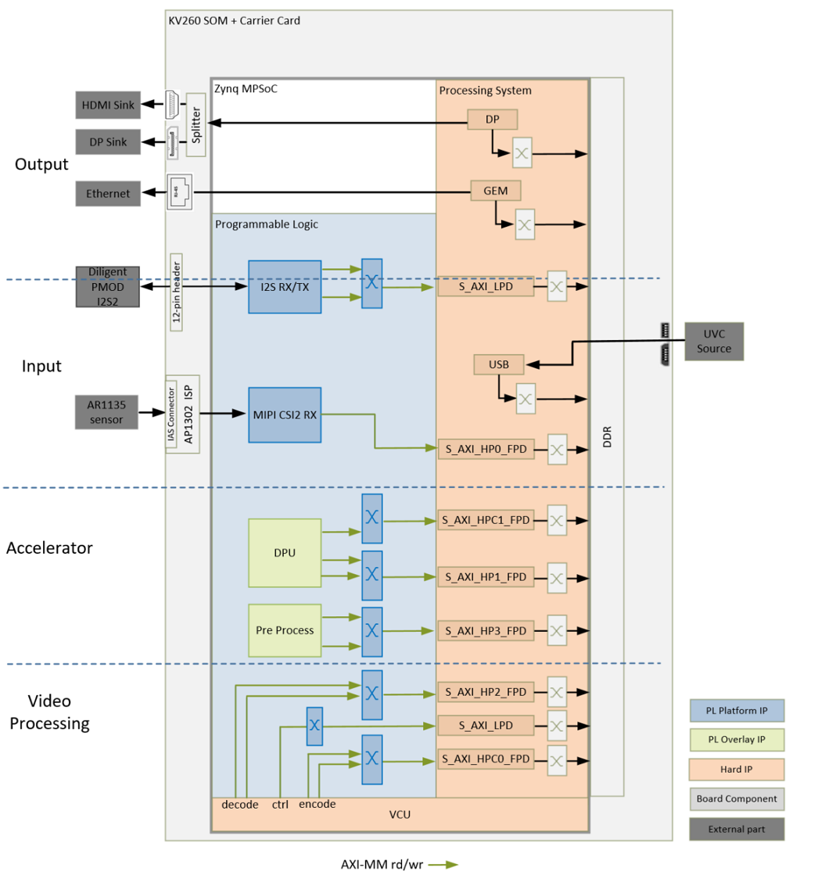
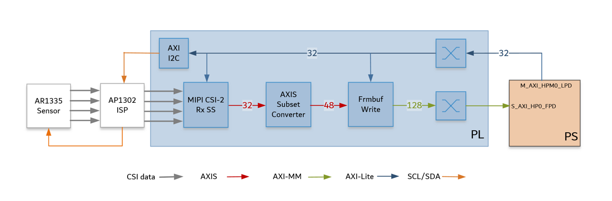
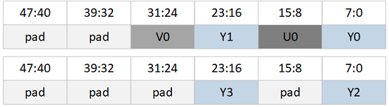
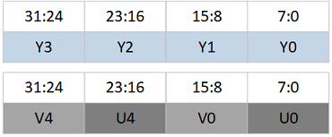
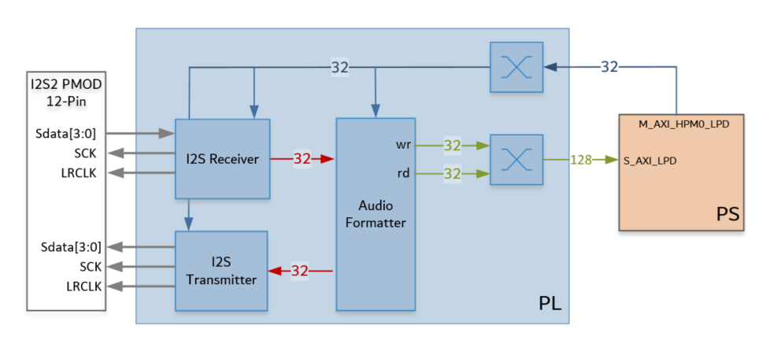

<table class="sphinxhide">
 <tr>
   <td align="center"><h1> Kria&trade; KV260 Vision AI Starter Kit   Smart Camera Tutorial</h1>
   </td>
 </tr>
 <tr>
 <td align="center"><h1> Hardware Architecture of the Platform </h1>

 </td>
 </tr>
</table>

# Hardware Architecture of the Platform

## Introduction
 This section describes the design implemented in Programmable Logic (PL). The following figure shows the top level hardware architecture of the reference design.

 At a high level, the design comprises of four pipelines

Capture/Input pipeline: This comprises of pipelines through which audio/video data are captured.

* USB capture pipeline (PS)
* MIPI CSI-2 capture pipeline (PL)
* I2S Audio receive pipeline (PL)

Display/Output pipeline: This comprises of pipelines through which audio/video data are outputted.

* DisplayPort pipeline (PS)
* Ethernet pipeline (PS)
* I2S Audio transmit pipeline (PL)

Video processing pipeline: This comprises of VCU encoder and decoder for compressing/decompressing video data.

Accelerator pipeline : This comprises of overlay accelerator functions integrated into the platform using Vitis.

* The Deep Learning Processing Unit (DPU) IP runs different Neural Network models (PL)
* The Pre-Processing block modifies the input data as required by the Network (PL)

**Note:**  The PS interconnects in the figure are conceptual.

## Capture
### Single Sensor MIPI Capture

A capture pipeline receives video frames from an external source and writes it into memory. The single sensor MIPI CSI-2 receiver capture pipeline is shown in the following figure.

This pipeline consists of four components, of which two are controlled by the APU via an AXI-Lite based register interface; one is controlled by the APU via an I2C register interface, and one is
configured statically.

* The On Semi AR1335 is a CMOS active pixel image sensor with a pixel array of 4208H x 3120V.   It sends sensor data to the ISP through a 4-lane MIPI interface.  It is controlled and programmed by the ISP via a two-wire serial interface. The sensor is connected to the IAS 0 module connector on the ML carrier card. For more information refer to the datasheet from https://www.onsemi.com/products/sensors/image-sensors-processors/image-sensors/ar1335

* The On Semi AP1302 ISP is a Image signal processor digital image sensor supporting image resolutions up to 4224x 3156V. AP1302 interfaces to CMOS imaging sensors and performs all the necessary operations required to capture video streams. It performs functions like Auto White Balancing (AWB),  Auto Exposure (AE), Auto Focus (AF) etc.  The ISP is controlled via an I2C interface using an AXI I2C controller in the PL. It is mounted on a ML carrier card and has a MIPI output interface that is connected to the MIPI CSI-2 RX subsystem inside the PL. A GPIO is used to reset the IP. For more information refer to the datasheet from https://www.onsemi.com/products/sensors/image-sensors-processors/image-processors/ap1302

* The MIPI CSI-2 receiver subsystem (CSI Rx) includes a MIPI D-PHY core that connects four data lanes and one clock lane to the ISP.  It implements a CSI-2 receive interface according to the MIPI CSI-2 standard v2.0 with underlying MIPI D-PHY standard v1.2. The subsystem captures images from the ISP in YUV 4:2:0 format and outputs AXI4-Stream video data.  At two pixels per clock (ppc) and 8 bits per pixel, the AXIS width is 32 bits. For more information see the MIPI CSI-2 Receiver Subsystem Product Guide [PG232](https://www.xilinx.com/support/documentation/ip_documentation/mipi_csi2_rx_subsystem/v5_0/pg232-mipi-csi2-rx.pdf).

* The AXI subset converter, see AXI4-Stream Infrastructure IP Suite LogiCORE IP Product Guide [PG085](https://www.xilinx.com/support/documentation/ip_documentation/axis_infrastructure_ip_suite/v1_1/pg085-axi4stream-infrastructure.pdf), is a statically-configured IP core that converts the 32 bit AXI4-Stream input data to 48 bit AXI4-Stream output data by adding zeros to the MSB of each data word. At two ppc,  the AXIS width is 48 bits.  The format on the AXI4-Stream is shown below for the even and odd lines.

* The video frame buffer takes YUV 4:2:0 AXI4-Stream input data and converts it to AXI4-MM format which is written to memory in semi-planar YUV 4:2:0 format. The Y and UV are stored in separate planes as shown below. The AXI-MM interface is connected to the S_AXI port of the PS.  

For each video frame transfer, an interrupt is generated. A GPIO is used to reset the IP between resolution changes.  For more information see Video Frame Buffer Read and Video Frame Buffer Write LogiCORE IP Product Guide [PG278](https://www.xilinx.com/support/documentation/ip_documentation/v_frmbuf/v1_0/pg278-v-frmbuf.pdf)

All the IPs in this pipeline are configured to transport 2ppc @ 300 MHz, enabling up to 3840x2160 resolution at 60 frames per second (fps). But the MIPI line rate of 896 Mbps doesn't support 60 fps. Maximum throughput requirement is 3840x2160 resolution at 30 fps so the set MIPI line rate should be adequate.

Note: MIPI video clock requirement for NV12 (YUV420) at line rate 896 Mbps is 221 MHz @ 2ppc, so we could run all the IPs at 221 MHz @ 2ppc.  For more information see the MIPI CSI-2 Receiver Subsystem Product Guide [PG232](https://www.xilinx.com/support/documentation/ip_documentation/mipi_csi2_rx_subsystem/v5_0/pg232-mipi-csi2-rx.pdf).

## Display

The Video output pipelines and Video Processing pipelines are not covered in this section as they are not PL components. For more information refer to DisplayPort Controller and GEM Ethernet chapters in the Zynq UltraScale+ Device Technical Reference Manual [UG1085](https://www.xilinx.com/support/documentation/user_guides/ug1085-zynq-ultrascale-trm.pdf). For more information on Video Processing pipelines refer to Video Codec Unit LogiCORE IP Product Guide [PG252](https://www.xilinx.com/support/documentation/sw_manuals/xilinx2020_2/pg252-vcu.pdf).

## Audio Transmit and Receive

This platform also supports capture and replay of audio. The I2S audio RX-to-TX pipeline is shown in the following figure. This pipeline consists of three components, all of which are controlled by the APU through an AXI4-Lite base register interface.

* The I2S Receiver/Transmitter IP can be connected to audio devices for receiving and transmitting PCM audio. The I2S IPs typically interface with the external ADC/DAC which facilitates the playback of audio. The IPs are configured to have two audio channels. The IPs supports any sampling rate and can be configure registers via the AXI Lite Salve interface. For more information refer to LogiCORE IP Product Guide for I2S Transmitter and I2S Receiver [PG308](https://www.xilinx.com/support/documentation/ip_documentation/i2s/v1_0/pg308-i2s.pdf). In this reference design no acceleration function is run on the Audio data and it is in pass through mode.

* The audio formatter provides high-bandwidth direct memory access between memory and AXI4-Stream target peripherals. Initialization, status, and management registers are accessed  through an AXI4-Lite slave interface. It is configured with both read and write interface enabled for a maximum of two audio channels and  interleaved memory packing mode with memory data format configured as AES to PCM. The IP receives audio input from the I2S RX IP and writes the data to memory. It reads audio data from memory and sends  it out to the I2S TX IP, which forwards it to the output device. See the Audio Formatter Product Guide (PG330) for more information.

## Clocks, Resets and Interrupts

### Clocks
The following table identifies the main clocks of the PL design, their source, their clock frequency, and their function.

| Clock      | Clock Source  | Clock Frequency     | Funtion |
| :---       |    :----:     |         :---:       | :-----  |
| pl_clk0 | PS | 100 MHz | Clock source for clocking wizard (clk_wiz_0) generating clocks |
| clk_200M |	Clocking wizard |	200 MHz	| MIPI D-PHY core clock |
| clk_100M* |	Clocking wizard	| 100 MHz	 | AXI-Lite clock to configure the different audio and video IPs in the design. It is also used as a AXI Stream clock for the stream connection between the I2S receiver IP and the Audio formatter IP |
| clk_300M* |	Clocking wizard |	300 MHz |	AXI MM clock and AXI Stream clock used in the capture pipeline, display pipeline, and processing pipeline|
| clk_50M |	Clocking wizard |	50 MHz |	PLL reference clock for the VCU IP |
| clk_600M* |	Clocking wizard |	600 MHz	| Generated to be used by the accelerator |
| pl_clk1 |	PS | 	100 MHz	| Clock source for clocking wizard (clk_wiz_audio) generating clocks mainly for the audioIPs |
| clk_out1 |	Clocking wizard |	18.43 MHz |AXI MM clock and AXI Stream clock used in the audio pipeline. Also drives the mclk_out_rx on the 12-PIN PMOD interface via an ODDR |
| clk_out2 |	Clocking wizard	| 18.43 MHz | Drives the mclk_out_tx on the 12-PIN PMOD interface via an ODDR. Phase shifted by180 degrees wrt clk_out1 |
| lrclk_out, sclk_out |	I2S receiver |	variable | 	Drives clocks on the 12-PIN PMOD interface |
| lrclk_out, sclk_out	| I2S transmitter |	variable | 	Drives clocks on the 12-PIN PMOD interface |

\*Clocks exposed as a Platform interface and can be used by an accelerator

### Resets
The following table summarizes the resets used in this design.

| Reset Source | Function  |
| :---         |    :----  |
|pl_resetn0		|PL reset for proc_sys_reset modules and the clock_wizard generating clocks for the video domain |
|rst_processor_100MHz	|Synchronous resets for clk_out100M clock domain						 |
|rst_processor_300MHz	|Synchronous resets for clk_out300M clock domain						 |
|rst_processor_600MHz	|Synchronous resets for clk_out600M clock domain						 |
|pl_resetn1		|PL reset for proc_sys_reset modules and the clock_wizard generating clocks for the audio domain |
|rst_processor_18MHz	|Synchronous resets for clk_out1 clock domain							 |
|GPIOs			|												 |
|emio_gpio_o[0]		|Frame Buffer Write IP reset									 |
|emio_gpio_o[1]		|AP1302 ISP Reset										 |
|emio_gpio_o[2]		|VCU reset											 |

### Interrupts
The following table lists the PL-to-PS interrupts used in this design.

| Inerrupt ID | Instance  |
| :---        |    :----  |
|pl_ps_irq1[0]	| MIPI RX Subsytem IP 						    |
|pl_ps_irq1[1]	| Frame Buffer Write IP 					    |
|pl_ps_irq1[2]	| VCU IP 							    |
|pl_ps_irq1[3]	| AXI I2C IP 							    |
|pl_ps_irq1[4]	| I2S receiver IP						    |
|pl_ps_irq1[5]	| I2S transmitter IP						    |
|pl_ps_irq1[6]	| Audio formatter IP - Stream to Memory Map			    |
|pl_ps_irq1[7]	| Audio formatter IP - Memory Map to Stream			    |
|pl_ps_irq0	| Exposed as a Platform interface and can be used by an accelerator |

## Resource Utilization
The resource utilization numbers on this platform post implementation is reported in the table below.

| Resource  | Utilization  | Avaialble  | Utilization %  |
| :---      |    :----     | :---       |    :----       |
|LUT	|21514	|117120	|18.36	|
|LUTRAM	|1975	|57600	|3.42	|
|FF	|32085	|234240	|13.69	|
|BRAM	|18	|144	|12.50	|
|URAM	|1	|64	|1.56	|
|DSP	|35	|1248	|2.80	|
|IO	|15	|186	|8.06	|
|BUFG	|10	|352	|2.84	|
|MMCM	|2	|4	|50.0	|
|PLL	|1	|8	|12.5	|

## Next Steps

* [Hardware Architecture of the Accelerator](hw_arch_accel.md)
* Go back to the [KV260 SOM Smart camera design start page](../smartcamera_landing)

### License

Licensed under the Apache License, Version 2.0 (the "License"); you may not use this file except in compliance with the License.

You may obtain a copy of the License at
[http://www.apache.org/licenses/LICENSE-2.0](http://www.apache.org/licenses/LICENSE-2.0)

Unless required by applicable law or agreed to in writing, software distributed under the License is distributed on an "AS IS" BASIS, WITHOUT WARRANTIES OR CONDITIONS OF ANY KIND, either express or implied. See the License for the specific language governing permissions and limitations under the License.

Copyright&copy; 2021 Xilinx

