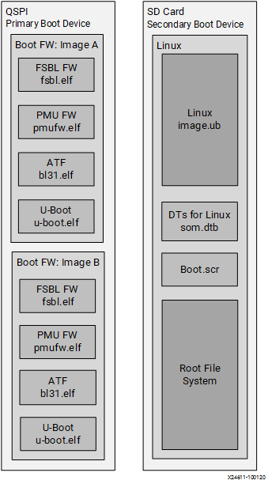
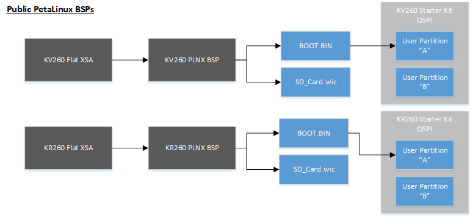
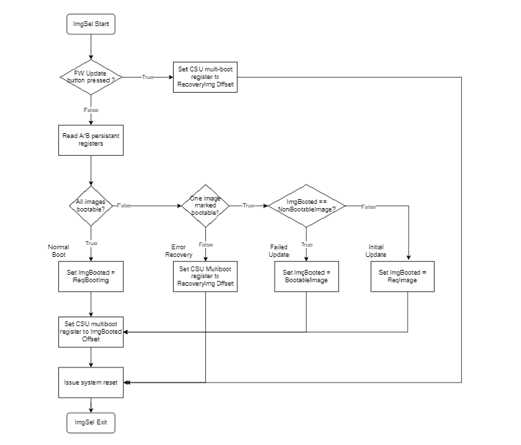

# Boot Firmware Overview

The SOM Starter Kits use a two stage boot process. The primary boot firmware is pre-installed at the factory on the QSPI device. The secondary boot device is an SD card containing the Linux kernel and Linux root filesystem (rootfs). The AMD Starter Kit carrier card hardware design sets the MPSoC boot mode to QSPI32. The SOM boots up to U-Boot using the QSPI contents and U-Boot then hand-off to the secondary boot device.

This document gives an overview to various components in the Kria SOM boot firmware, and points to source code available for customers to get started with their implementations for their Kria SOM  custom carrier card. For general information about boot of the Zynq MPSoC, refer to Zynq UltraScale TRM [Boot and Configuration](https://docs.xilinx.com/r/en-US/ug1085-zynq-ultrascale-trm/Boot-and-Configuration) chapter.

The QSPI image and its boot firmware (FW) contents in SOM Starter Kits are common across all K26 starter kits.

The overall boot device definition and firmware contents are outlined in the following figure.



For advanced evaluation a user can customize boot firmware using Yocto or the corresponding kit PetaLinux BSP. Refer to [BootFW BOOT.BIN Generation page](./bootfw_boot.bin_generation.md) for pointers on how to generate BOOT.BIN. Yocto or PetaLinux BSP can be used to generate a new BOOT.BIN that is then loaded to the QSPI user A/B partition and custom SD card contents summarized in the following diagram:



## Primary Boot Device

The primary boot device is a QSPI device physically located on the Kria SOM. The necessary elements are packaged in a Zynq® UltraScale+™ MPSoC specific format and file captured as BOOT.BIN. The BOOT.BIN file contains the board-specific boot firmware that consists of the following elements:

- FSBL: First-stage boot-loader firmware
  - [Source code](https://github.com/Xilinx/embeddedsw/tree/master/lib/sw_apps/zynqmp_fsbl)
  - FSBL is generated in [Yocto](https://xilinx.github.io/kria-apps-docs/yocto.html) or [PetaLinux](https://docs.xilinx.com/r/en-US/ug1144-petalinux-tools-reference-guide/First-Stage-Boot-Loader-for-Zynq-UltraScale-and-Zynq-7000-Devices), the flow is not unique to Kria SOM. Released SOM BSP generates FSBL by default when executing ```petalinux-build```.
- PMU: Platform management unit firmware
  - [Source code](https://github.com/Xilinx/embeddedsw/tree/master/lib/sw_apps/zynqmp_pmufw)
  - SOM specific PMU guidance can be found on [SOM wiki page](https://xilinx-wiki.atlassian.net/wiki/spaces/A/pages/1641152513/Kria+K26+SOM#MPSoC-PMU-FW)
- TF-A: Trusted Firmware with support for A-Profile Arm processors
  - [Details](https://www.trustedfirmware.org/about/)
  - [Source code](https://git.trustedfirmware.org/TF-A/trusted-firmware-a.git/) and [read-only copy](https://github.com/ARM-software/arm-trusted-firmware) - bl31 used
- U-Boot: Second-stage boot loader
  - [details](#u-boot)

The primary boot device provides a fail-over copy of boot firmware arranged in an A/B configuration. The A/B configuration provides a dynamic primary and secondary (last known working) image operation with corresponding update mechanisms. On boot, the system automatically boots from the defined primary image, and, if boot fails, it falls back to the previously known good boot image.

## Secondary Boot Device

The secondary boot device on the Kria Starter Kits is an SD card. It contains the operating system image and associated application files. It also contains a superset of device trees for various board configurations and a boot script used by U-Boot to select the dynamically detected board configuration.

## A/B Boot Concept

 The Kria Starter Kits support an A/B FW update mechanism to ensure that the platform has a known good fallback in the event of an issue during the upgrade process. The A/B concept is that two copies of the software stack are maintained in the non-volatile (NV) memory, with one being the "current" image  and the other being “backup”.

 For illustration, say the user booted till Linux using Image A.

The user has the capability to update the backup image, which is Image B in this case. This update can be done using bootfw_update utility from xmutils from Linux (also called [Image Update](#image-update)). Upon updating Image B, the requested image is set to Image B and it is marked as "Non-Bootable".  Upon reboot, [Image Selector](#image-selector-application) uses the following algorithm to decide which image to boot:

1) If both images are marked "Bootable", Image Selector boots the requested image.

2) If both images are marked "Non Bootable", this state implies the FW is in a bad state, since neither of the images are verified as booting till Linux and the system will then boot the [Image Selector](#image-selector-application) application [Image Recovery](#image-recovery-application).  Note that this state should not occur if using then normal A/B update mechanisms.

3) If the requested image is non-bootable and the last booted image is bootable, it implies the requested image was updated during the previous boot and hence that image, Image B in the example, is selected for boot.

4) If the requested image is non-bootable and the last booted is non-bootable, it implies the newly updated Image B failed to boot. In this case, Image selector falls back to the known good image, which is Image A and Image A boots.

ImgSel flow based on the QSPI persistent registers is shown in below figure.



Kria SOM A/B updates builds on top of the MPSoC multi-boot functionality and abstracts the A/B concept with two pre-defined boot partitions. The boot.bin A/B partitions are maintained and laid out in the QSPI primary boot device. The QSPI will have a dedicated region for maintaining persistent boot state registers and the associated boot image offsets.

To work within the functionality of the MPSoC CSU ROM the Image Selector application that is launched at power-on reset (POR) to select which boot.bin image is used by passing a different offset to the CSU multi-boot register. The ImgSel application can be copied after each of the boot image partitions at the a 32KB boundary such that if the boot fails, CSU ROM functionality immediately loads ImgSel as the next discovered image. This allows ImgSel to provide the failure recovery mechanism to point back to the last bootable image based on the state information in the A/B Persistent Register.

Note that to see which image was selected for booting, read MultiBootOffset value from FSBL prints, for an example:

```text
  Zynq MP First Stage Boot Loader 
  Release 2023.1   May  1 2023  -  00:38:12
  MultiBootOffset: 0x40
  Reset Mode    :    System Reset
```

If MultiBootOffset is 0x40, image A was selected. If MultiBootOffset is 0x1f0, then image B was selected.

## Boot FW QSPI Memory Map

The boot FW of the Kria Starter Kits is pre-loaded at time of production in the SOM QSPI memory. This device is intentionally isolated from the SD card to ensure that the board is always in a bootable state and SW developers can primarily focus on OS level updates and late bound loading of bitstreams. Sectors of the QSPI device on Kria Starter Kits are locked during production to prevent accidental overwrite in customer systems; with the only sectors that are read/write are the A and B boot partitions by the xmutil [Image Update](#image-update) and [Image Recovery tools](#image-recovery-application).

Note that production SOM (that is to be used with custom CC) does not have locked or pre-loaded QSPI.

The following is QSPI memory map used for Kira SOM starter kits.

| Offset (hex)   | Size (hex) | Sector Access | Description                                             | Linux mtd |
|----------------|------------|---------------|---------------------------------------------------------|-----------|
| 0x00000000     | 0x80000      | R             | [Image Selector Application](#image-selector-application)                              | 0         |
| 0x00080000     | 0x80000      | R             | Image Selector Application Golden                       | 1         |
| 0x00100000     | 0x20000      | R/W           | [Image Selector registers](#image-selector-registers) | 2         |
| 0x00120000     | 0x20000      | R/W           | Image Selector register backup                          | 3         |
| 0x00140000     | 0xC0000      | -             | Reserved                                                | 4         |
| 0x00200000     | 0x300000     | R/W           | Image A ( BOOT.BIN containing FSBL, PMU, ATF, [U-Boot](#u-boot))   | 5         |
| 0x00500000     | 0xA00000     | R/W           | Space for larger images (PL - 8MB, RPU - 2MB)           | 5         |
| 0x00F00000     | 0x80000      | R             | ImgSel Image A Catch (ImgSel application)               | 6         |
| 0x00F80000     | 0x300000     | R/W           | Image B ( BOOT.BIN containing FSBL, PMU, ATF, [U-Boot](#u-boot))   | 7         |
| 0x01280000     | 0xA00000     | R/W           | Space for larger images (PL - 8MB, RPU - 2MB)           | 7         |
| 0x01C80000     | 0x80000      | R             | ImgSel Image B Catch (ImgSel application)               | 8         |
| 0x01D00000     | 0x100000     | -             | reserved                                                | 9         |
| 0x01E00000     | 0x200000     | R             | [Image Recovery Application](#image-recovery-application)                              | 10        |
| 0x02000000     | 0x200000     | R             | Image Recovery Application backup                       | 11        |
| 0x02200000     | 0x20000      | R/W           | U-Boot storage variables                                | 12        |
| 0x02220000     | 0x20000      | R/W           | U-Boot storage variables backup                         | 13        |
| 0x02240000     | 0x40000      | R             | QSPI Image Version Information*                         | 14        |
| 0x02280000     | 0x20000      | R/W           | Secure OS storage                                       | 15        |
| 0x022A0000     | 0x1d60000    | R/W           | End Address (User)                                      | 16        |

\*   QSPI Image Version Information Example: XilinxSom_QspiImage_v1.0_20201030 Last 32Bytes: HashValue Hash Algo: SHA256 It is only 256Bytes but has to be 64KB aligned - therefore size is 0x10000.

Starting from 2022.2, Yocto can generate QSPI images for Starter Kits. Information can be found in [QSPI Stitching page](./bootfw_qspi_stitching.md)

## Image Selector Registers

Below table shows contents of image selector registers at offset 0x100000

| Offset | Register                  | Description                                                                          | Default Value for SOM Manufacturing Image |
|--------|---------------------------|--------------------------------------------------------------------------------------|-------------------------------------------|
| 0x0    | Identification String     | “ABUM” – A/B Update Mechanism                                                        | 0x4D554241                                |
| 0x4    | Version                   | 0x1                                                                                  | 0x00000001                                |
| 0x8    | Length                    | 4 – No of registers present (not including the first 4)                              | 0x00000004                                |
| 0xC    | Checksum                  | SUM of all words excluding checksum                                                  | 0xAEB1BDB9                                |
| 0x10   | Persistent State register | See [table below](#persistent-register)                                              | 0x01010000                                |
| 0x14   | Image A offset            | CSU multi-boot address offset of "Image A". Must correspond to 32KB boundary.        | 0x00200000                                |
| 0x18   | Image B offset            | CSU multi-boot address offset of "Image B". Must correspond to 32KB boundary         | 0x00F80000                                |
| 0x1C   | Recovery offset           | CSU multi-boot address offset of "Recovery Image". Must correspond to 32KB boundary. | 0x01E00000                                |

## Persistent Register

Below table shows the encoding for persistent register. Default value for SOM manufacturing image: 0x01010000

| Bit width | Field                | Type | Description                    |
|-----------|----------------------|------|--------------------------------|
| 7:0       | Last Image Booted    | R    | 0 - Image A, 1 - Image B       |
| 15:8      | Requested Boot Image | RW   | 0 - Image A, 1 - Image B       |
| 23:16     | Image B Bootable     | RW   | 0 - Not bootable, 1 - Bootable |
| 31:24     | Image A Bootable     | RW   | 0 - Not bootable, 1 - Bootable |

## Boot Image Applications

The following applications uses or update Image A/B and/or persistent registers. All three applications are independent and can work standalone with no dependencies across the three applications.
For more information on how to uses the three applications, please refer to [Kria SOM wiki](https://xilinx-wiki.atlassian.net/wiki/spaces/A/pages/1641152513/Kria+K26+SOM#Boot-Firmware-Updates) and [UG1089's Board Reset, Firmware Update and Recovery chapter](https://www.xilinx.com/support/documentation/user_guides/som/1_0/ug1089-kv260-starter-kit.pdf).

### Image Selector Application

The Image Selector(ImgSel) application is a small baremetal application running out of OCM after a POR/SRST to select the OS boot image. It reads the persistent register to decide which image to boot from in the QSPI memory map.

Read the [Image Selector](./bootfw_image_selector.md) page for more details on this application.

### Image Update

The Image Update Linux application is a function being called by xmutil that updates image A or image B at run time. It is included in the Kria Starter Kit Linux root file system. When it is called to update image A or image B, it will also update the persistent register.

Read [Boot FW via xmutil section of Kria SOM wiki](https://xilinx-wiki.atlassian.net/wiki/spaces/A/pages/1641152513/Kria+K26+SOM#Boot-FW-via-xmutil) for information on how to use Image Update. Visit the [linux image update repository](https://github.com/Xilinx/linux-image_update/tree/master) to see its source code.

### Image Recovery Application

The Image Recovery application is a baremetal application that uses a web-browser-based user interface. It is invoked when the FW-update button is pressed at power-on, or when both image A and image B becomes un-bootable. It can be used to directly update the A/B images and persistent register states.

Read the [Image Recovery](./bootfw_image_recovery.md) page for more details on this application.

## U-Boot

U-Boot provides the functionality for the hand-off between the primary boot device and the secondary boot device. It will select the appropriate boot devices, load the Linux kernel, select Linux device tree based on detected HW configuration, and then boot Linux.

U-Boot is an open source Universal Boot Loader that is frequently used in the Linux community. AMD provides a Git tree located at [github](https://github.com/Xilinx/u-boot-xlnx) which includes [U-Boot to run on Xilinx boards](https://xilinx-wiki.atlassian.net/wiki/spaces/A/pages/18842223/U-boot). U-Boot for SOM has been configured to support dynamic booting on different starter kits using MPSoC PMU configuration objects.

Read the [PMU configuration objects](./bootfw_pmu_config_obj.md) and [U-Boot handoff](./bootfw_uboot_handoff.md) for more details on dynamic carrier card configuration in Kria StarterKits.

## QSPI Component and QSPI Update

QSPI used in commercial grade SOM is [MT25QU512ABB8E12-0SIT](https://www.micron.com/products/nor-flash/serial-nor-flash/part-catalog/mt25qu512abb8e12-0sit), QSPI used in I-grade SOM is [MT25QU512ABB8E12-0AAT](https://www.micron.com/products/nor-flash/serial-nor-flash/part-catalog/mt25qu512abb8e12-0aat). The QSPI has locking functionality - refer to linked datasheets on Micron for details.

If developers are developing on AMD released starter kits, QSPI image is locked and the only section that should need update is the Image A/B section along with the persistent registers.

However, if developers are developing their own carrier cards, the production SOM's QSPI section is not locked. The entire QSPI can be customized by customers to meet their boot firmware requirements for their production designs.

## License

Licensed under the Apache License, Version 2.0 (the "License"); you may not use this file except in compliance with the License.

You may obtain a copy of the License at
[http://www.apache.org/licenses/LICENSE-2.0](http://www.apache.org/licenses/LICENSE-2.0)

Unless required by applicable law or agreed to in writing, software distributed under the License is distributed on an "AS IS" BASIS, WITHOUT WARRANTIES OR CONDITIONS OF ANY KIND, either express or implied. See the License for the specific language governing permissions and limitations under the License.

<p class="sphinxhide" align="center">Copyright&copy; 2023 Advanced Micro Devices, Inc</p>
