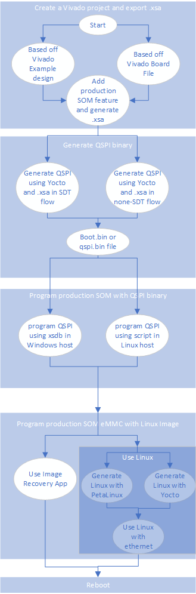
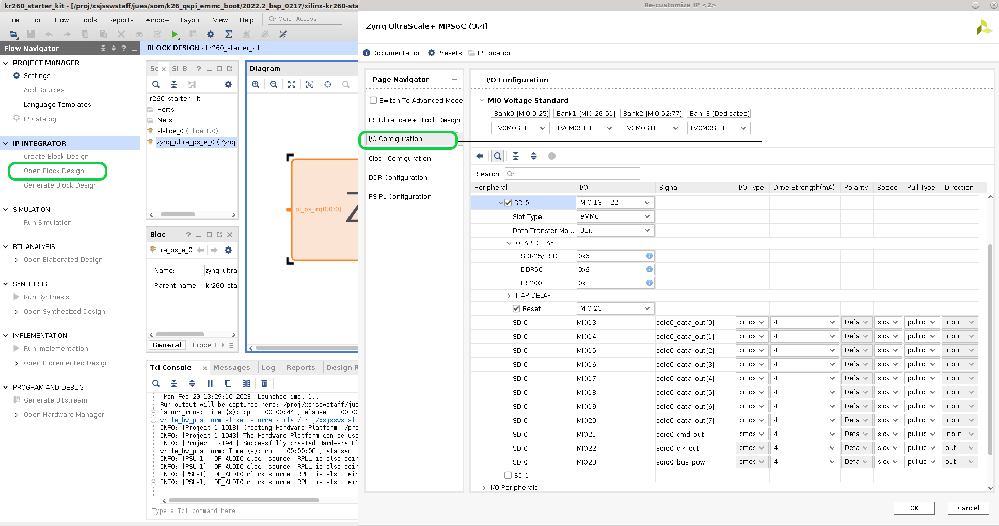
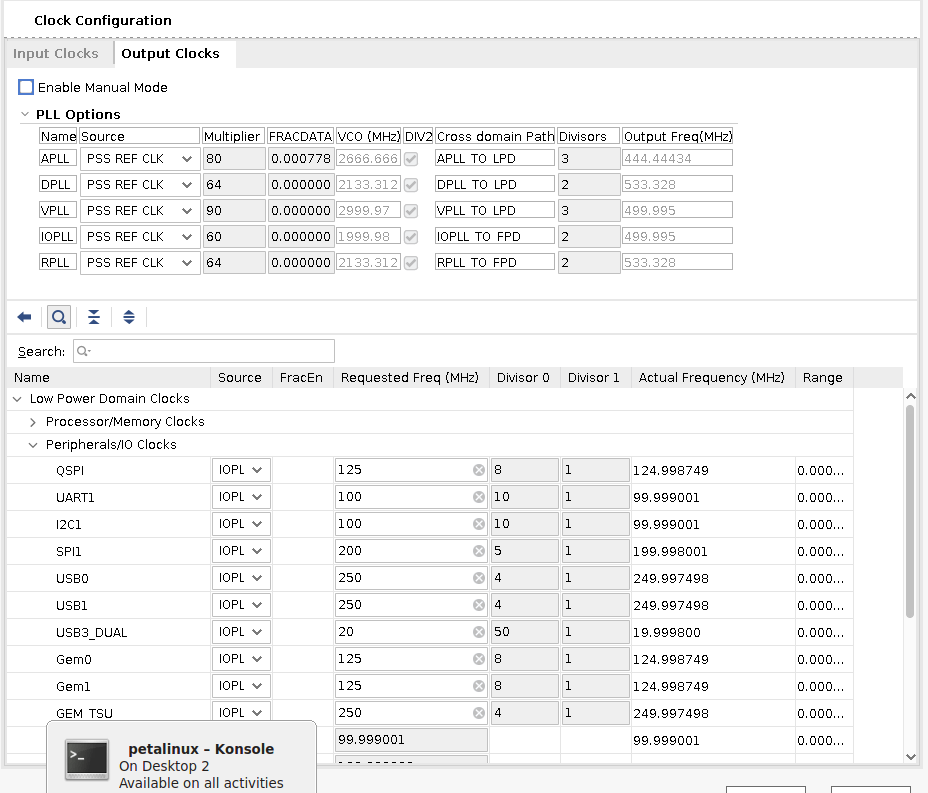
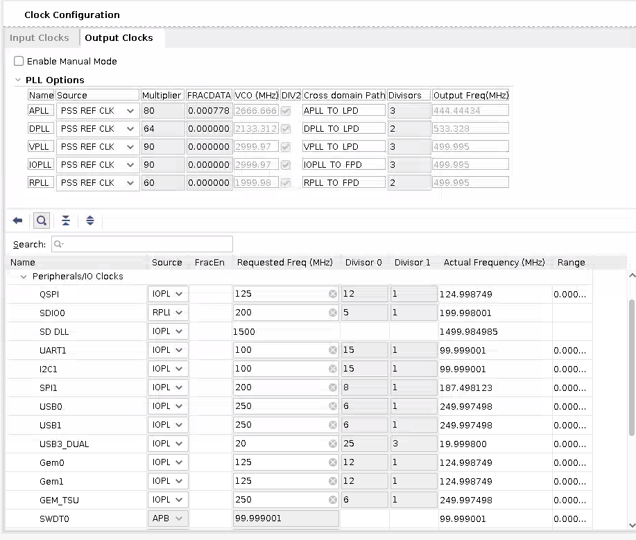

# QSPI to eMMC Boot for Production SOM

## Introduction

The production SOM has an eMMC device populated, whereas the Starter Kit SOMs does not. Therefore, instead of the Starter Kit's QSPI-> SD two stage boot process, you can do a QSPI -> eMMC two stage process on the production SOM. This page gives an example of how to boot from QSPI -> eMMC for a K26 production SOM that is mounted on a KV260 or KR260 carrier card. However, it also applies to a K24 production SOM (I grade or C grade) on a KD240 carrier card.
>**NOTE:** The removal of the SOM from an AMD produced Starter Kit voids its warranty. This workflow is only intended to provide an example for creating your own carrier card design and wanting to make use of a similar two-stage boot methodology.

You can also use the traditional monolithic boot (from eMMC) for production SOMs by using the eMMC boot mode and placing the boot files in the eMMC. This method is not covered by this document and also requires you to set the BOOT_MODE pins to eMMC on your production carrier card.

This tutorial is targeted for 2022.2 releases and tool chains.

## Prerequisites

1. Completed Getting Started with Kria SOM [KV260](https://www.xilinx.com/products/som/kria/kv260-vision-starter-kit/kv260-getting-started/getting-started.html), [KR260](https://www.xilinx.com/products/som/kria/kr260-robotics-starter-kit/kr260-getting-started/getting-started.html), or [KD240](https://www.xilinx.com/products/som/kria/kd240-drives-starter-kit/kd240-getting-started/getting-started.html)
2. Read [Bootfw Overview](./bootfw_overview.md) and its associated contents.
3. Vivado or Vivado Lab installed on the host computer.
4. Gone through the [Yocto flow](https://xilinx.github.io/kria-apps-docs/yocto/build/html/docs/yocto_kria_support.html) on the host computer.
5. (Optional) PetaLinux installed on the host computer.

## Steps

There are many different ways to get a production SOM to boot from QSPI to eMMC. In this doc, the following steps are suggested with Kria SOM:

0. [Create the Vivado project and export the .xsa file with the Production SOM and Carrier Card peripheral support](#0-export-xsa-file-with-production-som-and-carrier-card-peripheral-support)

1. [Generate binary image for QSPI with starter kit peripherals and eMMC](#1-generate-binary-image-for-qspi-with-starter-kit-peripherals-and-emmc)

2. [Program the Production SOM with a QSPI binary using XSDB/XSCT and U-Boot](#2-program-production-som-with-qspi-binary)

3. [Program the Production SOM eMMC with a Linux image](#3-program-production-som-emmc-with-linux-image), there are two ways to do this:
    1. [Program the Production SOM eMMC with the Image Recovery Application](#3a-program-production-som-emmc-with-the-image-recovery-application) (does not support Ubuntu)
    2. [Program the Production SOM eMMC with Linux image targeted for eMMC using Linux booted from the SD card with two steps](#3b-program-production-som-emmc-with-linux-image-using-linux):
        1. [Boot Linux Through SD](#3ba-boot-linux-through-sd).
        2. [Write to eMMC in Linux](#3bb-write-to-emmc-in-linux).

4. [Reboot in QSPI mode](#4-reboot-in-qspi-mode)

The following figure shows a graphical representation of the flow to help you guide through the many options of doing each step:



### 0. Export .XSA file with Production SOM and Carrier Card Peripheral Support

First, create a Vivado project that has both the Production SOM features (such as eMMC support for K24c/K24i and K26, and just for K24i, DDR ECC enablement) and carrier card peripheral features. This allows you to later generate QSPI boot images or .wic images with features from both, enabling access to eMMC and Ethernet at the same time. The easiest way is to start from a Starter Kit SOM, as that has all the CC peripheral support, and you just need to enable eMMC, and in the case of K24i, DDR ECC.

#### Getting the Base Starter Kit Vivado Design

The base hardware project can be obtained either through example designs, or Vivado board files.

##### Method 1: Example design

If the targeted tool version is 2024.2.1 and newer, follow the instructions in [Generate Vivado Project from Example Designs](https://xilinx.github.io/kria-apps-docs/creating_applications/2022.1/build/html/docs/Generate_vivado_project_from_CED.html) to generate a base hardware project from Vivado example designs.

##### Method 2: Board Files

Follow the instructions in [Generate Vivado Project from Board Files](https://xilinx.github.io/kria-apps-docs/creating_applications/generate_vivado_project_boardfile.html) to generate a base hardware project from board files.
</details>

#### Next, add Production SOM only Features

<details>
<summary>Add Production SOM only Features (click to expand instructions) </summary>

Click **IP INTEGRATOR** -> **Open Block Design**, and double click **ZYNQ UltraSCALE+ PS** block to open the configuration wizard for the PS.

In the configuration wizard, navigate to **I/O Configuration** -> **Low Speed** -> **Memory Interfaces** -> **SD**, check **SD0**, and match the configuration of SD 0 to that of the following screenshot:



Then click **OKAY**, save the project, and click **IP_ITEGRATOR** -> **Generate Block Design**. After that is finished, click **File** -> **Export** -> **Export Hardware**, leave the default settings (but ensure to include bitstream), choose a xsa file name such as ```kr260_starter_kit_emmc8bit```, and click **next** until **finish**. The generate ```kr260_starter_kit_emmc8bit.xsa``` file is also generated.

>**NOTE:** If you are using a K24i, you need to also enable the DDR ECC feature as it is not enabled on the K24 Production SOM or K24c.

</details>

### 1. Generate binary image for QSPI with starter kit peripherals and eMMC

Unlike the Starter Kit SOM, the production SOM is shipped without QSPI prepopulated. You must first program QSPI with the appropriate boot firmware so that the SOM will boot to U-Boot via the QSPI contents and then hand off to the Linux OS image in eMMC. The full QSPI binary for Starter Kit SOM is not released; however, each components can be generated as outlined in the [Bootfw Overview](./bootfw_overview.md) and its pages.

There are two different yocto machines you can use to rebuild boot firmware with the new .xsa file:

* the sdt machines that is available from 2024.2 onward(k26-sm-sdt, or k24i-sm-sdt, or k24c-sm-sdt)
* the old none-sdt machines that is obsolete from 2025.1 onward (k26-sm, or k24i-sm, or k24c-sm)

See [Yocto Support](https://xilinx.github.io/kria-apps-docs/yocto/build/html/docs/yocto_kria_support.html) for more details on which tool versions supports each machine name. 

There are also two recipes you can generate in this step

* the xilinx-bootbin recipe generates a boot.bin that contains u-boot, fsbl, etc
* the kria-qspi recipe generates a qspi.bin that contains boot.bin in its A/B partition, and image recovery.

If you plan to use image recovery utility to update eMMC, then kria-qspi is required. If you plan to use Linux to update eMMC, then either recipe generates a working binary.


#### Instruction to regenerate with SDT flow

<details>
<summary> Expand for instructions </summary>

1. Generate SDT using SDTGEN and the .xsa generated in the [previous step].(#0-export-xsa-file-with-production-som-and-carrier-card-peripheral-support)
2. update machine .conf to the new SDT generated artifacts and generate new boot.bin
3. update the dtb file to include CC peripherals

To generate the artifacts needed for SDT flow, first create a gen_sdt.tcl script:

``` bash
set xsa_path <path to .xsa file>

 set_dt_param -debug enable
 set_dt_param -dir ./<tarballname>
 set_dt_param -xsa $xsa_path
 set_dt_param -board_dts zynqmp-smk-k26-reva 
 generate_sdt
```

Then execute sdtgen with the tcl script and tarball the output:

``` bash
sdtgen gen_sdt.tcl
tar -czvf <tarballname>.tar.gz <tarballname>
```

Next, generate a bootbin binary that supports the production SOM + CC peripheral in Yocto with the tarball, the commands expected (using 2025.1 as an example here):

``` bash
    #<MACHINE name> needs to be production som build - k26-sm-sdt, or k24i-sm-sdt, or k24c-sm-sdt
    repo init -u https://github.com/Xilinx/yocto-manifests.git -b rel-v2025.1
    repo sync
    repo start rel-v2025.1 --all
    source setupsdk
    #modify sources/meta-kria/conf/machine/<MACHINE name>.conf:
    # replace the following line:
        #SDT_URI = "https://petalinux.xilinx.com/sswreleases/rel-v2025.1/sdt/2025.1/2025.1_0407_1_04081029/external/k26-sm-sdt/k26-sm-sdt_2025.1_0407_1.tar.gz"
        #SDT_URI[sha256sum] = "38cd47525be3526cf3766d82a318283bcac3f6205070bbb080ce0ab69d895fd2"
        #SDT_URI[S] = "${WORKDIR}/k26-sm-sdt_2025.1_0407_1"
    # with the following line:
        SDT_URI = "file://<path to tarball folder>/<tarballname.tar.gz>"
        SDT_URI[S] = "${WORKDIR}/<tarballname>"
        SDT_URI[sha256sum] = "<tarball checksum>"
```

</details>

#### Instruction to regenerate with none-SDT flow

<details>
<summary> Expand for instructions </summary>
1. Import the .xsa generated in the [previous step].(#0-export-xsa-file-with-production-som-and-carrier-card-peripheral-support)
2. Use [Yocto Support on Kria](https://xilinx.github.io/kria-apps-docs/yocto.html) combined with [Importing a new .xsa to Yocto](https://xilinx.github.io/kria-apps-docs/yocto.html#importing-a-new-xsa-file)
3. update the dtb file to include CC peripherals

To generate a QSPI binary that supports the production SOM + CC peripheral, the commands expected (after repo set up, using 2024.1 as an example here):

``` bash
    #<MACHINE name> needs to be production som build - k26-sm, or k24i-sm, or k24c-sm
    repo init -u https://github.com/Xilinx/yocto-manifests.git -b rel-v2024.1
    repo sync
    repo start rel-v2024.1 --all
    source setupsdk
    #modify sources/meta-kria/conf/machine/<MACHINE name>.conf with the following:
                HDF_BASE = "file://"
                HDF_PATH = "/path/to/XSA/file.xsa"
    # make sure to remove "HDF_URL" lines, you do not need SHA256SUM for local .xsa files

    #modify sources/meta-kria/recipes-bsp/u-boot/u-boot-xlnx_%.bbappend so that we can map a device tree for production som + device tree for a CC for this production SOM + CC combo
        # in IMPORT_CC_DTBS for K24 or K26, add:
                zynqmp-sck-<cc>-g-rev<supported rev>.dtbo:zynqmp-sm-<k24 or k26>-rev<supported rev>.dtb:zynqmp-sm-<k24 or k26>-xcl2g<grade: c or i>-revA-sck-<cc>-g-revA.dtb \
                #for an example, for a K24 i grade on KD240, add this line:
                    #           zynqmp-sck-kd-g-revA.dtbo:zynqmp-sm-k24-revA.dtb:zynqmp-sm-k24-xcl2gi-revA-sck-kd-g-revA.dtb \
                    #           this line  combines the production SOM DT zynqmp-sm-k24-revA.dtb and CC device tree overlay zynqmp-sck-kd-g-revA.dtbo into zynqmp-sm-k24-xcl2gi-revA-sck-kd-g-revA.dtb  
                    #           The device trees can be found in https://github.com/Xilinx/u-boot-xlnx/blob/master/arch/arm/dts/ and generated combined dtb can be found in build/tmp/work/<machine name>-xilinx-linux/u-boot-xlnx/1_v2024.01-xilinx-v2024.1+gitAUTOINC+<time stamp>/build/arch/arm/dts/dt-blob/
        # in CC_DTBS_DUP for K24 or K26, add:
                zynqmp-sm-<k24 or k26>-xcl2g<grade: c or i>-revA-sck-<cc>-g-revA:zynqmp-sm-<k24 or k26>-xcl2g<grade: c or i>-rev<rev of som targeted>-sck-<cc>-g-rev<rev of cc targeted> \
                #for an example, for a rev 1 K24 i grade on a rev 1 KD240, add this line:
                    #           zynqmp-sm-k24-xcl2gi-revA-sck-kd-g-revA:zynqmp-sm-k24-xcl2gi-rev1-sck-kd-g-rev1 \
                    #           note that the "zynqmp-sm-k24-xcl2gi-rev1-sck-kd-g-rev1" string from example above should match the "Detected name:" print out from u-boot
                    #           note that the first string "zynqmp-sm-k24-xcl2gi-revA-sck-kd-g-revA" matches the combined name from the line added in IMPORT_CC_DTBS
                    #           this line basically maps  different revisioned hardware to use the same device tree as that for SOM rev A and CC A as there had been no changes to DT

    # Then build boot.bin or qspi binary:
    #boot.bin only
    MACHINE=<MACHINE name> bitbake xilinx-bootbin # machine name DOES NOT end in -sdt
    #QSPI binary, this recipe is required if updating eMMC using image recovery
    MACHINE=<MACHINE name> bitbake kria-qspi # machine name DOES NOT end in -sdt
```

</details>

#### Common Instructions for both SDT flow and none SDT flow

<details>
<summary> Click to expand </summary>
Next, in both flows, you need to update the dtb file to include CC peripherals, and then generate the binary image.

```bash
   #modify sources/meta-kria/recipes-bsp/u-boot/u-boot-xlnx_%.bbappend so that we can map a device tree for production som + device tree for a CC for this production SOM + CC combo
        # in IMPORT_CC_DTBS for K24 or K26, add:
                zynqmp-sck-<cc>-g-rev<supported rev>.dtbo:zynqmp-sm-<k24 or k26>-rev<supported rev>.dtb:zynqmp-sm-<k24 or k26>-xcl2g<grade: c or i>-revA-sck-<cc>-g-revA.dtb \
                #for an example, for a K24 i grade on KD240, add this line:
                    #           zynqmp-sck-kd-g-revA.dtbo:zynqmp-sm-k24-revA.dtb:zynqmp-sm-k24-xcl2gi-revA-sck-kd-g-revA.dtb \
                    #           this line  combines the production SOM DT zynqmp-sm-k24-revA.dtb and CC device tree overlay zynqmp-sck-kd-g-revA.dtbo into zynqmp-sm-k24-xcl2gi-revA-sck-kd-g-revA.dtb  
                    #           The device trees can be found in https://github.com/Xilinx/u-boot-xlnx/blob/master/arch/arm/dts/ and generated combined dtb can be found in build/tmp/work/<machine name>-xilinx-linux/u-boot-xlnx/1_v2024.01-xilinx-v2024.1+gitAUTOINC+<time stamp>/build/arch/arm/dts/dt-blob/
        # in CC_DTBS_DUP for K24 or K26, add:
                zynqmp-sm-<k24 or k26>-xcl2g<grade: c or i>-revA-sck-<cc>-g-revA:zynqmp-sm-<k24 or k26>-xcl2g<grade: c or i>-rev<rev of som targeted>-sck-<cc>-g-rev<rev of cc targeted> \
                #for an example, for a rev 1 K24 i grade on a rev 1 KD240, add this line:
                    #           zynqmp-sm-k24-xcl2gi-revA-sck-kd-g-revA:zynqmp-sm-k24-xcl2gi-rev1-sck-kd-g-rev1 \
                    #           note that the "zynqmp-sm-k24-xcl2gi-rev1-sck-kd-g-rev1" string from example above should match the "Detected name:" print out from u-boot
                    #           note that the first string "zynqmp-sm-k24-xcl2gi-revA-sck-kd-g-revA" matches the combined name from the line added in IMPORT_CC_DTBS
                    #           this line basically maps  different revisioned hardware to use the same device tree as that for SOM rev A and CC A as there had been no changes to DT

    #build boot.bin only
    MACHINE=<MACHINE name> bitbake xilinx-bootbin # machine name needs to end in -sdt
    #build QSPI binary, this recipe is required if updating eMMC using image recovery
    MACHINE=<MACHINE name> bitbake kria-qspi # machine name needs to end in -sdt
```

</details>

#### Additional required steps in generating QSPI for the Image Recovery application on KD240 and KR260

<details>

<summary> (click to expand)  </summary>

To use the Image Recovery application to program eMMC on the next step, some extra steps are required for the KD240 and KR260. In none-SDT flow (for all tool versions), the Image Recovery application assumes a specific clock setup and does not derive that from the .xsa file. However, as of 2024.2, image recovery is not yet supported in -SDT flow(see [Yocto Issues](https://xilinx.github.io/kria-apps-docs/yocto/build/html/docs/yocto_kria_support.html#issues)), so this needs to be done in both overall none-SDT flow and SDT flow until -SDT flow for image recovery is supported. When eMMC gets added on the KR260 and KD240, it changes the clocking structure for GEM, and Ethernet would not function without some extra patches to account for the change in clocking.

Example flow for 2023.2 on KR260:
Example difference in clock divisors on KR260 before and after adding eMMC(shown as SD0):




IOPLL, from which the gem0 clock is derived from, has changed from multiplier 60 divisor 2 to multiplier 90 divisor 3. The divisor0 for GEM 0 and GEM 1 has changed from 8 to 12. In 2023.2 and 2024.1, the IOPLL configuration in Image Recovery application depends on fsbl psu_init code which is derived from xsa, so the IOPLL configuration always keeps up to date with .xsa. However, the GEM divisor depends on the local parameters in the Image Recovery application source code and needs to be updated as follows:

1. On Web interface, create a forked repo from <https://github.com/Xilinx/embeddedsw>. Ensure that **Copy the master branch only** is not selected.
2. Clone the forked repo: ```git clone git@github.com:<forkname>/embeddedsw.git```.
3. Check out the branch for the release (in this case, 2023.2): ```git checkout -f xlnx_rel_v2023.2_update```.
4. Adjust the divisor value changes in the cloned repo as required for gem 0 [here](https://github.com/Xilinx/embeddedsw/blob/xlnx_rel_v2023.2_update/lib/sw_apps/img_rcvry/misc/tools/xparameters.h#L326:L327) and gem 1 [here](https://github.com/Xilinx/embeddedsw/blob/xlnx_rel_v2023.2_update/lib/sw_apps/img_rcvry/misc/tools/xparameters.h#L340:L341).
    >**NOTE:** The KD240 and KR260 uses GEM 1 for its image recovery Ethernet connection, and the KV260 uses GEM 0 for its image recovery ethernet connection.
5. Commit and push the change to forked repo and write down the commit ID.
6. In the Yocto project before running bitbake cmd, open the `sources/meta-xilinx/meta-xilinx-standalone/classes/xlnx-embeddedsw.bbclass` file, update [this line](https://github.com/Xilinx/meta-xilinx/blob/rel-v2023.2/meta-xilinx-standalone/classes/xlnx-embeddedsw.bbclass#L4) with the forked repo URL and [this line](https://github.com/Xilinx/meta-xilinx/blob/rel-v2023.2/meta-xilinx-standalone/classes/xlnx-embeddedsw.bbclass#L11) with the commit ID noted in step 5.
7. Rerun the bitbake command, ```MACHINE=<MACHINE name> bitbake kria-qspi```.

</details>

#### Artifact location

If you chose xilinx-bootbin recipe, the binary file can be found in ```build/tmp/deploy/images/<MACHINE name>/BOOT-<MACHINE name>-<timestamp>.bin```

If you chose kria-qspi recipe, the binary file can be found in ```build/tmp/deploy/images/<MACHINE name>/kria-qspi-<MACHINE name>-<timestamp>.bin```

### 2.Program Production SOM with QSPI binary

When you have a QSPI binary .bin file in ```$TMPDIR/deploy/images/<MACHINE name>```, it is time to program it to the board. Mount the Kria production SOM onto a carrier card, and connect it to a host computer using a micro-usb cable or an AMD Platform cable. Leave the SD card slot empty and connect to power. There are two ways to program QSPI, one with through Windows host and one through Linux host (easier).

#### Programming instructions for Linux

Follow instructions in [embpf-bootfw-update-tool](https://github.com/Xilinx/embpf-bootfw-update-tool) to program the generated .bin file into QSPI

#### Programming instructions for windows

<details>
<summary> click to expand </summary>

To program the QSPI using XSDB/XSCT, download the [boot.tcl](./example_src/boot.tcl) file, and place it in a <working_folder/> along with ```<QSPI_image>.bin, bl31.elf pmufw.elf system.dtb u-boot.elf zynqmp_fsbl.elf``` found in  ```$TMPDIR/deploy/images/<MACHINE name>``` from the previous step.

Connect the serial port of the carrier card with a UART Listener so you can work in U-Boot. Power on the board.

In xsdb/xsct, change directory to your <working_folder/>, and source `boot.tcl`:

```shell
source boot.tcl
```

This will boot U-Boot on the board. In the UART Listener, print outs display from U-Boot. On the UART Listener, press **enter** to reach the U-Boot prompt, then go back to xsdb, and copy the QSPI image to DDR:

```shell
dow -force -data <QSPI image>.bin <ddr address>
```

Example:

```shell
dow -force -data <QSPI image>.bin 0x80000
```

In U-Boot, write the QSPI image in DDR to QSPI:

``` shell
ZynqMP> sf probe 0x0 0x0 0x0 
ZynqMP> sf erase <offset address on flash> <greater than the size qspi bin>
ZynqMP> sf write <ddr address> <offset address on flash> <greater than the size qspi bin>
```

Example:

``` shell
ZynqMP> sf probe 0x0 0x0 0x0 
ZynqMP> sf erase 0x0 0x3000000  
ZynqMP> sf write 0x80000 0x0 0x3000000 
```

Close XSDB. Leaving it open/connected can interfere with the ZynqMPSoC's operation.
</details>

Now QSPI is programmed with an image that contains `boot.bin` files and the Image Recovery application. These are used in the following section.

### 3. Program Production SOM eMMC with Linux Image

There are two ways to program the eMMC, using an Image Recovery application or Linux.

#### 3A Program Production SOM eMMC with the Image Recovery Application

<details>

<summary> click to expand</summary>

The Image Recovery tool has an option to upload an image file to eMMC on a production SOM. For details on set up and use of the Recovery Tool, see [Boot Image Recovery Tool on the Kria SOM Wiki](https://xilinx-wiki.atlassian.net/wiki/spaces/A/pages/1641152513/Kria+K26+SOM#Boot-Image-Recovery-Tool).

The recovery tool currently only supports .wic image upload and has a 4 GB upload file size limit.

The Yocto generated image is around 2 GB and can be uploaded to eMMC directrly through the recovery tool. To generate a wic image for your production SOM, refer to the [Yocto Kria support](https://xilinx.github.io/kria-apps-docs/yocto/build/html/docs/yocto_kria_support.html) page.

By default, the PetaLinux generated image is around 8 GB, so you need to shrink it down. In this example, limit the .wic image targeted to eMMC to 2 GB, using 0.5 G for the boot partition and 1.5 G for rootfs. Before generating, the .wic image, update the build/rootfs.wks in the PetaLinux work folder:

```shell
    # in 2023.1 and older, need to use --ondisk mmcblk0 to target to emmc
    part /boot --source bootimg-partition --ondisk mmcblk0 --fstype=vfat --label boot --active --align 4 --fixed-size 500M
    part / --source rootfs --ondisk mmcblk0 --fstype=ext4 --label root --align 4 --fixed-size 1500M
    # in 2023.2 and later, --use-label allows wic to be in either emmc or sd
    part /boot --source bootimg-partition --use-label --fstype=vfat --label boot --active --align 4 --fixed-size 2G
    part /     --source rootfs            --use-label --fstype=ext4 --label root          --align 4 --fixed-size 4G
```

>**NOTE:** After booting, use [resize](https://xilinx.github.io/kria-apps-docs/creating_applications/2022.1/build/html/docs/target.html#resize-part) tool to expand rootfs.

Then, generate the .wic image with the .wks file and targeting running out of eMMC (mmcblk0):

```shell
    petalinux-package --wic --bootfiles "ramdisk.cpio.gz.u-boot boot.scr Image system.dtb" --wks build/rootfs.wks
```

The .wic image can now be uploaded through the Image Recovery App.
</details>

#### 3b Program Production SOM eMMC with Linux Image using Linux

<details>
<summary> click to expand</summary>

To write to eMMC from Linux, you first boot Linux so that has eMMC awareness and Ethernet capabilities. This is because the Linux images can be bigger than the DDR space. Therefore, traditional eMMC programming [through XSDB and DDR](https://support.xilinx.com/s/article/67157?language=en_US) will not work in this case. You must boot to a Linux image from the SD, then transfer the final image file directly from the host computer to eMMC on the Starter Kit through the network.

The Starter Kit PetaLinux images (.wic files) and Ubuntu image (.img file) released do not have eMMC support and are targeted to boot from the SD card and not eMMC. The images targeted to eMMC must to be regenerated with the appropriate hardware (eMMC enabled). In 2023.1 and older, the .wic images also need to be generated with ```disk-name "mmcblk0"``` in petalinux-package to target it to boot out of eMMC (in 2023.2 and newer, .wks file has ```--use-label``` which allows the wic image to work out of eMMC or the SD card). The production SOM (that is, [Production K26 SOM](https://xilinx-wiki.atlassian.net/wiki/spaces/A/pages/1641152513/Kria+K26+SOM#PetaLinux-Board-Support-Packages)) BSP is prebuilt with a .wic image; however, it has eMMC support and are targeted to boot out of eMMC. It can be used as an example image to program into the eMMC.

##### 3b.a Boot Linux through the SD

You need to boot a Linux with eMMC and Ethernet support from SD card. By default, the released K26 production SOM BSP has eMMC support but no awareness of any Starter Kit peripherals including Ethernet. The Starter Kit BSPs has support for Ethernet but no eMMC support as the default Starter Kit SOM do not have eMMC. Therefore, you need to create your own Linux .wic image that has both Ethernet and eMMC support. You already created a .xsa file with support for both in [step 0](#0-export-xsa-file-with-production-som-and-carrier-card-peripheral-support),  leverage the .xsa created there to generate a new .wic image. This can be done in either Yocto or PetaLinux. Follow either[Generate with new .xsa in Yocto](#generate-with-new-xsa-in-yocto) or [Generate with the new .xsa in PetaLinux](#generate-with-the-new-xsa-in-petalinux):

###### Generate with new .xsa in Yocto

For steps to import a new .xsa file, refer to [Importing a New XSA File](../../../yocto/source/docs/yocto_kria_support.md#importing-a-new-xsa-file). You have already done most of the steps in [QSPI generation ins step 1](#1-program-production-som-with-qspi-binary), you now need the following command to also generate a new .wic image:

```bash
    MACHINE=<MACHINE name> bitbake kria-image-full-cmdline 
```

Now you have a .wic image in ```$yocto_project/build/tmp/deploy/images/<machine name>/``` to program into a SD card.

###### Generate with the New .xsa in PetaLinux

This section discusses how to import the new hardware configuration into the PetaLinux project. For more details, review the *PetaLinux Tools Documentation: Reference Guide* ([UG1144](https://docs.amd.com/go/en-US/ug1144-petalinux-tools-reference-guide-Importing-Hardware-Configuration)).

Here are the example commands to import the new .xsa and regenerate the .wic image:

```shell
    petalinux-config --get-hw-description hardware/xilinx-kr260-starterkit-2022.2/kr260_starter_kit_emmc8bit.xsa #this will bring up a config GUI - just exit and let it configure
    petalinux-build
    petalinux-package --boot --u-boot --force

    #for KV260 on 2023.1 and earlier, package to SD on mmcblk1:
    petalinux-package --wic --images-dir images/linux/ --bootfiles "ramdisk.cpio.gz.u-boot,boot.scr,Image,system.dtb,system-zynqmp-sck-kv-g-revB.dtb" --disk-name "mmcblk1"
    #for KV260 on 2023.2 and later, --disk-name is not supported, and .wks file has --use-label to allow booting out of eMMC or SD
    petalinux-package --wic --images-dir images/linux/ --bootfiles "ramdisk.cpio.gz.u-boot,boot.scr,Image,system.dtb,system-zynqmp-sck-kv-g-revB.dtb"

    #for KR260 on 2023.1 and earlier, package to SD on sda/usb:
    petalinux-package --wic --images-dir images/linux/ --bootfiles "ramdisk.cpio.gz.u-boot,boot.scr,Image,system.dtb,system-zynqmp-sck-kr-g-revB.dtb" --disk-name "sda"
    #for KR260 on 2023.2 and later, --disk-name is not supported, and .wks file has --use-label to allow booting out of eMMC or SD
    petalinux-package --wic --images-dir images/linux/ --bootfiles "ramdisk.cpio.gz.u-boot,boot.scr,Image,system.dtb,system-zynqmp-sck-kr-g-revB.dtb"

    #for KD240, supports starts on 2023.2, .wks file has --use-label to allow booting out of eMMC or SD
    petalinux-package --wic --images-dir images/linux/ --bootfiles "ramdisk.cpio.gz.u-boot,boot.scr,Image,system.dtb,system-zynqmp-sck-kd-g-revA.dtb" 
```

Now you have a .wic image in ```$petalinux_project/images/linux/``` to program into the SD card.

###### Boot Linux with eMMC and Peripheral Support

Plug the SD card into SD slot and power on.

If doing this for the second time (that is, if eMMC already has a Linux image), both U-Boot and Linux choose to boot to eMMC prior to trying to boot to SD. To boot to SD instead of eMMC, press **Enter** when U-Boot prompts you to stop autoboot. In U-Boot, first wipe the eMMC, and then use commands to boot to PetaLinux image in sd:

Example commands to wipe eMMC. It can vary depending on what was previously in eMMC:

```bash
    ZynqMP> mmc part #check existing partition map
    ZynqMP> mmc partconf 0 1 0 0 # set boot partition to user partition to allow writes/erase
    ZynqMP> mmc dev 0 0 #switch to the user partition (should be partition 1 according to outputs from previous command)
    ZynqMP> mmc read 0x80000 0x7fffffff 1 # read a large chunk so it display the max size as below:
        # MMC read: dev # 0, block # 2147483647, count 1 ... MMC: block number 0x80000000 exceeds max(0x1da4000)
        # 0 blocks read: ERROR
    ZynqMP> mmc erase 0 0x1da4000 # or whatever max output from previous command    
    ZynqMP> mmc dev 0 1 #switch to the boot partition (should be partition 1 according to outputs from previous command)
    ZynqMP> mmc read 0x80000 0x7fffffff 1 # read a large chunk so it display the max size
    ZynqMP> mmc erase 0 <max size> #erase the partition
    ZynqMP> mmc dev 0 2 #switch to the rootfs partition (should be partition 2 according to outputs from previous command)
    ZynqMP> mmc read 0x80000 0x7fffffff 1 # read a large chunk so it display the max size
    ZynqMP> mmc erase 0 <max size> #erase the partition
```

Example commands to force the U-Boot boot out of SD (alternatively, you can power cycle again and let U-Boot automatically pick the SD card to boot from because eMMC has been wiped clean):

For KV260, SD is mapped to mmc1:

``` bash
    ZynqMP> setenv boot_targets mmc1
    ZynqMP> run bootcmd_mmc1
```

For KR260, SD is behind the USB hub:

``` bash
    ZynqMP> setenv boot_targets usb0
    ZynqMP> run bootcmd_usb0
```

##### 3b.b Write to eMMC in Linux

Once booted to Linux, you should see `/dev/mmcblk0`, the eMMC partition. On the KV260 Starter Kit, SD is mapped to SD1, while on KR260, SD is mapped to USB. So on KV260 there is also `/dev/mmcblk1`, the SD partition. To double check, use this command:

```shell
    cat /sys/class/mmc_host/mmc0/*/uevent
    cat /sys/class/mmc_host/mmc1/*/uevent
```

if ```MMC_TYPE=MMC```, it is an eMMC device, if ```MMC_TYPE=SD```, it is a SD device.

Next, transfer the image file targeted for eMMC over using your favorite method (such as scp, nfs, copying over SD card, and so on).

Using scp:

    on target:

    ```shell
    sudo chmod 666 /dev/mmcblk0 #add write permission for user
    ifconfig #check ip address
    ```

    on host computer, copy the image for eMMC over (a .img file for Ubuntu or .wic file for PetaLinux, built to boot out of eMMC)

    ```
    scp <image> petalinux@<ip address>:/dev/mmcblk0
    ```

using nfsroot:

    On the host computer, where <image> is a .img file for Ubuntu or .wic file for PetaLinux, built to boot out of eMMC:

    ```shell
    nfsroot3 <path to be mounted where image is present>
    ```

    On target:

    ```shell
    mkdir /nfsroot
    mount -t nfs -o nolock,proto=tcp,port=2049 10.10.70.101:/exports/root /nfsroot
    #Use DD command to flash image
    dd if=/nfsroot/<image> of=/dev/mmcblk0
    ``` 

</details>

### 4. Reboot in QSPI Mode

Next, boot the board in QSPI. Simply power cycle, and it will boot from QSPI to eMMC.

Refer to [U-Boot Handoff](./bootfw_uboot_handoff.md) "Prioritized Boot Order" section, on 2022.1 or later. If images are available, U-Boot prioritizes handing off from QSPI to eMMC on the production SOM.

<hr class="sphinxhide"></hr>

<p class="sphinxhide" align="center"><sub>Copyright © 2023-2025 Advanced Micro Devices, Inc.</sub></p>

<p class="sphinxhide" align="center"><sup><a href="https://www.amd.com/en/corporate/copyright">Terms and Conditions</a></sup></p>