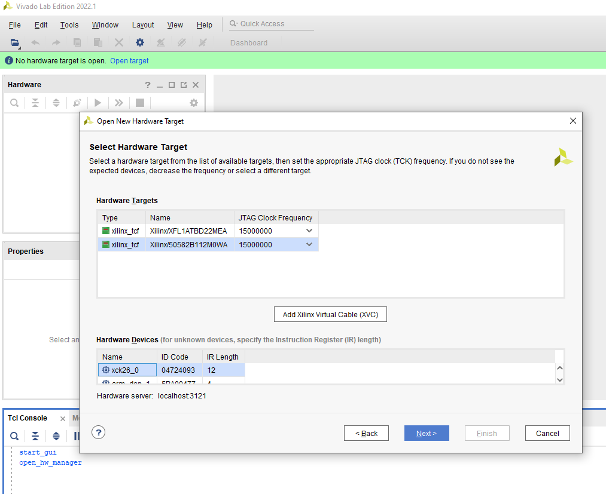
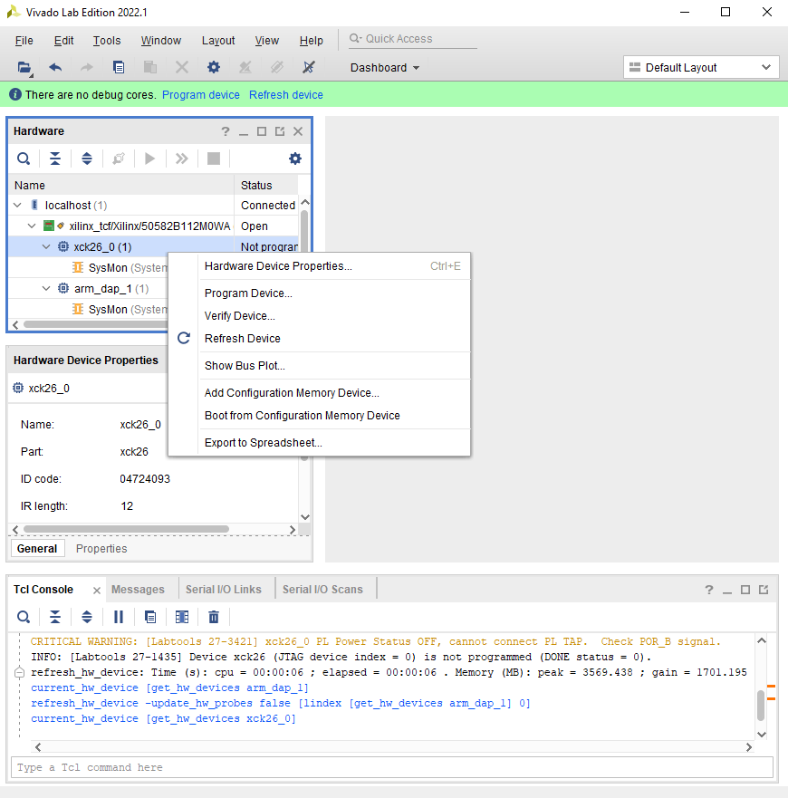
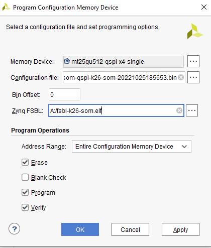

# Boot Firmware - QSPI to eMMC boot for Production SOM

## Introduction

The production SOM has an eMMC device populated, whereas the Starter Kit SOMs do not. Therefore, instead of Starter Kit's QSPI->SD two stage boot process, developer can do a QSPI -> eMMC two stage process on the production SOM. This page gives an example of how to boot from QSPI -> eMMC.

User can also use the traditional monolithic boot (from eMMC) for production SOMs by using eMMC boot mode and placing boot files in eMMC. This method is not covered by this document.

## Prerequisite

1. Have finished Getting started with Kria SOM [KV260](https://www.xilinx.com/products/som/kria/kv260-vision-starter-kit/kv260-getting-started/getting-started.html) or [KR260](https://www.xilinx.com/products/som/kria/kr260-robotics-starter-kit/kr260-getting-started/getting-started.html)
2. Have read [bootfw overview](./bootfw_overview.md) and its associated contents
3. Vivado or Vivado labs installed on host computer

## Steps

There are many different ways to get a Production SOM to boot from QSPI to eMMC. Here are the outlines of the steps:

1. Program production SOM with QSPI binary, there are 2 ways to do this:

    1.A Program QSPI using XSDB/XSCT and u-boot

    1.B Program QSPI using Vivado Labs

2. Program Production SOM eMMC with Linux Image, there are 2 days to do this:

    2.A Program Production SOM eMMC with Image Recovery App (does not support Ubuntu)

    2.B Program Production SOM eMMC with Linux Image using Linux:

        first boot Linux with eMMC awareness, and there are 2 days to do this too:
            2.B.a. Boot Linux using petalinux-boot
            2.B.b. Boot Linux through SD
        Write to eMMC in Linux

3. reboot in QSPI mode

### 1. Program Production SOM with QSPI binary

Unlike Starter Kit SOM, the production SOM is shipped without QSPI pre-populated. So developer first need to program QSPI with the appropriate boot firmware so that SOM will boot first in QSPI and hand off to Linux image in eMMC. The QSPI binary for Starter Kit SOM is not released, however, each components can be generated as outlined in [bootfw overview](./bootfw_overview.md) and its pages. As a reference and an example for this guide, developer can use [bootfw recipe in Yocto](./bootfw_qspi_stitching.md) to generate an example QSPI binary for either KV260 or KR260 and program the QSPI image to Kria production SOM.

Once you have a QSPI binary .bin file, it is time to program it to the board. Mount the Kria Production SOM onto a carrier card, connect it to a host computer using micro-usb cable or the Xilinx Platform cable. Leave SD card slot empty and connect to power.

There are two ways to program the QSPI, through Vivado Labs with XSDB/XSCT, or through XSDB/XSCT only.

#### 1A Program QSPI using XSDB/XSCT and u-boot

To program the QSPI using XSDB/XSCT only, download [boot.tcl](./example_src/boot.tcl) file and put them in a <working_folder/> along with <QSPI_image>.bin. Then download the [appropriate production .bsp file](https://xilinx-wiki.atlassian.net/wiki/spaces/A/pages/1641152513/Kria+K26+SOM#PetaLinux-Board-Support-Packages) for production SOM card (e.g. xilinx-k26-som-<version>.bsp). Once downloaded, extract the bsp file and copy the artifacts needed for boot.tcl into <working_folder/>

```shell
petalinux-create -t project -s xilinx-<board>-<version>.bsp
cd xilinx-<board>-<version>/pre-built/linux/images/
cp bl31.elf pmufw.elf system.dtb u-boot.elf zynqmp_fsbl.elf <working_folder/>
```

Connect the serial port of carrier card with a uart listener so we can work in u-boot. Power on the board.

In xsdb/xsct, cd to <working_folder/> and source boot.tcl:

```shell
source boot.tcl
```

This will boot u-boot on the board. In the uart listener there should be print outs from u-boot. Once at u-boot prompt, go back to xsdb and copy the QSPI image to DDR:

```shell
dow -force -data <QSPI image>.bin <ddr address>
```

example:

```shell
dow -force -data <QSPI image>.bin 0x80000
```

In u-boot, write the QSPI image in DDR to QSPI:

``` shell
ZynqMP> sf probe 0x0 0x0 0x0 
ZynqMP> sf erase <offset address on flash> <greater than the size qspi bin>
ZynqMP> sf write <ddr address> <offset address on flash> <greater than the size qspi bin>
```

example:

``` shell
ZynqMP> sf probe 0x0 0x0 0x0 
ZynqMP> sf erase 0x0 0x3000000  
ZynqMP> sf write 0x80000 0x0 0x3000000 
```

Now QSPI has been programmed!

#### 1B Program QSPI using Vivado Labs

We first need to set SOM to JTAG boot mode. Start XSDB or XSCT and put it in JTAG boot:

``` shell
connect
targets -set -filter {name =~ "PSU"}
mwr 0xffca0010 0x0
mwr 0xff5e0200 0x0100
rst -system
```

On the host computer, start Vivado or Vivado labs. In Vivado or Vivado Labs' starting window, click on "Open Hardware Manager".

open target (on the green line) → open new target → next → select local server, next → select the right target in Hardware Targets, and in Hardware Devices select xck26_0 → next → finish



right click on target (xck26_0) → select Add Configuration Memory Device



search and choose ```mt25qu512-qspi-x4-single``` and click OK


Click "OK" for "Do you want to program the configuration memory device now?"

Supply qspi .bin and fsbl files (produced in [QSPI stitching](./bootfw_qspi_stitching.md) tutorial), make sure to select Entire Configuration Memory Device, erase, program, verify, and click okay.



This may take up to 10 min. At the end, there is a warning ```[Xicom 50-100] The current boot mode is QSPI32. Flash programming is not supported with the selected boot mode.If flash programming fails, configure device for JTAG boot mode and try again.``` - it can be ignored.

Exit Vivado or Vivado Lab.

Now QSPI is programmed with an image that contains boot.bin files and image recovery app. They will be used in the following section.

### 2. Program Production SOM eMMC with Linux Image

There are two ways to program the eMMC - using image recovery application or using Linux.

#### 2A Program Production SOM eMMC with Image Recovery App

For details on set-up and use of the Recovery Tool, see [UG1089](https://docs.xilinx.com/r/en-US/ug1089-kv260-starter-kit) for KV260 and [UG1092](https://docs.xilinx.com/r/en-US/ug1092-kr260-starter-kit) for KR260.

The recovery tool currently only support .wic image upload, therefore it does not yet support Ubuntu. It has a limit of 4GB for .wic image upload. So we will need to reduce the wic image to 2GB, using .5G for boot and 1.5G for rootfs. update build/rootfs.wks in PetaLinux work folder:

```shell
part /boot --source bootimg-partition --ondisk mmcblk0 --fstype=vfat --label boot --active --align 4 --fixed-size 500M
part / --source rootfs --ondisk mmcblk0 --fstype=ext4 --label root --align 4 --fixed-size 1500M
```

Note that after booting, we can use [re-size](https://xilinx.github.io/kria-apps-docs/creating_applications/2022.1/build/html/docs/target.html#resize-part) tool to expand rootfs.

Then generate the .wic image to run out of eMMC (mmcblk0):

```shell
petalinux-package --wic --bootfiles "ramdisk.cpio.gz.u-boot boot.scr Image system.dtb" --wks build/rootfs.wks --disk-name "mmcblk0"
```

### 2B Program Production SOM eMMC with Linux Image using Linux

To write to eMMC from Linux, we first need to boot Linux that has eMMC awareness.
We can either do petalinux-boot --jtag or boot from SD card for now assuming that there's a SD card on the CC.

#### 2.B.a. Boot Linux using petalinux-boot

To use petalinux-boot, refer to [Petalinux Jtag Boot](https://docs.xilinx.com/r/en-US/ug1144-petalinux-tools-reference-guide/Steps-to-Boot-a-PetaLinux-Image-on-Hardware-with-JTAG). Developer should download the [Production K26 SOM BSP](https://xilinx-wiki.atlassian.net/wiki/spaces/A/pages/1641152513/Kria+K26+SOM#PetaLinux-Board-Support-Packages).

On the host connected to the board, start xsdb and put the board in JTAG bootmode:

```shell
connect 
targets -set -filter {name =~ "PSU"}
mwr -force 0xffca0010 0x0; mwr -force 0xff5e0200 0x0100
rst -system
```

On the host with K26 BSP (make sure to use K26 BSP which has eMMC awareness):

```shell
petalinux-create -t project -s xilinx-k26-som-<version>.bsp
cd xilinx-k26-som-<version>
petalinux-boot --jtag --prebuilt 3 --hw_server-url <hostname:3121>
```

on the host connected to the board, in the uart console, stop at u-boot and enter the following:

```shell
booti 0x00200000 0x04000000 0x00100000
```

This will boot a Linux with tinyFS, and you can ignore the error `ERROR: There's no '/dev' on rootfs.` because tiny FS does not provide /dev folder.

#### 2.B.b. Boot Linux through SD

Alternatively, program the SD card with one of the prebuilt .wic image in production [SOM BSP](https://xilinx-wiki.atlassian.net/wiki/spaces/A/pages/1641152513/Kria+K26+SOM#PetaLinux-Board-Support-Packages) to boot to Linux. This requires production SOM wic image so that Linux has eMMC awareness. Once downloaded, extract the bsp file and unzip the wic image in prebuilt folder to program SD card:

```shell
petalinux-create -t project -s xilinx-<board>-<version>.bsp
l xilinx-<board>-<version>/pre-built/linux/images/petalinux-sdimage.wic.xz
```

If doing this for the second time (eMMC already have a good working Linux image), Kria SOM will choose to boot to eMMC prior to try to boot to SD. In order to boot to SD instead of eMMC, press "enter" when u-boot prompts to stop autoboot. In u-boot, use these commands to boot to PetaLinux image in sd:

[note: need to check if this is working]

For KV260, SD is mapped to mmc1:
``` 
setenv boot_targets mmc1
run bootcmd_mmc1
```

For KR260, SD is behind the USB hub:
``` 
setenv boot_targets usb0
run bootcmd_usb0
```

#### Write to eMMC in Linux

Once booted to Linux, you should be able to see  /dev/mmcblk0 -  the eMMC partition. Note on KV260 starter kit, there is also /dev/mmcblk1 - the SD partition. To double check, you can use this command:

```shell
cat /sys/class/mmc_host/mmc0/*/uevent
cat /sys/class/mmc_host/mmc1/*/uevent
```

if ```MMC_TYPE=MMC```, it is an eMMC device, if ```MMC_TYPE=SD```, it is a SD device.

Next, delete the partitions on eMMC.

```shell
fdisk /dev/mmcblk0 #delete all partitions using "d" + "enter" followed by "partition number to be deleted"
```

Next, transfer the file over using your favorite method (such as scp, nfs, copying over SD card etc...). We are showing nfsroot method below:

    On host computer:

    ```shell
    nfsroot3 <path to be mounted where wic image is present>
    ```

    On target:

    ```shell
    mkdir /nfsroot
    mount -t nfs -o nolock,proto=tcp,port=2049 10.10.70.101:/exports/root /nfsroot
    #Use DD command to flash wic
    dd if=/nfsroot/petalinux-sdimage.wic of=/dev/mmcblk0
    ```

Instead of nfxroot method, you can also use scp:

on host computer:

[note to self: add thre above after testing. also how do i program ubuntu instead of a wic image?]

### 3. reboot in QSPI mode

Next, boot the board in QSPI - simply power cycle or do following in xsdb to boot in QSPI again:

``` shell
targets -set -filter {name =~ "PSU"}
mwr -force 0xffca0010 0x0;mwr -force 0xff5e0200 0x2100
rst -system
targets -set -nocase -filter {name =~ cortex-A53*0}
con
```

refer to [u-boot handoff](./bootfw_uboot_handoff.md) "Prioritized Boot Order" section, on 22.1 or later, u-boot will prioritize handling off from QSPI to eMMC on production SOM, if images are available.

## License

Licensed under the Apache License, Version 2.0 (the "License"); you may not use this file except in compliance with the License.

You may obtain a copy of the License at
[http://www.apache.org/licenses/LICENSE-2.0](http://www.apache.org/licenses/LICENSE-2.0)

Unless required by applicable law or agreed to in writing, software distributed under the License is distributed on an "AS IS" BASIS, WITHOUT WARRANTIES OR CONDITIONS OF ANY KIND, either express or implied. See the License for the specific language governing permissions and limitations under the License.

<p align="center">Copyright&copy; 2021 Xilinx</p>