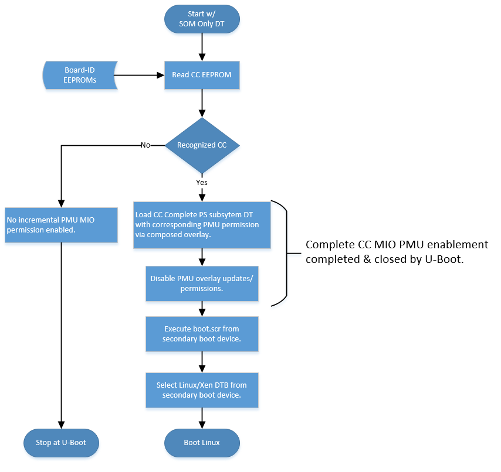
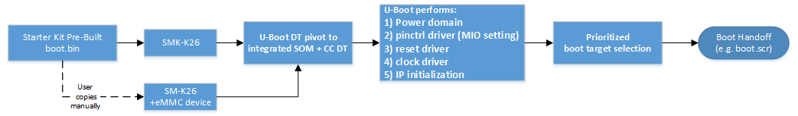
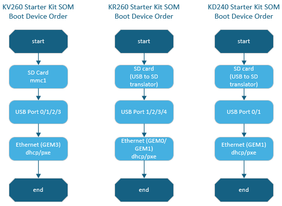
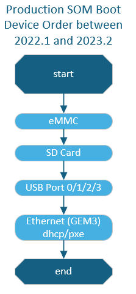
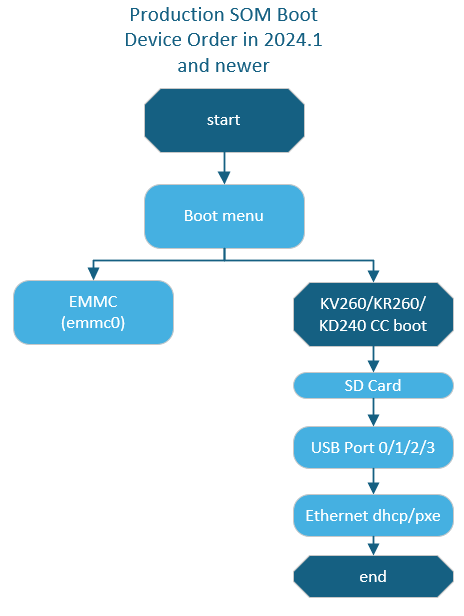

# U-Boot Handoff

## Introduction

In the AMD Kria&trade; Starter Kit's pre-built firmware, U-Boot provides the functionality for the hand-off between the primary boot device (QSPI) and the secondary boot device (by default, SD card but others are available). U-Boot automatically identifies the carrier card (CC) on which it is running; it then enables a full SOM + CC device tree, enables the CC peripherals via the platform management unit (PMU) configuration object overlay APIs, then searches a predefined peripheral device list for Linux boot artifacts, and then boots Linux with those artifacts.

The CC incremental PS subsystem peripherals using the PMU configuration overlay functionality are described [here](./bootfw_pmu_config_obj.md). The PMU overlay enables permissions for the incremental devices not included in the SOM only boot configuration defined by the first stage bootloader (FSBL). U-Boot drives the PMU configuration overlay APIs dynamically via the power domain (PD) driver when it loads the integrated device tree (DT) for the KV260 or KR260. U-Boot locks the PMU configuration overlay function after it has finished loading its electrically erasable programmable read-only memory (EEPROM) identified DT. The overall flow is outlined in the following flowchart.



AMD also provides "flat" KV260 and KR260 BSPs that contain a simpler U-Boot configuration without dynamic CC selection and peripheral enablement. However, the U-Boot source code does have support for dynamic initialization of peripherals if you need more sophisticated setups.

## U-Boot Support for Kria SOM Variants

### Starter Kit SOM and Production SOM

U-Boot for Kria officially supports the Kria Starter Kits. The Starter Kit SOM and Production SOM are variants of the same hardware design. The Starter Kit SOM (designated by SMK-K26) is a reduced functionality version of the Production SOM (designated by SM-K26) in that the embedded multimedia card (eMMC) non-volatile memory device is *not* populated in the Starter Kit configuration. The power-on "base" hardware configuration (Starter Kit SOM) used by the pre-built boot firmware is the most reduced set of base SOM functionality. Then at the U-Boot, the platform pivots to either an integrated Starter Kit SOM + CC or a Production SOM + CC.



### Prioritized Boot Order

Prior to 2021.2, U-Boot searched for both the SD card and eMMC secondary boot devices; if both were detected, a menu interface was provided to you to select the desired Linux boot target.

For Starter Kit SOM, from 2022.1 onwards, there is no U-Boot boot menu during the boot process for SOM. The AMD pre-built `BOOT.BIN` implements a fixed device boot selection as defined by the CC identified. See the following boot device selection order for the KV and KR carrier cards.



For production SOM, between 2022.1 and 2023.2, if a Production SOM is identified by its board-ID EEPROM, then the U-Boot first queries the SOM local eMMC (mmc0) device for boot, before falling to the normal Starter Kit CC boot order. After 2023.2, there is a boot menu to choose between eMMC and the the normal Starter Kit CC boot order.





## `boot.scr` - Linux DT Decoupling and DT Selection

U-Boot uses `boot.scr` to help in booting Linux with different device trees (DTs) provided in the SD image.

Kria SOM has decoupled the device tree (DT) used by the U-Boot firmware from the one selected and passed to Linux. This is to allow the BootFW (`BOOT.BIN`) and Linux image (SD card image) to have decoupled lifecycles.

>**NOTE:** The DT for U-Boot is integrated into `BOOT.BIN`, while DTs for Linux are stored in the SD card boot partition.

The U-Boot boot script (`boot.scr`) has three functions:

- Select the correct Linux DT from the prebuilt SOM + CC DTs in the Linux SD card boot partition
- Define the Linux boot argument (bootargs) based on the CC identified
- Lock the PMU configuration object functionality to prevent the enabling of any new power domain

The prebuilt U-Boot functionality provides U-Boot environment variables for `boot.scr` to use to drive the selection of the Linux DT. The following variables are used:

| env variable | Example       | Description                                                         |
|--------------|---------------|---------------------------------------------------------------------|
| board_name   | SMK-K26-XCL2G | SOM board product name. Differentiates Starter versus Production SOMs  |
| board_rev    | 1             | SOM board revision.                                                 |
| card1_name   | SCK-KV-G      | Carrier card product name.                                          |
| card1_rev    | 1             | Carrier card revision.                                              |

The following is an example `boot.scr` source code; it needs to be compiled by mkimage:

```
################
fitimage_name=image.ub
kernel_name=Image
ramdisk_name=ramdisk.cpio.gz.u-boot
rootfs_name=rootfs.cpio.gz.u-boot


# Close pmufw node so that linux can't send small fragments to pmufw
zynqmp pmufw node close

# Starter Kit default boot args
setenv bootargs 'earlycon console=ttyPS1,115200 clk_ignore_unused init_fatal_sh=1 cma=900M ';

#Set boot parameters based on CC type
if test "${card1_name}" = "SCK-KV-G"; then
        setenv card_name sck-kv-g && setenv bootargs ext4=/dev/mmcblk1p2:/rootfs $bootargs;
elif test "${card1_name}" = "SCK-KR-G"; then
        setenv card_name sck-kr-g && setenv bootargs ext4=/dev/sda2:/rootfs $bootargs;
else #Assume Kria USB secondary boot device
        setenv card_name unknown && setenv bootargs ext4=/dev/sda2:/rootfs $bootargs;
fi

#Set DT selection
if test "${card1_name}" = "SCK-KV-G"; then
        if test "${card1_rev}" = "Z" || test "${card1_rev}" = "A"; then
                #revA dtb also supports revZ boards
                dtb_name=SMK-zynqmp-${card_name}-revA
        elif test "${card1_rev}" = "B" || test "${card1_rev}" = "1"; then
                #revB dtb also supports rev1 boards
                dtb_name=SMK-zynqmp-${card_name}-revB
        fi
elif test "${card1_name}" = "SCK-KR-G"; then
        if test "${card1_rev}" = "B" || test "${card1_rev}" = "1"; then
                #revB dtb also supports rev1 dtb
                dtb_name=SMK-zynqmp-${card_name}-revB
        elif test "${card1_rev}" = "A"; then
                dtb_name=SMK-zynqmp-${card_name}-revA
        fi
else
        dtb_name=system
fi

for boot_target in ${boot_targets};
do
echo "Trying to load boot images from ${boot_target}"
if test "${boot_target}" = "mmc0" || test "${boot_target}" = "mmc1" || test "${boot_target}" = "usb0" || test "${boot_target}" = "usb1"; then
        if test -e ${devtype} ${devnum}:${distro_bootpart} /${fitimage_name}; then
                fatload ${devtype} ${devnum}:${distro_bootpart} 0x10000000 ${fitimage_name};
                bootm 0x10000000;
        fi
        if test -e ${devtype} ${devnum}:${distro_bootpart} /${kernel_name}; then
                fatload ${devtype} ${devnum}:${distro_bootpart} 0x00200000 ${kernel_name};
        fi
        if test -e ${devtype} ${devnum}:${distro_bootpart} /${dtb_name}.dtb; then
                fatload ${devtype} ${devnum}:${distro_bootpart} 0x00100000 ${dtb_name}.dtb;
        else
		echo "Expected ${dtb_name} Not Found in FAT Partition, Booting with SOM only DTB"
	fi
        if test -e ${devtype} ${devnum}:${distro_bootpart} /${ramdisk_name} && test "${skip_tinyramdisk}" != "yes"; then
                fatload ${devtype} ${devnum}:${distro_bootpart} 0x04000000 ${ramdisk_name};
                booti 0x00200000 0x04000000 0x00100000
        fi
        if test -e ${devtype} ${devnum}:${distro_bootpart} /${rootfs_name} && test "${skip_ramdisk}" != "yes"; then
                fatload ${devtype} ${devnum}:${distro_bootpart} 0x04000000 ${rootfs_name};
                booti 0x00200000 0x04000000 0x00100000
        fi
        booti 0x00200000 - 0x00100000
fi
done
```

The `boot.scr` is found in the SD card after programming a .wic image, or it is found in the Yocto build folder, ```build/tmp/deploy/images/<machine_name>/boot.scr```, or in the PetaLinux project (after the `petalinux-create` command) in `<petalinux_project>/pre-built/linux/images/boot.scr`. The .scr file has been compiled; therefore, there are some binaries prior to the texted source code.

### Compilation Procedure and Source Code

U-Boot is compiled with Yocto, and its recipe can be found [here](https://github.com/Xilinx/meta-xilinx/blob/master/meta-xilinx-core/recipes-bsp/u-boot/u-boot-xlnx.inc), and instructions to build are found [here](./bootfw_boot.bin_generation.md). [PetaLinux documentation](https://docs.xilinx.com/v/u/2020.1-English/ug1144-petalinux-tools-reference-guide) also contains information on U-Boot generation as well.

The source code for U-Boot is alsofound [here](https://github.com/Xilinx/u-boot-xlnx.git).

`boot.scr` is compiled using mkimage, and more information can be found [here](https://xilinx-wiki.atlassian.net/wiki/spaces/A/pages/749142017/Using+Distro+Boot+With+Xilinx+U-Boot).

<hr class="sphinxhide"></hr>

<p class="sphinxhide" align="center"><sub>Copyright © 2023-2025 Advanced Micro Devices, Inc.</sub></p>

<p class="sphinxhide" align="center"><sup><a href="https://www.amd.com/en/corporate/copyright">Terms and Conditions</a></sup></p>