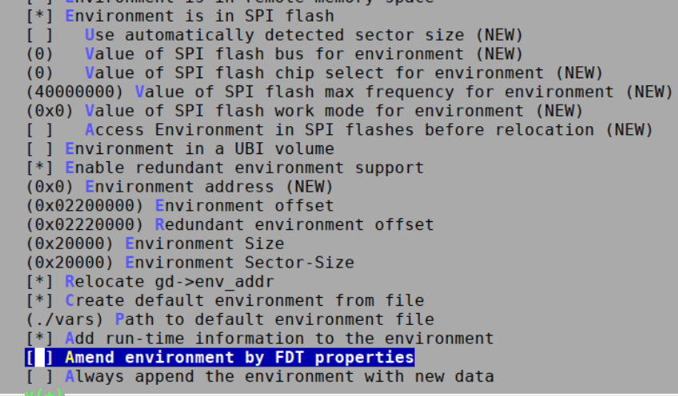

# Boot Firmware - Enable saveenv in U-boot

To prevent users from accidentally overwriting bootfw environment variables and render starter kits un-bootable, saveenv is disabled by default. If a user wants to boot via PXE without any serial port interactions, they need to enable saveenv in order to save serverip variable. This example uses K26, but can be used for K24 as well by replacing mentioning of K26 with K24.

## Enable SaveEnv on u-boot in PetaLinux

In order to enable saveenv in u-boot generated in PetaLinux, they can go through the following on PetaLinux with released BSP:

``` shell
$ petalinux-create -t project -s xilinx-<starterkit name>-<tool version>-<timestamp>.bsp
$ cd xilinx-<starterkit name>-<tool version>
$ petalinux-config –c u-boot #---> Environment ---> [ ] Environment is not stored (press N to deselect )
$ petalinux-config –c u-boot #---> Environment ---> [*] Environment is in SPI flash (press Y to select )
$ petalinux-config –c u-boot #---> Environment ---> [0x02200000] Environment offset (enter and change to 0x02200000)
$ petalinux-config –c u-boot #---> Environment ---> [0x02220000] Redundant Environment offset (enter and change to 0x02220000)
$ petalinux-config –c u-boot #---> Environment ---> [0x20000] Environment Size (enter and change to 0x20000)
$ petalinux-config –c u-boot #---> Environment ---> [0x20000] Environment Sector-Size (enter and change to 0x20000)
$ petalinux-config –c u-boot #---> Command line interface ---> Environment commands ---> [*] saveenv (press Y to select )
$ vim project-spec/meta-user/recipes-bsp/u-boot/u-boot-xlnx_%.bbappend  # workaround, currently new config file is not added correctly, fix in the file from:
# SRC_URI += "file://user_<timestamp>.cfg \
# to:
# SRC_URI:append = " file://user_<timestamp>.cfg \"
#note :there is a space between the double quote and "file://"

$ petalinux-build -c u-boot -x cleanall
$ petalinux-build -c u-boot
$ petalinux-package --boot --fsbl images/linux/zynqmp_fsbl.elf --u-boot images/linux/u-boot.elf --pmufw images/linux/pmufw.elf --fpga images/linux/system.bit --force
```

Below is a snippet of the u-boot config for SPI setting, note that the environment address correspond to QSPI memory map as documented in [BootFW Overview](./bootfw_overview.md#boot-fw-qspi-memory-map):



This generates a new BOOT.BIN in image/linux that can be programmed via A/B update method using [xmutil bootfw_update](https://xilinx-wiki.atlassian.net/wiki/spaces/A/pages/1641152513/Kria+K26+SOM#Boot-FW-management-via-xmutil).

## Enable SaveEnv on u-boot in Yocto

If re-generating u-boot in Yocto, follow the commands below. This assumes you have already went through [Kria Yocto Support](https://xilinx.github.io/kria-apps-docs/yocto.html).

``` shell
repo init -u https://github.com/Xilinx/yocto-manifests.git -b rel-v<tool version>
repo sync
source setupsdk
MACHINE=k26-smk bitbake virtual/bootloader -c menuconfig 
# Environment ---> [ ] Environment is not stored (press N to deselect )
# Environment ---> [*] Environment is in SPI flash (press Y to select ), and make sure any other "Environment is in" except for SPI is deselected *press N to deselect)
#---> Command line interface ---> Environment commands ---> [*] saveenv (press Y to select )
#exit and save
MACHINE=k26-smk bitbake kria-qspi
```

This generates a new boot.bin in ```$TMPDIR/deploy/images/k26-smk/```, and ```$TMPDIR``` is defined in ```build/conf/local.conf```, by default in tmp/. The new boot.bin can be programmed via A/B update method using [xmutil bootfw_update](https://xilinx-wiki.atlassian.net/wiki/spaces/A/pages/1641152513/Kria+K26+SOM#Boot-FW-management-via-xmutil).

## On-target commands

With the new BOOT.bin programmed via A/B update, when booting with the new BOOT.bin, you can save environment variable. For an example:

```bash
setenv serverip <host ip>
saveenv
```

## License

Licensed under the Apache License, Version 2.0 (the "License"); you may not use this file except in compliance with the License.

You may obtain a copy of the License at
[http://www.apache.org/licenses/LICENSE-2.0](http://www.apache.org/licenses/LICENSE-2.0)

Unless required by applicable law or agreed to in writing, software distributed under the License is distributed on an "AS IS" BASIS, WITHOUT WARRANTIES OR CONDITIONS OF ANY KIND, either express or implied. See the License for the specific language governing permissions and limitations under the License.

<p class="sphinxhide" align="center">Copyright&copy; 2023 Advanced Micro Devices, Inc</p>