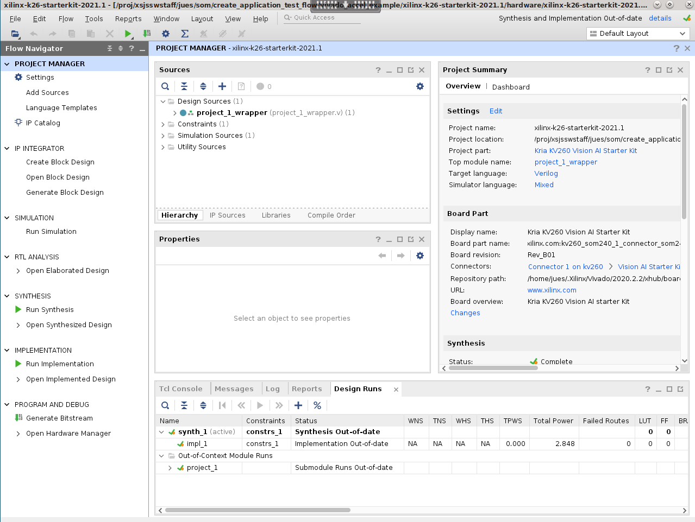
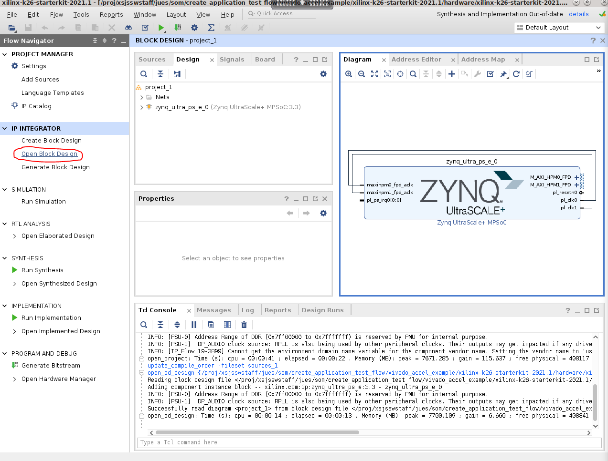
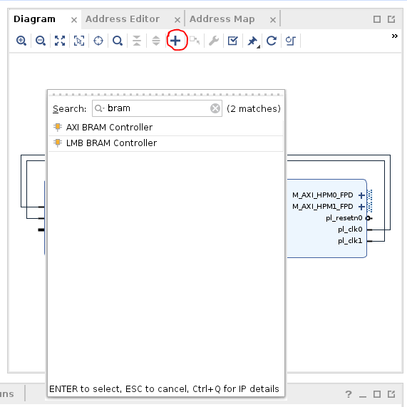

# Vivado Accelerator Flow Example

This page will walk you through an example adding a simple accelerator (in this case, a simple BRAM) application into the SOM infrastructure in the Vivado Accelerator Flow. Please first read [Vivado Accelerator Flow](./creating_applications_vivado_accel_flow.md) before trying this example. 

This example was created with 21.1 tools and BSP. You will need Vivado, XSTC, DTG and DTC. Please refer to [Generating DTSI and DTBO Overlay Files](./creating_applications_dtsi_dtbo_generation.md) for how to install DTG and DTC.

You will need to generate 3 files - .bit.bin (PL bitstream), .dtbo (device tree overlay), and shell.json to load onto SOM. 

## Generate .bit.bin

There are two ways to start the Vivado project for SOM starterkits. Since the [baremetal example](./creating_applications_baremetal.md) has an example for generating PL design in Vivado using board files, this example will use the Vivado design provided in [Starter Kit SOM BSP](https://xilinx-wiki.atlassian.net/wiki/spaces/A/pages/1641152513/Kria+K26+SOM#PetaLinux-Board-Support-Packages). 

Download the BSP from above link. Then create the project using starter kit BSP:
```
petalinux-create -t project -s xilinx-k26-starterkit-v2021.1-final.bsp
cd xilinx-k26-starterkit-2021.1/hardware/xilinx-k26-starterkit-2021.1/
```
Start Vivado, click ```Open Project``` and select ```xilinx-k26-starterkit-2021.1.xpr``` and the example project will open:

 


Click ```Open Block Design``` and you will see a pre-configured ```zynq_ultra_ps_e_0``` block:




In block design, Click on the ```+``` sign and add an ```AXI BRAM Controller```:




Click ```Run Connection Automation``` and connect ```S_AXI``` of ```axi_bram_ctrl_0``` to ```M_AXI_HPM0_FPD``` of ```zynq_ultra_ps_e_0```. 


Double click the ```axi_bram_ctrl_0 block```, and change Number of BRAM interfaces to 1. 


Double click the ```zynq_ultra_ps_e_0 block```, go to ```PS-PL Configuration```, and unselect ```AXI HPM1 FPD``` interface since it is unused. 


Click ```Run Connection Automation``` again and connect ```BRAM_PORTA``` of ```axi_bram_ctrl_0``` to a new blockram. 


Now your block design should look like below:


You should also check address map to see that bram is mapped to 0xa0000000 because we chose HPM0, we will need this address to test access to bram later:


By default Vivado generates a .bit file, you need to select ```Settings -> Bitstream -> -bin_file``` so that it generates a .bin file as well:
 
 


Click on ```Generate Bitstream``` to generate the .bin file


Copy the generated .bin file to top level, we will use the name ```bram``` for this simple application:
```
cp xilinx-k26-starterkit-2021.1.runs/impl_1/project_1_wrapper.bin bram.bit.bin
```

## Generate .xsa file

A .xsa file is needed for generation of .dtbo device tree overlay file in the next step. This is also generated in Vivado by  using ```File -> Export -> Export Hardware``` , make sure to select "include bitstream" in the generation.


## Generate .dtbo file

In this example, we will use the first method in [Generating DTSI and DTBO Overlay Files](./creating_applications_dtsi_dtbo_generation.md) to generate the .dtbo file needed. 

In XSCT, generate the dts files needed using ```project_1_wrapper.xsa``` created in previous step:
```
xsct% hsi open_hw_design project_1_wrapper.xsa
xsct% hsi set_repo_path <path to device-tree-xlnx repository>
xsct% hsi create_sw_design device-tree -os device_tree -proc psu_cortexa53_0
xsct% hsi set_property CONFIG.dt_overlay true [hsi::get_os]
xsct% hsi generate_target -dir bram_dts
xsct% hsi close_hw_design project_1_wrapper
xsct% exit
```
Then compile .dtsi to binary .dtbo using DTC:
```
cd bram_dts/
dtc -@ -O dtb -o pl.dtbo pl.dtsi
cd ../
cp bram_dts/pl.dtbo bram.dtbo
```

## Create shell.json file

Create a shell.json XRT_FLAT file by referring to [On-target Utilities and Firmware](./creating_applications_target.md). 

## Test on SOM Target

Now you have bram.bit.bin, bram.dtbo, shell.json files, you are ready to move them to SOM Starter Kit and test them. We assume that you have already booted to Linux using the prebuilt .wic images provided [here](https://xilinx-wiki.atlassian.net/wiki/spaces/A/pages/1641152513/Kria+K26+SOM#Starter-Kit-Pre-Built-Binaries).

Move the files over using your preferred method, this example uses scp to move over the files to target. 
 
 


On SOM's Linux command prompt, create a folder and copy over the files, and check that the new application shows up in listapps:
``` 
sudo mkdir /lib/firmware/xilinx/bram
sudo cp bram.* shell.json /lib/firmware/xilinx/bram/
sudo xmutil listapps
```

 


Observe that before the bram application is loaded, access to 0xa0000000 (the bram location that we obtained in Vivado) is not successful. But after loading the bram app, you will be able to read and write to 0xa0000000. 
```
sudo xmutil unloadapp
sudo xmutil loadapp bram
sudo devmem 0xa0000000 32
sudo devmem 0xa0000000 32 0xdeadbeef
sudo devmem 0xa0000000 32
```

 


 

#### License

Licensed under the Apache License, Version 2.0 (the "License"); you may not use this file except in compliance with the License.

You may obtain a copy of the License at
[http://www.apache.org/licenses/LICENSE-2.0](http://www.apache.org/licenses/LICENSE-2.0)

Unless required by applicable law or agreed to in writing, software distributed under the License is distributed on an "AS IS" BASIS, WITHOUT WARRANTIES OR CONDITIONS OF ANY KIND, either express or implied. See the License for the specific language governing permissions and limitations under the License.

<p align="center">Copyright&copy; 2021 Xilinx</p>

