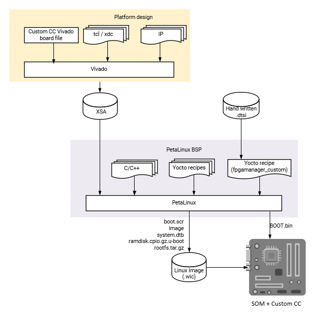
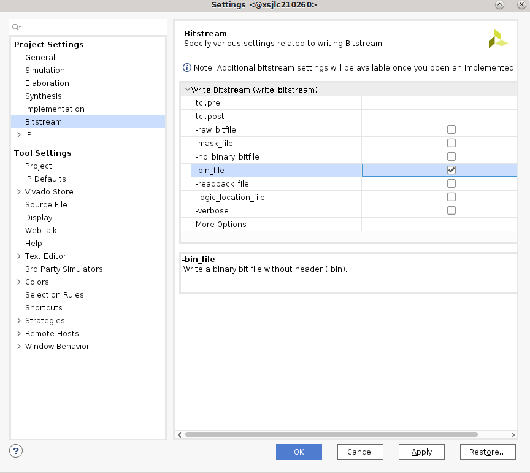

# Custom Carrier Card Flow

Developers creating their own carrier card will create a Vivado project using the Xilinx provided K26 production SOM Vivado board file as a starting point. The K26 board file contains the MIO configuration defined by the SOM HW design, and provides a minimal HW configuration to boot to Linux. The K26 board file does not contain any information specific to a carrier card. Developers then design in their specific custom MIO and PL based physical interfaces to create their own custom HW configuration while following the Kria CC Design Guide ([UG1091](https://www.xilinx.com/support/documentation/user_guides/som/ug1091-carrier-card-design.pdf)). After creating the integrated SOM + CC configuration, a .xsa file is exported. If using Linux, developers then create a Petalinux project to generate boot and OS images for booting Linux. Developers can then use the artifacts to create applications to run on top of the base Linux, using the previously discussed workflows: Vitis Accelerator Flow, Vitis Platform Flow, or Vivado Accelerator Flow.

* assumption: Using SOM K26 with developer defined carrier card
* input: Vivado K26 SOM board file, customer defined carrier card board configuration
* output: BOOT.bin, .wic image containing boot.src, Image, ramdisk.cpio.gz.u-boot, system.dtb, rootfs.tar.gz



## Prerequisites and Assumptions

This document assume that developer will use 2022.1 or later for tools and SOM content releases. The tool versions should match - e.g. use the same tool versions for PetaLinux, Vivado, and the released BSP.

1. Vitis tools installation
2. Vivado tools installation
3. PetaLinux tools installation

## Step 1 - Aligning Kria SOM boot & SOM Linux infrastructure

Xilinx built Kria SOM Starter Kit applications on a shared, application-agnostic infrastructure in the SOM Starter Linux including kernel version, Yocto project dependent libraries, and baseline BSP. When using this tutorial, make sure to align tools, git repositories, and BSP released versions.

### PetaLinux BSP Alignment

The SOM Starter Linux image is generated using the corresponding SOM variant multi-carrier card PetaLinux board support package (BSP). Developers creating applications on the Starter Kit are recommended to use this BSP as a baseline for their application development as it ensures kernel, Yocto project libraries, and baseline configuration alignment. The multi-carrier card BSP defines a minimalistic BSP that has the primary function of providing an application-agnostic operating system, and can be updated and configured dynamically at runtime.

## Step 2 - Create board file and .xdc file for custom carrier card

In example carrier card projects, we have created a few board configuration files used by Vivado to create board related configurations.  You will find  a few different board files for the SOM itself - the differences betweeen each SOM variants can be found [here](https://xilinx-wiki.atlassian.net/wiki/spaces/A/pages/1641152513/Kria+K26+SOM#SOM-Variants)

The following is a list of the supported board files related to SOM as of 2022.1:

* [Production SOM K26 C grade](https://github.com/Xilinx/XilinxBoardStore/tree/2022.1/boards/Xilinx/k26c)
* [Production SOM K26 I grade](https://github.com/Xilinx/XilinxBoardStore/tree/2022.1/boards/Xilinx/k26i)
* [KV260 SOM](https://github.com/Xilinx/XilinxBoardStore/tree/2022.1/boards/Xilinx/kv260_som)
* [KR260 SOM](https://github.com/Xilinx/XilinxBoardStore/tree/2022.1/boards/Xilinx/kr260_som)
* [KV260 Carrier Board](https://github.com/Xilinx/XilinxBoardStore/tree/2022.1/boards/Xilinx/kv260_carrier) also [here](https://github.com/Xilinx/kria-vitis-platforms/tree/xlnx_rel_v2022.1/kr260/platforms/vivado/board_files)
* [KR260 Carrier Board](https://github.com/Xilinx/XilinxBoardStore/tree/2022.1/boards/Xilinx/kr260_carrier) also [here](https://github.com/Xilinx/kria-vitis-platforms/tree/xlnx_rel_v2022.1/kr260/platforms/vivado/board_files)

Information on generating custom Vivado board files and where to place them can be found in [UG895](https://docs.xilinx.com/r/en-US/ug895-vivado-system-level-design-entry/Board-File). Developers will need to create a custom board file for their custom carrier card, and they can use KV260 as an example. Developer will use the production SOM (either C grade or I grade) as their SOM Card, not KV260 SOM or KR260 SOM.

Developers also need .xdc file to create mappings between Xilinx MPSoC pins and connectors, as well as adding constraints. K26 and KV260 .xdc files can both be found on [Kria documentation site](https://www.xilinx.com/products/som/kria/k26c-commercial.html#documentation). K260 .xdc file contains information on how MPSoC pins maps to the connector, and developer can use that information to create their own .xdc for their carrier card. KV260 .xdc file can be used as an example. Developers should refer to Vivado Design Suite using Constraints [UG903](https://docs.xilinx.com/r/en-US/ug903-vivado-using-constraints) for more information on creating their .xdc file.

## Step 3 - Generate a new custom PL design using Vivado

This flows starts with vivado board files containing information on K26 and custom CC as mentioned in step 2. After the board file for custom carrier card has been created and imported, they can be selected in Vivado:


Be sure to select the custom board file you have created in step 2 instead of KV260 board.

When selecting the Kria starter kit board file, make sure to click on "connections" to indicate that the K26 and KV carrier card are connected.

Once Zynq_ultra_ps_e_0 block is added to a design, make sure to click "Run Block Automation" to apply board file settings.


Developers then may need to indicate that the platform is an Extensible Vitis Platform. Whether to make the project extensible or not is dependent on if developer intend to reuse the platform for developing in Vitis. More details on how to create Extensible Platform can be found [here](https://docs.xilinx.com/r/en-US/ug1393-vitis-application-acceleration/Platform-Creation-Basics).
Project Manager -> Settings -> General -> check "Project is an extensible Vitis Platform"


Developers then should add the .xdc files for both K26 and their custom carrier card.

### Vivado Starter Project in BSP

Alternatively, developers can start from the base Vivado project provided. It can either be downloaded from [github](https://github.com/Xilinx/kria-base-hardware/tree/xlnx_rel_v2022.1/kria_som/k26) or be found in the BSP file.

To get the project from bsp, first, download the SOM Starter Kit BSP from the [SOM Wiki](https://xilinx-wiki.atlassian.net/wiki/spaces/A/pages/1641152513/Kria+K26+SOM#PetaLinux-Board-Support-Packages)
Then create the project using BSP:

```bash
petalinux-create -t project -s xilinx-k26-<version>.bsp
cd xilinx-k26-<version>
```

The Vivado starter project can be found in ```hardware/``` folder, and developers can open the project using the .xpr file. This project is a k26 project only, and will not contain any information about the carrier card being used. However, it does have enough information to boot basic Linux.

### Generate .bit.bin and .xsa file

Please refer to Vivado documentation to add custom IP blocks into your design and generate a .xsa file and a binary bitstream (.bin file converted .bit.bin file). In order to generate a binary bitstream (.bin) file, go to Tools -> setting and enable -bin_file, and rename the generated .bin file to .bit.bin.



An updated .xsa file needs to be generated by using File -> Export -> Export Hardware, make sure to select "include bitstream" in the generation.


An example base design for booting Linux can be found in PetaLinux project folder generated from SOM starterkits BSP in ```project-spec/hw-description/system.xsa```.

If using Linux the developer will also need to create a dtsi file for the project. The SOM dtsi file can be found [here](https://github.com/Xilinx/device-tree-xlnx/blob/xlnx_rel_v2022.1/device_tree/data/kernel_dtsi/2022.1/BOARD/zynqmp-sm-k26-reva.dtsi), the starterkit SOM dtsi can be found [here](https://github.com/Xilinx/device-tree-xlnx/blob/xlnx_rel_v2022.1/device_tree/data/kernel_dtsi/2022.1/BOARD/zynqmp-smk-k26-reva.dtsi)

## step 4 - Create Linux boot image from .xsa in Petalinux

Please refer to [UG1144](https://docs.xilinx.com/r/en-US/ug1144-petalinux-tools-reference-guide/Introduction#page=20) for detailed guide to create an image. Below are the commands extracted from the guide:

```bash
petalinux-create --type project --template zynqMP --name <petalinux_project>
cd <petalinux_project>
petalinux-config --get-hw-description <path to .xsa file>
cp <path to .dtsi file> project-spec/meta-user/recipes-bsp/device-tree/files/system-user.dtsi
petalinux-build 
```

the image and boot files can be found in ```images/linux/```

Developer can also use the [SOM K26 production BSP](https://xilinx-wiki.atlassian.net/wiki/spaces/A/pages/1641152513/Kria+K26+SOM#PetaLinux-Board-Support-Packages) to generate a Petalinux project and images. It does not have any information on any carrier cards, but it has enough SOM information to generate an image to boot to Linux and also include utilities such as xmutil and dfx-mgr. This can be used for bring up. To use released BSP, replace the above ```petalinux-create``` command with the following:

```bash
petalinux-create -t project -s xilinx-k26-<version>.bsp
```

## Step 5 - Boot new image on target platform

Depending on what developers decide to put on their custom carrier card, they may choose different [boot modes](./bootmodes.md). JTAG booting should be available on all carrier cards and this section will detail how to boot Linux via JTAG using PetaLinux. Details on using PetaLinux to boot Linux can be found in [Petalinux User Guide](https://docs.xilinx.com/r/en-US/ug1144-petalinux-tools-reference-guide/Generate-Boot-Image-for-Zynq-UltraScale-MPSoC) to help with booting with preferred bootmode.

First package the built images into pre-built folder:

```bash
petalinux-package --prebuilt
```

Then generate a xsdb tcl script <test.tcl>:

```bash
petalinux-boot --jtag --prebuilt 3 --tcl <test.tcl>
```

<test.tcl> will contain a script to boot Linux with tiny rootfs and exit xsdb, assuming that user is still in PetaLinux project folder. Take care to copy needed files and change pointers to files if you need to move the files to a different host machine to boot. Remove "exit" at the end of the tcl script to observe printouts from the script in xsdb.

In xsdb, first connect and put the board in JTAG mode using xsdb commands [here](./bootmodes.md). Then ```source <test.tcl>```, and Linux should boot.

## Step 6 - Develop Applications

Now that a base Linux design is up a running, developers can follow [Vitis Accelerator Flow](./vitis_accel_flow.md), or [Vitis Platform Flow](./vitis_platform_flow.md), or [Vivado Accelerator Flow](./vivado_accel_flow.md) to develop their applications.

## Examples

* Refer to [custom cc flow example](./custom_cc_flow_example.md) for a detailed step by step example on how to crease a base design forKV260.

## License

Licensed under the Apache License, Version 2.0 (the "License"); you may not use this file except in compliance with the License.

You may obtain a copy of the License at
[http://www.apache.org/licenses/LICENSE-2.0](http://www.apache.org/licenses/LICENSE-2.0)

Unless required by applicable law or agreed to in writing, software distributed under the License is distributed on an "AS IS" BASIS, WITHOUT WARRANTIES OR CONDITIONS OF ANY KIND, either express or implied. See the License for the specific language governing permissions and limitations under the License.

<p align="center">Copyright&copy; 2021 Xilinx</p>
