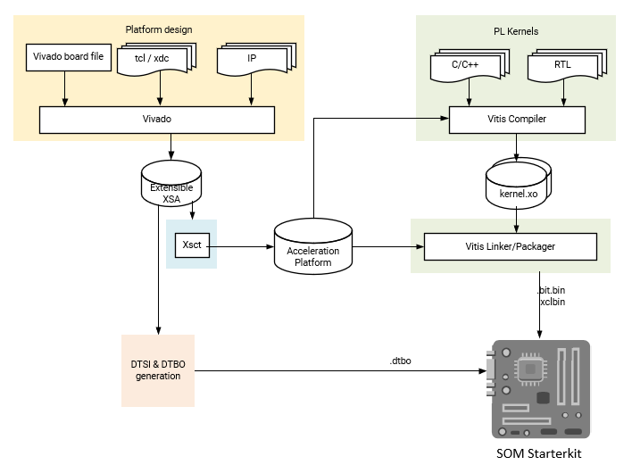
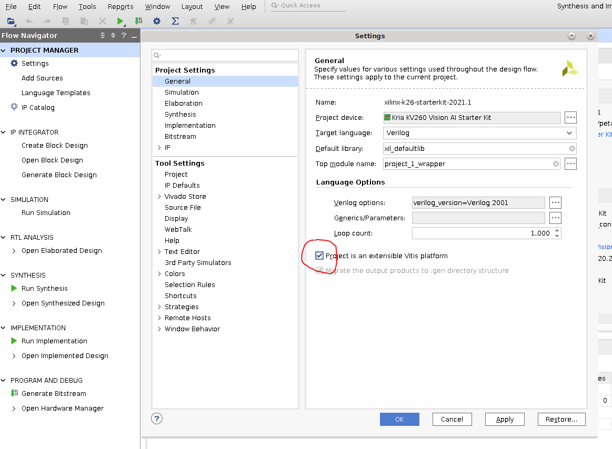

# Vitis Platform Flow

Developers can create a custom Vitis platform if they require a different set of physical PL I/O peripherals than those provided in Xilinx generated platforms. Development starts with the Vivado tool to create an extensible hardware platform. In Vivado, the Kria SOM Starter Kit Vivado board files are provided. It automatically drives the PS subsystem HW configuration and provides pre-defined connectivity for commonly used PL IPs based on the selected carrier card (e.g. MIPI interfaces on KV260 carrier card). Developers use Vivado to generate a custom .xsa file to be ported into Vitis as a platform project. Once the platform project is created, then a corresponding device tree overlay is generated. With the extensible .xsa and .dtbo developers can now follow the same flow outlined in Vitis Accelerator flow. The resulting bitstream, .xclbin, and .dtbo files are copied into the target.

* Assumption: Xilinx provided SOM carrier card with associated Vivado board file automation
* Input: Vivado SOM Starter Kit board files
* Output: .dtbo, .bit.bin, .xlcbin



## Prerequisites and Assumptions	
This document assume that developers will use 2021.1 or later for their tools and SOM releases. The tool versions should match - e.g. use the same tool versions for PetaLinux, Vivado, and the released BSP. 

1. Vitis tools installation	
2. PetaLinux [SOM StarterKit BSP download](https://xilinx-wiki.atlassian.net/wiki/spaces/A/pages/1641152513/Kria+K26+SOM#PetaLinux-Board-Support-Packages)
3. Vivado tools installation
4. tool for generating and/or compiling .dtbo file: a. PetaLinux tools installation or b. XSCT (will be installed as part of Vivado or Vitis)


## Step 1 - Aligning Kria SOM boot & SOM Starter Linux infrastructure 
Xilinx built Kria SOM Starter Kit applications on a shared, application-agnostic infrastructure in the SOM Starter Linux including kernel version, Yocto project dependent libraries, and baseline BSP. When using this tutorial, make sure to align tools, git repositories, and BSP released versions.
### PetaLinux BSP Alignment	
The SOM Starter Linux image is generated using the corresponding SOM variant multi-carrier card PetaLinux board support package (BSP). Developers creating applications on the Starter Kit are recommended to use this BSP as a baseline for their application development as it ensures kernel, Yocto project libraries, and baseline configuration alignment. The multi-carrier card BSP defines a minimalistic BSP that has the primary function of providing an application-agnostic operating system, and can be updated and configured dynamically at runtime. 	

## Step 2 - Generate a new custom PL design using Vivado
There are two ways to get started designing PL design for SOM Carrier cards. Developers can either start with the Vivado board file, or the released Vivado starter project in BSP. 
### Vivado board file
This flows starts with Vivado board files containing information on K26 and KV260 CC. The K26 SOM is supported in Vivado with three board files that automate the configuration of the SOM based peripherals. These board files are available in Vivado's board list in "Create Project" wizard in 2021.1 or later.

* K26C SOM - Commercial grade K26 SOM. 	
* K26I SOM - Industrial grade K26 SOM. 	
* KV260 Starter Kit - K26 based Starter Kit SOM with Vision AI Carrier Card connector interface. 


When selecting the Kria starter kit board file, make sure to click on "connections" to indicate that the K26 and KV carrier card are connected. 

Once Zynq_ultra_ps_e_0 block is added to a design, make sure to click "Run Block Automation" to apply board file settings. 


Developers then indicate that the platform is an Extensible Vitis Platform. More details on how to create Extensible Platform can be found [here](https://www.xilinx.com/html_docs/xilinx2021_1/vitis_doc/create_embedded_platforms.html).
Project Manager -> Settings -> General -> check "Project is an extensible Vitis Platform"



### Vivado Starter Project in BSP
Alternatively, developers can start from the Vivado project provided in the BSP file. 
First, download the SOM Starter Kit BSP from the [SOM Wiki](https://xilinx-wiki.atlassian.net/wiki/spaces/A/pages/1641152513/Kria+K26+SOM#PetaLinux-Board-Support-Packages)
Then create the project using BSP:
```
petalinux-create -t project -s xilinx-k26-starterkit-v2021.1-final.bsp
cd xilinx-k26-starterkit-2021.1
```
The Vivado starter project can be found in ```hardware/``` folder, and developers can open the project using the .xpr file. This project is a k26 project only, and will not contain any information about the carrier card being used. However, it does have enough information to boot basic Linux.

### Generate .xsa file
Please refer to Vivado documentation to add custom IP blocks into your design. An updated .xsa file needs to be generated by using File -> Export -> Export Hardware , make sure to select "include bitstream" in the generation. 


To access the example kv260 Vitis reference design, developers can follow the steps in the [Using Vivado to Build the Hardware Design](https://xilinx.github.io/kria-apps-docs/main/build/html/docs/build_vivado_design.html) tutorial. 

## Step 3 - Package the platform
After generating the .xsa file, developers will need to package it into a a Xilinx Platform File (.xpfm file). Developers can use the script [pfm.tcl](https://gitenterprise.xilinx.com/PAEG/vck190-base-trd/blob/2021.2/platforms/scripts/pfm.tcl)  to generate .xpfm file and its associated hw/ and sw/ folders:
```
xsct -sdx pfm.tcl -xsa <generated xsa file from step 2>.xsa
```
The .xpfm file and its associated hw/ sw/ folders will be located at ```xsct/<platform name>/<platform name>/export/<platform name>/```.  To copy or move the xpfm file, developers must also move the hw/ and sw/ directories, as the xpfm file expects them to be adjacent to itself.


## Step 4 - Compile a device tree overlay blob (.dtbo) using Petalinux
If using PL loading post Linux boot, then a DT overlay is required to add the HW/SW interfaces to the initial Linux booted device tree. For creating the DT overlay please refer to [dtsi_dtbo_generation](./dtsi_dtbo_generation.md) page. 

## step 5 - follow Vitis Accelerator Flow to generate applications
After creating .dtbo and Platform files, developers will be able to create their accelerators in Vitis platform. They can follow step 3 through 5 in [Vitis Accelerator Flow](./vitis_accel_flow.md#step3) to finish creating and running their applications. 

## Examples
* This [Vitis guide](https://github.com/Xilinx/Vitis-Tutorials/blob/2021.1/Vitis_Platform_Creation/Design_Tutorials/01-Edge-KV260/README.md) is a good detailed tutorial that uses a flow close to Vitis Platform Flow. It includes software generation in Petalinux as well, which is not in the scope of this tutorial. 

### License

Licensed under the Apache License, Version 2.0 (the "License"); you may not use this file except in compliance with the License.

You may obtain a copy of the License at
[http://www.apache.org/licenses/LICENSE-2.0](http://www.apache.org/licenses/LICENSE-2.0)

Unless required by applicable law or agreed to in writing, software distributed under the License is distributed on an "AS IS" BASIS, WITHOUT WARRANTIES OR CONDITIONS OF ANY KIND, either express or implied. See the License for the specific language governing permissions and limitations under the License.

<p align="center">Copyright&copy; 2021 Xilinx</p>
