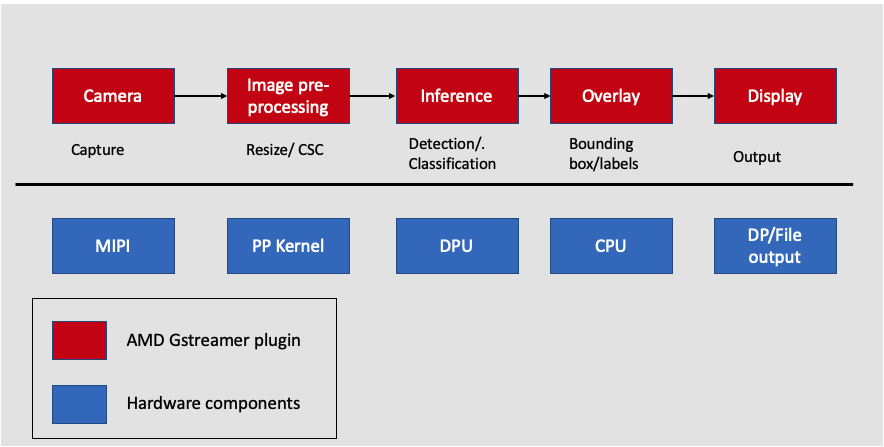

# Adding a ML Inference Pipeline

## Introduction

In this step, you build the SmartCam application by adding a ML pipeline to the existing image resizing application. The SmartCam VVAS ML pipeline has built-in machine learning for applications such as pedestrian detection, face detection, and people counting with local display. The ML pipeline consists of a ML inference and ML overlay. The ML inference is performed by the DPU, a hardware component, and a ML overlay, is performed on the CPU by a VVAS software plug-in.



Adding the hardware ML pipeline to the image resizing application involves the following steps:  

1. Adding a quantization function to the pre-processing pipeline
2. Adding the Vitis AI DPU to the hardware pipeline
3. Overview of VVAS plug-ins used for SmartCam
4. PetaLinux firmware
5. Running the design on the board

## Machine Learning Pre-processing

In machine learning, data pre-processing is integral in converting input data into a clean data set. A machine learning application receives data from multiple sources using multiple formats; this data needs to be transformed into a format feasible for analysis before being passed to an AI model. The AMD Vitis Vision accelerated library can help you pre-process image data before being feeding it to different deep neural networks (DNNs).

A ML pre-processing pipeline involves the following:

- CSC converts the incoming images from one color space to another. One example would be converting the NV12 image from a webcam to the RGB/BGR format expected by the neural network.
- Resizing the image changes the resolution of the input image to match the resolution used to train the network.
- Additional preprocessing computations such as subtraction, scaling, and threshold calculation.

### Pre-processing Function

In the previous step, the CSC and resize kernel are built as part of the image resizing application. In this step, you add the pre-processing kernel, which performs quantization. Navigate to `kv260/overlays/examples/smartcam` and replace the `xf_pp_pipeline_accel.cpp` with the [ml_pre-processing kernel](./code/ml_inference/vitis_platform_files/xf_pp_pipeline_accel.cpp), which performs CSC, resizing, scaling, and mean subtraction.

```
cd kria_platform/kria-vitis-platforms/kv260/overlays/examples/smartcam/
cp ../../../../../../code_repo_kria_vitis_acceleration_flow_2022.1/ml_inference/vitis_platform_files/xf_pp_pipeline_accel.cpp .
```

The Vitis Vision library provides a pre-processing function to perform quantization.

```
template <int INPUT_PTR_WIDTH, int OUTPUT_PTR_WIDTH,  int T_CHANNELS , int CPW,  int ROWS, int COLS, int NPC, bool PACK_MODE, int X_WIDTH, int ALPHA_WIDTH, int BETA_WIDTH, int GAMMA_WIDTH, int OUT_WIDTH, int X_IBITS, int ALPHA_IBITS, int BETA_IBITS, int GAMMA_IBITS,int OUT_IBITS, bool SIGNED_IN, int OPMODE, int UTH, int LTH>
void preProcess(ap_uint<INPUT_PTR_WIDTH> *inp, ap_uint<OUTPUT_PTR_WIDTH> *out,  float params[3*T_CHANNELS], int rows, int cols)

```

Combining all the previous steps with the pre-processing function looks like the following:

```
#pragma HLS DATAFLOW 

obj_iny.Array2xfMat<INPUT_PTR_WIDTH, XF_8UC1, HEIGHT, WIDTH, NPC>(img_inp_y, imgInput_y, in_img_linestride);
obj_inuv.Array2xfMat<INPUT_PTR_WIDTH, XF_8UC2, HEIGHT/2, WIDTH/2, NPC> (img_inp_uv, imgInput_uv, in_img_linestride/2);
xf::cv::nv122bgr<XF_8UC1, XF_8UC2, XF_8UC3, HEIGHT, WIDTH, NPC, NPC>(imgInput_y, imgInput_uv, rgb_mat);
xf::cv::resize<INTERPOLATION, IN_TYPE, HEIGHT, WIDTH, NEWHEIGHT, NEWWIDTH, NPC, MAXDOWNSCALE>(rgb_mat, resize_out_mat);                                                                                            
xf::cv::preProcess<IN_TYPE, OUT_TYPE, NEWHEIGHT, NEWWIDTH, NPC, WIDTH_A, IBITS_A, WIDTH_B, IBITS_B, WIDTH_OUT,IBITS_OUT>(resize_out_mat, out_mat, params);
xf::cv::xfMat2Array<OUTPUT_PTR_WIDTH, OUT_TYPE, NEWHEIGHT, NEWWIDTH, NPC>(out_mat, img_out, out_img_linestride);
```

## Next Steps

This completes the ML pre-processing kernel. The next step is the [Adding DPU IP](./adding-dpu-ip.md).

<hr class="sphinxhide"></hr>

<p class="sphinxhide" align="center"><sub>Copyright © 2023-2025 Advanced Micro Devices, Inc.</sub></p>

<p class="sphinxhide" align="center"><sup><a href="https://www.amd.com/en/corporate/copyright">Terms and Conditions</a></sup></p>