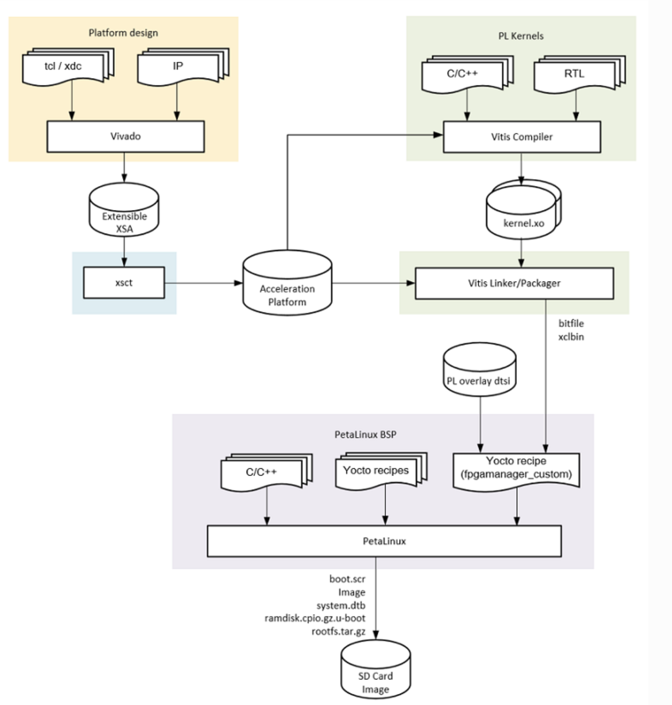
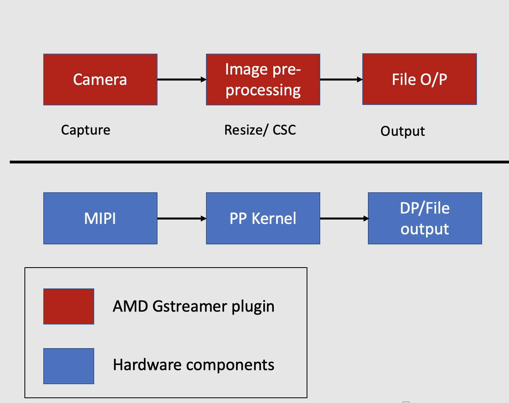

# Vitis Acceleration Flow

## Kria Vitis Acceleration Flow Overview

The K26 SOM is based on the UltraScale+ MPSoC technology, similar to the ZCU104 evaluation board. The Vitis tool provides a unified flow for developing FPGA accelerated applications targeted to the Kria edge application. [Vitis Embedded Acceleration flow](https://docs.xilinx.com/r/en-US/ug1393-vitis-application-acceleration/Introduction-to-Vitis-Tools-for-Embedded-System-Designers) provides a software-like development experience on FPGA and SoC, such as real-time reloading applications without rebooting the system. The following graph gives an overview of the Kria Vitis acceleration flow, which is divided into the following steps:

1. Platform Design: Developing a Vitis extensible platform
2. PL kernels: Developing a PL kernel/overlays using Vitis HLS and Vitis Vision libraries.
3. Vitis Linker/Packager: Integrating the Vitis extensible platform and PL kernels/overlays to generate a bitstream and xclbin description
4. PetaLinux firmware: Application development and integrating it into the PetaLinux/Ubuntu firmware.
5. SD Image: Generating a SD image and running the application on the Kria SOM Starter Kit.


## Image Resizing Application

In this step, you build an image resizing Application. The MIPI camera reads an input video of NV12 format, of size 1920x1080 pixels. The pre-processing acceleration kernel converts it to a BGR format and performs a resizing algorithm of user-defined size. The resizing algorithm is built using the  Vitis vision library.



Building the image resizing applications using the Vitis acceleration flow involves the following steps:  

1. Platform Design: Generate a KV260 Vitis extensible platform
2. PL kernels: Develop a resizing PL kernel using the Vitis Vision library
3. Vitis Linker/Packager:*** Compile and link the resizing PL kernel/overlay with the KV260 Vitis extensible platform using the Vitis acceleration flow.
4. PetaLinux firmware: Overview of the VVAS software stack and package the PetaLinux firmware with VVAS components
5. SD Image: Generating a SD image and running the application on the Kria SOM Starter Kit.

## KV260 Extensible Platform

The first step in the Kria Vitis Acceleration platform is to generate a Vitis extensible platform or XPFM. The Vitis extensible platform (XPFM) allows you to quickly develop and iterate the programmable components of the system on top of an available platform. This way, the platform and application development can be designed in parallel. The Vitis extensible platform (XPFM) exposes all the essential platform interfaces like clocks, interrupts, master AXI interfaces, and slave AXI interfaces for the accelerator to connect. The Vitis extensible platform (XPFM) is generated from an extensible hardware design (.xsa), which is a container with the hardware specifications such as processor configuration properties, peripheral connection information, address map, and device initialization code. In this step, you use the KV260 starter kit platform to generate a KV260 Vitis extensible platform.

### Download the Kria Starter Kit Platform

On the host computer, download the Vitis Platform files for KV260 and KR260.

```
mkdir kria_platform
cd kria_platform
git clone --branch xlnx_rel_v2022.1 --recursive https://github.com/Xilinx/kria-vitis-platforms.git

```

### Build the Platform

The Image resizing application and SmartCam application needs features such as encoder/decoder, Ethernet, HDMI/DP, and MIPI support. To support this hardware requirement, use the KV260_ispMIPI platform, as it supports all of the necessary features. Navigate to the KV260 platform and run the following commands. The make command builds the extensible platform, XPFM, for the KV260_ispMIPI platform. During the build, an extensible hardware XSA is generated. This XSA is used to generate the final Vitis Extensible platform, XPFM.

```
source <vitis path>/settings64.sh
cd kria-vitis-platform/kv260/
make platform PFM=kv260_ispMipiRx_vcu_DP
```

The generated platform is located at .`/platforms/xilinx_kv260_ispMipiRx_vcu_DP_202210_1/`.

```
ls platform/xilinx_kv260_ispMipiRx_vcu_DP_202210_1/
hw  kv260_ispMipiRx_vcu_DP.xpfm  sw
```

## Next Step

The next step is [Vitis PL Kernel Development Flow](./vitis-Pl-development-flow.md).

<hr class="sphinxhide"></hr>

<p class="sphinxhide" align="center"><sub>Copyright © 2023-2025 Advanced Micro Devices, Inc.</sub></p>

<p class="sphinxhide" align="center"><sup><a href="https://www.amd.com/en/corporate/copyright">Terms and Conditions</a></sup></p>