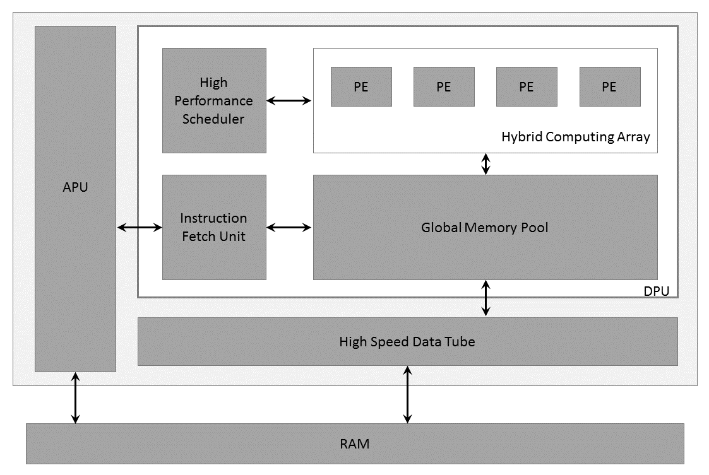

# AI Customization

The AI inference capability can be brought in by leveraging the AMD Vitis&trade; AI development stack, which provides optimized IP, tools, libraries, models, and example designs. In this topic, you are introduced to how to use the AMD model set and build your own model demo.

## DPU IP Introduction

Deep learning processor (DPU) is a programmable engine optimized for deep neural networks. It is a group of parameterizable IP cores preimplemented on the hardware with no place and route required. The DPU is released with the Vitis AI specialized instruction set, allowing for efficient implementation of many deep learning networks.
  
The DPU IP can be implemented in the programmable logic (PL) of the selected AMD Zynq&trade;-7000 SoC or AMD Zynq&trade; UltraScale+&trade; MPSoC device with direct connections to the processing system (PS). The DPU requires instructions to implement a neural network and accessible memory locations for input images as well as temporary and output data. A program running on the application processing unit (APU) is also required to service interrupts and coordinate data transfers.
  
The following figure shows the DPU Top-Level Block Diagram.
  
  <p align=center>DPU Top-level Block Diagram</p>
  <p align=center>PE:Processing Engine, DPU:Deep Learning Processor Unit, APU:Application Processing Unit
  
For more details on the DPU IP, refer to the *DPUCZDX8G for Zynq UltraScale+ MPSoCs Product Guide* ([PG338](https://docs.amd.com/go/en-US/pg338-dpu)) and the *Vitis AI Library User Guide* ([UG1354](https://docs.amd.com/go/en-US/ug1354-xilinx-ai-sdk)).

## Vitis AI Model

The Vitis AI development environment accelerates AI inference on AMD hardware platforms, including both edge devices and AMD Alveo&trade; accelerator cards. It consists of optimized IP cores, tools, libraries, models, and example designs. It is designed with high efficiency and ease of use in mind to unleash the full potential of AI acceleration on AMD FPGAs and on adaptive SoCs. The Vitis AI development environment makes it easy for users without FPGA knowledge to develop deep-learning inference applications by abstracting the intricacies of the underlying FPGA and adaptive SOC.
  
1. Machine Learning and Data Science: Importing a machine learning model from a Caffe, Pytorch, TensorFlow, or other popular framework onto Vitis AI, and then optimizing and evaluating its effectiveness.
    * Set up the environment of the Cloud or Edge. Vitis AI contains various samples for demonstration.
    * Quantizing the Model. Quantization and channel pruning techniques are employed to address these issues while achieving high performance and high energy efficiency with little degradation in accuracy. The Vitis AI development kit has the quantization and channel pruning tool.
    * Compiling the Model. The Compiler generates the compiled model based on the DPU microarchitecture. Vitis AI supports several DPUs for different platforms and applications.

2. Host Software Development: Developing the application code, accelerator development, including library, XRT, and Graph API use. Deploy the model on the target, and run the model.

3. Hardware, IP, and Platform Development: Creating the PL IP blocks for the hardware platform, creating PL kernels, functional simulation, and evaluating the Vivado timing, resource use, and power closure. Also involves developing the hardware platform for system integration.

4. System Integration and Validation: Integrating and validating the system functional performance, including timing, resource use, and power closure.

For more details about the Vitis AI development kit, refer to the *Vitis AI User Guide* ([UG1414](https://docs.amd.com/go/en-US/ug1414-vitis-ai)).

## AI Model Customization for Kria SOM Applications

### Model Preparation

You can customize your own models for the DPU instance integrated into the platform.

As above, the Vitis AI Model Zoo has already provided some ready-to-use models for the Vitis AI Library API.

If the model has been trained to an existing Kria example app DPU instance (for example, DPU3136), then the resulting models can be copied to the Kria Linux file system and used on an existing platform

>**NOTE:** Make sure the Vitis AI version of app and models.
>**NOTE:** As described in the Hardware Accelerator section, the DPU integrated in the different platform uses different configuration such as **B3136**, and so on.

The `arch.json` used to compile the xmodel for DPU can be obtained by build the accelerator, but if you do not build all from the start, save following code as `arch.json`:

```json
{
    "fingerprint":"0x1000020F6014406"
}
```

### Configuration Files

To integrate a different .xmodel into the SmartCam application, the following configuration files must be updated accordingly:

* AI Inference Config: Take the refinedet aiinference.json, `/opt/xilinx/kv260-smartcam/share/vvas/refinedet/aiinference.json` as an example,

```json
    {
        "vvas-library-repo": "/usr/lib/",
            "element-mode":"inplace",
            "kernels" :[
            {
                "library-name":"libvvas_xdpuinfer.so",
                "config": {
                    "model-name" : "refinedet_pruned_0_96",
                    "model-class" : "REFINEDET",
                    "model-path" : "/opt/xilinx/kv260-smartcam/share/vitis_ai_library/models",
                    "run_time_model" : false,
                    "need_preprocess" : false,
                    "performance_test" : false,
                    "debug_level" : 0
                }
            }
            ]
    }
```

   You can change the "model-name" and "model-path" fields to use the customized xmdel file at `${model-path}/${model-name}/${model-name}.xmodel`.

   Pay attention to the field "need_preprocess", which is now "false", tells Vitis AI Library the input buffer is already the resized and quantized BGR image as required by the model, and the preprocess is done by the preprocess plugin with the proper configuration which will be detailed in the next section.

   When you set the "need_preprocess" field here to "true" for some reason, you also make change to the process configuration to ask the preprocess IP works just as color conversion and resizing.

* Preprocess Config:

    ```json
        "config": {
            "debug_level" : 1,
            "mean_r": 123,
            "mean_g": 117,
            "mean_b": 104,
            "scale_r": 1,
            "scale_g": 1,
            "scale_b": 1
        }
    ```

The configuration value of mean/scale for r/g/b channels should be the same as the ones specified in the Vitis AI Model prototxt file. For example, the following is taken from `/opt/xilinx/share/kv260-smartcam/vvas/refinedet/preprocess.json`:

```prototxt
model {
name : "refinedet_480x360_5G"
    kernel {
    name: "refinedet_480x360_5G"
    mean: 104.0
    mean: 117.0
    mean: 123.0
    scale: 1.0
    scale: 1.0
    scale: 1.0
    }
}
```

>**NOTE:** The channel's sequence in the Vitis AI model prototxt file is B, G, R, not R, G, B, as the above samples show.

### Example

Take the Vitis AI model ssd_mobilenet_v2 as example; the detailed steps to add an AI task for smartcam application are provided.

1. Create the `ssd_mobilenet_v2` folder under `/opt/xilinx/kv260-smartcam/share/vvas/`, so that `ssd_mobilenet_v2` can be used as the value for the `--AItask` argument .

2. Download the model file for the GPU from the following link: <https://github.com/Xilinx/Vitis-AI/blob/master/models/AI-Model-Zoo/model-list/cf_ssdmobilenetv2_bdd_360_480_6.57G_1.4/model.yaml>.

    After extraction, you get the following file structure:

    ```text
    ├── README.md
    ├── code
    │   ├── gen_data
    │   │   └── gen_quantize_data_list.py
    │   ├── test
    │   │   ├── demo.sh
    │   │   ├── demo_list.txt
    │   │   ├── demo_quantized.sh
    │   │   ├── evaluation.py
    │   │   ├── gt_labels.txt
    │   │   ├── images.txt
    │   │   ├── quantize.sh
    │   │   └── result.txt
    │   └── train
    │       ├── solver.prototxt
    │       └── trainval.sh
    ├── data
    │   ├── convert_jsonTotxt.py
    │   └── data_preprocess.sh
    ├── float
    │   ├── quantize.prototxt
    │   ├── test.prototxt
    │   ├── trainval.caffemodel
    │   └── trainval.prototxt
    ├── labelmap_voc.prototxt
    └── quantized
        ├── deploy.caffemodel
        ├── deploy.prototxt
        ├── quantized_test.prototxt
        ├── quantized_train_test.caffemodel
        └── quantized_train_test.protot
    ```

3. Prepare the ssd_mobilenet_v2 model, `ssd_mobilenet_v2.xmodel`, for DPU 3136 and put the generated xmodel files together with the prototxt file to:

    `/opt/xilinx/kv260-smartcam/share/vitis_ai_library/models/ssd_mobilenet_v2/`
     ssd_mobilenet_v2.prototxt

    ```text
      opt
      └── xilinx
        └── kv260-smartcam
              └── share
                  └── vitis_ai_library
                      └── models
                          └── ssd_mobilenet_v2
                              ├── ssd_mobilenet_v2.prototxt
                              └── ssd_mobilenet_v2.xmodel
    ```

4. Create the configuration files for ssd_mobilenet_v2.

* `preprocess.json`: The mean and scale of the B, G, R channel is taken from the `deploy.protxt` of the model.

    ```prototxt
    layer {
      name: "data"
      type: "Input"
      top: "data"
      transform_param {
        mean_value: 104
        mean_value: 117
        mean_value: 123
        resize_param {
          prob: 1
          resize_mode: WARP
          height: 360
          width: 480
          interp_mode: LINEAR
        }
      }
      input_param {
        shape {
          dim: 1
          dim: 3
          dim: 360
          dim: 480
        }
      }
    }
    ```

     ```json
     {
      "xclbin-location":"/lib/firmware/xilinx/kv260-smartcam/kv260-smartcam.xclbin",
      "vvas-library-repo": "/opt/xilinx/kv260-smartcam/lib",
      "kernels": [
        {
          "kernel-name": "pp_pipeline_accel:pp_pipeline_accel_1",
          "library-name": "libvvas_xpp.so",
          "config": {
            "debug_level" : 0,
            "mean_r": 123,
            "mean_g": 117,
            "mean_b": 104,
            "scale_r": 1,
            "scale_g": 1,
            "scale_b": 1
          }
        }
      ]
    }
     ```

* `aiinference.json`:

   ```json
   {
    "xclbin-location":"/lib/firmware/xilinx/kv260-smartcam/kv260-smartcam.xclbin",
    "vvas-library-repo": "/usr/lib/",
    "element-mode":"inplace",
    "kernels" :[
      {
        "library-name":"libvvas_xdpuinfer.so",
        "config": {
          "model-name" : "ssd_mobilenet_v2",
          "model-class" : "SSD",
          "model-path" : "/opt/xilinx/kv260-smartcam/share/vitis_ai_library/models",
          "run_time_model" : false,
          "need_preprocess" : false,
          "performance_test" : false,
          "debug_level" : 0
        }
      }
    ]
  }
  ```

* `lable.json`: The SSD model provides predictation of multiple classes in the `labelmap_voc.prototxt` file.

    ```bash
    item {
      name: "none_of_the_above"
      label: 0
      display_name: "background"
    }
    item {
      name: "person"
      label: 1
      display_name: "person"
    }
    item {
      name: "rider"
      label: 2
      display_name: "rider"
    }
    item {
      name: "car"
      label: 3
      display_name: "car"
    }
    item {
      name: "truck"
      label: 4
      display_name: "truck"
    }
    item {
      name: "bus"
      label: 5
      display_name: "bus"
    }
    item {
      name: "train"
      label: 6
      display_name: "train"
    }
    item {
      name: "motor"
      label: 7
      display_name: "motor"
    }
    item {
      name: "bike"
      label: 8
      display_name: "bike"
    }
    item {
      name: "sign"
      label: 9
      display_name: "sign"
    }
    item {
      name: "light"
      label: 10
      display_name: "light"
    }
    ```

    You need to convert the above label info to the .json file as requested by the VVAS framework as follows:

    ```json
    {
        "model-name":"ssd_mobilenet_v2",
        "num-labels": 11,
        "labels": [
            {
                "label": 0,
                "name": "background",
                "display_name": "background"
            },
            {
                "label": 1,
                "name": "person",
                "display_name": "person"
            },
            {
                "label": 2,
                "name": "rider",
                "display_name": "rider"
            },
            {
                "label": 3,
                "name": "car",
                "display_name": "car"
            },
            {
                "label": 4,
                "name": "truck",
                "display_name": "tr"
            },
            {
                "label": 5,
                "name": "bus",
                "display_name": "bus"
            },
            {
                "label": 6,
                "name": "train",
                "display_name": "train"
            },
            {
                "label": 7,
                "name": "motor",
                "display_name": "motor"
            },
            {
                "label": 8,
                "name": "bike",
                "display_name": "bike"
            },
            {
                "label": 9,
                "name": "sign",
                "display_name": "sign"
            },
            {
                "label": 10,
                "name": "light",
                "display_name": "light"
            }
        ]
    }
    ```

* `drawresult.json`: Here, you pick up the three classes to be shown: car, person,and bicycle, and also customize the color for each class as follows:

    ```json
    {
      "xclbin-location":"/usr/lib/dpu.xclbin",
      "vvas-library-repo": "/opt/xilinx/kv260-smartcam/lib",
      "element-mode":"inplace",
      "kernels" :[
        {
          "library-name":"libvvas_airender.so",
          "config": {
            "fps_interval" : 10,
            "font_size" : 2,
            "font" : 3,
            "thickness" : 2,
            "debug_level" : 0,
            "label_color" : { "blue" : 0, "green" : 0, "red" : 255 },
            "label_filter" : [ "class", "probability" ],
            "classes" : [
                    {
                    "name" : "car",
                    "blue" : 255,
                    "green" : 0,
                    "red" : 0
                    },
                    {
                    "name" : "person",
                    "blue" : 0,
                    "green" : 255,
                    "red" : 0
                    },
                    {
                    "name" : "bicycle",
                    "blue" : 0,
                    "green" : 0,
                    "red" : 255
                    }]
          }
        }
      ]
    }
    ```

<hr class="sphinxhide"></hr>

<p class="sphinxhide" align="center"><sub>Copyright © 2023-2025 Advanced Micro Devices, Inc.</sub></p>

<p class="sphinxhide" align="center"><sup><a href="https://www.amd.com/en/corporate/copyright">Terms and Conditions</a></sup></p>