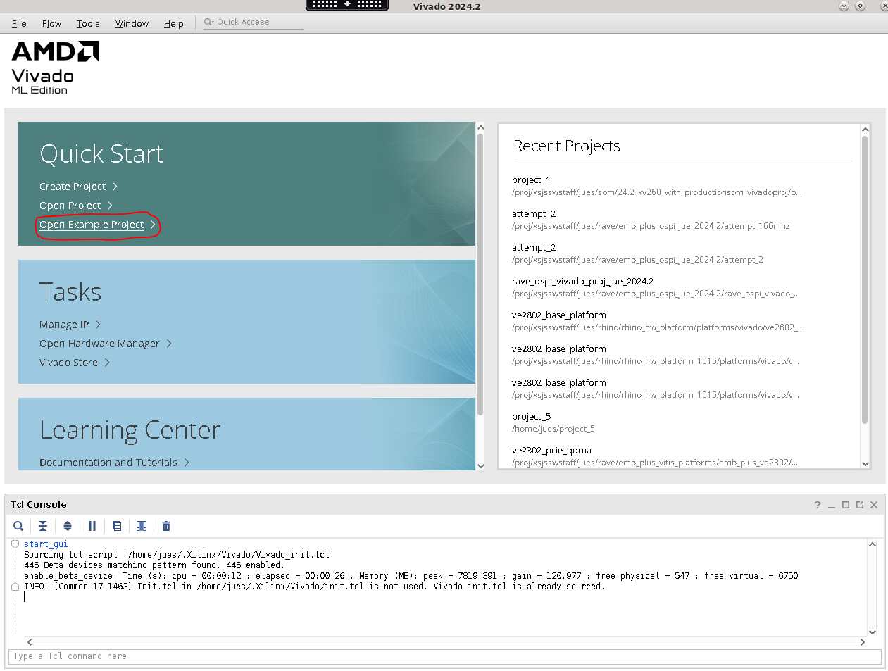
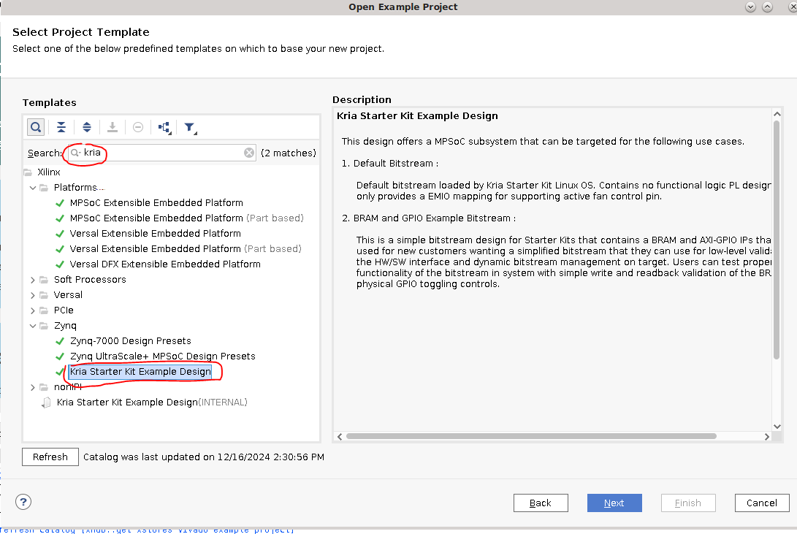
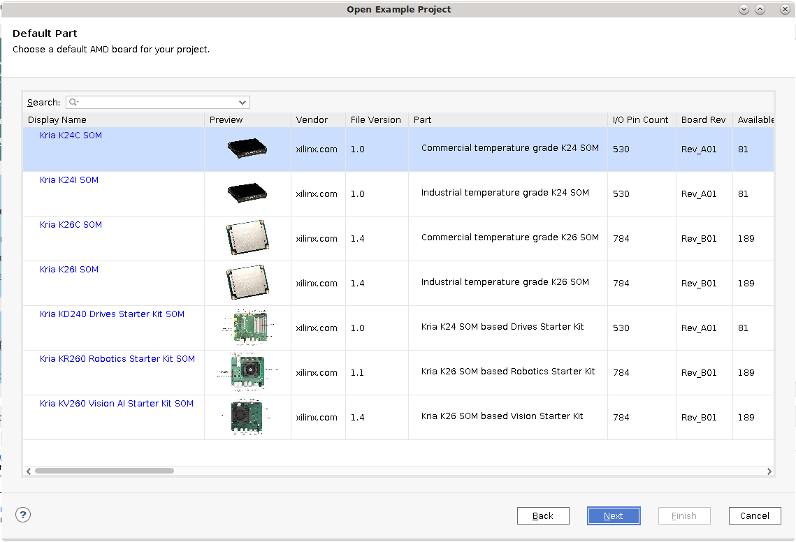
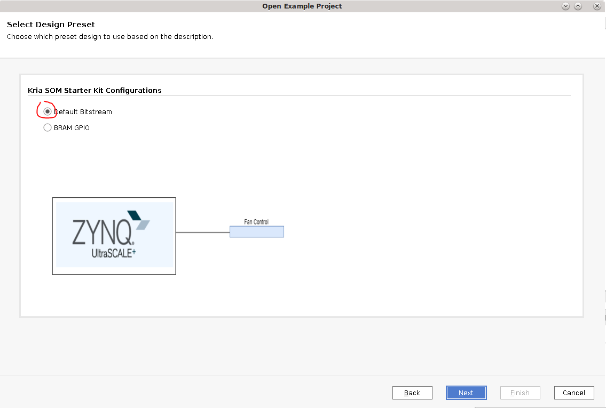

# Generate a Vivado Project from Example Project

This tutorial details how to generate an example Vivado Project for your Starter Kit from Vivado Example Projects. The example Vivado projects are used to generate the .xsa file in AMD's Yocto flow for Kria SOM.

* Assumption: Vivado 2024.2 and later
* Input: Vivado Example project
* Output: .bit or .xsa files

## Prerequisites and Assumptions

Tool requirement:

* Vivado tools installation that is 2024.2 and later

## Create a Vivado Project from Vivado Example Projects

This flows starts with Vivado example projects containing information on K26, K24, KV260 CC, KR260 CC, or KD240 CC. The example projects are also used to generate .xsa files for the default Yocto flow.

The K26/K24 SOM is supported in Vivado with example designs that configure SOM based peripherals, such as DDR, eMMC (for production SOM), and so on.

The KV260/KR260/KD240 StarterKit is supported in Vivado with example designs that configure both Starter Kit SOM and CC based peripherals, such as DDR, USB, Ethernet, fan control, and so on. It does not contain peripherals such as eMMC by default, as that is available on Production SOM only.

1. Open Vivado, and click  **Open Example Project**.


2. Click through **Next**, search for ```kria``` in the template, select **Kria Starter Kit Example Design**, and click **Next**.


3. Provide the desired project name and location, and click **next**. Then select the designed hardware configuration, and click **Next**.


4. Select **Default bitstream**, and click **Next**.


5. Click **Finish**. A Vivado base project for the desired Kria Starter Kit is created.

## Optional: Make the Platform an Extensible Platform

If the project is meant for a Vitis platform, you can now indicate that the platform is an Extensible Vitis Platform. For details on how to create Extensible Platform, refer to the *Embedded Design Development Using Vitis User Guide* ([UG1701](https://docs.amd.com/go/en-US/ug1701-vitis-accelerated-embedded/Adding-Hardware-Interfaces)).

1. Select **Project Manager** -> **Settings** -> **General**, and check **Project is an extensible Vitis Platform**.


2. Then select **window** -> **platform setup** to select the interfaces to expose as a platform. The following example screenshot indicates Vivado is reserving pl_ps_irq0 for the platform to interface with Vitis accelerators.


### Generate a Wrapper

Now, generate a wrapper or top module for the block design:

1. Navigate to **Block Design window** -> **sources window** -> **Design Sources**, right click **design_1**, and select **Generate HDL wrapper**.


2. In the window, select **Let Vivado manage wrapper and auto-update**, and click **OK**.

## Generate the Bitstream

Now you are ready to generate the bitstream. To generate the bitstream, click **Program and Debug** -> **Generate Bitstream**. This process takes some time.

## Generate .xsa file

After generating the bitstream, generate a .xsa file for either Yocto, PetaLinux, or Vitis to import. Go to **File** -> **Export** -> **Export Hardware** to launch the Export Hardware Platform wizard. This wizard can also be launched by Export Platform button in Flow Navigator or Platform Setup window.

Click through **Next**, leaving most in default, except in Select Platform State, select **Pre-synthesis, enable Include Bitstream**, and click **Finish**.

A .xsa file is generated. The export path is reported in the Tcl Console.

<hr class="sphinxhide"></hr>

<p class="sphinxhide" align="center"><sub>Copyright © 2023-2025 Advanced Micro Devices, Inc.</sub></p>

<p class="sphinxhide" align="center"><sup><a href="https://www.amd.com/en/corporate/copyright">Terms and Conditions</a></sup></p>