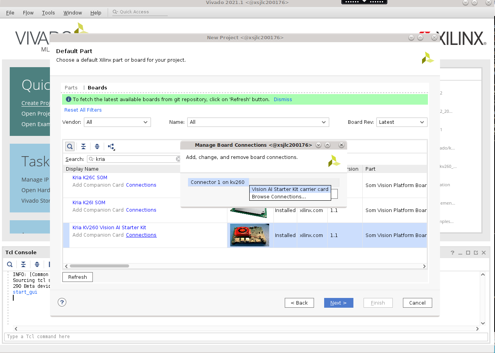
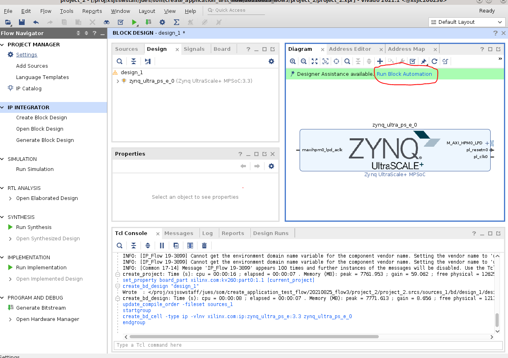
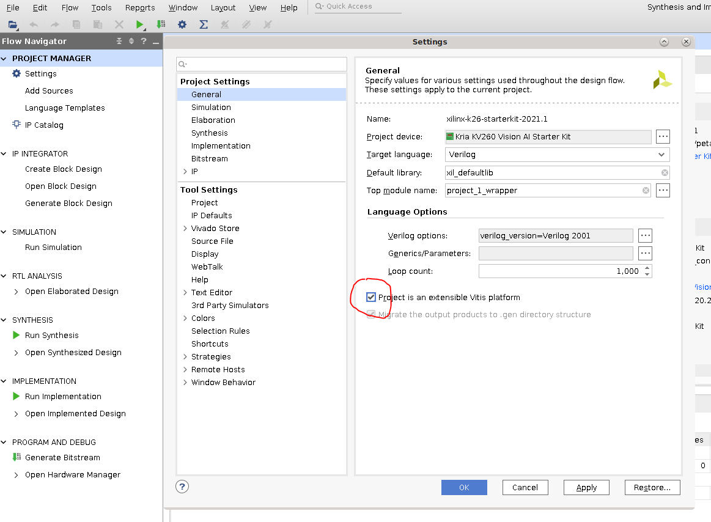
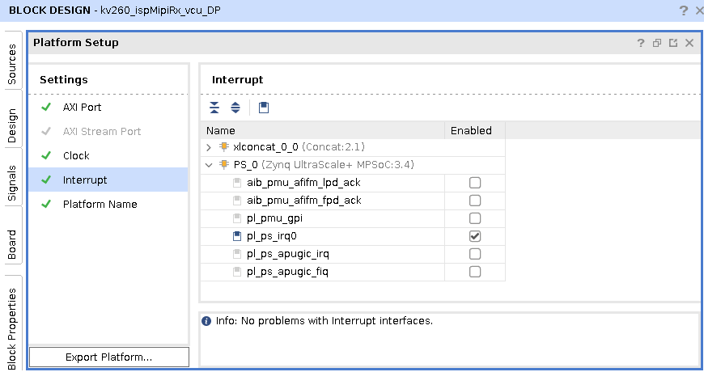
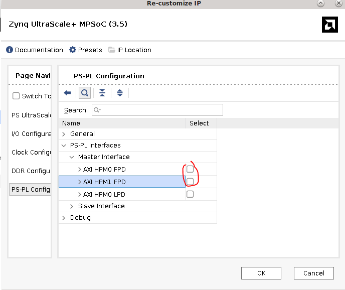
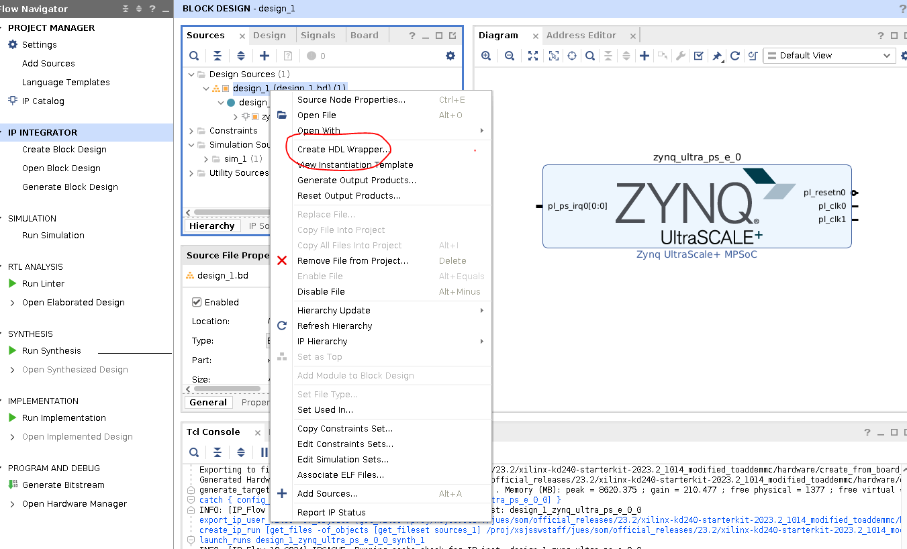

# Generate a Vivado Project from Board Files

This tutorial details how to generate a base Vivado Project for your Starter Kit from Vivado board files.

* Assumption: AMD provided SOM carrier card with associated Vivado board file automation
* Input: Vivado SOM Starter Kit board files
* Output: .bit or .xsa files

## Prerequisites and Assumptions

This document assumes that you use Vivado versions that your target starter kit is available in. For example:

1. KV260 board file is available in Vivado 2021.1 and later
2. KR260 board file is available in Vivado 2022.1 and later
3. KD240 board file is available in Vivado 2023.1 and later

For a list of board files required and the tool versions that support them, refer to the [Wiki](https://xilinx-wiki.atlassian.net/wiki/spaces/A/pages/1641152513/#Vivado-Board-Support-Packages).

Tool requirement:

* Vivado tools installation with the appropriate version

## Apply Vivado Board File Preset

This flows starts with Vivado board files containing information on K26, K24, KV260 CC, KR260 CC, or KD240 CC.

The K26/K24 SOM is supported in Vivado with board files that automate the configuration of the SOM based peripherals, such as DDR, eMMC (for production SOM), and so on.

The KV260/KR260/KD240 Starter Kit is supported in Vivado with board files that automate the configuration of both the Starter Kit SOM and CC based peripherals, such as DDR, USB, Ethernet, and so on. It does not contain peripherals such as eMMC, by default, as it available on Production SOM only.

These board files are available in Vivado's board list in the "Create Project" wizard. When Vivado starts, click **Quick Start** -> **Create Project**. Leave the default settings, and click ```**Next** until you are at the "Default Part" selections. Click **Boards**, and search for the board you want to generate a Vivado design for.



When selecting the Kria starter kit board file, make sure to click **connections**,and connect the connectors between the StarterKit SOM and the carrier card. Click **Next** then **Finish**.

In ```Flow Navigator```, click **IP integrator** -> **Create Block Design**. In the Diagram window, press the **+** button to add IP, and search for the PS to add ```Zynq UltraScale+ MPSoC```.

Once Zynq_ultra_ps_e_0 block is added to a design, click **Run Block Automation**, and to apply the board file settings, keep *Apply Board Preset** selected.



## Optional: Make the Platform an Extensible Platform

If the project is meant for a Vitis platform, now indicate that the platform is an Extensible Vitis Platform. More details on how to create Extensible Platform can be found in [UG1393](https://docs.xilinx.com/r/en-US/ug1393-vitis-application-acceleration/Adding-Hardware-Interfaces)
Project Manager -> Settings -> General -> check "Project is an extensible Vitis Platform"


Then check window -> platform setup to select interfaces to be exposed as a platform. Below is an example snapshot indicating Vivado is reserving pl_ps_irq0 for the platform to interface with Vitis accelerators.


## Clean Up or Connect Interfaces

By default, the board presets have enabled HPM0 and HPM1. If they are not connected, an error occurs when trying to generate the .xsa file or bitstream. To remove the error, in ```Block Design window -> Diagram``` and double-click the "Zynq UltraScale + MPSoC" block. Go to **PS-PL Configuration** -> **PS-PL Interfaces** -> **Master Interfaces** to uncheck the ```AXI HPM0 FPD``` and ```AXI HPM1 FPD``` interfaces before clicking **OK**:



### Generate a  Wrapper

Now, generate a wrapper or top module for the block design:

Navigate to the Block Design window -> sources window -> Design Sources, right-click **design_1**, and select **Generate HDL wrapper**:



In the pop up window, select **Let Vivado manage wrapper and auto-update**, and press **OK**.

## Generate the Bitstream

Now, generate the bitstream. To generate the bitstream, click **Program and Debug** -> **Generate Bitstream**. This process takes some time.

Optional: After the .bit file is generated, you might need to convert it to a `.bit.bin` file, a format that xmutil is expecting:

        ```shell
        cd $kv260-vitis/platforms/vivado/kv260_ispMipiRx_vcu_DP/project/kv260_ispMipiRx_vcu_DP.runs/impl_1/
        echo 'all:{kv260_ispMipiRx_vcu_DP_wrapper.bit}'>bootgen.bif
        bootgen -w -arch zynqmp -process_bitstream bin -image bootgen.bif
        mv kv260_ispMipiRx_vcu_DP_wrapper.bit.bin kv260-smartcam-raspi.bit.bin
        ```

## Generate the .xsa File

After the generating bitstream, generate a .xsa file for either Yocto, PetaLinux, or Vitis to import. Go to **File** -> **Export** -> **Export Hardware** to launch the Export Hardware Platform wizard. This wizard can also be launched by Export Platform button in the Flow Navigator or Platform Setup window.

Click through **next**, leaving the defaults except in ```Select Platform State```. Select **Pre-synthesis, enable Include Bitstream**.

Click **Finish**.

A .xsa file is generated. The export path is reported in the Tcl Console.

<hr class="sphinxhide"></hr>

<p class="sphinxhide" align="center"><sub>Copyright © 2023-2025 Advanced Micro Devices, Inc.</sub></p>

<p class="sphinxhide" align="center"><sup><a href="https://www.amd.com/en/corporate/copyright">Terms and Conditions</a></sup></p>