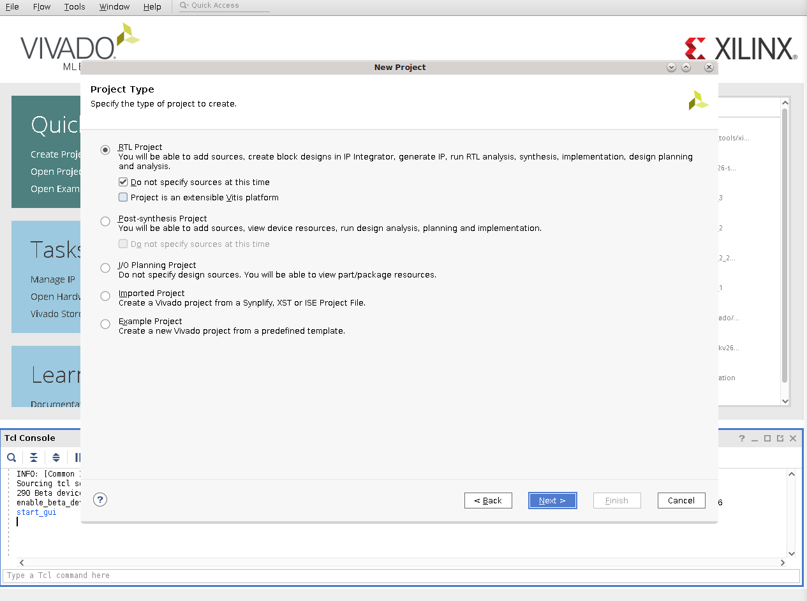
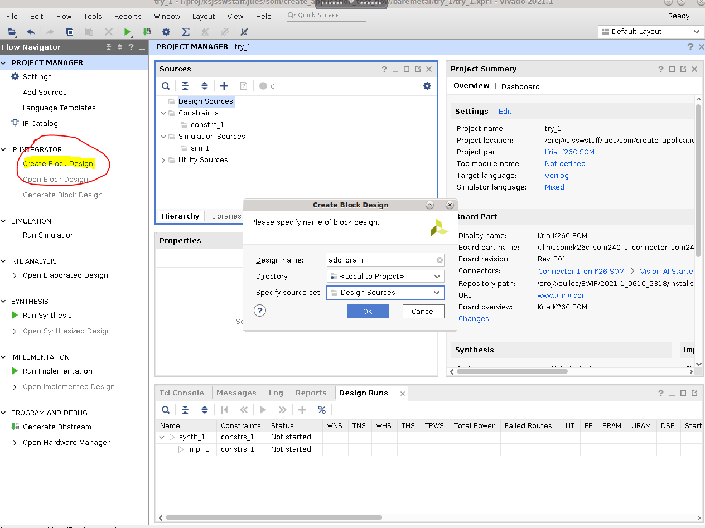
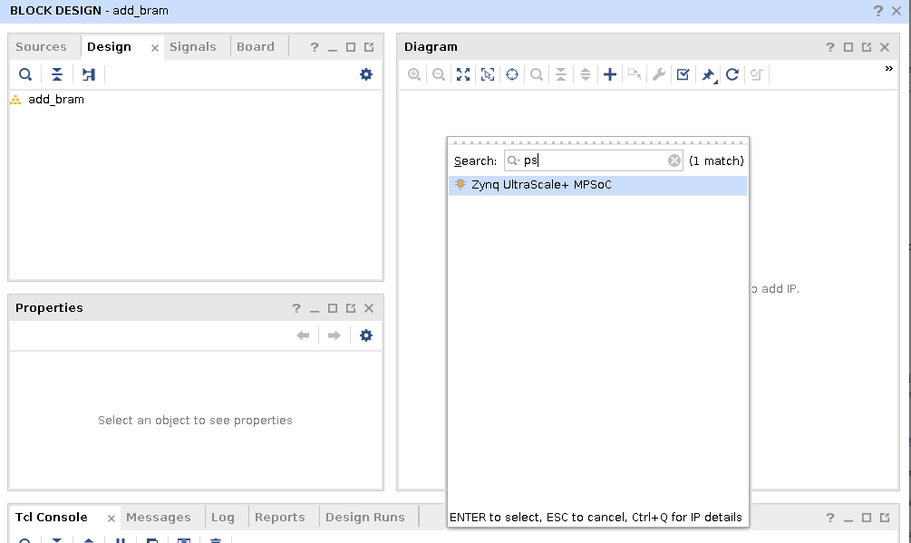
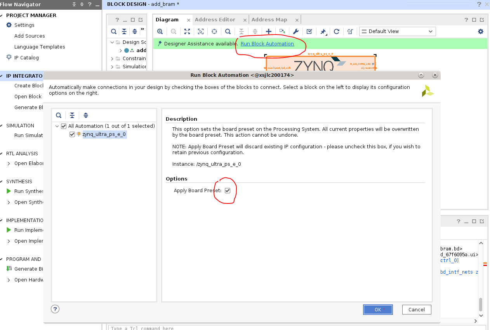
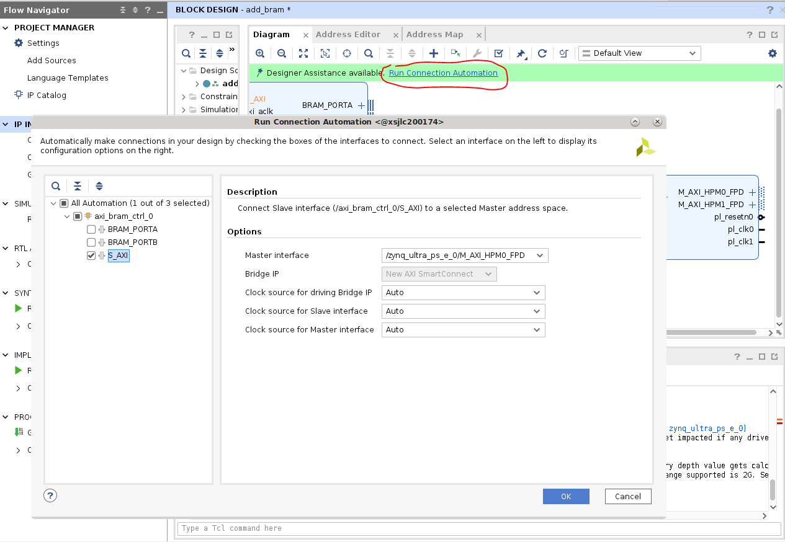
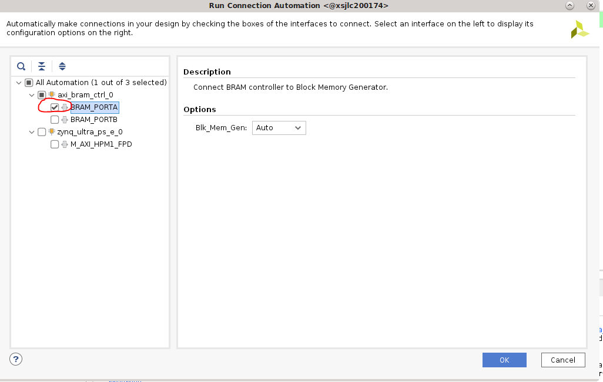

# Bare-metal Flow Example

Developers who wish to use SOM without Linux will be creating a bare-metal(also called standalone) application. This example flow will detail the process of creating a simple PL design with a BRAM connected to the PS, running on the Vision AI Starter Kit. The flow will then create a standalone software in Vitis to read and write from BRAM. Lastly, the flow will suggest two ways to load and test the application on SOM.

* Assumption: Xilinx built carrier cards with corresponding SOM Starter Kit board file
* Input: SOM Starter Kit board files (in Vivado), developer's own accelerator designs in Vivado (in this case, BRAM)
* Output: ```<pl>```.bit, fsbl.elf, pmufw.elf, ```<application>```.elf, and boot.bin

## Prerequisites and Assumptions

This document assumes that developers will use 2021.1 or later tools and SOM content releases. The tool versions should match - e.g. use the same tool versions for Vivado, Vitis, Bootgen, XSDB

1. Vitis tools installation, which will include Vivado, Bootgen, and XSDB


### Vivado board file

This flows starts with Vivado board files containing information on K26, KV260 CC or KR260 CC. The K26 SOM is supported in Vivado with board files that automate the configuration of the SOM based peripherals. These board files are available in Vivado's board list in "Create Project" wizard.

Refer to [Wiki](https://xilinx-wiki.atlassian.net/wiki/spaces/A/pages/1641152513/Kria+K26+SOM#Vivado-Board-Support-Packages) for a list of board files required, tool versions that support them and how to download them from XHUB store correctly.

## Step 1: Generate PL design in Vivado

Start Vivado. Choose File -> Project -> New. Then choose RTL project:



Click next, then choose ```boards``` in ```Default Part``` section, choose K26* card, and then click on ```connections```:


Choose the carrier card to connect the SOM to, in this case the Vision AI Starter Kit carrier card:


Click through to finish creating the project. Now create a block design:



In Block Design, click on the + sign, and add PS block:



Once the PS block is added, make sure to click ```Run Block Automation``` and apply the board preset. This will configure the PS block correctly for SOM + Carrier Card:



Now add another block - the AXI BRAM controller:


Click on ```Run Connection Automation``` and connect the S_AXI port of BRAM controller with ```M_AXI_HPM0``` port of PS:



Click on ```Run Connection Automation``` again and connect BRAM_PORTA to a block ram:



Double click the BRAM controller and configure it to only have 1 BRAM interface:


Double click the PS block, select ``PS-PL Configuration``` and configure it to only enable HPM0 (unselect HPM1):


Now connections are complete. Click on Generate Block Design:


After that is done generating, right click on the block design you have created and select ```Create HDL Wrapper```, this will set the created block design as top module:


Check the address map of the BRAM slave memory so we can use the same address in software later:


Generate the bitstream:


This will generate a bitstream at:

```try_1/try_1.runs/impl_1/add_bram_wrapper.bit```

Lastly, export the .xsa file to work the next step in Vitis:


Select ```Include bitstream```:


Launch Vitis by selecting ```Tools -> Layunch Vitis IDE```:


## Step 2: Generate Standalone Software in Vitis

In Vitis, select Project -> Create Application Project:


Select ```Create a new platform from hardware (XSA)``` and point to the .xsa file that was just exported in step 1:


Name the application and associate with PSU_cortexa53_0:


Use ```Hello World``` as a template:


In ```helloworld.c```, alter the code to read and write from BRAM, and then right click ```hello_world_system``` and select ```Build Project```:


Now developers will have the following files:

```bash
vitis_workspace/add_bram_wrapper/export/add_bram_wrapper/sw/add_bram_wrapper/boot/fsbl.elf
vitis_workspace/add_bram_wrapper/export/add_bram_wrapper/sw/add_bram_wrapper/boot/pmufw.elf
vitis_workspace/hello_world/Debug/hello_world.elf
```

## Step 3: Boot Baremetal Applications

There are two ways to boot baremetal applications - using JTAG to download files and start the application, and programming boot files into boot image sectors of QSPI so that the application boots up upon power up without needing XSDB. JTAG booting is ideal for development and debugging, while QSPI booting is ideal for deployment.

### Option 1: Boot using JTAG

Developers can boot using JTAG using the 4 files generated: fsbl.elf, pmufw.elf, hello_world.elf, add_bram_wrapper.bit using the following XSDB script:

```bash
proc boot_jtag { } {
############################
# Switch to JTAG boot mode #
############################
targets -set -filter {name =~ "PSU"}
# update multiboot to ZERO
mwr 0xffca0010 0x0
# change boot mode to JTAG
mwr 0xff5e0200 0x0100
# reset
rst -system
}

connect
boot_jtag

after 2000
targets -set -filter {name =~ "PSU"}
fpga "add_bram_wrapper.bit"
mwr 0xffca0038 0x1FF

# Download pmufw.elf
targets -set -filter {name =~ "MicroBlaze PMU"}
after 500
dow pmufw.elf
con
after 500

# Select A53 Core 0
targets -set -filter {name =~ "Cortex-A53 #0"}
rst -processor -clear-registers
dow fsbl.elf
con
after 10000
stop


dow hello_world.elf
after 500
con
```

### Option 2: Boot Using boot.bin

Alternatively, developers can generate a boot.bin file to be programmed into the A/B image update section.

Developers first need to create a `<test>.bif` file containing the following:

```bash
the_ROM_image:
{
    [fsbl_config] a5x_x64
    [pmufw_image]pmufw.elf
    [bootloader]fsbl.elf    
    [destination_device=pl]add_bram_wrapper.bit
    [destination_cpu=a5x-0]hello_world.elf

}
```

Then they need to run [bootgen](https://docs.xilinx.com/r/en-US/ug1283-bootgen-user-guide/Introduction) to create boot.bin:

```bash
bootgen -arch zynqmp -image test.bif -o boot.bin
```

Then, use the FW update and recovery utility documented in [UG1089](https://docs.xilinx.com/v/u/en-US/ug1089-kv260-starter-kit#page=24) and [here](https://xilinx-wiki.atlassian.net/wiki/spaces/A/pages/1641152513/Kria+K26+SOM#Boot-FW-Update-Process)
to update the boot firmware. In this example, we have decided to write boot.bin into image A. Make sure to mark Image A as bootable, and as the requested Boot Image so that SOM will boot image A on every power cycle.


## Step 4: Observe UART Output

After step 3, .bit file and the .elf files will be programmed, and developers should observe printouts from uart indicating the ability to write and read from BRAM.

### Optional: Restoring Linux booting image

Developers may need to restore Starter Kit back to its default, Linux-booting setting after one of the image sectors had been overwriten with baremetal boot file. In that case, they can download the released Linux booting BOOT.bin from [SOM Wiki](https://xilinx-wiki.atlassian.net/wiki/spaces/A/pages/1641152513/Kria+K26+SOM#Boot-Firmware-Updates) and program it into one of the image sectors. They will then mark that image sector as bootable and requested image.

## License

Licensed under the Apache License, Version 2.0 (the "License"); you may not use this file except in compliance with the License.

You may obtain a copy of the License at
[http://www.apache.org/licenses/LICENSE-2.0](http://www.apache.org/licenses/LICENSE-2.0)

Unless required by applicable law or agreed to in writing, software distributed under the License is distributed on an "AS IS" BASIS, WITHOUT WARRANTIES OR CONDITIONS OF ANY KIND, either express or implied. See the License for the specific language governing permissions and limitations under the License.

<p align="center">Copyright&copy; 2021 Xilinx</p>