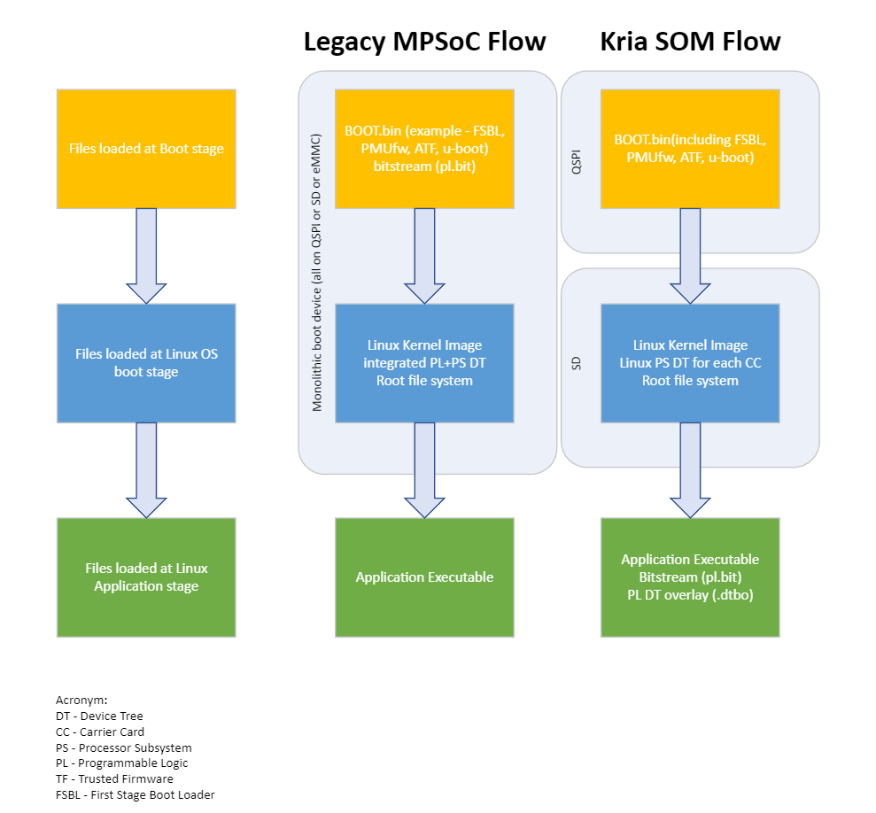

# Bitstream Management on Kria SOM

The AMD Kria&trade; Starter Kits are deployed with primary and secondary boot devices to isolate the core boot firmware and the operating system. In Kria, multiple application bitstreams are enabled without forcing operating system (OS) reboots by managing bitstreams as a dynamic software component within the Linux OS. This approach is different from AMD legacy MPSoC evaluation platforms that have used a monolithic boot device and managing the bitstream as a boot time component. This page provides a comparison of the dynamic bitstream management in the Kria Starter Kit Linux to the legacy MPSoC evaluation board flow.

The following diagram summarizes the differences, and the table that follows details the differences.

| Topic | Legacy MPSoC Flow | Kria SOM Flow |
|------------------------|--------------------------------------------------|--------------------------------------------------|
| Bitstream Management | The majority of the previous MPSoC examples focused on bitstream being loaded prior to the boot of the OS and maintaining a static hardware/software interface for all applications within that booted OS. This means that the bitstream is loaded prior to Linux booting and its device tree was loaded as part of the Linux boot device tree.                   | The Kria Starter Kit focuses on dynamic post-Linux boot bitstream management. This enables an application-agnostic boot firmware that does not include any bitstream. The bitstream is instead managed within the Linux file system and swapped dynamically at runtime using xmutil/dfx-mgr. The loading of the bitstream needs to be accompanied by its hardware/software interface definition which is appended to the booted Linux device tree (DT) through a Linux DT-overlay. Thus, bitstreams being managed dynamically require both the bitstream (`*.bit.bin`) and DT-overlay (`*.dtbo`) files. The [on target utility](./target.html) has information and pointers to bitstream management by xmutil/dfx-mgr. |
| Bitstream Generation | The majority of MPSoC legacy examples focused on the generation of the MPSoC device configuration (that is, PCW MIO configs) and the PL bitstream as a monolithic configuration generation. This was then used to generate entire set of boot firmware artifacts (FSBL, PL, PMU, ...) with every build.  | The Kria Starter Kit focuses on an incremental hardware configuration. This means that at the time of a new programmable logic (PL) design, you only need to generate the new bitstream (within the constraints of not changing other device configurations, such as MIO assignments) and do not need to regenerate a new `BOOT.BIN` because the bitstream is managed outside the `BOOT.BIN` container. You will use the resulting bitstream file and generate a corresponding DT overlay, both of which are later copied to the Linux file system to be loaded by xmutil/dfx-mgr. This [series of documents](https://xilinx.github.io/kria-apps-docs/creating_applications/2022.1/build/html/index.html) details the process to generate the overlay design, and [On-target Utilities](./target.html) has more information on xmutil/dfx-mgr.  |
| Boot Segmentation    | Legacy MPSoC examples focus on a monolithic boot device (that is, QSPI, SD card, or embedded multimedia card (eMMC)). In this flow, all firmware content is managed and searched by the CSU ROM within the same physical device.                                                                                                | The Kria Starter Kit uses a primary/secondary boot architecture to functionally segment the core boot firmware from the OS image. This is detailed in the [BootFW](https://xilinx.github.io/kria-apps-docs/bootfw/build/html/docs/bootfw_overview.html) page. The QSPI device serves as the primary boot device containing the platform `BOOT.BIN` which contains the first stage boot loader (FSBL), PMU FW, and U-Boot. The SD card device serves as the secondary boot device containing the Linux OS artifacts include the kernel and rootfs. This allows for the platform to boot multiple Linux OS images without having to build or modify the core boot firmware. You can update the boot firmware of QSPI with your own custom `BOOT.BIN`, and do this using the xmutil boot image update utility. U-Boot is used to support the hand-off between QSPI and the SD card based secondary boot device (See the K26 SOM XSA & BSP Overview). |
| Dynamic MIO          | Legacy MPSoC designs used a static MIO configuration which locks in the configuration of the PS subsystem physical I/O at device boot time.                | The Kria Starter Kit references use an incremental hardware configuration capability of PMU to support the dynamic configuration of the carrier card specific MIO (KV260 verus KR260). This allows for a common boot firmware which identifies the carrier card via the BoardID EEPROM and then U-Boot incrementally configures the corresponding CC card specific MIOs. Read more in [PMU Overlay Config Object](https://xilinx.github.io/kria-apps-docs/bootfw/build/html/docs/bootfw_pmu_config_obj.html).                       |

> **NOTE:** The dynamic bitstream management described here is how AMD is deploying and managing the Kria Starter Kit pre-built OS and application designs. For production Kria SOM developers, you have full freedom to use the combination of boot partitioning and bitstream management that matches your application requirements.

Copyright © 2023-2025 Advanced Micro Devices, Inc.

<a href="https://www.amd.com/en/corporate/copyright">Terms and Conditions</a>
