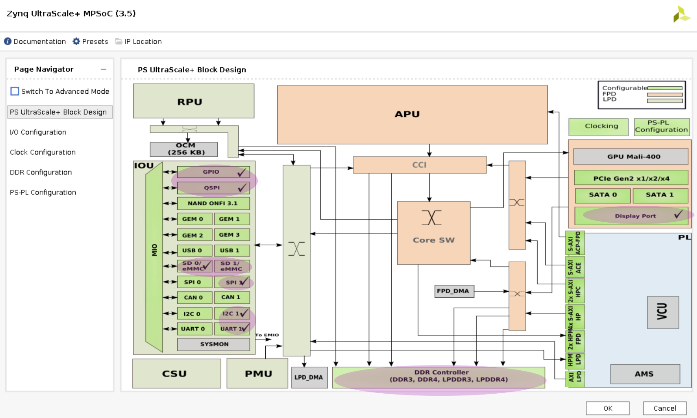

# Custom Carrier Card Flow

Creating your own carrier card creates a Vivado project using the AMD provided K26/K24 production SOM Vivado board file as a starting point. The K26/K24 board file contains the MIO configuration defined by the SOM hardware design, and provides a minimal HW configuration to boot to Linux. The K26/K24 board file does not contain any information specific to a carrier card. Then you design in your specific custom MIO and PL based physical interfaces to create your own custom hardware configuration while following the *Kria SOM Carrier Card Design Guide* ([UG1091]( https://docs.amd.com/go/en-US/ug1091-carrier-card-design)). After creating the integrated SOM + CC configuration, a .xsa file is exported. If using Linux, then create a PetaLinux project to generate boot and OS images for booting Linux. Use the artifacts to create applications to run on top of the base Linux, using the previously discussed workflows: Vitis Accelerator Flow, Vitis Platform Flow, or Vivado Accelerator Flow.

* Assumption: Using SOM K26 or SOM K24 with developer defined carrier card
* Input: Vivado K26/K24 SOM board file, customer defined carrier card board configuration
* Output: `BOOT.bin`, .wic image containing `boot.src`, Image, `ramdisk.cpio.gz.u-boot`, `system.dtb`, `rootfs.tar.gz`


## Prerequisites and Assumptions

This document assumes that you use 2022.1 or later for tools and SOM content releases. The tool versions should match. For example, use the same tool versions for PetaLinux, Vivado, and the released BSP.

1. Vitis tools installation
2. Vivado tools installation
3. PetaLinux tools installation

## Step 1: Aligning Kria SOM boot and SOM Linux Infrastructure

AMD built Kria SOM Starter Kit applications on a shared, application-agnostic infrastructure in the SOM Starter Linux including kernel version, Yocto project dependent libraries, and baseline BSP. When using this tutorial, make sure to align tools, git repositories, and BSP released versions.

### PetaLinux BSP Alignment

The SOM Starter Linux image is generated using the corresponding SOM variant multi-carrier card PetaLinux board support package (BSP). It is recommended that if you create applications on the Starter Kit, use this BSP as a baseline for your application development as it ensures kernel, Yocto project libraries, and baseline configuration alignment. The multi-carrier card BSP defines a minimalistic BSP that has the primary function of providing an application-agnostic operating system and can be updated and configured dynamically at runtime.

## Step 2: Create a Board Gile and .xdc file for a Custom Carrier Card

In example carrier card projects, a few board configuration files have been created used by Vivado to create board related configurations. You will find a few different board files for the SOM itself; the differences between each SOM variants can be found [here](https://xilinx-wiki.atlassian.net/wiki/spaces/A/pages/1641152513/#SOM-Variants).

The following is a list of the supported board files related to SOM as of 2023.1.

K26, KV260, and KR260 board file support starts in 2022.1:

* [Production SOM K26 C grade](https://github.com/Xilinx/XilinxBoardStore/tree/2023.1/boards/Xilinx/k26c)
* [Production SOM K26 I grade](https://github.com/Xilinx/XilinxBoardStore/tree/2023.1/boards/Xilinx/k26i)
* [KV260 SOM](https://github.com/Xilinx/XilinxBoardStore/tree/2023.1/boards/Xilinx/kv260_som)
* [KR260 SOM](https://github.com/Xilinx/XilinxBoardStore/tree/2023.1/boards/Xilinx/kr260_som)
* [KV260 Carrier Board](https://github.com/Xilinx/XilinxBoardStore/tree/2023.1/boards/Xilinx/kv260_carrier)
* [KR260 Carrier Board](https://github.com/Xilinx/XilinxBoardStore/tree/2023.1/boards/Xilinx/kr260_carrier)

K24 and KD240 board file support starts in 2023.1:

* [Production SOM K24 C grade](https://github.com/Xilinx/XilinxBoardStore/tree/2023.1/boards/Xilinx/k24c)
* [Production SOM K24 I grade](https://github.com/Xilinx/XilinxBoardStore/tree/2023.1/boards/Xilinx/k24i)
* [KD240 SOM](https://github.com/Xilinx/XilinxBoardStore/tree/2023.1/boards/Xilinx/kd240_som)
* [KV260 Carrier Board](https://github.com/Xilinx/XilinxBoardStore/tree/2023.1/boards/Xilinx/kd240_carrier)

For information on generating custom Vivado board files and where to place the files, refer to the *Vivado Design Suite User Guide: System-Level Design Entry* ([UG895](https://docs.amd.com/go/en-US/ug895-vivado-system-level-design-entry/Board-File)). You need create a custom board file for your custom carrier card, and you can use KV260 as an example. Use the production SOM (either C grade or I grade) as your SOM card, not KV260 SOM, KR260 SOM, or KD240 SOM.

You also need a .xdc file to create mappings between AMD MPSoC pins and connectors, as well as adding constraints. The .xdc files can be found on [Kria K26 documentation site](https://www.amd.com/en/products/system-on-modules/kria/k26/k26c-commercial.html#documentation) or [Kria K24 documentation site](https://www.amd.com/en/products/system-on-modules/kria/k24/k24c-commercial.html#documentation). The .xdc files contains information on how MPSoC pins maps to the connector, and you can use that information to create your own .xdc for your carrier card. KV260/KR260/KD240 .xdc files can be used as an example. For more information on creating a .xdc file,  refer to *Vivado Design Suite User Guide: Using Constraints* ([UG903](https://docs.amd.com/go/en-US/ug903-vivado-using-constraints)).

## Step 3: Generate a New Custom PL Design Using Vivado

This flows starts with Vivado board files containing information on K26/K24 and custom CC as mentioned in step 2. After the board file for the custom carrier card has been created and imported, it can be selected in Vivado:


Be sure to select the custom board file you have created in step 2 instead of the KV260 board.

When selecting the Kria Starter Kit board file, make sure to click **connections** to indicate that the SOM and carrier card are connected.

Once the Zynq_ultra_ps_e_0 block is added to a design, make sure to click **Run Block Automation** to apply the board file settings.


You might need to indicate that the platform is an Extensible Vitis Platform. Whether to make the project extensible or not is dependent on if you intend to reuse the platform for developing in Vitis. More details on how to create Extensible Platform can be found [here](https://docs.amd.com/go/en-US/ug1701-vitis-accelerated-embeddedPlatform-Creation-Basics).
In Project Manager -> Settings -> General, select **Project is an extensible Vitis Platform**.


Then, add the .xdc files for both SOM and your custom carrier card.

### Vivado Starter Project in BSP

Alternatively, you can start from the base Vivado project provided. It can either be downloaded from [GitHub](https://github.com/Xilinx/kria-base-hardware/) or found in the BSP files.

To get the project from bsp, first, download the SOM Starter Kit BSP from the [SOM Wiki](https://xilinx-wiki.atlassian.net/wiki/spaces/A/pages/1641152513/Kria+K26+SOM#PetaLinux-Board-Support-Packages)
Then, create the project using BSP:

```bash
petalinux-create -t project -s xilinx-<SOM board name>-<version>.bsp
cd xilinx-<SOM board name>-<version>
# example <SOM board name> is K26 or K24
```

The Vivado starter project can be found in the ```hardware/``` folder, and you can open the project using the .xpr file. This project is a SOM (K26/K24) project only and does not contain any information about the carrier card being used. However, it does have enough information to boot basic Linux. It has all the peripherals that exist on a production Kria SOM itself. For an example, on the K26 Production SOM, it has DDR, eMMC, QSPI, UART, and so on enabled, as highlighted in purple in the following PCW screenshot:



You can then configure the PCW to enable carrier-card specific peripherals such as GEM, USB, and so on.

### Generate the .bit.bin and .xsa file

To add custom IP blocks into your design and generate a .xsa file and a binary bitstream (.bin file converted .bit.bin file), refer to the Vivado documentation. To generate a binary bitstream (.bin) file, nav to **Tools** -> setting and enable -bin_file, and rename the generated .bin file to `.bit.bin`.


To generate an updated .xsa file, select **File** -> **Export** -> **Export Hardware**. Make sure to select **include bitstream** in the generation.


An example base design for booting Linux is found in the PetaLinux project folder generated from SOM Starter Kit BSP in ```project-spec/hw-description/system.xsa```.

If using Linux, you also need to create a .dtsi file for the project. You can find the DTSI files in [Xilinx device-tree-xlnx repo](https://github.com/Xilinx/device-tree-xlnx) or [u-boot repo](https://github.com/Xilinx/u-boot-xlnx). For example:

* [2023.1 K26 production SOM dtsi](https://github.com/Xilinx/device-tree-xlnx/blob/xlnx_rel_v2023.1/device_tree/data/kernel_dtsi/2023.1/BOARD/zynqmp-sm-k26-reva.dtsi)
* [2023.1 K26 Kria SOM Starter Kit SOM dtsi](https://github.com/Xilinx/device-tree-xlnx/blob/xlnx_rel_v2023.1/device_tree/data/kernel_dtsi/2023.1/BOARD/zynqmp-smk-k26-reva.dtsi)
* [2023.1 K24 C grade production SOM dtsi](https://github.com/Xilinx/device-tree-xlnx/blob/xlnx_rel_v2023.1/device_tree/data/kernel_dtsi/2023.1/BOARD/zynqmp-sm-k24-reva.dtsi)
* [2023.1 K24 Kria SOM Starter Kit SOM dtsi](https://github.com/Xilinx/device-tree-xlnx/blob/xlnx_rel_v2023.1/device_tree/data/kernel_dtsi/2023.1/BOARD/zynqmp-smk-k24-reva.dtsi)
* [2023.1 KV dts](https://github.com/Xilinx/u-boot-xlnx/blob/xlnx_rebase_v2023.01_update/arch/arm/dts/zynqmp-sck-kv-g-revA.dts)
* [2023.1 KR dts](https://github.com/Xilinx/u-boot-xlnx/blob/xlnx_rebase_v2023.01_update/arch/arm/dts/zynqmp-sck-kr-g-revA.dts)
* [2023.1 KD dts](https://github.com/Xilinx/u-boot-xlnx/blob/xlnx_rebase_v2023.01_update/arch/arm/dts/zynqmp-sck-kd-g-revA.dts)

## Step 4 - Create the Linux Boot Fmage from the .xsa in PetaLinux

For a detailed guide to create an image, refer to the *PetaLinux Tools Documentation: Reference Guide* ([UG1144](https://docs.amd.com/go/en-US/ug1144-petalinux-tools-reference-guide)). The following are the commands extracted from the guide:

```bash
petalinux-create --type project --template zynqMP --name <petalinux_project>
cd <petalinux_project>
petalinux-config --get-hw-description <path to .xsa file>
cp <path to .dtsi file> project-spec/meta-user/recipes-bsp/device-tree/files/system-user.dtsi
petalinux-build 
```

The image and boot files are found in ```images/linux/```.

You can also use the [SOM K26 or K24 production BSP](https://xilinx-wiki.atlassian.net/wiki/spaces/A/pages/1641152513/#PetaLinux-Board-Support-Packages) to generate a PetaLinux project and images. It does not have any information on any carrier cards, but it has enough SOM information to generate an image to boot to Linux and also include utilities such as xmutil and dfx-mgr. This can be used for bring up. To use a released BSP, replace the above ```petalinux-create``` command with the following:

```bash
petalinux-create -t project -s xilinx-<SOM board name>-<version>.bsp
#<som board name> example: k26 or k24
```

## Step 5 - Boot a New Image on the Target Platform

Depending on what you decide to put on your custom carrier card, you might choose different [boot modes](./bootmodes.md). JTAG booting is available on all carrier cards, and this section details how to boot Linux via JTAG using PetaLinux. To help with booting with your preferred boot mode, details on using PetaLinux to boot Linux can be found in the *PetaLinux Tools Documentation: Reference Guide* ([UG1144](    https://docs.amd.com/go/en-US/ug1144-petalinux-tools-reference-guide/Generate-Boot-Image-for-Zynq-UltraScale-MPSoC)).

First, package the built images into the prebuilt folder:

```bash
petalinux-package --prebuilt
```

Thenm generate a xsdb Tcl script <test.tcl>:

```bash
petalinux-boot --jtag --prebuilt 3 --tcl <test.tcl>
```

`<test.tcl>` contains a script to boot Linux with tiny rootfs and exit XSDB, assuming that you are still in the PetaLinux project folder. Take care to copy the necessary files, and the change pointers to files if you need to move the files to a different host machine to boot. Remove "exit" at the end of the tcl script to observe printouts from the script in XSDB.

In XSDB, first connect and put the board in JTAG mode using the XSDB commands found [here](./bootmodes.md). Then ```source <test.tcl>```, and Linux boots.

## Step 6 - Develop Applications

Now that a base Linux design is up a running, follow the [Vitis Accelerator Flow](./vitis_accel_flow.md), [Vitis Platform Flow](./vitis_platform_flow.md), or [Vivado Accelerator Flow](./vivado_accel_flow.md) to develop your applications.

## Resources and Examples

* For a detailed step by step example on how to create a base design for KV260, refer to [custom cc flow example](./custom_cc_flow_example.md).
* For a list of resources for building custom carrier cards, refer to [Kria Adventure Map](https://xilinx.github.io/kria-apps-docs/Kria_doc_map/map.htm), world 3.

<hr class="sphinxhide"></hr>

<p class="sphinxhide" align="center"><sub>Copyright © 2023-2025 Advanced Micro Devices, Inc.</sub></p>

<p class="sphinxhide" align="center"><sup><a href="https://www.amd.com/en/corporate/copyright">Terms and Conditions</a></sup></p>