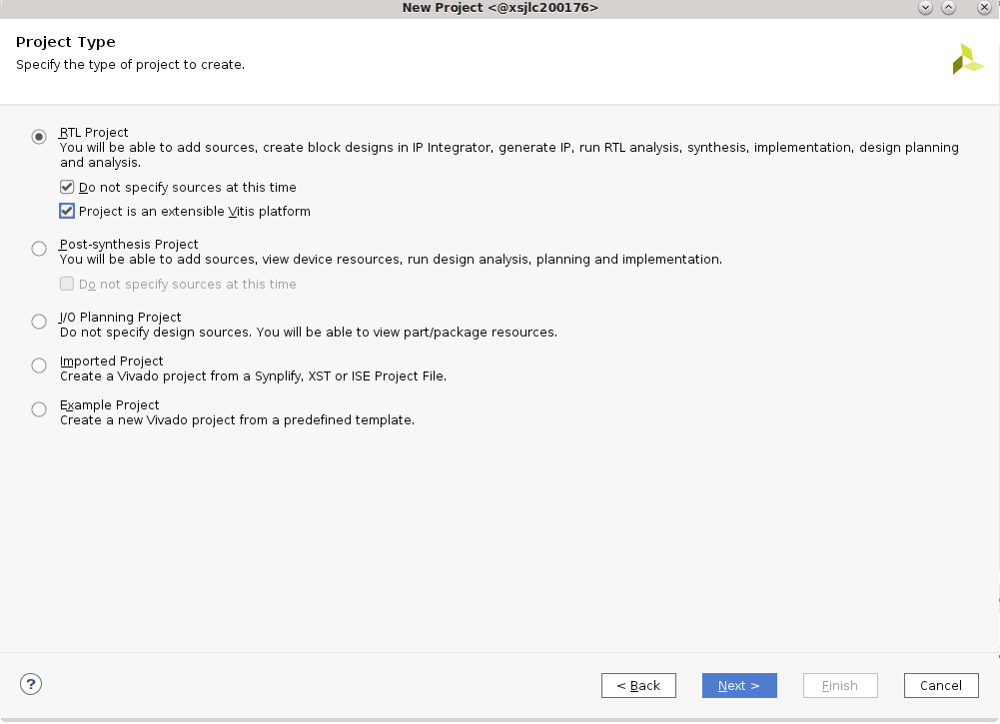
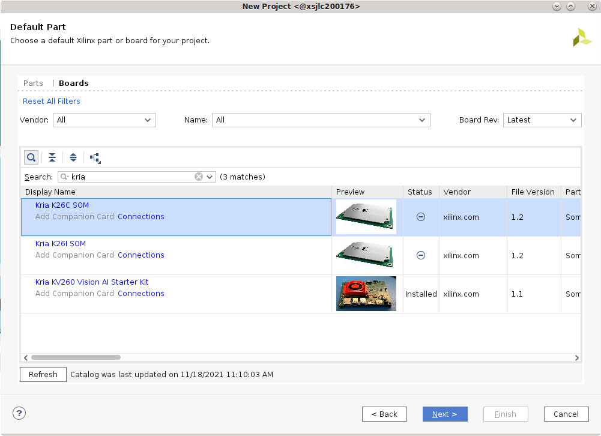
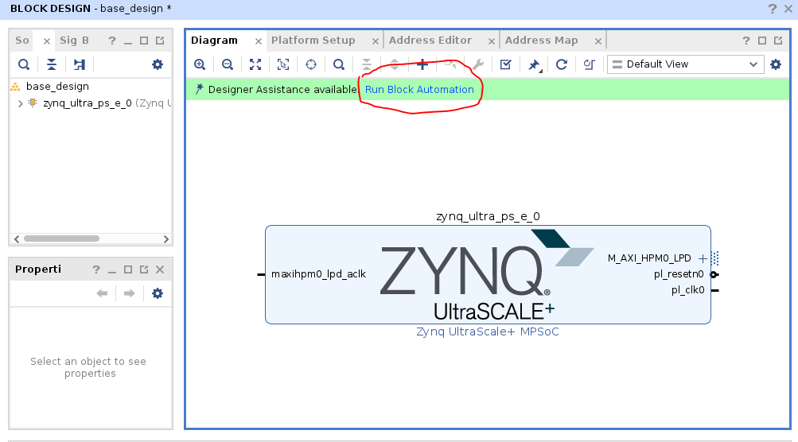
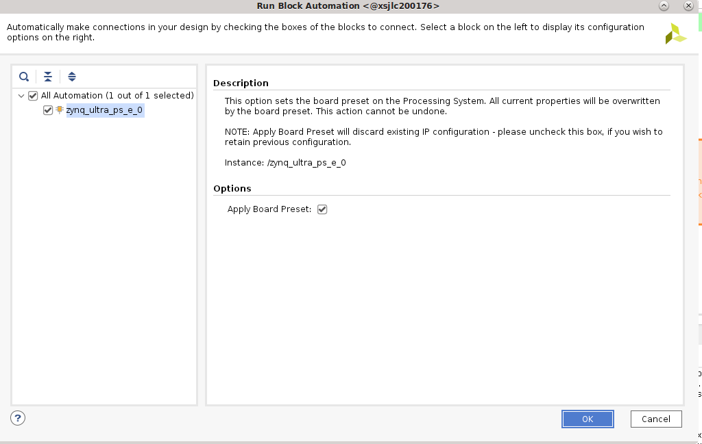

# Example - Creating a Platform for a Custom Carrier Card

Developers will create a custom carrier card to support their production configuration when migrating from Starter Kit based evaluation to the production SOM. They will need to create a base .xsa design suited for their Carrier Card + SOM combo. This example creates a base .xsa design for KV260 (Vision Carrier card + Kria SOM) Starter Kit as an example of how a developer may create their own base designs.

## Creating a Vivado design

In Vivado, click on ```Create Project``` -> ```next``` -> enter ```kv260_base``` as project name and select project location -> next

select "Project is an extensible Vitis platform" if you plan to continue with Vitis Platform Flow and not Vivado Accelerator Flow.



in Default Part page, select "Boards", search for "Kria" and select the appropiate SOM, in this case we select Kria K26C SOM. We do not click connections because we are creating a design for KV260 manually as an example of creating a project for custom CC.



Click ```Finish```

In ```Flow Navigator``` click on ```IP Integrator -> Create Block Design```. update ```Design name``` to ```base_design```.

### Setting up PS connections

In Diagram tab, click on "+" to add IP. Search for "Zynq UntraScale+ MPSoC" and double click to add. Once the block appears, click on "Run Block Automation"



Keep selections of "Apply Board Preset" and click OK. This will apply HW configuration presets that are dictated by the SOM physical design. Special notes on PMU power management functions and default UART are called out in [DS987](https://www.xilinx.com/support/documentation/data_sheets/ds987-k26-som.pdf) “MIO Banks” table note #1.



Double click on the Zynq Ultrascale+ Block to configure the block. The KV carrier card includes DisplayPort, SD card, UART, and GEM functionality. These physical MIO mappings can be found in the KV carrier card schematic and need to be enabled in I/O configuration design:

* Check High Speed -> GEM -> GEM 3, leaving default settings (MIO 64... 75)
* Check High Speed -> USB -> USB 0 and then USB 3.0, leaving default setting for USB 0 (MIO 52 .. 63), but change to GT Lane2  for USB 3.0
* Check High Speed -> Display Port, change DPAUX to (MIO 27 .. 30) and Lane Selection to  Dual Lower
* Check Low Speed -> I/O Peripheral -> UART -> UART 1 , change to (MIO 36 ... 37)
* Uncheck Low Speed -> Memory Interfaces ->  SD -> SD 0
* Check Low Speed -> Memory Interfaces -> SD -> SD 1 and leave MIO selection at (MIO 39 .. 51), and expand SD1:
  * check CD and select MIO 45
  * Check Power and select MIO 43

If we switch over to the PS UltraSccale_ Block design, we should see the following with the same check marks:


When creating your own custom CC card design, you may also want to update Clock Configuration and PS-PL configuration to suit your custom carrier cards. In this case, the default configuration will work for our KV260 and requires no changes.

Click OK to apply settings.

To save the block design in a tcl script, this is the command:

```bash
write_bd_tcl -no_ip_version -check_ips false -f <output>.tcl
```

### Setting up board files

In the base .xsa designs that we release, there are no PL component - the PS is configured and PL ready for developers to add their own designs. However, when adding some IPs (such as MIPI), there are presets that are applied that has information on the pin connections on the boards. Developers will need to create their own board files. They can also put the pin definition into an .xdc file instead.

Refer to [UG895](https://docs.xilinx.com/r/en-US/ug895-vivado-system-level-design-entry) for more information on board files.

SOM Starter Kit presets can be found in Vivado installation folder. For an example they are found in ```<installation folder>/Vivado/<version>/data/xhub/boards/XilinxBoardStore/boards/Xilinx/<board>/1.1/```

Developers will want to create their own presets for pin-accessing IPs or put those information in their .xdc files.

To apply the .xml files, copy the kv260/ folder into a chosen ```<path>```, and execute the following in Vivado:

```bash
   set_param board.repoPaths [list "<path>" “<path2>” “...”]
```

Then in step [Creating a Vivado design](#creating-a-vivado-design), select the board file to pair with K26 SOM in below interface by clicking on "connection" and finding the newly defined carrier card board file there.


If you are trying out the KV260 board files, please change mentioning of "Vision AI Starter Kit carrier card" to "Test Vision AI Starter Kit carrier card" (or other appropiate names) in board.xml and preset.xml in order to differentiate it from the boardfiles already exist in tools.

Note that in preset.xml of KV260, we already define the presets for Zynq MPSoC's processor subsystem, which was defined manually in [Creating a Vivado design](#creating-a-vivado-design). Therefore for the purpose of this tutorial, we did not apply the board files in order to show you how to manually setup PS connections for a CC.

Alternatively, define all the contraints in .xdc file instead. the .xdc file can be added by ```File```-> ```Add Sources``` -> ```add or create constraints```

The xdc definition for KV260 interfaces that includes PL definition can be found [here](https://www.xilinx.com/products/som/kria/k26c-commercial.html#documentation) as an example.

## Next Steps

After creating the base .xsa design for a custom CC, developers can then go through [Vitis Platform Flow](./vitis_platform_flow.md), [Vivado Accelerator Flow](./vivado_accel_flow.md), or [Baremetal Flow](./baremetal.md) to create their appplicartions.

## License

Licensed under the Apache License, Version 2.0 (the "License"); you may not use this file except in compliance with the License.

You may obtain a copy of the License at
[http://www.apache.org/licenses/LICENSE-2.0](http://www.apache.org/licenses/LICENSE-2.0)

Unless required by applicable law or agreed to in writing, software distributed under the License is distributed on an "AS IS" BASIS, WITHOUT WARRANTIES OR CONDITIONS OF ANY KIND, either express or implied. See the License for the specific language governing permissions and limitations under the License.

<p class="sphinxhide" align="center">Copyright&copy; 2023 Advanced Micro Devices, Inc</p>