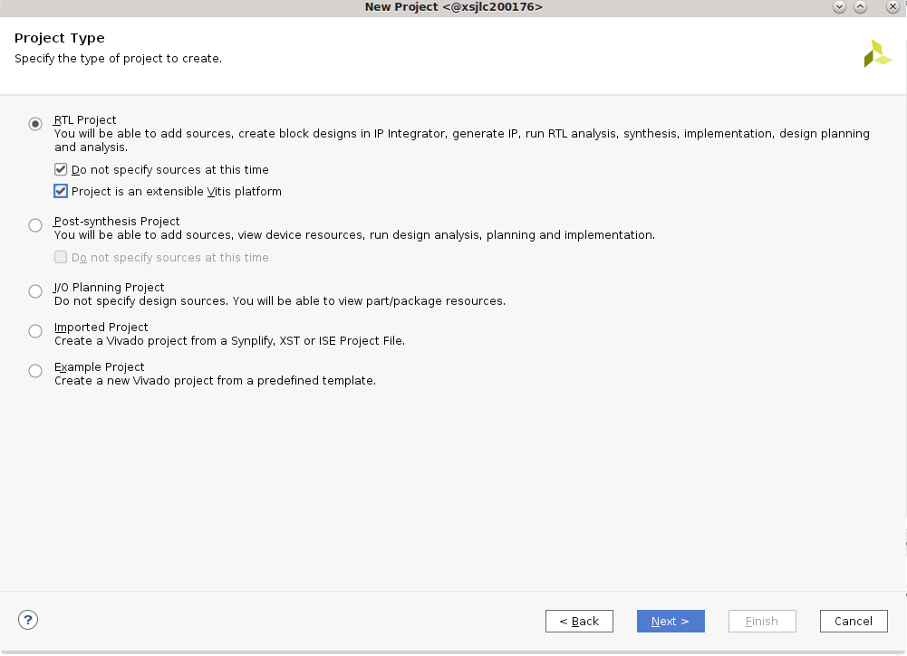
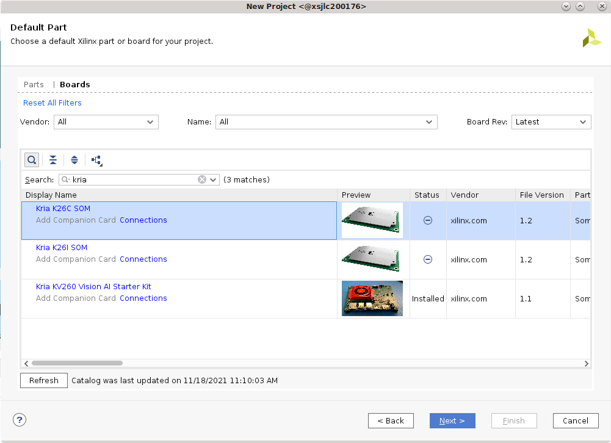
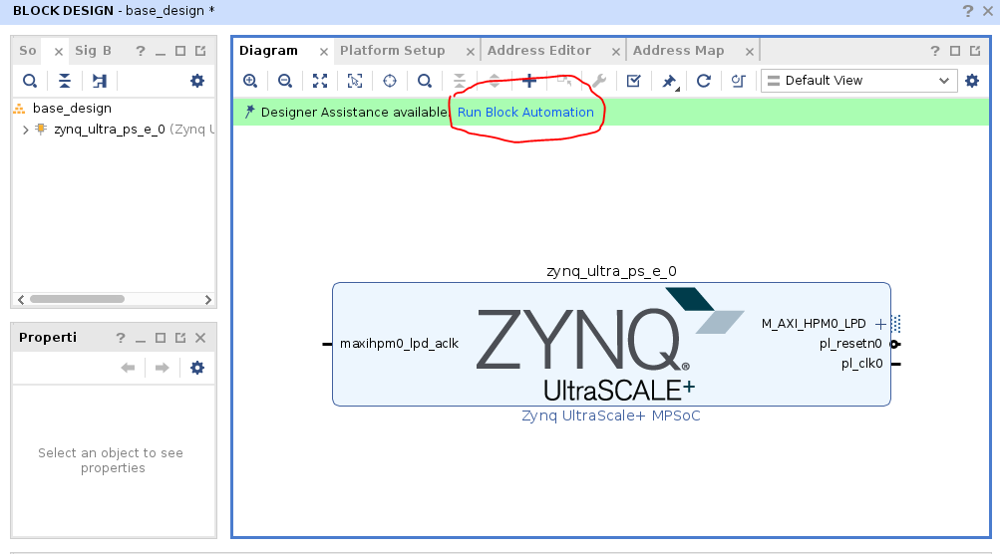
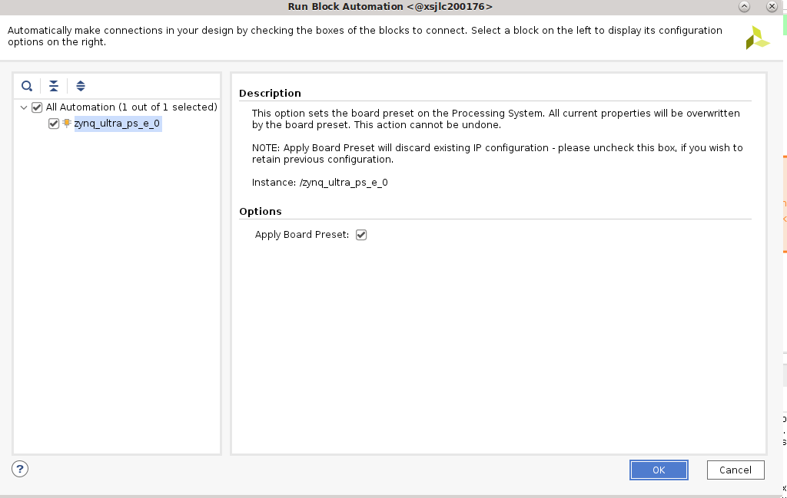
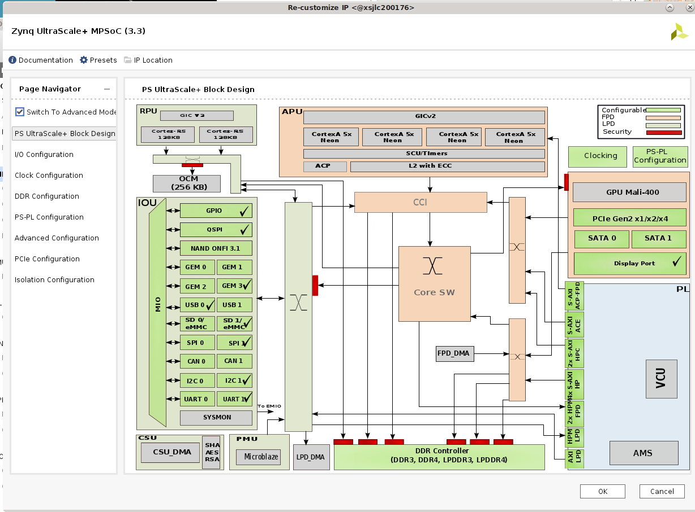

# Example: Create a Platform for a Custom Carrier Card

You can create a custom carrier card to support your production configuration when migrating from the Starter Kit based evaluation to the production SOM. You need to create a base .xsa design suited for your carrier card + SOM combo. This example creates a base .xsa design for the KV260 (Vision carrier card + Kria SOM) Starter Kit as an example of how to create your own base designs.

## Create a Vivado Design

1. In Vivado, click **Create Project** -> **next**, and enter ```kv260_base``` as the project name, and select **project location** -> **next**.

    If you plan to continue with the Vitis Platform Flow and not the ivado Accelerator Flow, select **Project is an extensible Vitis platform**.


2. In the Default Part page, select **Boards**, search for `Kria`, and select the appropriate SOM (In this case, select **Kria K26C SOM**). Do not click connections because you are creating a design for the KV260 manually as an example of creating a project for a custom CC.


    Click **Finish**.

3. In ```Flow Navigator```, click **IP Integrator** -> **Create Block Design**. Update the ```Design name``` to ```base_design```.

### Set Up the PS Connections

1. In the Diagram tab, to add the IP, click **+** to. Search for `Zynq UntraScale+ MPSoC` and double click to add. Once the block appears, click **Run Block Automation**.


2. Keep the selections of "Apply Board Preset" and click **OK**. This applies the hardware configuration presets that are dictated by the SOM physical design. Special notes on PMU power management functions and default UART are called out in the “MIO Banks” table note #1 of the *Kria K26 SOM Data Sheet* ([DS987](https://docs.amd.com/go/en-US/ds987-k26-som)).


3. To configure the block, double-click the Zynq Ultrascale+ block. The KV carrier card includes DisplayPort, SD card, UART, and GEM functionality. These physical MIO mappings are found in the KV carrier card schematic and need to be enabled in the I/O configuration design:

    * Check **High Speed** -> **GEM** -> **GEM 3**, leaving the default settings (MIO 64... 75)
    * Check **High Speed** -> **USB** -> **USB 0** and then **USB 3.0**, leaving the default setting for USB 0 (MIO 52 .. 63), but change to GT Lane2 for USB 3.0
    * Check **High Speed** -> **Display Port**, change DPAUX to (MIO 27 .. 30) and Lane Selection to  Dual Lower
    * Check **Low Speed** -> **I/O Peripheral** -> **UART** -> **UART 1** , and change to (MIO 36 ... 37)
    * Uncheck **Low Speed** -> **Memory Interfaces** ->  **SD** -> **SD 0**
    * Check **Low Speed** -> **Memory Interfaces** -> **SD** -> **SD 1**, and leave the MIO selection at (MIO 39 .. 51), and expand SD1:
      * Check **CD** and select **MIO 45**
      * Check **Power** and select **MIO 43**

    If you switch over to the PS UltraSccale_ Block design, you see the following with the same check marks:


    When creating your own custom CC card design, you might also want to update the clock configuration and PS-PL configuration to suit your custom carrier cards. In this case, the default configuration works for your KV260 and requires no changes.

4. To apply the settings, click **OK**.

5. To save the block design in a Tcl script, use the following command:

    ```bash
    write_bd_tcl -no_ip_version -check_ips false -f <output>.tcl
    ```

### Set Up the Board Files

In the base .xsa designs that released, there is no PL component. The PS is configured and the PL is ready for you to add your own designs. However, when adding some IPs (such as MIPI), there are presets that are applied that has information on the pin connections on the boards. You need to create your own board files. Instead, you can also put the pin definition into a .xdc file.

For more information on board files, refer to *Vivado Design Suite User Guide: System-Level Design Entry* ([UG895]( https://docs.amd.com/go/en-US/ug895-vivado-system-level-design-entry)).

The SOM Starter Kit presets are found in the Vivado installation folder. For example, ```<installation folder>/Vivado/<version>/data/xhub/boards/XilinxBoardStore/boards/Xilinx/<board>/1.1/```.

You need to create your own presets for pin-accessing IPs or put this information in your .xdc files.

1. To apply the .xml files, copy the `kv260/` folder into a chosen ```<path>```, and execute the following in Vivado:

    ```bash
      set_param board.repoPaths [list "<path>" “<path2>” “...”]
    ```

2. In the [Create a Vivado design](#create-a-vivado-design) step, select the board file to pair with the K26 SOM in the following interface. Click **connection** and find the newly defined carrier card board file there.


3. If you are trying out the KV260 board files, change "Vision AI Starter Kit carrier card" to "Test Vision AI Starter Kit carrier card" (or other appropriate names) in `board.xml` and `preset.xml` to differentiate it from the board files that already exist in the tools.

    >**NOTE:** In the `preset.xml` file of the KV260, the presets are already defined for the Zynq MPSoC processor subsystem, which was defined manually in [Create a Vivado design](#create-a-vivado-design). Therefore, for the purpose of this tutorial, the board files are not applied in order to show you how to manually set up PS connections for a CC.

    Alternatively, define all the constraints in the .xdc file instead. To add the .xdc file, select **File** -> **Add Sources** -> **add or create constraints**.

    As an example, the xdc definition for KV260 interfaces that includes PL definition can be found [here](https://www.xilinx.com/products/som/kria/k26c-commercial.html#documentation).

## Next Steps

After creating the base .xsa design for a custom CC, go through the [Vitis Platform Flow](./vitis_platform_flow.md), [Vivado Accelerator Flow](./vivado_accel_flow.md), or [Baremetal Flow](./baremetal.md) to create your appplications.

<hr class="sphinxhide"></hr>

<p class="sphinxhide" align="center"><sub>Copyright © 2023-2025 Advanced Micro Devices, Inc.</sub></p>

<p class="sphinxhide" align="center"><sup><a href="https://www.amd.com/en/corporate/copyright">Terms and Conditions</a></sup></p>