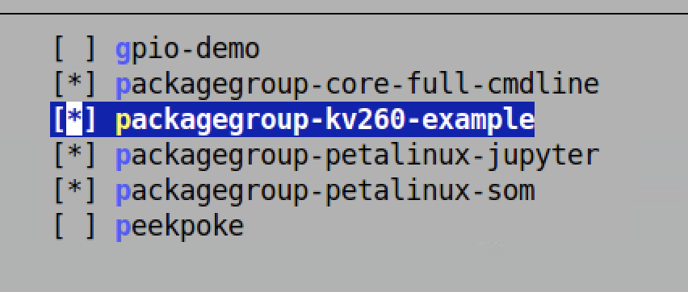
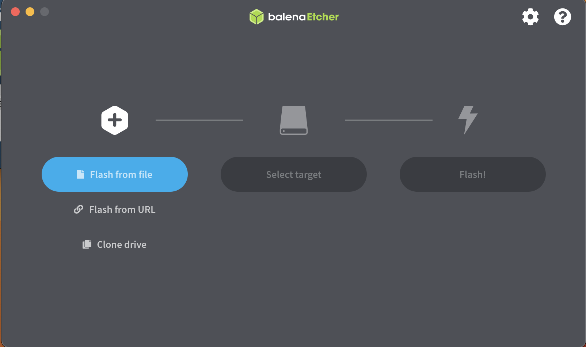

# Petalinux Firmware

In this step, we will be creating the firmware for running the Image resizing application. We will use the PetaLinux toolchain to build a new Petalinux wic image with the hardware and software binaries baked in using recipes. 

***IMPORTANT : A ***prerequisite*** for this step is the user should know about the Petalinux flow and familar with Yocto recipes***


## Petalinux eSDK update 

You need PetaLinux 2022.1 with eSDK update 1 or later, as the vvas library is released asynchronously and not included in the main 2022.1 petalinux tools release. Download [PetaLinux Tools Installer 2022.1](https://www.xilinx.com/support/download/index.html/content/xilinx/en/downloadNav/embedded-design-tools.html) 

To install PetaLinux, extract the petalinux installer, accept the license, and source the tool's settings script.

1. Set up the PetaLinux environment. 

```
source <petaLinux_tool_install_dir>/settings.sh
```
The eSDK can be used to update the petalinux tool for creating new images or SDKs. The eSDK updates are published here. Upgrade the tool with new eSDK for the '2022.1 update1' release and source the tool's settings script.

```
petalinux-upgrade -u 'http://petalinux.xilinx.com/sswreleases/rel-v2021/sdkupdate/2022.1_update3/' -p 'aarch64'
```
The petalinux tool is now updated with '2022.1 update1' Yocto eSDK.

## Platform outputs 

Before creating the petalinux firmware, lets bring all the platform outputs inside a platform_outputs directory. 

```
//If you are on a differnet level, go the *tutorial* directory 

mkdir platform_outputs 
cp kria_platform/kria-vitis-platforms/kv260/overlays/examples/smartcam/binary_container_1/link/int/system.bit platform_outputs/
cp kria_platform/kria-vitis-platforms/kv260/overlays/examples/smartcam/binary_container_1/dpu.xclbin platform_outputs/

```

## Create PetaLinux Project

The first step is downloading the 22.1 Starter Kit SOM BSP from the [Kria K26 SOM wiki](https://xilinx-wiki.atlassian.net/wiki/spaces/A/pages/1641152513/Kria+K26+SOM#Introduction) under the PetaLinux Board Support Package section. Create a PetaLinux project with the Starter Kit SOM BSP using the following commands. 

```
mkdir firmware
cd firmware
// copy the Downloaded BSP into the firmware folder
petalinux-create -t project -s xilinx-kv260-starterkit-v2022.1-05140151.bsp 
cd xilinx-kv260-starterkit-2022.1/
petalinux-build
```

We will add recipes for FPGA Binaries, MIPI cameras, VVAS custom plugins, and package groups in the following steps.  These recipes will be part of the project-spec/meta-user folder, which is a meta-layer that's already included in the project.


## FPGA firmware

When the user launches the xmutil loadapp application, the xmutil will invoke the DFX Manager. The [dfx-mgr](https://github.com/Xilinx/dfx-mgr) is a Xilinx library that implements an on-target daemon for managing a data model of on-target applications, active PL configuration, and loading/unloading the corresponding bitstreams. The dfx-mgr requires that the application bitstreams be loaded in /lib/firmware/<company_name>/<app_name>.

The dfx-mgr requires that the files required for an application be loaded in the same <app_name>. The app_name directory must contain the following:

- Application bitstream converted to *.bit.bin format
- Application bitstream device tree overlay *.dtbo
- If it's a Vitis-based PL design using XRT - metadata file in .xclbin format
- shell.json with metadata about the PL design


### Converting bit stream to bit.bin

- The fpgamanager class will automatically convert the system.bit to system.bit.bin.

### Modifying DTBO 

- Download the [samrtcam dtsi](https://github.com/Xilinx/kria-apps-firmware/blob/xlnx_rel_v2022.1/boards/kv260/smartcam/kv260-smartcam.dtsi) and rename to tut_1.dtsi file and copy it to the platform_outputs directory. Modify the line 15 contents to the following. 

```
firmware-name = "system.bit.bin";
``` 

### Generating shell.json 

- The shell.json file is a metadata file for dfx-mgr. The shell.json only needs the following content. Touch and copy it to the *platform_outputs directory*

```
{
  "shell_type" : "XRT_FLAT",
  "num_slots": "1"
}
```

### fpgamanager Class 

- The fpgamanager provides an interface to Linux for configuring the programmable logic (PL). It packs the dtbos and bitstreams in the /lib/firmware/xilinx directory in the root file system. Use the following command to generate the firmware recipe. The recipe will be generated at "project-spec/meta-user/recipes-firmware/tutorial/"


The platform_outputs directory should have the following files:

```
system.bit 
shell.json
tut_1.dtsi
dpu.xclbin

```
Run the following command to creare a tutorial.bb file. It will be created at this location ***project-spec/meta-user/recipes-apps/tutorial/tutorial.bb***. 
```
petalinux-create -t apps --template fpgamanager -n tutorial --enable --srcuri " ../../platform_outputs/system.bit  ../../platform_outputs/shell.json   ../../platform_outputs/tut_1.dtsi ../../platform_outputs/dpu.xclbin" --force
```

Navigate to the file and add the following content

```
vi project-spec/meta-user/recipes-apps/tutorial/tutorial.bb
```

Open the file and add the following content to the end of the tutorial.bb file 

```
PACKAGE_ARCH = "${MACHINE_ARCH}"
 
COMPATIBLE_MACHINE:k26-kv = "${MACHINE}"
```

## Add Recipe for AP1302 Firmware


Smartcam uses an AR1335 MIPI sensor, which requires AP1302 firmware. AP1302 is released on GitHub. We will first create a folder called "ap1302-firmware" to keep the AP1302 recipes ap1302-firmware.inc and ap1302-ar1335-single-firmware.bb. 

```
mkdir -p project-spec/meta-user/recipes-firmware/ap1302-firmware/
```
Create a new file [ap1302-ar1335-single-firmware.bb](./code/kria_vitis_acceleration_flow/image_resizing/petalinux_firmware/ap1302-firmware/ap1302-ar1335-single-firmware.bb) and add the below  content for project-spec/meta-user/recipes-firmware/ap1302-firmware/ap1302-ar1335-single-firmware.bb:

```
SUMMARY = "ap1302 ar1335-single firmware binary"
 
include ap1302-firmware.inc
 
FW_NAME = "ap1302_ar1335_single_fw.bin"
```

Create a new file [ap1302-firmware.inc](./code/kria_vitis_acceleration_flow/image_resizing/petalinux_firmware/ap1302-firmware/ap1302-firmware.inc) and add the below content for project-spec/meta-user/recipes-firmware/ap1302-firmware/ap1302-firmware.inc.

```
LICENSE = "Proprietary"
LIC_FILES_CHKSUM = "file://LICENSE.txt;md5=9c13aad1aab42f76326f1beceafc40c4"
 
BRANCH ?= "xlnx_rel_v2022.1"
SRC_URI = "git://github.com/Xilinx/ap1302-firmware.git;protocol=https;branch=${BRANCH}"
SRCREV ?= "63e20752dc8b1e91fc6d6d518ebeb76f65e9f738"
 
S = "${WORKDIR}/git"
 
FW_NAME ?= ""
 
do_configure[noexec] = "1"
do_compile[noexec] = "1"
 
do_install() {
    install -d ${D}/lib/firmware  # create /lib/firmware
    install -m 0644 ${FW_NAME} ${D}/lib/firmware/${FW_NAME} # copy firmware binary to /lib/firmware
}
 
FILES:${PN} = "/lib/firmware/${FW_NAME}"

```

## Add Recipe for Image resizing software

Next, we add the recipe for smartcam software, released on [GitHub](https://github.com/Xilinx/smartcam/tree/xlnx_rel_v2022.1) for 2022.1. We first create a folder for the application recipe. 

```
mkdir -p project-spec/meta-user/recipes-apps/resize/
```

Create a new file, [resize.bb](./code/kria_vitis_acceleration_flow/image_resizing/firmware/resize/resize.bb) and add the following content to file project-spec/meta-user/recipes-apps/resize/resize.bb

```
SUMMARY = "Example Smartcam application"
 
LICENSE = "Apache-2.0"
LIC_FILES_CHKSUM = "file://LICENSE;md5=a9c5ded2ac97b4ce01aa0ace8f3a1755"
 
BRANCH = "xlnx_rel_v2022.1"
SRC_URI = "git://github.com/Xilinx/smartcam.git;protocol=https;branch=${BRANCH}"
SRCREV = "ad9523ee5f002141334698eb6ddc9a14679ac8d2"
 
inherit cmake
 
DEPENDS = "vvas-accel-libs glog gstreamer1.0-rtsp-server opencv"
RDEPENDS:${PN} = " \
    gst-perf \
    gstreamer1.0-omx \
    gstreamer1.0-plugins-bad-faac \
    gstreamer1.0-plugins-bad-mpegtsmux \
    gstreamer1.0-plugins-good-rtp \
    gstreamer1.0-plugins-bad-kms \
    gstreamer1.0-plugins-bad-mediasrcbin \
    gstreamer1.0-plugins-bad-videoparsersbad \
    gstreamer1.0-plugins-good-multifile \
    gstreamer1.0-plugins-good-rtpmanager \
    gstreamer1.0-plugins-good-udp \
    gstreamer1.0-plugins-good-video4linux2 \
    gstreamer1.0-python \
    gstreamer1.0-rtsp-server \
    vvas-accel-libs \
    libdrm-tests \
    v4l-utils \
    alsa-utils \
    python3-core \
    "
 
SOMAPP_INSTALL_PATH = "/"
EXTRA_OECMAKE += "-DCMAKE_BUILD_TYPE=Release -DCMAKE_SYSROOT=${STAGING_DIR_HOST} -DCMAKE_INSTALL_PREFIX=${SOMAPP_INSTALL_PATH} "
 
S = "${WORKDIR}/git"
 
FILES:${PN} += " \
    /opt/xilinx \
    "
```

##  Create Packagegroup
Next, we want to create the package group to include both the firmware and software, as well as the AR1335 driver that is needed for this application. [UG1144](https://docs.xilinx.com/r/en-US/ug1144-petalinux-tools-reference-guide/Adding-a-Package-Group) also details this step. 

```
mkdir -p project-spec/meta-user/recipes-core/packagegroups/
```
Create a new file [packagegroup-kv260-example.bb](./code/kria_vitis_acceleration_flow/image_resizing/firmware/packagegroups/packagegroup-kv260-example.bb) and add the following content to file project-spec/meta-user/recipes-core/packagegroups/packagegroup-kv260-example.bb

```
DESCRIPTION = "Example Smartcam related Packages"
 
inherit packagegroup
 
EXAMPLE_PACKAGES = " \
    ap1302-ar1335-single-firmware \
    tutorial \
    resize \
    "
 
RDEPENDS:${PN} = "${EXAMPLE_PACKAGES}"
 
COMPATIBLE_MACHINE = "^$"
COMPATIBLE_MACHINE:k26-kv = "${MACHINE}"
PACKAGE_ARCH = "${MACHINE_ARCH}"
```

Add the below line to project-spec/meta-user/conf/user-rootfsconfig:

```
CONFIG_packagegroup-kv260-example
```

Enable the package group by using the below command to get to the configuration GUI,

```
petalinux-config -c rootfs

```
Go to "user packages" dir and select "packagegroup-kv260-example". Click Yes to save the configurations and Exit.





## Build the Petalinux WIC Image
Build the image using the following commands. 


```
petalinux-build
petalinux-package --wic --bootfiles "ramdisk.cpio.gz.u-boot boot.scr Image system.dtb"
```

## Image SD card 

Petalinux Image will be generated in the "xilinx-kv260-starterkit-2022.1/images/linux" folder. Navigate to the folder. Using a GUI like balenaEtcher, flash a microSD card with the "petalinux-sdimage.wic" image:



## Next steps
This completes the Petalinux WIC Image generation. The next step is [running image application on the board](./running-on-board.md).


