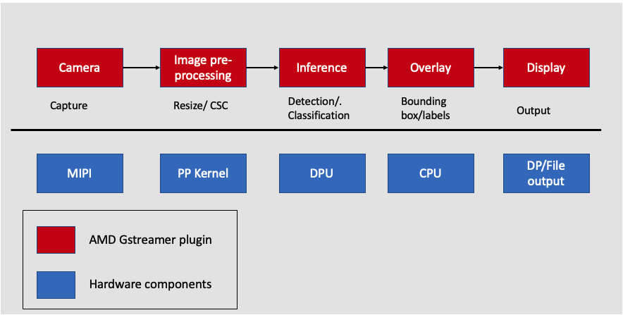

# Overview of the Smartcam VVAS plugin 

This step will give an overview of the VVAS plugin used for the Smart Camera Application. The VVAS smart camera code invokes the image-resizing kernel and DPU. The graph below shows the Smart Camera application from input video to outputting insights. All the individual blocks are various plugins that are used. At the bottom are the different hardware engines that are utilized throughout the application. The Smart camera pipeline works as follows:

Streaming data can come over the MIPI camera directly. The meadiasrc bin plugin is a wrapper around GStreamer generic v4l2src plugin. The mediasrcbin plugin is designed to simplify using live video capture devices in this design.

***AI Pre-processing***: The captured frames are sent to the image pre-processing step, where the input image can be pre-processed before inference. The plugin will perform the pre-processing step, as seen in the previous step. The Pre-processor step converts the NV12 image to BGR format, image resizing, and quantizing blocks as required by the DPU AI inference engine. The quantizer function is added in step -1 of the ML tutorial.  

***AI Inference:*** After pre-processing, the frame is sent for inference. Inference is performed using the VVAS infrastructure plugin vvas_xfilter and vvas_xdpuinfer acceleration library. The vvas_xdpuinfer is an acceleration software library that controls the DPU through the Vitis AI interface. 

***AI Rendering:*** To overlay the inference results, such as bounding boxes and labels. arrows etc., there is a software acceleration library called vvas_xboundingbox. This library and the vvas_xfilter plug-in draw bounding boxes and label information on the frame.

Finally, VVAS presents various options to output the results, like rendering the output with the bounding boxes on the screen, saving the output to the local disk, etc.



## Video Capture plugin
[Video Capture](https://xilinx.github.io/kria-apps-docs/kv260/2022.1/build/html/docs/smartcamera/docs/sw_arch_platform.html#video-capture) at the user-space level uses a Media source bin plugin. The [mediasrcbin](https://xilinx.github.io/kria-apps-docs/kv260/2022.1/build/html/docs/smartcamera/docs/sw_arch_platform.html#media-source-bin-gstreamer-plugin) plugin is designed to simplify using live video capture devices in this design. The plugin is a bin element that includes the standard [v4l2src](https://gstreamer.freedesktop.org/documentation/video4linux2/v4l2src.html?gi-language=c) GStreamer element. It configures the media pipelines of the supported video sources in this design. It allows you to configure the media pipeline and its sub-devices. It uses the libmediactl and libv4l2subdev libraries which provide the following functionality:

```
- Enumerate entities, pads and links
- Configure sub-devices
    - Set media bus format
    - Set dimensions (width/height)
    - Set frame rate
    - Export sub-device controls

```
## AI Pre-processing Plugin

The vvas_xmultisrc plugin will control the pre-processing step. The inputs to the plugin are a JSON file, and xclbin, which will be available on the card at "/opt/xilinx/kv260-smartcam/share/vvas/${AI_TASK}/preprocess.json". It contains information on the quantization of the resized BGR images. These values are generated from the AI model protoxt file and will vary between AI task configs as the core AI algorithm demands. In the last step of compiling a YOLO model and changing these values, we will see. The current preprocess.json file uses the following. 

```
"config": {
        "debug_level" : 0,
        "mean_r": 128,
        "mean_g": 128,
        "mean_b": 128,
        "scale_r": 1,
        "scale_g": 1,
        "scale_b": 1
    }

```

## AI Inference Plugin

vvas_xfilter GStreamer plugin with kernel library /usr/lib/libvvas_dpuinfer.so works as middleware between applications that interface with the user and underlying Vitis AI library, which interface with DPU to do the actual AI inference tasks. For 3 AI tasks that are supported: Facedetect, Refinedet, and SSD, the user does not need to change anything in the json. The following is the JSON file for Facedetect. 

```
"xclbin-location":"/lib/firmware/xilinx/kv260-smartcam/kv260-smartcam.xclbin",
"vvas-library-repo": "/opt/xilinx/kv260-smartcam/lib",
  "element-mode": "transform",
  "kernels": [
    {
      "kernel-name": "pp_pipeline_accel:{pp_pipeline_accel_1}",
      "library-name": "libvvas_xpp.so",
      "config": {
        "debug_level" : 1,
        "mean_r": 128,
        "mean_g": 128,
        "mean_b": 128,
        "scale_r": 1,
        "scale_g": 1,
        "scale_b": 1
      }
    }
 }

```

## AI Rendering Plugin 

The results from the AI Inference step (such as coordinates of detected faces) are passed to the AI Rendering plugin, which is responsible for drawing bounding boxes around the objects in the original frame. vvas_xfilter GStreamer plugin and kernel library /usr/lib/libvvas_xboundingbox.so do the AI results rendering work, based on the meta info passed down from the AI Inference plugin to here with video buffers.  The JSON file at /opt/xilinx/kv260-smartcam/share/vvas/${AI_TASK}/drawresult.json provides a way to customize the rendering properties such as font of the label, colors of the bounding box for different classes.

```
"xclbin-location":"/usr/lib/dpu.xclbin",
 "vvas-library-repo": "/opt/xilinx/kv260-smartcam/lib",
 "element-mode":"inplace",
 "kernels" :[
   {
     "library-name":"libvvas_airender.so",
     "config": {
         "fps_interval" : 10,
         "font_size" : 2,
         "font" : 3,
         "thickness" : 2,
         "debug_level" : 0,
         "label_color" : { "blue" : 0, "green" : 0, "red" : 255 },
         "label_filter" : [ "class", "probability" ],
         "classes" : [
         ]
     }
   }
 ]

```
## DP output Plugin

[kmssink](https://gstreamer.freedesktop.org/documentation/kms/index.html?gi-language=c) is a simple video sink that renders video frames directly in a plane of a DRM device. The kmssink element interfaces with the DRM/KMS Linux framework and the Xilinx DRM driver through the libdrm library and the dri-card device node. The kmssink element library uses the libdrm library to configure the cathode ray tube controller (CRTC) based on the monitor's extended display identification data (EDID) information with the video resolution of the display. It also configures plane properties such as the alpha value. Information on the Display software stack can be found [here](https://xilinx.github.io/kria-apps-docs/kv260/2022.1/build/html/docs/smartcamera/docs/sw_arch_platform.html#dp-tx-display). 

Next steps
This completes the Smartcam VVAS overview. The next step is [Smartcam Petalinux-firmware](./smartcam-petalinux.md).