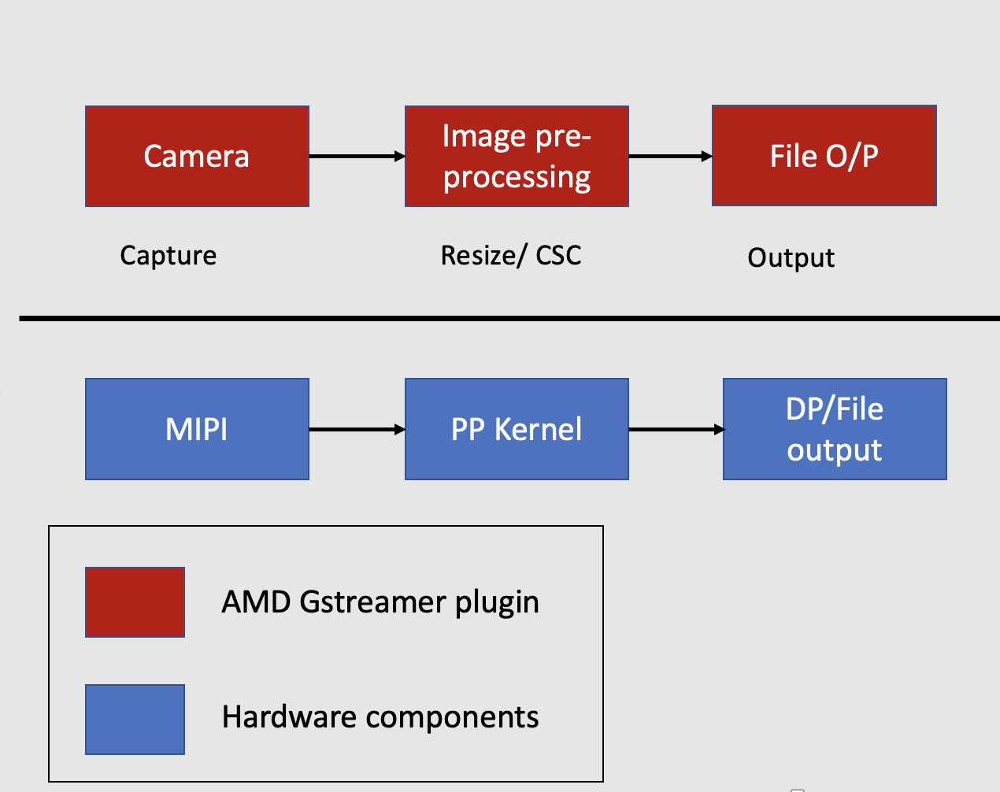
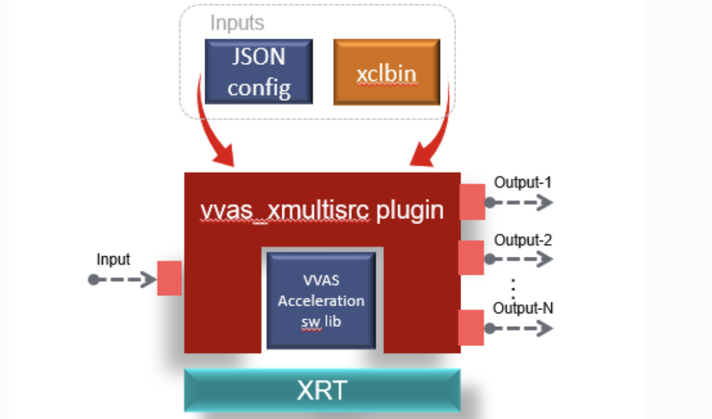

# Overview of VVAS Plugins

GStreamer is a pipeline-based multimedia framework linking various media processing systems to create workflows.  For example, GStreamer can build a system that reads files in one format, processes them, and exports them in another. The formats and processes can be changed in a plug-and-play fashion. Vitis Video Analytics SDK(VVAS) leverages the ease of use of the GStreamer framework to build seamless streaming pipelines for AI-based video and image analytics and several other solutions without needing any understanding of FPGA or other development environment complexities. VVAS provides several hardware accelerators for various functionalities and highly optimized GStreamer plugins meeting most of the requirements of Video Analytics and transcoding solutions. VVAS also provides an easy-to-use framework to integrate their own hardware accelerators/kernels into GStreamer framework-based applications.

## Smartcamera VVAS Code

The Smart Camera application VVAS code, uses the Video Capture , AI Pre-processing Plugin, AI Inference Plugin, AI Rendering Plugin, DP output Plugin to perform facedetect application. This step only performs the image-resizing kernel which can be performed using the AI pre-processing pluigin. It uses an xmultisrc infrastructure plugin which is used to invoke the image-resizing kernel. The AI Inference Plugin, AI Rendering Plugin, DP output Plugin are explained in the ML Inference step.

## Image Processing Application

The graph below shows the Image Resizing application from input video to output. All the individual blocks are various plugins that are used. At the bottom are the different hardware engines that are utilized throughout the application. The  GStreamer pipeline works as follows:



***Video Capture plugin:*** Streaming data comes over the MIPI camera directly. The meadiasrc bin plugin is a wrapper around GStreamer generic v4l2src plugin. The mediasrcbin plugin is designed to simplify using live video capture devices in this design.

***Image Pre-processing plugin:*** The captured frames are sent to the image pre-processing step, where the input image can be pre-processed before inference. The pre-processing step will be performed by the vvas_xmultisrc plugin. The vvas_xmultisrc plugin calls the PP kernel on the hardware. The Pre-processor step converts the NV12 image to BGR format and resizes the image

***File o/p plugin:*** Finally, filesink Gstreamer plugin is used to output to the local disk, etc.

## Video Capture Plugin

[Video Capture](https://xilinx.github.io/kria-apps-docs/kv260/2022.1/build/html/docs/smartcamera/docs/sw_arch_platform.html#video-capture) at the user-space level uses a Media source bin plugin. The [mediasrcbin](https://xilinx.github.io/kria-apps-docs/kv260/2022.1/build/html/docs/smartcamera/docs/sw_arch_platform.html#media-source-bin-gstreamer-plugin) plugin is designed to simplify the usage of live video capture devices in this design. The plugin is a bin element that includes the standard v4l2src GStreamer element. It allows you to configure the media pipeline and its sub-devices. It uses the libmediactl and libv4l2subdev libraries which provide the following functionality:

```text
- Enumerate entities, pads and links
- Configure sub-devices
  - Set media bus format
  - Set dimensions (width/height)
  - Set frame rate
  - Export sub-device controls
```

## Image pre-processing Plugin

Smart camera VVAS code uses the Xmultisrc plugin to perfom the [Image pre-processing step](https://github.com/Xilinx/smartcam/blob/xlnx_rel_v2022.1/src/vvas_xpp_pipeline.c). The [Xmultisrc](https://xilinx.github.io/VVAS/2.0/build/html/docs/common/common_plugins.html#vvas-xmultisrc) is a generic infrastructure plugin that is used to build custom accelerations. The plug-in abstracts the GStreamer framework's core/common functionality, such as caps negotiations, buffer management, etc.  The plugin can have one input pad and multiple-output pads. The Xmultisrc plug-in takes the configuration file as one of the input properties, kernels-config. This configuration file is in JSON format and contains the information the kernel requires. During the initialization step, the Xmultisrc parses the JSON file and performs the following tasks:

1. Finds the VVAS acceleration software library in the path and loads the shared library.
2. Understands the acceleration software library type and prepares the acceleration software library handle (VVASKernel) to be passed to the core APIs



## Image Resizing JSON FILE

The smartcam VVAS xmultisrc plugin uses the following JSON file which will be used to control the image resizing kernel.The JSON file points to the xclbin, vvas library repo, kernel-name and libaray-name.

In the [Vitis Compile and Link section](./vitis-compile-link.md), the makefile outputs a **xclbin and system.bit** the binaries.  In the [petalinux firware step](./petalinux-firmware.md), you will learn that the binarie will be loaded at the "/opt/xilinx location"  

```text
{  
  xclbin-location":"/opt/xilinx/kv260-smartcam/kv260-smartcam.xclbin",
  "vvas-library-repo": "/opt/xilinx/kv260-smartcam/lib",
  "element-mode": "transform",
  "kernels": [
    {
      "kernel-name": "pp_pipeline_accel:{pp_pipeline_accel_1}",
      "library-name": "libvvas_xpp.so",       
      "config": {


      }
    }
  ]
}
```

| Property Name         | Type          |  Default              | Description                                   |
| :---                  |    :----:     | :----:                |   :----:                                            |
| xclbin-location       | String        |   NULL                | The path of xclbin, including the xclbin name. The plug-in downloads this xclbin and creates an XRT handle for memory allocation and programming kernels.                                              |
| vvas-library-repo     | String        |   /usr/lib            | The library path for the VVAS repository for all the acceleration software libraries.                                               |
| kernels               | N/A           |    N/A                | The JSON tag for starting the kernel-specific configurations.                                              |
| kernel-name           | String        |   NULL                | Name and instance of a kernel separated by “:” as mentioned in xclbin.                                              |
| library-name          | String        |  NULL                 | The acceleration software library name for the kernel. This is appended to vvas-library-repo for an absolute path.                                             |
| config                | N/A           |    N/A                | The JSON tag for kernel-specific configurations depends on the acceleration software library.                                              |

## Acceleration Development guide for XMULTISRC

[Xmultisrc](https://xilinx.github.io/VVAS/2.0/build/html/docs/common/common_plugins.html#vvas-xmultisrc) plugin interacts with the acceleration kernel through a set of Core APIs and utility APIs exposed by an acceleration software library. Smart camera VVAS code uses the Xmultisrc plugin to perfom the [Image pre-processing step](https://github.com/Xilinx/smartcam/blob/xlnx_rel_v2022.1/src/vvas_xpp_pipeline.c). We will use the same plugin for the Image processing Application. In this we will give an overview of the plugin development

### VVAS Core APIs

The GStreamer VVAS infrastructure plug-ins (vvas_xfilter and vvas_xmultisrc) call the core APIs to perform operations on the kernel. The core APIs will invoke the XRT, which sends the commands and manages the buffers to the kernel. The VVAS Core APIs have 4 API's which will be called by the GStreamer in sequence.

1. Plugin Initialization
2. Starting the kernel.
3. Waiting for the kernel done
4. Denitilizating the plugin

### Plugin Initialization

- In this step, the XMultisrc plugin will invoke the xlnx_kernel_init function to perform a one-time initialization of any custom data structures. In this step, the smartcam xmultisrc plugin reads the JSON file, allocates memory, and initializes the struct. This is performed at the Line-77 of the xmultisrc plugin.

### Starting the kernel

#### Kernel Properties

- Before starting the kernel, the user should know about the Kernel mode and the type of kernels. This will define the set of APIs to be used for Starting of the kernel.

#### Kernel Modes

- There are two types of kernel modes. These Modes are documented in the [Execution Modes](https://docs.xilinx.com/r/en-US/ug1393-vitis-application-acceleration/Execution-Modes). In this tutorial, we will use the XRT Managed kernel, where XRT manages the kernel executions by hiding the implementation details from the user.
  - XRT Managed Kernel
  - User Managed Kernel.

#### Type of Kernel

- VVAS provides Hard and soft kernels. Embedded designs support only hard kernels written using HLS or RTL.

### Kernel Start

- The next step is to start the kernel, which is done using the xlnx_kernel_start function. xlnx_kernel_start is called by infrastructure plug-in for each input frame/buffer it has received. This will invoke the hardware kernel for each buffer. In this step, we will use the [vvas_kernel_start API](https://xilinx.github.io/VVAS/main/build/html/docs/common/Acceleration-Software-Library-Development.html#vvas-kernel-start) to invoke the image-resizing kernel. This is performed at the [Line-164](https://github.com/Xilinx/smartcam/blob/xlnx_rel_v2022.1/src/vvas_xpp_pipeline.c#L164) of the xmultisrc plugin.

### Waiting for the kernel to finish

- The next step is to check whether the task is completed. The user needs to call. ***vvas_kernel_done API***. This API will return when the kernel finishes processing the current task. The developer can provide the “time-out” interval value indicating how long this API has to wait before it can return in case the kernel has not finished processing. The API can be called in the ***xlnx_kernel_start*** function or  ***xlnx_kernel_done*** function. This is performed at the [Line-182](https://github.com/Xilinx/smartcam/blob/xlnx_rel_v2022.1/src/vvas_xpp_pipeline.c#L182) of the xmultisrc plugin.

### Denitilizating the plugin

- ***xlnx_kernel_deinit API*** is called by the infrastructure plug-in when a plug-in is de-initializing, i.e., freeing the data structures allocated during the initialization step. This is performed at the [Line-68](https://github.com/Xilinx/smartcam/blob/xlnx_rel_v2022.1/src/vvas_xpp_pipeline.c#L68) of the xmultisrc plugin.

### Conclusion

- This completes the overview of the vvas_xmultisrc plugin, which is used to invoke the resizing accelerator on the FPGA device.

## File O/p Plugin

- The Filesink Gstreamer plugin writes incoming data to a file in the local file system.

## Next steps
This completes the VVAS overview. The next step is [Petalinux firmware](./petalinux-firmware.md).