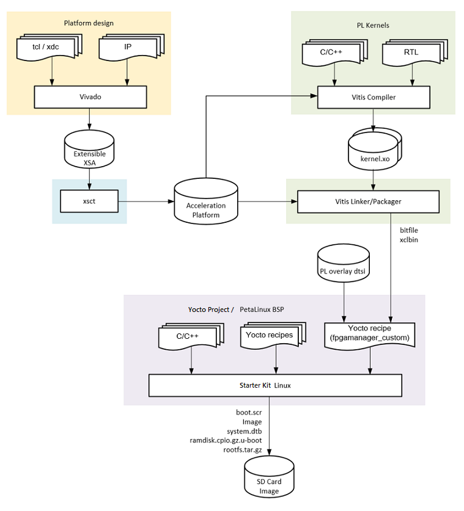
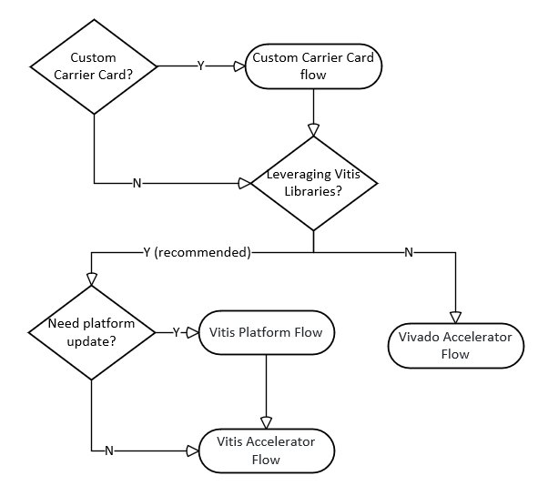
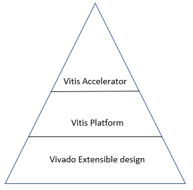
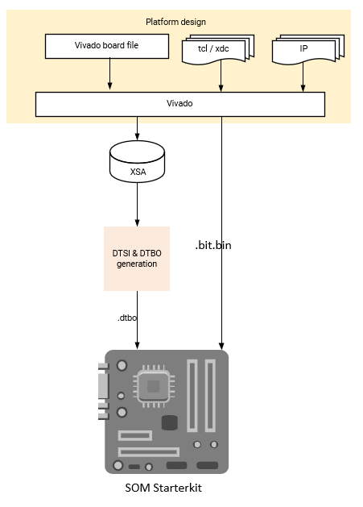
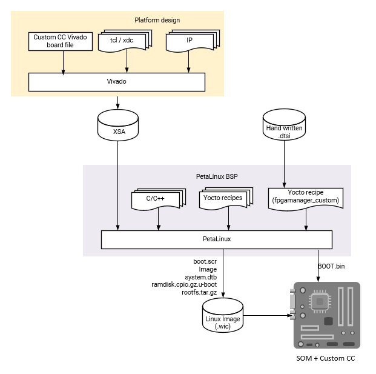

########################################################################################################################
Development Overview
########################################################################################################################

   Tool flow to generate reference designs for Kria SOM.

**********************
Introduction
**********************

In this document, four workflows are outlined: 

- :doc:`../docs/vitis_accel_flow`
- :doc:`../docs/vitis_platform_flow`
- :doc:`../docs/vivado_accel_flow`
- :doc:`../docs/custom_cc_flow`

:ref:`som-dev-flow` in the later part of the document gives an overview of how to choose the best flow for developers.

The following is an overview of generalized steps required to develop, build, and run applications on ground up SOM design. Starter Kits provide prebuilt, reusable content for the hardware configuration and device firmware steps, and prebuilt references designs the programmable logic (PL) hardware and application software steps.

Generate the Hardware Configuration
=====================================

The MPSoC device requires a boot-time hardware configuration for the processing system (PS). This is defined in Vivado, and if creating a custom CC, you must configure the MIO related I/O in this configuration step. This step is already completed if using an AMD provided Starter Kit BSP and/or the Vivado SOM board files which provide automation for configuring the MIO that are fixed by the SOM HW design.

Generate the Device Boot Firmware
============================================

The boot firmware is the software that runs to support the initialization of the MPSoC platform and is captured as a BOOT.BIN design artifact. If using an AMD Starter Kit, this step is already completed for developers. However, if developers want to create a custom boot firmware, an A/B user boot partition is provided for easier testing. Refer to the Firmware Update chapter of `UG1089 <https://www.xilinx.com/support/documentation/user_guides/som/1_0/ug1089-kv260-starter-kit.pdf>`_ or `wiki <https://xilinx-wiki.atlassian.net/wiki/spaces/A/pages/1641152513/Kria+K26+SOM#Boot-Firmware-Updates>`_. The SOM Starter Kit uses a primary/secondary boot device flow where the primary boot device contains the BOOT.BIN and the secondary device contains the OS components.

For Kria Starter Kits, the QSPI primary boot device (``BOOT.BIN``) contains:

- PMU firmware
- FSBL
- ATF
- U-Boot

For Kria Starter Kits, the SD card secondary device contains:

.. glossary::

    ``boot.src``
      Script read by U-boot

    ``Image``
      Linux Kernel binary

    ``ramdisk.cpio.gz.u-boot``
      Linux initramfs

    ``system.dtb``
      Linux device Tree

    ``rootfs.tar.gz``
      Root file system

- ``boot.src``: Script read by U-Boot
- ``Image``: Linux kernel binary
- ``ramdisk.cpio.gz.u-boot``: Linux initramfs
- ``system.dtb``: Linux device Tree
- ``rootfs.tar.gz``: Root file system

Build the Application PL Hardware Design
=============================================

The PL design defines the configuration of the PL domain of the MPSoC device on SOM, containing the PL accelerator(s). The PL configuration is defined by the user design and can be captured in Vivado or Vitis based workflows at different levels of abstraction. The design artifact captured from any of the workflows for designing a PL configuration is a bitstream (``.bit``, often required in ``.bit.bin`` form). This bitstream can be loaded at boot as part of the device boot firmware, or after the OS boot via a runtime library.

If using an AMD Kria Starter Kit reference application, the bitstream is provided prebuilt and always loaded after the Linux boot.

Build Application Software
=====================================

The application software refers to the software that runs on the APU and/or RPU PS targets. This software can be developed through Vitis, Yocto, PetaLinux, Ubuntu, or other open-source tools (such as Yocto). Excluding the custom Carrier Card Flow, when developing an application for SOM, you usually do not need to rebuild the entire OS. You only need to generate your application and move it onto the target file system to execute.

If using an AMD Kria Starter Kit reference designs, the applications are provided prebuilt. 

Deploy and Test On-Target
=====================================

Once applications and custom hardware designs are generated, you must move them to target.

If using the Kria Starter Kit with the Linux reference design, you can also use :doc:`on-target utilities <../docs/target>` to move your applications over and test. 

If using the Kria Starter Kit, you can use various boot modes to test the monolithic boot of the application software using :doc:`these TCL scripts <../docs/bootmodes>` to override the Starter Kit hardware defined QSPI32 boot mode.

****************************************************
Prerequisites and Assumptions
****************************************************

This document assumes you are using AMD tools 2022.1. Older tool versions with PetaLinux support are archived and can be accessed through links on the left side of the page.

Depending on the scope of customization, selected workflow, and OS choice, different tools are needed. Before determining which tools to install, refer to the various tool flow sections:

1. Vitis tools installation (this includes Vivado)
2. Vivado tools installation (if Vitis is not required and installed)
3. Device Tree Generator (DTG) and Device Tree Compiler (DTC) installation: Refer to `Build Device Tree Blob <https://xilinx-wiki.atlassian.net/wiki/spaces/A/pages/18842279/Build+Device+Tree+Blob>`_
4. `XSCT <https://www.xilinx.com/html_docs/xilinx2022_1/vitis_doc/XSCT.html>`_ (installed as part of Vivado or Vitis)
5. KV260-vitis `git repository <https://github.com/Xilinx/kria-vitis-platforms>`_, which contains KV260 and KR260 Vitis platforms, Vitis overlay projects, and their associated Makefiles.
6. `Yocto installation <https://xilinx.github.io/kria-apps-docs/yocto/build/html/docs/yocto_kria_support.html>`_
7. PetaLinux tools installation with its `minimum installation requirement <https://docs.xilinx.com/r/en-US/ug1144-petalinux-tools-reference-guide/Installation-Requirements>` and PetaLinux SOM Starter Kit BSP from `SOM Wiki <https://xilinx-wiki.atlassian.net/wiki/spaces/A/pages/1641152513/Kria+K26+SOM#PetaLinux-Board-Support-Packages>`_
8. Ubuntu image and development kits from `Ubuntu <https://ubuntu.com/download/amd-xilinx>`_

After you understand the following SOM developer flow, refer to the following table for tool requirements to generate the PL portion of your applications.

.. list-table:: Tool Requirements to Generate PL Portion of Application
   :widths: 22 18 18 18 24
   :header-rows: 1

   * - Flows
     - Vitis
     - Yocto or PetaLinux
     - Vivado
     - Tools for DTBO
   * - Vitis Accelerator Flow
     - Required
     - Optional
     - Required
     - Not Needed
   * - Vitis Platform Flow
     - Required
     - Optional
     - Required
     - (XSTC, DTG, DTC) or PetaLinux 
   * - Vivado Accelerator Flow
     - Not Needed
     - Optional
     - Required
     - (XSTC, DTG, DTC) or PetaLinux 
   * - Custom Carrier Card Flow
     - Not Needed
     - Optional
     - Required
     - Not Needed
   * - Baremetal Flow
     - Required
     - Not Needed
     - Required
     - Not Needed

.. note::
   Depending on your decisions, more than one flow can be involved. Refer to the following decision tree.

.. _som-dev-flow:

****************************************************
SOM Developer Flow
****************************************************

You might only need to touch parts of the flow to put your applications on SOM. Based on the scope of hardware and design change, there are four different flows to leverage when developing a custom application. The choice of flow depends on the hardware target definition, where the target design intersects with AMD's released reference designs, and tool preference. The following decision tree helps guide you through the appropriate workflows:

If you plan to create your own custom carrier card, you need to first go through the custom carrier card flow before generating your design through the Vitis or Vivado based tool flows.

If using an AMD carrier card or you finished developing the needed base Linux designs for your custom carrier card, you need to generate the application designs. The recommended tool for applications, such as vision and video application, is Vitis because Vitis supplies the Vitis_Accel_libraries and allows you to develop quickly. Alternatively, if those advantages are not needed or wanted, you can also use the Vivado Accelerator flow.

In the Vitis tool flow, you leverage the Vitis Platform in the example designs and jump directly into the Vitis Accelerator flow, or you might need to update your platform using the Vitis Platform flow before going into the Vitis Accelerator flow.

The preceding diagram shows the hierarchy between a Vivado Extensible design, Vitis Platform and Vitis Accelerators. A Vivado Extensible design is required first to in-take board information and create proper configurations. Then a Vitis Platform can be generated on top of the Vivado Extensible design. After that, Vitis Accelerators and applications can be created in the Vitis Platform. You can intersect in different layers dependent on where you design diverges from the AMD examples.

:doc:`Vitis Acceleration Flow <../docs/vitis_accel_flow>`
==========================================================================

This flow uses AMD provided SOM Starter Kit Vitis Platforms as a basis for generating your own PL accelerators. Use a Vivado Extensible Platform (``.xsa``) file provided by AMD and import it into a Vitis Platform project. Then, create your own overlay accelerator(s) within the bounds of the provided the Vitis platform and generate a new bitstream (``.bit`` file converted to ``.bit.bin``) and metadata container file (``.xclbin``). Use the existing device tree blob (``.dtb``) associated with the AMD provided Vitis platform. The resulting application accelerator files are then moved to the target SOM platform to be run.

- Constraints: Use the same carrier card and physical peripheral definition as AMD provided SOM Starter Kit Vitis Platforms
- Input: AMD provided Vitis Platform (``.xsa``), AMD provided Vitis platform device tree (``.dtbo``)
- Output: ``.bit.bin``, ``.xclbin``

.. image:: ../docs/media/tool_flow_vitis_accel.PNG
   :alt: Tool Flow

:doc:`Vitis Platform Flow <../docs/vitis_platform_flow>`
==========================================================================

You can create a custom Vitis platform if you require a distinct set of physical PL I/O peripherals than those provided in AMD generated platforms. Development starts with the Vivado tool to create an extensible hardware platform. In Vivado, the Kria SOM Starter Kit Vivado board file is provided. It automatically drives the PS subsystem Hardware configuration and provides predefined connectivity for commonly used PL IPs based on the selected carrier card (for example, MIPI interfaces on KV260 carrier card). Use Vivado to generate a custom ``.xsa`` file to be ported into Vitis as a platform project. Once the platform project is created, then a corresponding device tree overlay is generated. With the extensible ``.xsa`` and ``.dtbo``, you can now follow the same flow outlined in Vitis Accelerator flow. The resulting bitstream, ``.xclbin``, and ``.dtbo`` files are copied into the target.

- Assumption: AMD provided SOM carrier card with associated Vivado board file automation
- Input: Vivado SOM Starter Kit board file
- Output: ``.dtbo``, ``.bit.bin``, ``.xclbin``

.. image:: ../docs/media/tool_flow_vitis_platform.PNG
   :alt: Tool Flow

:doc:`Vivado Acceleration Flow <../docs/vivado_accel_flow>`
==========================================================================

If you prefer a traditional hardware design flow, you can generate your PL designs using Vivado. In this flow, you start from the Kria SOM starter kit board files in Vivado and implements your own PL design in Vivado to generate a ``.xsa`` file and bitstream. The resulting ``.xsa`` file is used to generate the device tree overlay. Once the PL design (``.bit.bin``) and hardware/software interface definition (``.dtbo``) files are created, they can be copied into the target and managed by dfx-mgr.

- Assumption: AMD built carrier cards with corresponding SOM Starter Kit board file
- Input: SOM Starter Kit board file (in Vivado) or Vivado project released with SOM BSP, your own accelerator designs in Vivado
- Output: ``.dtbo``, ``.bit``

:doc:`Custom Carrier Card Flow <../docs/custom_cc_flow>`
==========================================================================

When creating your own carrier card, you create a Vivado project using the AMD provided K26 production SOM Vivado board file as a starting point. The K26 board file contains the MIO configuration defined by the SOM hardware design, and provides a minimal hardware configuration to boot to Linux. The K26 board file does not contain any information specific to a carrier card. You then design in your specific custom MIO and PL based physical interfaces to create your own custom hardware configuration while following the *Kria SOM Carrier Card Design Guide* (`UG1091 <https://docs.amd.com/go/en-US/ug1091-carrier-card-design>`_). After creating the integrated SOM + CC configuration, a ``.xsa`` file is exported. If using Linux, then create a Yocto or Petalinux project to generate boot and OS images for booting Linux. You can then use the artifacts to create applications to run on top of the base Linux, using the previously discussed workflows: Vitis Accelerator Flow, Vitis Platform Flow, or Vivado Accelerator Flow.

- assumption: Using SOM K26 with developer defined carrier card
- input: Vivado K26 SOM board file, customer defined carrier card board configuration
- output: ``BOOT.bin``, ``.wic`` image containing ``boot.src``, Image, ``ramdisk.cpio.gz.u-boot``, ``system.dtb``, ``rootfs.tar.gz``

Baremetal and Non-Linux Application Workflow on SOM
==========================================================================

While the Kria Starter Kits examples are Linux centric, they can be used for baremetal applications by using user application hooks provided in the boot firmware architecture and corresponding XSDB debug hooks. The Kria Starter Kit prebuilt firmware includes two user partitions labeled "A" and "B". Only one is active at a time and is controlled by the Image Selector application at boot. YOu can load your baremetal based application `BOOT.BIN` to the partition to one of the user partitions and boot your custom application with QSPI32 boot mode. Alternatively, use the Xilinx System Debugger (XSDB) and JTAG to load and boot your application on the Starter Kit.

- To load custom `BOOT.BIN` to A/B partitions, use the Linux based xmutil image update utility or use the platform recovery tool. For details on loading a `BOOT.BIN` to the user A/B partitions, see the `Kria Wiki <https://xilinx-wiki.atlassian.net/wiki/spaces/A/pages/1641152513/Kria+K26+SOM#Boot-Firmware-Updates>`_ or `UG1089 <https://www.xilinx.com/support/documentation/user_guides/som/1_0/ug1089-kv260-starter-kit.pdf>`_.
- For setting JTAG boot via XSDB, see :doc:`../docs/bootmodes`.

.. note::
   For a detailed example of creating a simple baremetal application, see :doc:`../docs/baremetal`.

******************************************************************************
Kria SOM References
******************************************************************************

- Kria SOM `Wiki <https://xilinx-wiki.atlassian.net/wiki/spaces/A/pages/1641152513/Kria+K26+SOM>`_
- Kria SOM K26 Data Sheet `DS987 <https://docs.xilinx.com/r/en-US/ds987-k26-som>`_
- Kria SOM KV260 Data Sheet `DS986 <https://docs.xilinx.com/r/en-US/ds986-kv260-starter-kit>`_
- Kria SOM KR260 Data Sheet `DS988 <https://docs.xilinx.com/r/en-US/ds988-kr260-starter-kit>`_
- Kria SOM KV260 User Guide `UG1089 <https://docs.xilinx.com/r/en-US/ug1089-kv260-starter-kit>`_
- Kria SOM KR260 User Guide `UG1092 <https://docs.xilinx.com/r/en-US/ug1092-kr260-starter-kit>`_
- Kria SOM Carrier Card Design Guide `UG1091 <https://docs.xilinx.com/r/en-US/ug1091-carrier-card-design>`_
- Zynq MPSoC TRM `UG1085 <https://docs.xilinx.com/r/en-US/ug1085-zynq-ultrascale-trm/Zynq-UltraScale-Device-Technical-Reference-Manual>`_

Tool Documentation
=====================================

Vitis Documentation
---------------------------------

- Vitis Unified Software Development Platform `<https://docs.amd.com/go/en-US/ug1416-vitis-documentation>`_

Vivado Documentation
---------------------------------

- Vivado Design Suite Tutorial `UG940 <	https://docs.amd.com/go/en-US/ug940-vivado-tutorial-embedded-design>`_
- Vivado Design Flow Overview `UG892 <https://docs.amd.com/go/en-US/ug892-vivado-design-flows-overview>`_
- Vivado System Level Design Entry `UG895 <https://docs.amd.com/go/en-US/ug895-vivado-system-level-design-entry>`_
- Vivado Design Suite User Guide `UG896 <https://docs.amd.com/go/en-US/ug896-vivado-ip>`_
- Vivado Design Suite Using Constraints `UG903 <https://docs.amd.com/go/en-US/ug903-vivado-using-constraints>`_ 

PetaLinux Documentation
---------------------------------

-  `Yocto Project Documentation <https://docs.yoctoproject.org/>`_
- PetaLinux User Guide `UG1144 <https://docs.amd.com/go/en-US/ug903-vivado-using-constraints>`_

Device Tree Generator Documentation
------------------------------------------------------------------

- `Build Device Tree Blob <https://xilinx-wiki.atlassian.net/wiki/spaces/A/pages/18842279/Build+Device+Tree+Blob>`_

******************************************************************************
File extension appendix:
******************************************************************************

- ``.bit.bin``: Binary file for bitstream. This is the .bin file that can be generated from Vivado/Vitis instead of ``.bit`` file.
- ``.bsp``: Board support package
- ``.dtb``: Device Tree Blob. A binary file containing binary data that describes hardware, compiled from .dtb and .dtbi files.
- ``.dtbo``: Device Tree Blob Overlay. A binary file containing hardware that can be overlayed on top of the existing .dtb file.
- ``.dts``: Device Tree Source. This is typically the top level (board level) device tree description.
- ``.dtsi``: Device Tree Source Include. These files are typically used to describe hardware on a SoC and in this case, the PL designs as well.
- ``.elf``: Executable and Linkable Format. Contains compiled software.
- ``.wic``: The .wic image helps simplify the process of deploying a platform project image to test by including the required boot, rootfs, and related partitions in the image. As a result, all you need to do is copy the image to a storage device and use it to boot the hardware target device.
- ``.xdc``: Xilinx Design Constraint file. Indicate pin mapping, and pin constraints in Vivado.
- ``.xml``: The XML board file is a configuration file used by Vivado to create board related configuration.
- ``.xclbin``: Device binary file, also known as an AXLF file. It is an extensible, future-proof container of (bitstream/platform) hardware as well as software (MPSoC/MicroBlaze ELF files) design data. In the flows above, the ``.xclbin`` file has information about the address space of the PL design.
- ``.xsa``: Xilinx Shell Archive. These files are generated by Vivado to contain the required hardware information to develop embedded software with Vitis and an only be opened with AMD tools.

.. Copyright © 2023–2025 Advanced Micro Devices, Inc

.. `Terms and Conditions <https://www.amd.com/en/corporate/copyright>`_.