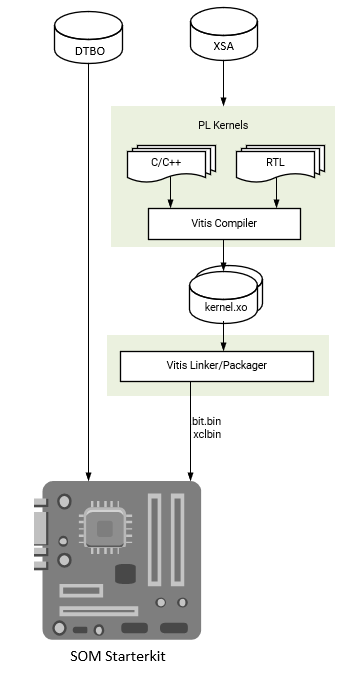

# Vitis Accelerator Flow

This flow is for using the AMD provided SOM Starter Kit Vitis Platforms as a basis for generating your own PL accelerators. Use a Vivado Extensible Platform (.xsa) file provided by AMD and import it into a Vitis Platform project. You then create your own overlay accelerator(s) within the bounds of the provided Vitis Platform and generate a new bitstream (.bit file converted to .bit.bin) and metadata container file (.xclbin). Use the existing device tree blob (.dtb) associated with the AMD provided Vitis platform. The resulting application accelerator files are then moved to the target SOM platform to be run.

To access the .xsa files for different platforms released from AMD, refer to the [KV260 Creating a Vitis Platform](https://xilinx.github.io/kria-apps-docs/kv260/2022.1/build/html/docs/build_vitis_platform.html) tutorial to generate the .xsa files from the released reference design.

* Constraints: You must use the same carrier card and physical interface definition as AMD provided SOM starter kits and associated Vitis platforms.
* Input: AMD provided Vitis platform (.xsa), AMD provided Vitis platform device tree (.dtbo)
* Output: .bit.bin, .xclbin


## Prerequisites and Assumptions

This document assumes that you use 2021.1 or later tools and SOM content releases. The tool versions should match. For example, use the same tool versions for the released BSP, Vivado, as well as PetaLinux and/or Ubuntu. For the Ubuntu version, refer to table in the [Wiki](https://xilinx-wiki.atlassian.net/wiki/spaces/A/pages/1641152513/Kria+K26+SOM#Ubuntu-LTS).

1. Vitis tools installation
2. PetaLinux tool (optional) [installation](https://www.xilinx.com/support/download/index.html/content/xilinx/en/downloadNav/embedded-design-tools.html)
3. PetaLinux [SOM Starter Kit BSP download](https://xilinx-wiki.atlassian.net/wiki/spaces/A/pages/1641152513/Kria+K26+SOM#PetaLinux-Board-Support-Packages) (optional)

## Step 1: Aligning the Kria SOM Boot and SOM Starter Linux Infrastructure

AMD built Kria SOM Starter Kit applications on a shared, application-agnostic infrastructure in the SOM Starter Linux including kernel version, Yocto project dependent libraries, and baseline BSP. When using this tutorial, make sure to align tools, git repositories, and BSP released versions.

### PetaLinux BSP Alignment

The SOM Starter Linux image is generated using the corresponding SOM variant multi-carrier card PetaLinux board support package (BSP). If creating applications on the Starter Kit, it is recommended that you use this BSP as a baseline for your application development as it ensures kernel, Yocto project libraries, and baseline configuration alignment. The multi-carrier card BSP defines a minimalistic BSP that has the primary function of providing an application-agnostic operating system, and can be updated and configured dynamically at runtime.

## Step 2: Obtain the Platform Files and .dtbo Files

First, decide which Kria Starter Kit Vitis platform to develop on. The list of platforms can be found in [KV260 Creating a Vitis Platform](https://xilinx.github.io/kria-apps-docs/kv260/2022.1/build/html/docs/build_vitis_platform.html), which also contains a tutorial to generate the platform files (including .xpfm, .xsa files) from the released reference designs.

>**NOTE:** While the KR260 and KD240 example project has Vivado projects in the [Kria Vitis Platform repository](https://github.com/Xilinx/kria-vitis-platforms) that have Vitis platform hooks, they have not been validated to be used as Vitis platforms.

   Applications and their corresponding platforms are listed in the following table:

   |Application |Platform|
   |----|----|
   |smartcam |kv260_ispMipiRx_vcu_DP|
   |aibox-reid |kv260_vcuDecode_vmixDP|
   |defect-detect |kv260_ispMipiRx_vmixDP|
   |nlp-smartvision |kv260_ispMipiRx_rpiMipiRx_DP|

Alternatively, you can generate your own platform through the [Vitis Platform flow](./vitis_platform_flow.md).

The Vitis Platform repository has the device tree (DT) source associated with the platform captured as a .dtsi file, which is compiled into a .dtbo file to use on target. While each application firmware folders on target has an associated .dtsi/.dtbo file and PetaLinux uses application name to generate its .dtbo file, each .dtsi/.dtbo file is actually unique to the platform on which the application is based on. The .dtsi files associated with each application can be found in [Kria apps firmware](https://github.com/Xilinx/kria-apps-firmware). There are three ways to get the .dtbo file shown as follows.

### 1. Compile from .dtsi

Download the .dtsi file from the [Kria apps firmware](https://github.com/Xilinx/kria-apps-firmware) and compile them using the following command. For more information on dtc,  refer to [dtsi_dtbo_generation](./dtsi_dtbo_generation.md):

```bash
dtb -o pl.dtbo pl.dtsi
```

### 2. Obtain from Target

Copy the .dtbo files from target from applications sharing the same platform. They can be located on target, post dnf install in ```/lib/firmware/xilinx/<application name>/<application name>.dtbo```.

An example ```<application name>``` is kv260-smartcam.

### 3. Generate from PetaLinux

Alternatively, generate from PetaLinux.

```bash
petalinux-create -t project -s xilinx-<board>-<version>.bsp
cd xilinx-<board>-<version>
petalinux-build -c <application name>
```

The .dtbo file is found in:

```bash
$temp_folder/sysroots-components/k26/<application name>/lib/firmware/xilinx/<application name>/<application name>.dtbo
```

The location of `$temp_folder` can be found in ```xilinx-<board>-<version>/project-spec/configs/config```.

```CONFIG_TMP_DIR_LOCATION="$tmp_folder"```

## Step 3 - Create .xclbin and .bit.bin file from Vitis

Typically in this work flow, developers will use Makefiles to generate their design. Example Makefiles can be found [here in kv260-vitis repo](https://github.com/Xilinx/kria-vitis-platforms/tree/xlnx_rel_v2022.1/kv260/overlays/examples) and [here in Vitis Library repo](https://github.com/Xilinx/Vitis_Libraries/tree/master/vision/L1/examples).

In the Makefile, uSse ```PLATFORM``` to associate the application with the Vitis Platform.

```bash
PLATFORM = <path to Vitis Platform project>.xpfm
```

After a successful make, a .xclbin and .bit file is generated.

To generate a `.bit.bin file`, create a ```<accelerator>.bif``` file with the following content:

```text
all:
{
    <accelerator>.bit
}
```

Then, run bitgen to create a binary bitstream ```<accelerator>.bit.bin``` file:

```bash
bootgen -arch zynqmp -process_bitstream bin -image <accelerator>.bif 

```

## Step 4: Move the User Application to the Target Platform

After generating the PL design, move the required files (`.bit.bin`, .dtbo, `shell.json`, and .xclbin for Vitis flow) to the target platform using standard tools (for example, SCP, FTP). For information on where to place the application firmware files, see [On-target Utilities and Firmware](./target.md).

## Step 5: Run the User application

Once the required files are in place, run your applications using the following steps:

* Use xmutil or dfx-mgr to load the application bitstream
* Start your application software

## Examples

* A step by step Vitis Accelerator Flow example using Makefiles from released [kv260_vitis](https://github.com/Xilinx/kv260-vitis) projects can be found [here](./vitis_accel_flow_smartcam_filter2d_example.md)
* A step by step example to recreate the SmartCam application on existing platform, including software development, can be found [here](./kria_vitis_acceleration_flow/kria-vitis-acceleration)
* A step by step example to create a KV260 model zoo application based on released platform can be found [here](https://community.element14.com/technologies/fpga-group/b/blog/posts/kv260-vvas-sms-2021-1-blog)
* Vitis hardware acceleration tutorials can be found [here](https://github.com/Xilinx/Vitis-Tutorials/tree/2022.1/Hardware_Acceleration). They are not specific to SOM.

<!---
 removing until sysroot solution is better * A step by step Vitis Accelerator Flow example using GUI from released [kv260_vitis](https://github.com/Xilinx/kv260-vitis) projects can be found [here](./vitis_accel_vadd_example.md)
-->
<hr class="sphinxhide"></hr>

<p class="sphinxhide" align="center"><sub>Copyright © 2023–2025 Advanced Micro Devices, Inc</sub></p>

<p class="sphinxhide" align="center"><sup><a href="https://www.amd.com/en/corporate/copyright">Terms and Conditions</a></sup></p>
