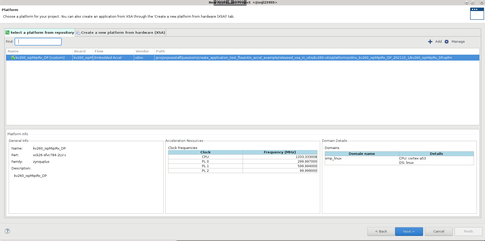
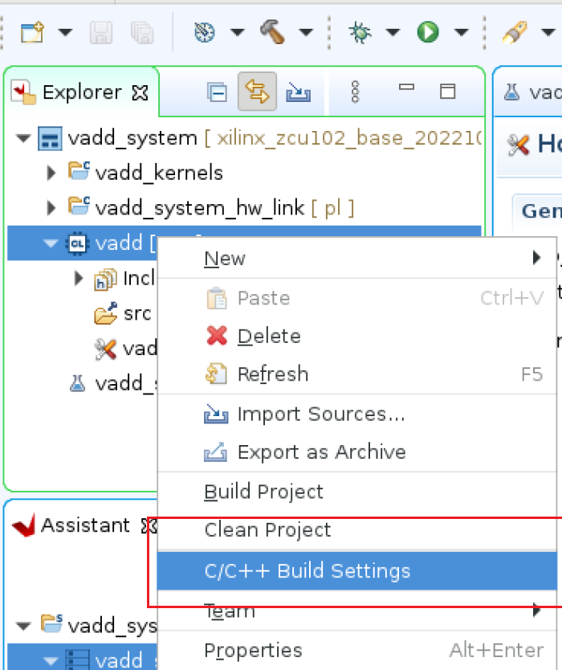
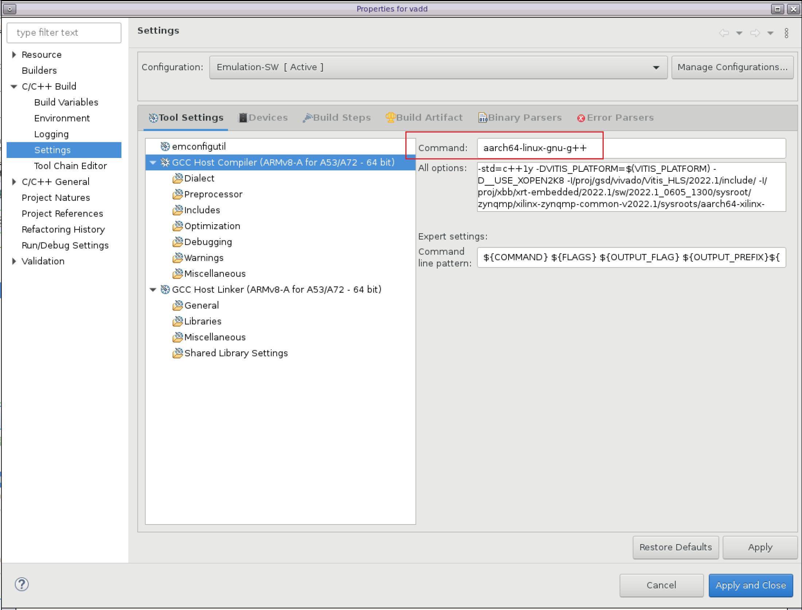
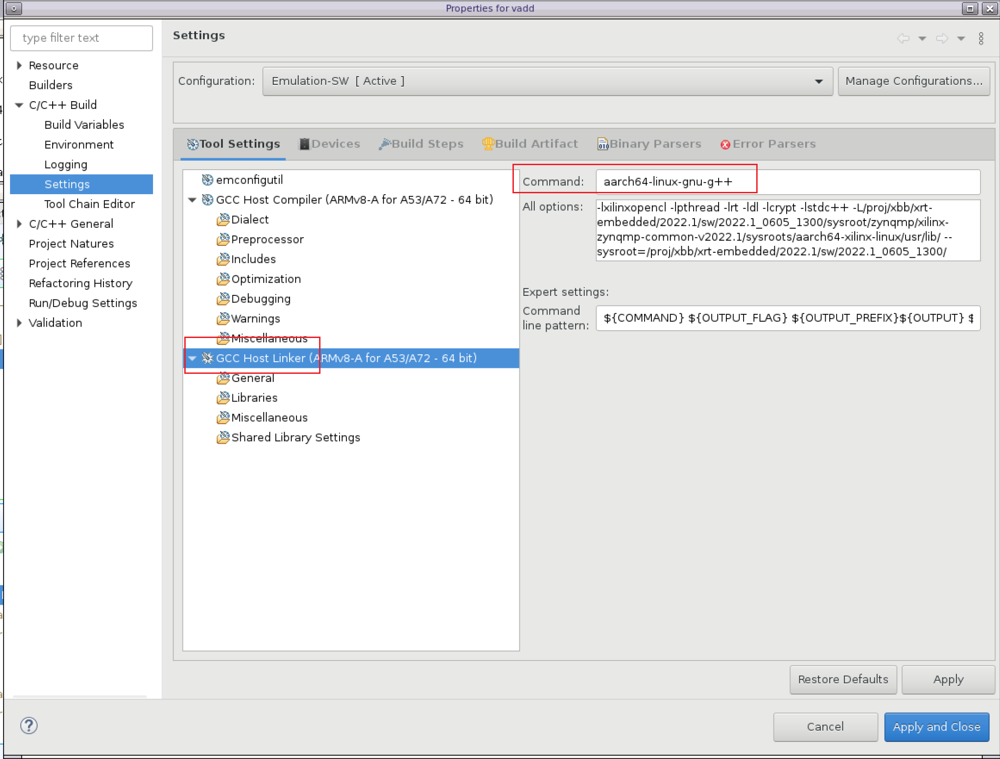

# Vitis Accelerator Flow Example - Adding the VADD Accelerator Using the Vitis GUI

This example provide an example to add an acceleration application into an existing released SOM platforms using Vitis GUI. By default, the released platforms and applications uses a Makefile flow (example [here](./vitis_accel_flow_smartcam_filter2d_example.md)). However, this example shows an alternative way to add accelerator applications using the Vitis IDE. You import a Vitis Platform into Vitis and insert an acceleration application there. AMD prebuilt KV260 platform examples and their associated applications are:

   |Application |Platform|
   |----|----|
   |smartcam |kv260_ispMipiRx_vcu_DP|
   |aibox-reid |kv260_vcuDecode_vmixDP|
   |defect-detect |kv260_ispMipiRx_vmixDP|
   |nlp-smartvision |kv260_ispMipiRx_rpiMipiRx_DP|

This example adds a VADD acceleration application into kv260_ispMipiRx_DP used by nlp-smartvision and uses 2022.1 tools. You can use any of the released platforms to try out the example. Note an overlay and its application needs to be both present for an acceleration application to execute. Because you are inserting the VADD accelerator without the original NLP-smartvision overlay, the original smartvision applications do not work on this newly generated overlay.

## Obtain the Platform

Because you are altering an existing platform, first get the platform, kv260_ispMipiRx_DP. A detailed tutorial is provided in [Creating Vitis Platform](https://xilinx.github.io/kria-apps-docs/kv260/2022.1/build/html/docs/build_vitis_platform.html). Here are the specific commands to generate the platform:

```shell
git clone --branch xlnx_rel_v2022.1 --recursive https://github.com/Xilinx/kria-vitis-platforms.git
cd $workdir/kria-vitis-platforms/kv260/platforms
source <vitis path>/settings64.sh
make platform PFM=kv260_ispMipiRx_rpiMipiRx_DP 
```

The platform required in later steps is now available in ```$workdir/kria-vitis-platforms/kv260/platforms/xilinx_kv260_ispMipiRx_rpiMipiRx_DP_202210_1```.

### Optional Step

   Up to 2022.1 (this will be fixed in 2022.2.), Vitis still tries to generate `sd_card.img` even if the .bif file is empty, resulting in an error, ```ERROR:BootGen - syntax error```, when completing step 7 of "Generating overlay in Vitis". This error is harmless. All the required files are still generated. However, to avoid the error, you can populate ```$workdir/kria-vitis-platforms/kv260/platforms/xilinx_kv260_ispMipiRx_rpiMipiRx_DP_202210_1/sw/kv260_ispMipiRx_rpiMipiRx_DP/boot/linux.bif``` with the following content, assuming that your `kv260-vitis/` and `xilinx-k26-starterkit-v2022.1/` are both top level in `$workdir`:

   ```text
   the_ROM_image:
   {
    [fsbl_config] a53_x64
    [bootloader] <../../../../xilinx-k26-starterkit-2022.1/images/linux/zynqmp_fsbl.elf>
    [pmufw_image] <../../../../xilinx-k26-starterkit-2022.1/images/linux/pmufw.elf>
    [destination_cpu=a53-0, exception_level=el-3, trustzone] <../../../../xilinx-k26-starterkit-2022.1/images/linux/bl31.elf>
    [load=0x00100000] <../../../../xilinx-k26-starterkit-2022.1/images/linux/system.dtb>
    [destination_cpu=a53-0, exception_level=el-2] <../../../../xilinx-k26-starterkit-2022.1/images/linux/u-boot.elf>
   }
   ```

## Download Sysroot for Ubuntu OS

If you are using Ubuntu, you can download the sysroot for the corresponding version being used [here](https://ubuntu.com/download/amd-xilinx). Make sure to download the 22.04 sysroot for this example because your target is running Ubuntu 22.04.

Unlike PetaLinux 2021.1, Ubuntu sysroot already has XRT installed so you do not need to regenerate, but the `README.md` file has information on regenerating sysroot in case other libraries are needed.

Unzip the sysroot file:

```shell
cd $ubuntu
tar -xf iot-limerick-kria-classic-desktop-2204-x06-20220614-78-sysroot.tar.xz
```

The ```<target sysroot>``` is ```$ubuntu/sysroots/aarch64-xilinx-linux```.

## Generate the Overlay in Vitis - Hardware

1. Start Vitis, select **Create Application Projects**, and skip the welcome page.
2. In **Select a platform from repository**, click **+**, navigate to the folder containing ```.xpfm``` file in  ```$workdir/kv260-vitis/platforms/xilinx_kv260_ispMipiRx_DP_202110_1```, and click **Open**. This opens the .xpfm file and its associated platform. Click  **Next**.
   

3. Name the project ```vadd```, and click **Next**.
4. In Domain page:
   - Set Domain to ```smp_linux```
   - Set ```Sys_root path``` to ```<target sysroot>```.
   - Leave ```Root FS``` empty
   - Leave ```Kernel Image```  empty
   - Click **Next**.

5. Select **Acceleration templates with PL and AIE accelerators** -> **Simple Vector Addition**, and click **Finish** to generate the application.
6. In the Explorer window, double-click the **vadd_system->vadd->vadd.prj** file to open it, change the **Active Build configuration** from **Emulation-SW** to **Hardware**.
7. Select ```vadd_system``` in the Explorer window, and click the **Build** icon in the toolbar. The build task takes 10-30 minutes. When the build completes, the build result is located in `vadd_system/Hardware/` directory.
   >**NOTE:** IFf step 8 in section "Create Sysroot" was not performed, there is an error, and it can be ignored.

    - `vadd_system_hw_link/Hardware/binary_container_1.build/link/int/system.bit`: PL bitstream including vadd kernel and platform components.
    - `vadd_system_hw_link/Hardware/binary_container_1.xclbin`: Acceleration binary container for XRT configuration. It includes metadata that describes the kernels.

    Usually, vadd/Hardware/vadd contains the compiled application, but in this case, the software generation portion has an error:

    ```text
    fatal error: bits/libc-header-start.h no such file
    ```

    Ignore this for now; it is addressed in the "Compiling the Application - Software" section.

8. The bitstream needs to be in .bin format so that fpgamanager can load it. Convert the `.bit` file to a `.bit.bin` file with the following commands.

   ```bash
   cd vadd_system_hw_link/Hardware/binary_container_1.build/link/int/
   echo 'all:{system.bit}'>bootgen.bif
   bootgen -w -arch zynqmp -process_bitstream bin -image bootgen.bif
   mv system.bit.bin vadd.bit.bin    
   ```

## Compile the Application - Software

The native g++ compiler used by Vitis is not compatible with the Ubuntu 22.04 sysroot. To compile the software, use the Ubuntu 22.04 tool chain (aarch64-linux-gnu-g++) instead of the Vitis tool chain.

### 22.04 Ubuntu Host

If you happen to be running Vitis on Ubuntu 22.04 (this is not officially supported), first run these commands to install the tools:

```bash
sudo apt update
sudo apt install crossbuild-essential-arm64
```

This installs the tool chain, and you see files including ```/usr/bin/aarch64-linux-gnu-g++```, added the installed folder to your `$PATH`.

In Vitis, open the project with vadd again. Rightclick **vadd** -> **C/C++ Build Settings**:



Give the path of `/usr/bin/aarch64-linux-gnu-g++` for both the compiler and linker before rebuilding the software by right-clicking **vadd** -> **build project**.



### 20.04 Ubuntu Host

If you are using a 20.04 Ubuntu Host, there is a CHROOT workaround to compile with a Ubuntu 22.04 tool chain. Refer to the [Wiki](need to getlink for this!!!!!!!!!)

## Obtaining the .dtbo File

Download the corresponding .dtsi file (in this case, nlp-smartvision from [kv260_firmware 2022.1 release](https://github.com/Xilinx/kria-apps-firmware/tree/xlnx_rel_v2022.1) and compile them using the following command. For more information on dtc, refer to [dtsi_dtbo_generation](./dtsi_dtbo_generation.md):

```shell
dtc -@ -O dtb -o vadd.dtbo kv260-nlp-smartvision.dtsi
```

The output is `vadd.dtbo`.

## Create `shell.json`

   Prepare `shell.json`. Copy it from other applications or create one with the following contents:

```json
{
  "shell_type" : "XRT_FLAT",
  "num_slots": "1"
}
```

## Test Application

1. Transferring the files to the board.

    Make sure the Ethernet cable of SOM Starter Kit is connected. Use SCP or SFTP to upload the files from the host to the target board.

    ```shell
    # Running on host machine
    scp vadd.dtbo vadd.bit.bin shell.json vadd binary_container_1.xclbin ubuntu@<SOM Starter Kit IP>:/home/ubuntu/
    ```

    >**NOTE:** Thee vadd file above is a file generated in the "Compiling the Application - Software" section.

2. Load the hardware on target.

    ```shell
    # Running on target board
    sudo mkdir /lib/firmware/xilinx/vadd
    cd /home/ubuntu
    sudo mv vadd.dtbo vadd.bit.bin shell.json /lib/firmware/xilinx/vadd/
    sudo xmutil listapps
    sudo xmutil unloadapp
    sudo xmutil loadapp vadd
    ```

3. Run Vector Addition Application on the board.

   - Run the vadd application

   ```shell
   chmod +x ./vadd
   ./vadd binary_container_1.xclbin
   ```

   - It shows the following program prints.

   ```shell
    xilinx-k26-starterkit-2021_1:~$ ./vadd binary_container_1.xclbin
    INFO: Reading binary_container_1.xclbin
    Loading: 'binary_container_1.xclbin'
    TEST PASSED
   ```
  
Congratulations, you have added an accelerator to an existing Platform!

This tutorial is based on Vitis GUI based [Vitis Platform flow example](https://github.com/Xilinx/Vitis-Tutorials/blob/2021.1/Vitis_Platform_Creation/Design_Tutorials/01-Edge-KV260/), but many of the steps that create and set up the platform in Vivado are not followed prebuilt platform was used.

<hr class="sphinxhide"></hr>

<p class="sphinxhide" align="center"><sub>Copyright © 2023-2025 Advanced Micro Devices, Inc.</sub></p>

<p class="sphinxhide" align="center"><sup><a href="https://www.amd.com/en/corporate/copyright">Terms and Conditions</a></sup></p>