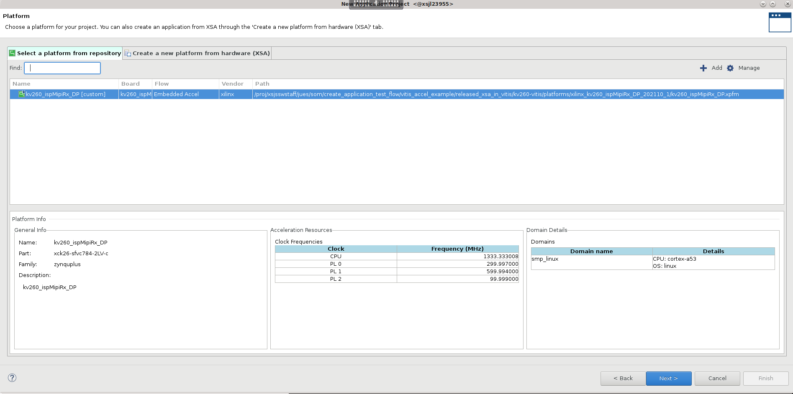

# Vitis Accelerator Flow Example - Adding VADD Accelerator using Vitis GUI

This example provide an example for developers who want to add an acceleration application into existing released SOM platforms using Vitis GUI. By default, the released platforms and applications uses a Makefile flow (example [here](./vitis_accel_flow_smartcam_filter2d_example.md)). However, this example shows an alternative way to add accelerator applications using Vitis IDE. We will import a Vitis Platform into Vitis and insert an acceleration application there. AMD prebuilt KV260 platform examples and their associated applications are:

   |Application |Platform|
   |----|----|
   |smartcam |kv260_ispMipiRx_vcu_DP|
   |aibox-reid |kv260_vcuDecode_vmixDP|
   |defect-detect |kv260_ispMipiRx_vmixDP|
   |nlp-smartvision |kv260_ispMipiRx_rpiMipiRx_DP|

This example adds a VADD acceleration application into kv260_ispMipiRx_DP used by nlp-smartvision and uses 2022.1 tools. You can use any of the released platforms to try out the example. Note an overlay and its application needs to be both present for an acceleration application to execute. Since we are inserting the VADD accelerator without the original NLP-smartvision overlay,  the original smartvision applications will not work on this newly generated overlay.

## Obtaining Platform

Since we are altering an existing platform, we will first  get the platform - kv260_ispMipiRx_DP. Detailed tutorial is at [Creating Vitis Platform](https://xilinx.github.io/kria-apps-docs/kv260/2022.1/build/html/docs/build_vitis_platform.html). Here are the specific commands to generate the platform:

```shell
git clone --branch xlnx_rel_v2022.1 --recursive https://github.com/Xilinx/kria-vitis-platforms.git
cd $workdir/kria-vitis-platforms/kv260/platforms
source <vitis path>/settings64.sh
make platform PFM=kv260_ispMipiRx_rpiMipiRx_DP 
```

The platform we will need in later steps will be available now in ```$workdir/kria-vitis-platforms/kv260/platforms/xilinx_kv260_ispMipiRx_rpiMipiRx_DP_202210_1```.

### Optional step

   Up to 2022.1(this will be fixed in 2022.2.), Vitis still tries to generate sd_card.img even if .bif file is empty - resulting in an error ```ERROR:BootGen - syntax error``` when doing step 7 of "Generating overlay in Vitis". This error is harmless - all the needed files are still generated. However, to avoid the error, you can populate ```$workdir/kria-vitis-platforms/kv260/platforms/xilinx_kv260_ispMipiRx_rpiMipiRx_DP_202210_1/sw/kv260_ispMipiRx_rpiMipiRx_DP/boot/linux.bif``` with below content, assuming that your kv260-vitis/ and xilinx-k26-starterkit-v2022.1/ are both top level in $workdir:

   ```text
   the_ROM_image:
   {
    [fsbl_config] a53_x64
    [bootloader] <../../../../xilinx-k26-starterkit-2022.1/images/linux/zynqmp_fsbl.elf>
    [pmufw_image] <../../../../xilinx-k26-starterkit-2022.1/images/linux/pmufw.elf>
    [destination_cpu=a53-0, exception_level=el-3, trustzone] <../../../../xilinx-k26-starterkit-2022.1/images/linux/bl31.elf>
    [load=0x00100000] <../../../../xilinx-k26-starterkit-2022.1/images/linux/system.dtb>
    [destination_cpu=a53-0, exception_level=el-2] <../../../../xilinx-k26-starterkit-2022.1/images/linux/u-boot.elf>
   }
   ```

## Downloading Sysroot for Ubuntu OS

Ubuntu users can download the sysroot for the corresponding version they are using [here](https://ubuntu.com/download/amd-xilinx), make sure to download the 22.04 sysroot for this example since our target will be running Ubuntu 22.04.

Unlike PetaLinux 2021.1, Ubuntu sysroot already have xrt installed so you dont need to regenerate. But the README.md file has information on re-generating sysroot in case other libraries are needed.

Unzip the sysroot file:

```shell
cd $ubuntu
tar -xf iot-limerick-kria-classic-desktop-2204-x06-20220614-78-sysroot.tar.xz
```

The ```<target sysroot>``` is ```$ubuntu/sysroots/aarch64-xilinx-linux```

## Generating Overlay in Vitis - Hardware

1. Start Vitis, and select ```Create Application Projects```, skip the welcome page
2. In ```Select a platform from repository```, click ```+ Add``` and navigate to the folder containing ```.xpfm``` file in  ```$workdir/kv260-vitis/platforms/xilinx_kv260_ispMipiRx_DP_202110_1``` and click ```Open```. this will open the .xpfm file and its associated platform. click  ```Next```

   

3. Name the project ```vadd```, click ```Next```.
4. In Domain page:
   - Set Domain to ```smp_linux```
   - Set ```Sys_root path``` to ```<target sysroot>```.
   - Leave ```Root FS``` empty
   - Leave ```Kernel Image```  empty
   - click Next

5. Select ```Acceleration templates with PL and AIE accelerators -> Simple Vector Addition``` and click ```Finish``` to generate the application.
6. In the Explorer window double click the **vadd_system->vadd->vadd.prj** file to open it, change the **Active Build configuration** from **Emulation-SW** to **Hardware**.
7. Select ```vadd_system``` in Explorer window and Click **Build** icon in toolbar. The build task would take 10-30 minutes. When build completes, the build result is located in `vadd_system/Hardware/` directory. Note that if step 8 in section "Create Sysroot" was not performed, there will be an error and it can be ignored.

    - vadd_system_hw_link/Hardware/binary_container_1.build/link/int/system.bit: PL bitstream including vadd kernel and platform components.
    - vadd_system_hw_link/Hardware/binary_container_1.xclbin: Acceleration binary container for XRT configuration. It includes metadata that describes the kernels.

    Usually, vadd/Hardware/vadd will contain the compiled application, but in this case the software generation portion will have an error:

    ```text
    fatal error: bits/libc-header-start.h no such file
    ```

    Please ignore this for now, we will address this in "Compiling application - software" section.

8. The bitstream needs to be in bin format so that fpgamanager can load it. Convert `.bit` file to `.bit.bin` file with the following commands.

   ```bash
   cd vadd_system_hw_link/Hardware/binary_container_1.build/link/int/
   echo 'all:{system.bit}'>bootgen.bif
   bootgen -w -arch zynqmp -process_bitstream bin -image bootgen.bif
   mv system.bit.bin vadd.bit.bin    
   ```

## Compiling application - software

The native g++ compiler used by Vitis is not compatible with the Ubuntu 22.04 sysroot. In order to compile the software, we need to use Ubuntu 22.04 tool chain (aarch64-linux-gnu-g++) instead of Vitis tool chain.

### 22.04 Ubuntu Host

If you happen to be running Vitis on Ubuntu 22.04 (note that this is not officially supported), you can first run these commands to install the tools:

```bash
sudo apt update
sudo apt install crossbuild-essential-arm64
```

This should install tool chain and you will see files including ```/usr/bin/aarch64-linux-gnu-g++```, add the installed folder to your $PATH.

In Vitis, open the project with vadd again. Right click vadd -> C/C++ Build Settings:


And give the path of /usr/bin/aarch64-linux-gnu-g++ for both compiler and linker before rebuilding the software by right clicking on vadd -> build project. 


### 20.04 Ubuntu Host

If you are using a 20.04 Ubuntu Host, there's a CHROOT workaround to compile with a Ubuntu 22.04 tool chain. Please refer to [Wiki](need to getlink for this!!!!!!!!!)

## Obtaining .dtbo File

You can download the corresponding .dtsi file (in this case, nlp-smartvision from [kv260_firmware 2022.1 release](https://github.com/Xilinx/kria-apps-firmware/tree/xlnx_rel_v2022.1) and compile them using command below. For more information on dtc please refer to [dtsi_dtbo_generation](./dtsi_dtbo_generation.md):

```shell
dtc -@ -O dtb -o vadd.dtbo kv260-nlp-smartvision.dtsi
```

Output is vadd.dtbo.

## Create shell.json

   Prepare shell.json. You can copy it from other applications or create one with the following contents.

```json
{
  "shell_type" : "XRT_FLAT",
  "num_slots": "1"
}
```

## Test Application

1. Transferring the files to the board

    Make sure the Ethernet cable of SOM Starter Kit is connected. Use SCP or SFTP to upload the files from host to target board.

    ```shell
    # Running on host machine
    scp vadd.dtbo vadd.bit.bin shell.json vadd binary_container_1.xclbin ubuntu@<SOM Starter Kit IP>:/home/ubuntu/
    ```

    note that the vadd file above is a file generated in section "Compiling application - software".

2. Load the hardware on target

    ```shell
    # Running on target board
    sudo mkdir /lib/firmware/xilinx/vadd
    cd /home/ubuntu
    sudo mv vadd.dtbo vadd.bit.bin shell.json /lib/firmware/xilinx/vadd/
    sudo xmutil listapps
    sudo xmutil unloadapp
    sudo xmutil loadapp vadd
    ```

3. Run Vector Addition Application on the Board

   - Run vadd application

   ```shell
   chmod +x ./vadd
   ./vadd binary_container_1.xclbin
   ```

   - It should show program prints.

   ```shell
    xilinx-k26-starterkit-2021_1:~$ ./vadd binary_container_1.xclbin
    INFO: Reading binary_container_1.xclbin
    Loading: 'binary_container_1.xclbin'
    TEST PASSED
   ```
  
Congratulations, you have added an accelerator to an existing Platform!

This tutorial is based on Vitis GUI based [Vitis Platform flow example](https://github.com/Xilinx/Vitis-Tutorials/blob/2021.1/Vitis_Platform_Creation/Design_Tutorials/01-Edge-KV260/), but we do not follow many of the steps that create and set-up the platform in Vivado since we use prebuilt platform.

## License

Licensed under the Apache License, Version 2.0 (the "License"); you may not use this file except in compliance with the License.

You may obtain a copy of the License at
[http://www.apache.org/licenses/LICENSE-2.0](http://www.apache.org/licenses/LICENSE-2.0)

Unless required by applicable law or agreed to in writing, software distributed under the License is distributed on an "AS IS" BASIS, WITHOUT WARRANTIES OR CONDITIONS OF ANY KIND, either express or implied. See the License for the specific language governing permissions and limitations under the License.

<p class="sphinxhide" align="center">Copyright&copy; 2023 Advanced Micro Devices, Inc</p>