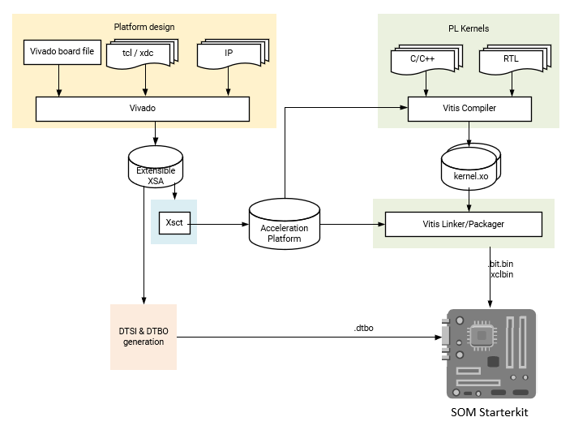

# Vitis Platform Flow

Developers can create a custom Vitis platform if they require a different set of physical PL I/O peripherals than those provided in AMD generated platforms. Development starts with the Vivado tool to create an extensible hardware platform. In Vivado, the Kria SOM Starter Kit Vivado board files are provided. It automatically drives the PS subsystem HW configuration and provides pre-defined connectivity for commonly used PL IPs based on the selected carrier card (e.g. MIPI interfaces on KV260 carrier card). Developers use Vivado to generate a custom .xsa file to be ported into Vitis as a platform project. Once the platform project is created, then a corresponding device tree overlay is generated. With the extensible .xsa and .dtbo developers can now follow the same flow outlined in Vitis Accelerator flow. The resulting bitstream, .xclbin, and .dtbo files are copied into the target.

* Assumption: AMD provided SOM carrier card with associated Vivado board file automation
* Input: Vivado SOM Starter Kit board files
* Output: .dtbo, .bit.bin, .xclbin



## Prerequisites and Assumptions

This document assumes that developers will use 2021.1 or later tools and SOM content releases. The tool versions should match - e.g. use the same tool versions for released BSP, Vivado, as well as PetaLinux and/or Ubuntu. For Ubuntu version, refer to table in [wiki](https://xilinx-wiki.atlassian.net/wiki/spaces/A/pages/1641152513/#Ubuntu-LTS).

1. Vitis tools installation
2. (Optional) PetaLinux [SOM Starter Kit BSP download](https://xilinx-wiki.atlassian.net/wiki/spaces/A/pages/1641152513/#PetaLinux-Board-Support-Packages)
3. Vivado tools installation
4. tool for generating and/or compiling .dtbo file: a. PetaLinux tools installation or b. XSCT (will be installed as part of Vivado or Vitis)

## Step 1 - Aligning Kria SOM boot & SOM Starter Linux infrastructure

AMD built Kria SOM Starter Kit applications on a shared, application-agnostic infrastructure in the SOM Starter Linux including kernel version, Yocto project dependent libraries, and baseline BSP. When using this tutorial, make sure to align tools, git repositories, and BSP released versions.

### PetaLinux BSP Alignment

The SOM Starter Linux image is generated using the corresponding SOM variant multi-carrier card PetaLinux board support package (BSP). Developers creating applications on the Starter Kit are recommended to use this BSP as a baseline for their application development as it ensures kernel, Yocto project libraries, and baseline configuration alignment. The multi-carrier card BSP defines a minimalistic BSP that has the primary function of providing an application-agnostic operating system, and can be updated and configured dynamically at runtime.

## Step 2 - Generate a new custom PL design using Vivado

There are two ways to get started designing PL design for SOM Carrier cards. Developers can either start with the Vivado board file, or the released Vivado starter project in BSP.

### Vivado board file

This flows starts with Vivado board files containing information on K26, K24, KV260 CC, KR260 CC or KD240 CC. The K26/K24 SOM is supported in Vivado with board files that automate the configuration of the SOM based peripherals. These board files are available in Vivado's board list in "Create Project" wizard.

Refer to [Wiki](https://xilinx-wiki.atlassian.net/wiki/spaces/A/pages/1641152513/#Vivado-Board-Support-Packages) for a list of board files required, tool versions that support them.

Details of how to generate a Vivado design from board file can be found [here](./Generate_vivado_project_from_boardfile.md).

### Vivado Starter Project in BSP

Alternatively, developers can start from the Vivado project provided in the BSP file.
First, download the SOM Starter Kit BSP from the [SOM Wiki](https://xilinx-wiki.atlassian.net/wiki/spaces/A/pages/1641152513/#PetaLinux-Board-Support-Packages)
Then create the project using BSP:

```bash
petalinux-create -t project -s xilinx-<board>-<version>.bsp
cd xilinx--<board>-<version>
```

The Vivado starter project can be found in ```hardware/``` folder, and developers can open the project using the .xpr file. If using the K26/K24 BSP, the project is a K26/K24 project only, and will not contain any information about the carrier card being used. However, it does have enough information to boot basic Linux. The KV260,  KR260 KD240 BSP have CC information.

In 2022.1 or later, those project will also be available in [github repo](https://github.com/Xilinx/kria-base-hardware) for those who do not wish to use PetaLinux.

### Generate .xsa file

Please refer to Vivado documentation to add custom IP blocks into your design. An updated .xsa file needs to be generated by using File -> Export -> Export Hardware , make sure to select "include bitstream" in the generation.


To access the example KV260 Vitis reference design, developers can follow the steps in the [Using Vivado to Build the Hardware Design](https://xilinx.github.io/kria-apps-docs/kv260/2022.1/build/html/docs/build_vivado_design.html) tutorial that uses [Kria Vitis Platform repository](https://github.com/Xilinx/kria-vitis-platforms).

Note that while KR260 and KD240 example project has Vivado projects in [Kria Vitis Platform repository](https://github.com/Xilinx/kria-vitis-platforms) that has Vitis platform hooks, they have not been validated to be used as Vitis platforms in other applications.

## Step 3 - Package the platform

After generating the .xsa file, developers will need to package it into a Xilinx Platform File (.xpfm file). Developers can use the script [pfm.tcl](https://github.com/Xilinx/vck190-base-trd/blob/2022.1/platforms/scripts/pfm.tcl)  to generate .xpfm file and its associated hw/ and sw/ folders:

```bash
xsct -sdx pfm.tcl -xsa <generated xsa file from step 2>.xsa
```

The .xpfm file and its associated hw/ sw/ folders will be located at ```xsct/<platform name>/<platform name>/export/<platform name>/```.  To copy or move the xpfm file, developers must also move the hw/ and sw/ directories, as the xpfm file expects them to be adjacent to itself.

## Step 4 - Compile a device tree overlay blob (.dtbo)

If using PL loading post Linux boot, then a DT overlay is required to add the HW/SW interfaces to the initial Linux booted device tree. For creating the DT overlay please refer to [dtsi_dtbo_generation](./dtsi_dtbo_generation.md) page.

Note that in the [Accelerated Flow Application Development](https://docs.xilinx.com/r/en-US/ug1393-vitis-application-acceleration/Setting-Up-the-Environment-to-Run-the-Vitis-Software-Platform) where the accelerator or reconfigurable module only uses interfaces initialiated by the platform, the final bitstreams generated from the same platform can all share the same .dtbo files. The meta data associated with the accelerator added in step 5 below will be in a .xclbin file and we will not need to updte .dtbo, even though the bitstream has been updated.

If not using Accelerated Flow Application development, then the .dtsi file may need update after adding accelerator.

## step 5 - follow Vitis Accelerator Flow to generate applications

After creating .dtbo and Platform files, developers will be able to create their accelerators in Vitis platform. They can follow step 3 through 5 in [Vitis Accelerator Flow](./vitis_accel_flow.md) to finish creating and running their applications.

## Examples

* This [Vitis guide](https://github.com/Xilinx/Vitis-Tutorials/blob/2022.1/Vitis_Platform_Creation/Design_Tutorials/01-Edge-KV260/README.md) is a good detailed tutorial that uses a flow close to Vitis Platform Flow. It includes software generation in Petalinux as well, which is not in the scope of this tutorial.
* This [Vitis platform flow example] details step by step, how to add a Raspi pipeline to the kv260_ispMipiRx_vcu_DP platform (on which smartcam application is based), to allow smartcam application to use Raspi camera.

## License

Licensed under the Apache License, Version 2.0 (the "License"); you may not use this file except in compliance with the License.

You may obtain a copy of the License at
[http://www.apache.org/licenses/LICENSE-2.0](http://www.apache.org/licenses/LICENSE-2.0)

Unless required by applicable law or agreed to in writing, software distributed under the License is distributed on an "AS IS" BASIS, WITHOUT WARRANTIES OR CONDITIONS OF ANY KIND, either express or implied. See the License for the specific language governing permissions and limitations under the License.

<p class="sphinxhide" align="center">Copyright&copy; 2023 Advanced Micro Devices, Inc</p>