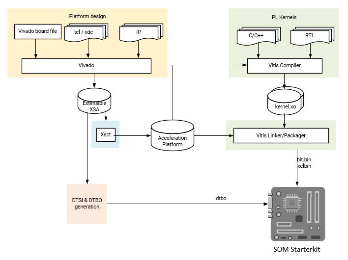
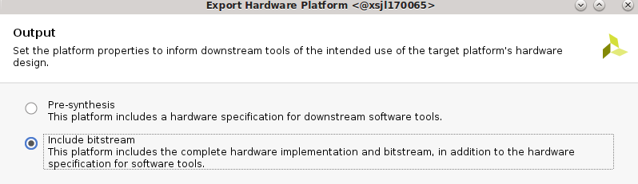

# Vitis Platform Flow

You can create a custom Vitis platform if you require a different set of physical PL I/O peripherals than those provided in AMD generated platforms. Development starts with the Vivado tool to create an extensible hardware platform. In Vivado, the Kria SOM Starter Kit Vivado board files are provided. It automatically drives the PS subsystem hardware configuration and provides predefined connectivity for commonly used PL IPs based on the selected carrier card (for example, MIPI interfaces on ther KV260 carrier card). Use Vivado to generate a custom .xsa file to be ported into Vitis as a platform project. Once the platform project is created, then a corresponding device tree overlay is generated. With the extensible .xsa and .dtbo, you can now follow the same flow outlined in Vitis Accelerator flow. The resulting bitstream, .xclbin, and .dtbo files are copied into the target.

* Assumption: AMD provided SOM carrier card with associated Vivado board file automation
* Input: Vivado SOM Starter Kit board files
* Output: .dtbo, .bit.bin, .xclbin



## Prerequisites and Assumptions

This document assumes that you use 2021.1 or later tools and SOM content releases. The tool versions should match; that is, use the same tool versions for released BSP, Vivado, as well as PetaLinux and/or Ubuntu. For Ubuntu version, refer to the table in the [Wiki](https://xilinx-wiki.atlassian.net/wiki/spaces/A/pages/1641152513/#Ubuntu-LTS).

1. Vitis tools installation
2. (Optional) PetaLinux [SOM Starter Kit BSP download](https://xilinx-wiki.atlassian.net/wiki/spaces/A/pages/1641152513/#PetaLinux-Board-Support-Packages)
3. Vivado tools installation
4. tool for generating and/or compiling .dtbo file:
    * PetaLinux tools installation or
    * XSCT (will be installed as part of Vivado or Vitis)

## Step 1 - Align the Kria SOM Boot and SOM Starter Linux Infrastructure

AMD built Kria SOM Starter Kit applications on a shared, application-agnostic infrastructure in the SOM Starter Linux including kernel version, Yocto project dependent libraries, and baseline BSP. When using this tutorial, make sure to align tools, git repositories, and BSP released versions.

### PetaLinux BSP Alignment

The SOM Starter Linux image is generated using the corresponding SOM variant multi-carrier card PetaLinux board support package (BSP). When creating applications on the Starter Kit, it is recommended that you use this BSP as a baseline for your application development as it ensures kernel, Yocto project libraries, and baseline configuration alignment. The multi-carrier card BSP defines a minimalistic BSP that has the primary function of providing an application-agnostic operating system and can be updated and configured dynamically at runtime.

## Step 2 - Generate a New Custom PL Design Using Vivado

There are two ways to get started designing PL design for SOM Carrier cards. Start with either start the Vivado board file or the released Vivado starter project in BSP.

### Vivado Board File

This flows starts with Vivado board files containing information on K26, K24, KV260 CC, KR260 CC, or KD240 CC. The K26/K24 SOM is supported in Vivado with board files that automate the configuration of the SOM based peripherals. These board files are available in Vivado's board list in "Create Project" wizard.

For a list of board files required, tool versions that support them, refer to the [Wiki](https://xilinx-wiki.atlassian.net/wiki/spaces/A/pages/1641152513/#Vivado-Board-Support-Packages).

Details of how to generate a Vivado design from board file can be found [here](./Generate_vivado_project_from_boardfile.md).

### Vivado Starter Project in the Vivado Example Project

Alternatively, an example project from Vivado (2024.2 and later) can be used. Details of how to generate a Vivado design from Vivado example design can be found [here](./Generate_vivado_project_from_CED.md).

### Generate the .xsa File

To add custom IP blocks into your design, refer to the Vivado documentation. You need to generate an updated .xsa file by selecting **File** -> **Export** -> **Export Hardware**, and make sure to select **include bitstream** in the generation.



To access the example KV260 Vitis reference design, follow the steps in the [Using Vivado to Build the Hardware Design](https://xilinx.github.io/kria-apps-docs/kv260/2022.1/build/html/docs/build_vivado_design.html) tutorial that uses the [Kria Vitis Platform repository](https://github.com/Xilinx/kria-vitis-platforms).

> **NOTE:** While the KR260 and KD240 example project has Vivado projects in [Kria Vitis Platform repository](https://github.com/Xilinx/kria-vitis-platforms) that have Vitis platform hooks, they have not been validated to be used as Vitis platforms in other applications.

## Step 3 - Package the Platform

After generating the .xsa file, you need to package it into a Xilinx Platform File (.xpfm file). Use the [pfm.tcl](https://github.com/Xilinx/vck190-base-trd/blob/2022.1/platforms/scripts/pfm.tcl) script to generate the .xpfm file and its associated `hw/` and `sw/` folders:

```bash
xsct -sdx pfm.tcl -xsa <generated xsa file from step 2>.xsa
```

The .xpfm file and its associated `hw/` and `sw/` folders is located at ```xsct/<platform name>/<platform name>/export/<platform name>/```.  To copy or move the xpfm file, you must also move the `hw/` and `sw/` directories because the xpfm file expects them to be adjacent to itself.

## Step 4 - Compile a Device Tree Overlay Blob (.dtbo)

If using PL loading post Linux boot, then a DT overlay is required to add the hardware/software interfaces to the initial Linux booted device tree. To create the DT overlay, refer to the [dtsi_dtbo_generation](./dtsi_dtbo_generation.md) page.

>**NOTE:** In the [Accelerated Flow Application Development](https://docs.amd.com/go/en-US/ug1700-vitis-accelerated-data-center/Setting-Up-the-Vitis-Environment) where the accelerator or reconfigurable module only uses interfaces initiated by the platform, the final bitstreams generated from the same platform can all share the same .dtbo files. The metadata associated with the accelerator added in the following step 5 are in a .xclbin file, and you do not need to update .dtbo, even though the bitstream was been updated.

If not using Accelerated Flow Application development, then the .dtsi file might need update after adding accelerators.

## Step 5 - Follow the Vitis Accelerator Flow to Generate Applications

After creating .dtbo and platform files, you can create your accelerators in the Vitis platform. Follow step 3 through 5 in the [Vitis Accelerator Flow](./vitis_accel_flow.md) to finish creating and running your applications.

## Examples

* This [Vitis guide](https://github.com/Xilinx/Vitis-Tutorials/blob/2022.1/Vitis_Platform_Creation/Design_Tutorials/01-Edge-KV260/README.md) is a detailed tutorial that uses a flow close to the Vitis Platform Flow. It includes software generation in PetaLinux, as well, which is not in the scope of this tutorial.
* This [Vitis platform flow example] details step by step, how to add a Raspi pipeline to the kv260_ispMipiRx_vcu_DP platform (on which smartcam application is based), and how to allow the smartcam application to use a Raspi camera.

<hr class="sphinxhide"></hr>

<p class="sphinxhide" align="center"><sub>Copyright © 2023-2025 Advanced Micro Devices, Inc.</sub></p>

<p class="sphinxhide" align="center"><sup><a href="https://www.amd.com/en/corporate/copyright">Terms and Conditions</a></sup></p>