# Vitis Platform Flow Example: Adding a Raspberry Pi Camera to SmartCam's Platform

This example takes SmartCam's platform, kv260_ispMipiRx_vcu_DP, removes its MIPI ISP and audio IPs, and adds Raspberry Pi support instead. Then you add in the DPU accelerator overlay for the SmartCam application. Functionally, this allows the SmartCam application to take the image sensor input from the Raspberry Pi Camera on J9 instead of the AP1305 sensors on J7.

The tutorial first regenerates the platform with the Raspberry Pi pipeline, creating its corresponding bitstream and device tree artifacts. You then test those artifacts with the Raspberry Pi Camera to display Raspberry Pi capture on the monitor without any accelerator functions. Then you take the platform and add a DPU accelerator, and retest the firmware with accelerator function added in; the accelerator function creates a blue bounding box on faces detected.

This example is targeted for the 20022.1 release on Ubuntu 22.04 for KV260.

## Prerequisites and Hardware Setup

You must have gone through tutorial on running [SmartCam](https://xilinx.github.io/kria-apps-docs/kv260/2022.1/build/html/docs/smartcamera/smartcamera_landing.html) on the KV260 Ubuntu 22.04, based on tool version 2022.1, so that you understand how to program the SD card and basics of running an application on the KV260. The example also uses SmartCam docker container to provide the drivers needed.

The hardware setup is similar to that of [SmartCam](https://xilinx.github.io/kria-apps-docs/kv260/2022.1/build/html/docs/smartcamera/docs/app_deployment.html#application-specific-hardware-setup), except you do not need to the IAS sensor in J7 but a Raspberry Pi Camera on J9 instead. This tutorial has been tested with the [Rasberry Pi Camera V2 from element14](https://community.element14.com/products/raspberry-pi/w/documents/1502/new-pi-camera-and-pi-camera-noir-v2).

This example is based on 2022.1 releases, so be sure to use 2022.1 tools, BSPs, repositories, and so on.

## Generating the Platform

### Obtaining the Platform

Because you are altering the SmartCam platform, kv260_ispMipiRx_vcu_DP, you first need to get the platform. Detailed tutorial is at [Creating Vitis Platform](https://xilinx.github.io/kria-apps-docs/kv260/2022.1/build/html/docs/build_vitis_platform.html). Here are the specific commands to use to generate the platform:

```shell
git clone --recursive --branch xlnx_rel_v2022.1 https://github.com/Xilinx/kria-vitis-platforms.git
cd kria-vitis-platforms/kv260/
```

In this page, the preceding directory is referred to as ```$kv260-vitis``` .

```shell
make platform PFM=kv260_ispMipiRx_vcu_DP
cd $kv260-vitis/platforms/vivado/kv260_ispMipiRx_vcu_DP/project/
```

The Vivado project is located in ```$kv260-vitis/platforms/vivado/kv260_ispMipiRx_vcu_DP/project/kv260_ispMipiRx_vcu_DP.xpr```.

In Vivado, open the .xpr project.

### Obtaining the isp_single IP

In this example, you use a Raspberry Pi pipeline that uses a ISP block. This is a custom IP that is not present in AMD IP catalog, so you need to manually copy it to your project. This IP is found in ```$kv260-vitis/platforms/vivado/kv260_ispMipiRx_rpiMipiRx_DP/ip/isp_single_kv260/```, this is the platform for nlp_smartvision app that has support for Raspberry Pi.

1. To generate the IP, use the following command:

   ```shell
   cd $kv260-vitis/platforms/vivado/kv260_ispMipiRx_rpiMipiRx_DP/ip/isp_single_kv260/
   make ip
   ```

   This generates a ```isppipeline.prj/``` folder; this is the ISP IP you use in this project.

2. In Vivado project where you have `kv260_ispMipiRx_vcu_DP.xpr` opened, click **Project Manager** -> **IP Catalog**, and notice the user repository. This is where you copy the ```isp_single_kv260/``` IP to which is located in ```$kv260-vitis/platforms/vivado/kv260_ispMipiRx_vcu_DP/ip/```.

3. Copy the single_isp IP over:

   ```shell
   cd $kv260-vitis/
   cp platforms/vivado/kv260_ispMipiRx_rpiMipiRx_DP/ip/isp_single_kv260/ platforms/vivado/kv260_ispMipiRx_vcu_DP/ip/ -rf
   ```

4. Then, refresh the repo:
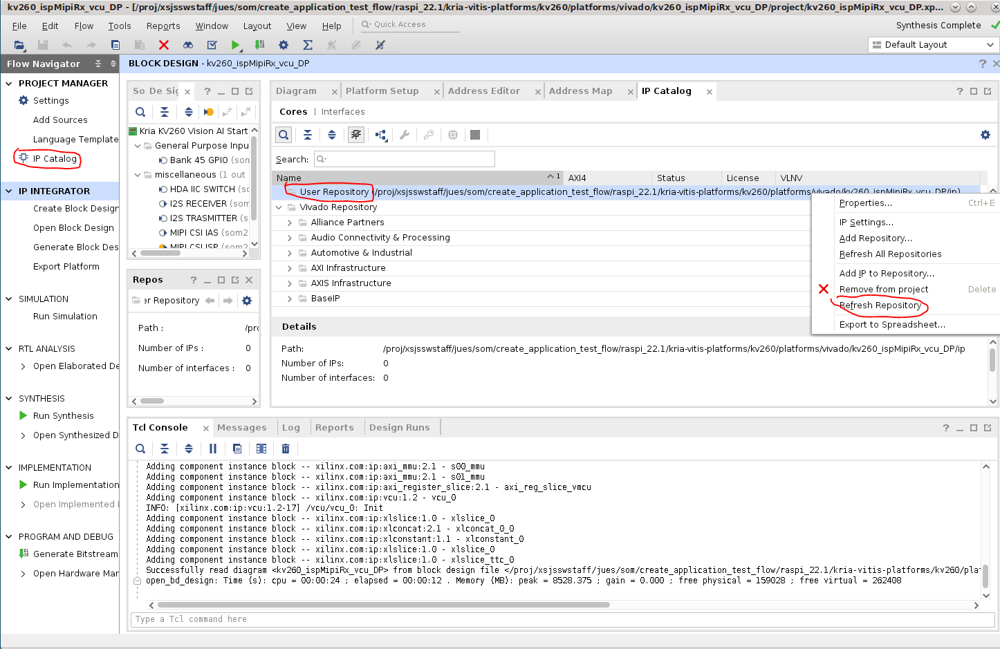

### Importing the Raspberry Pi Pipeline

Next, import the Raspberry Pi pipeline that replaces the original ISP pipeline in kv260_ispMipiRx_vcu_DP.

1. Download the source [capture_pipeline_raspi.tcl](./example_src/raspi_example/capture_pipeline_raspi.tcl), and source it in the Vivado Tcl Console.

   ```shell
   source capture_pipeline_raspi.tcl
   ```

2. Next, click **Flow Navigator** -> **IP Integrator** -> **Open Block Design**, and then in Tcl Console, type in the following to instantiate the subblock of the ISP pipeline for Raspberry Pi:

   ```shell
   create_hier_cell_capture_pipeline_raspi ./ raspi_pipeline
   ```

This creates a new, unconnected block of the Raspberry Pi ISP pipeline in the existing block design. You can double click the block to see the component of this subblock.
>**NOTE:** You can find pin assignment for Raspberry Pi in mipi_csi2_rx_subsyst_0 by double clicking the IP and navigating to the Pin Assignment tab.

#### Optional: Generating `capture_pipeline_raspi.tcl`

The following steps show how to generate `capture_pipeline_raspi.tcl` in the platform used for Raspberry Pi-supported NLP application. This is not required because we have provided the file is already provided, but instructions to show you how it was imported from one project to another are also provided.

```shell
cd $kv260-vitis
make platform PFM=kv260_ispMipiRx_rpiMipiRx_DP
```

1. In Vivado, open ```platforms/vivado/kv260_ispMipiRx_rpiMipiRx_DP/project/kv260_ispMipiRx_rpiMipiRx_DP.xpr```. Click **IP Integrator** -> **Open Block Design**.

2. Double click **capture_pipeline_raspi**, double click **mipi_csi2_rx_subsyst_0**, select the Shared Logic tab, change to **Include Shared Logic in Core**, and click **okay**. This removes the `pll_lock_in` and `clkoutphy_in` pins. Also remove the unconnected pins from the capture_pipeline_raspi hierarchy's pin list.

3. In the Vivado Tcl Console, enter:

   ```write_bd_tcl -hier_blks [get_bd_cells capture_pipeline_raspi] capture_pipeline_raspi.tcl```

   This generates ```capture_pipeline_raspi.tcl```.

### Updating the Block Design

1. Next, you replace the capture_pipeline with this raspi_pipeline. Most of the signals can be replaced one to one;if it is the same signal between capture_pipeline and raspi_pipeline, disconnect the signal/bus on capture_pipeline and connect other IP/interfaces to raspi_pipeline instead. At the end, click **capture pipeline**, and press **delete**" to remove it. Most of the raspi_pipeline is connected by now:
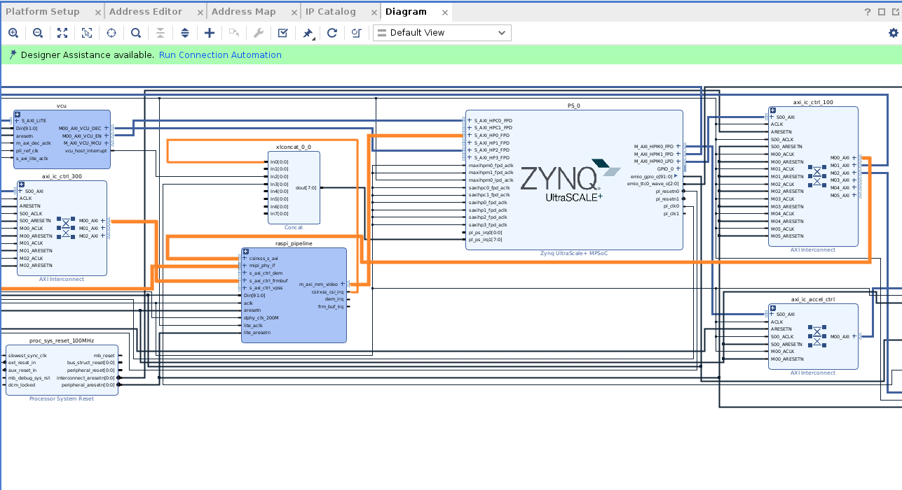

2. `s_axi_CTR`L and `s_axi_ctrl_vpss` are still not connected. You need to create connections for them. Find axi_ic_ctrl_300; it currently only has one `M00_AXI` port connected to `raspi_pipeline/s_axi_ctrl_frm_buf`. Double click **axi_ic_ctrl_300**, and change the Number of Master Interfaces from 1 to 3:
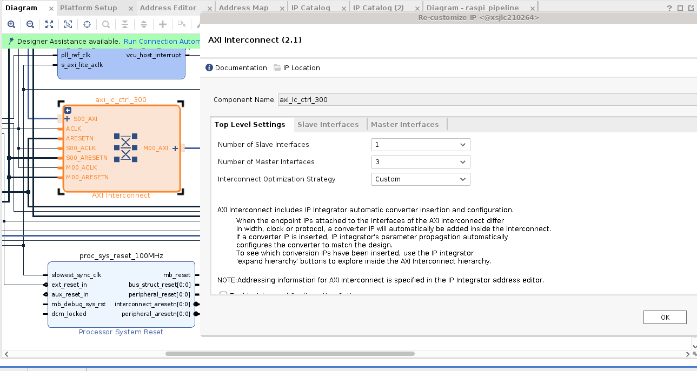

3. Now, connect the `ACLK` and `ARRESETN` signals on `axi_ic_ctrl_300`, and connect the `M01_AXI` and `M02_AXI` to the two `s_axi ports` on raspi_pipeline that are still unconnected.
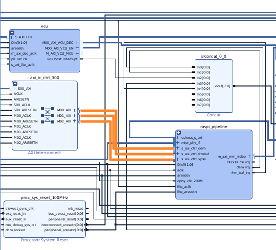

4. Next, you must free up an interrupt port because the raspi_pipeline has more interrupts than the `capture_pipeline` you deleted. You do not need the audio path in this experiment, so remove them. In the block design, find the `Audio_ss_0` block to delete them. Next, update `axi_ic_audio_mcu` to have one single slave port instead of three; this interconnect is still needed because of the address width difference between the `m_axi_vcu_mcu port` of `axi_ic_audio_mcu` and the `s_axi_lpd` port of `ps_0`. This also frees up three ports on `axi_ic_ctrl_100`; double click that and change it from six master ports to three master ports.

5. Next, `PS_0/S_AXI_HP0_FPD` is currently 128 bits wide, but the new connection raspi_pipeline/m_axi_mm_video is only 64 bits. Double click **PS_0**, select **PS-PL Configuration** -> **PS-PL Interfaces** -> **Slave Interfaces** -> **AXI HP** -> **AXI HP0 FPD**, and change the AXI HP0 FPD Data Width from 128 to 64.

   It should look similar to the following screenshot. Click **OK**:
     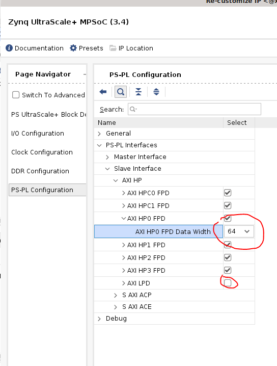

6. Next, connect the interrupts:

   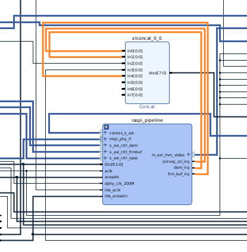

7. Raspberry Pi requires you to enable `HDA09` via the `F11` pin. Right-click Add IP "Constant" with "Const Val" = 1, right click **->**, create a port with "Port name" = raspi_enable, Direction = Output, Type = other. Connect them.  This ensures that you enable HDA09.
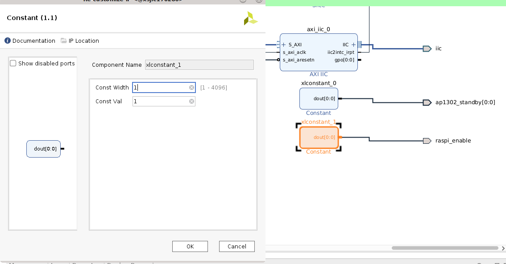

### Constraint File

Reuse the constraints for MIPI PHY. Raspberry Pi requires you to enable HDA09 via the F11 pin.  To add the raspi_enable constraint, add the following to ```prj/prj.srcs/constrs_1/imports/xdc/pin.xdc``` :

```shell
#Raspi Enable HDA09
set_property PACKAGE_PIN F11 [get_ports {raspi_enable}]
set_property IOSTANDARD LVCMOS33 [get_ports {raspi_enable}]
set_property SLEW SLOW [get_ports {raspi_enable}]
set_property DRIVE 4 [get_ports {raspi_enable}]
```

### Address Map

Go to the Address Editor tab, and modify the address of the ones in green boxes (see the following snapshot). First, select all the unassigned address, right click, and click **assign**. Then go back and modify their address and range to match the following screenshot (you can also leave the PS_0/raspi_pipeline* address as the default, just matching the range, but you then need to update .dtsi to match).

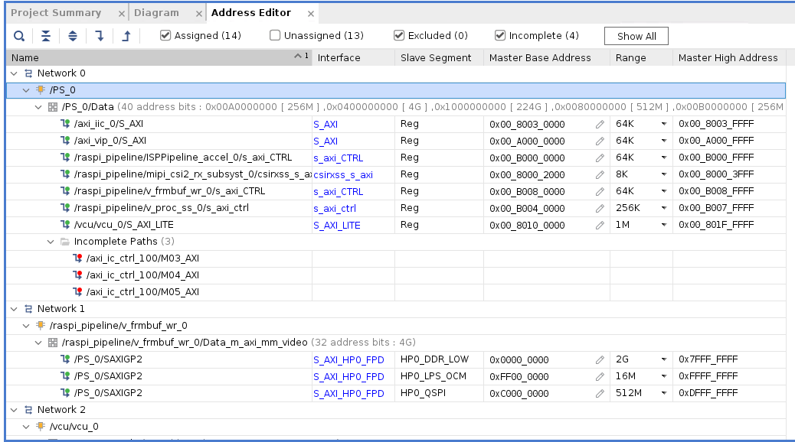

### Lower the Clock Rate

1. Double-click **clk_wiz_0**, change `clk_300M` to `clkv_200M`, and update theoutput frequency. The Raspberry Pi IP does meet timing at 300 MHz.
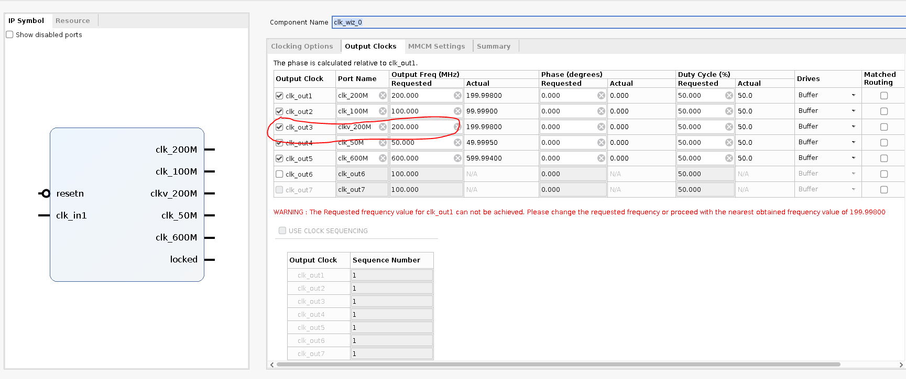

2. Now go to Platform Setup tab, click on "Clock" and enable the new clkv_200M and set it as default clock:
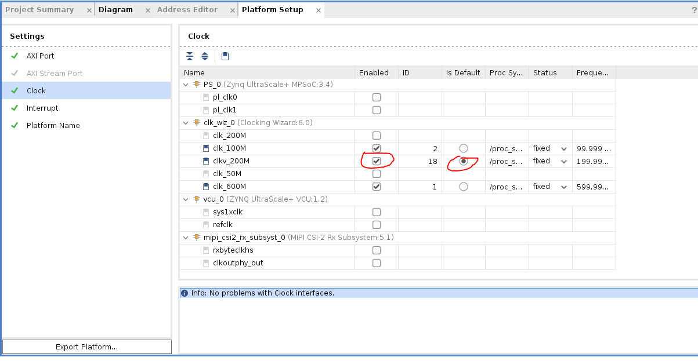

### Platform Setup

Navigate to the Platform Setup tab. No changes are needed, but notice that you are keeping the same ports for accelerator insertion in Vitis.

### Validate the Design

Select **Tools** (top tool bar) -> **Validate Design**. When asked if you want to add an autoa assign unassigned address segment, click **No**.

### Generate the Wrapper

Regenerate the wrapper because you added a `raspi_enable` signal.

Navigate to **Block Design** -> **sources** -> **Design Sources**, right-click **kv260_ispMipiRx_vcu_DP_wrapper**, and select **Remove File from Project**:

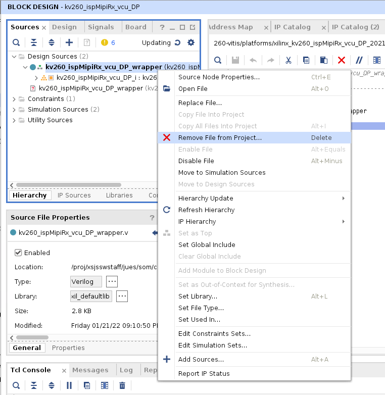

In pop-up select "Ignore and continue with invalid top module"

Block Design -> sources -> Design Sources -> right click on kv260_ispMipiRx_vcu_DP and select "Generate HDL wrapper":

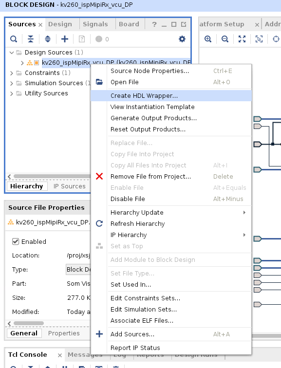

In the pop-up, select **Let Vivado manage wrapper and auto-update**, and click **OK**.

Double-click the kv260_ispMipiRx_vcu_DP_wrapper file, and `raspi_enable` displays as one of the outputs in the wrapper.

### Generate the Output Products

Navigate to **Block Design** -> **sources** -> **Design Sources**, right-click **kv260_ispMipiRx_vcu_DP_i**, and select **Reset Output Products**. Then navigate to **Block Design** -> **sources** -> **Design Sources**, right-click **kv260_ispMipiRx_vcu_DP_i**, select **Generate Output Products**, select **out of context per IP**, and click **Generate**:

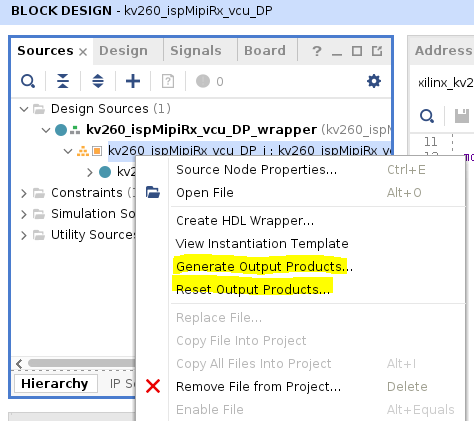

### Generate the Bitstream

Now you are ready to generate the bitstream. To generate the bitstream, click **Program and Debug** -> **Generate Bitstream**. This process takes some time.

After the .bit file is generated, convert it to a `.bit.bin` file, the format that xmutil is expecting:

```shell
cd $kv260-vitis/platforms/vivado/kv260_ispMipiRx_vcu_DP/project/kv260_ispMipiRx_vcu_DP.runs/impl_1/
echo 'all:{kv260_ispMipiRx_vcu_DP_wrapper.bit}'>bootgen.bif
bootgen -w -arch zynqmp -process_bitstream bin -image bootgen.bif
mv kv260_ispMipiRx_vcu_DP_wrapper.bit.bin kv260-smartcam-raspi.bit.bin
```

## Creating the .dtsi File

Base your .dtsi file from the [SmartCam .dtsi file](https://github.com/Xilinx/kria-apps-firmware/blob/xlnx_rel_v2022.1/boards/kv260/smartcam/kv260-smartcam.dtsi). Remove the ISP and audio devices, as well as ap1302 on I2C port 0.

In their stead, we will need to add the imx devices and their associated support functions. The resulting dtsi file can be found in [kv260-smartcam-raspi.dtsi](./example_src/raspi_example/kv260-smartcam-raspi_2022.1.dtsi). There are a few things to correlate to the PL design:

### Base Address

Each device in the .dtsi file needs to have the correct address corresponding to what you set in the "Address Map" section. The provided .dtsi file corresponds to the screenshot. If your address map is different, make the necessary changes.

- imx_isp0 in .dtsi corresponds to ISPPipeline_accel_0
- imx_csiss_1 in .dtsi corresponds to mipi_csi2_rx_subsyst_0
- imx_scalar_1 in .dtsi corresponds to v_proc_ss_0
- imx_fb_wr_csi corresponds to v_frmbuf_wr_0

### Interrupt

The interrupt numbers 104 through 111 are corresponding to ```pl_ps_irq1[0]``` through ```pl_ps_irq1[7]```. Thus, make sure that:

- imx_csiss_1 has interrupt 104, if csirxss_csi_irq is connected to In0 of xlconcat_0_0, which feeds to pl_ps_irq1[0]
- imx_isp0 has interrupt 105, if dem_irq is connected to In1 of xlconcat_0_0, which feeds to pl_ps_irq1[1]
- imx_fb_wr_csi has interrupt 108, if dem_irq is connected to In4 of xlconcat_0_0, which feeds to pl_ps_irq1[4]

### GPIO

This does not require any changes, but the ```reset-gpio[86:82]``` in the .dtsi file corresponds to ```PS_0/emio_gpio_o[8:4]```. You can see that the emio_gpio_o ius routed into raspi_pipeline to some rstn signals, and their position correspond to the gpio settings for each device in the .dtsi file.

### I2C

On the KV260 carrier card, Raspberry Pi is on I2C port 2, so imx219 is on i2x@2 in the .dtsi file.

### AFI Ports

Lastly, you changed the `S_AXI_HP0_FPD` port from 128 bits to 62 bits, so you need to set the AFI device in the .dtsi file. Configure 4, 5, to 1 to indicate 64 bits (0 = 128 bit, 1 = 64 bit, 2 = 32 bit):

```text
config-afi = <0 0>, <1 0>, <2 0>, <3 0>, <4 1>, <5 1>, <6 0>, <7 0>, <8 0>, <9 0>, <10 0>, <11 0>, <12 0>, <13 0>, <14 0x0>, <15 0x000>;
```

### Bitstream File Name

Change ```firmware-name``` to its corresponding `.bit.bin` file name. This step is optional because the reference is not being used by dfx-mgr.

```text
firmware-name = "kv260-smartcam-raspi.bit.bin";
```

### Clock Frequency

Because you changed one of the clocks from 300 MHz to 200 MHz, change the corresponding clocks (`misc_clk_2`) in the .dtsi file to 200 MHz:

``` text
misc_clk_2: misc_clk_2 {
        #clock-cells = <0x0>;
        clock-frequency = <199998000>;
        compatible = "fixed-clock";
};
```

### Compile .dtsi to .dtbo

After you are done, your .dtsi file looks like [this](./example_src/raspi_example/kv260-smartcam-raspi_2022.1.dtsi).

Now compile the .dtsi file into the .dtbo binary:

```shell
dtc -@ -O dtb -o kv260-raspi.dtbo kv260-raspi.dtsi
```

Several warning messages display; it is okay to ignore them. ```kv260-smartcam-raspi.dtbo``` displays in the folder.

## Installing Drivers on Ubuntu

This step assumes you have installed SmartCam and are able to run the SmartCam application through the Docker container on Ubuntu. If not, to install SmartCam, follow the [SmartCam app deployment](https://xilinx.github.io/kria-apps-docs/kv260/2022.1/build/html/docs/smartcamera/smartcamera_landing.html) instructions in Ubuntu 22.1 SmartCam app deployment page.

## Testing the Platform on Target

Now, you need to test the generated platform to make sure the Raspberry Pi pipeline is working. 
>**NOTE:** You have not yet added in the DPU accelerator, so you cannot test the Raspberry Pi with SmartCam application itself until later.

First, SCP the `kv260-raspi.dtbo kv260-raspi.bit.bin` over to target or copy them to the SD card, finding them in `/boot/firmware/`, and reuse the `shell.json` file in `/lib/firmware/xilinx/kv260-smartcam/shell.json`:

```shell
sudo mkdir /lib/firmware/xilinx/kv260-raspi
sudo mv kv260-raspi.dtbo kv260-raspi.bit.bin shell.json /lib/firmware/xilinx/kv260-raspi
sudo xmutil listapps
sudo xmutil unloadapp
sudo xmutil loadapp kv260-raspi
sudo xmutil desktop_disable
```

If the hardware and the device tree is created correctly, you see Raspberry Pi in `/dev/media0`:

``` shell
root@kria:~# media-ctl -d /dev/media0 -p
Media controller API version 5.15.39

Media device information
------------------------
driver          xilinx-video
model           Xilinx Video Composite Device
serial
bus info
hw revision     0x0
driver version  5.15.39

Device topology
- entity 1: imx_vcap_csi output 0 (1 pad, 1 link)
            type Node subtype V4L flags 0
            device node name /dev/video0
        pad0: Sink
                <- "b0040000.scaler":1 [ENABLED]

- entity 5: b0040000.scaler (2 pads, 2 links)
            type V4L2 subdev subtype Unknown flags 0
            device node name /dev/v4l-subdev0
        pad0: Sink
                [fmt:RBG888_1X24/1920x1080 field:none colorspace:srgb]
                <- "b0000000.isp_accel":1 [ENABLED]
        pad1: Source
                [fmt:VYYUYY8_1X24/1920x1080 field:none colorspace:srgb]
                -> "imx_vcap_csi output 0":0 [ENABLED]

- entity 8: imx219 6-0010 (1 pad, 1 link)
            type V4L2 subdev subtype Sensor flags 0
            device node name /dev/v4l-subdev1
        pad0: Source
                [fmt:SRGGB10_1X10/1920x1080 field:none colorspace:srgb xfer:srgb ycbcr:601 quantization:full-range
                 crop.bounds:(8,8)/3280x2464
                 crop:(688,700)/1920x1080]
                -> "80002000.csiss":0 [ENABLED]

- entity 10: 80002000.csiss (2 pads, 2 links)
             type V4L2 subdev subtype Unknown flags 0
             device node name /dev/v4l-subdev2
        pad0: Sink
                [fmt:SRGGB10_1X10/1920x1080 field:none colorspace:srgb xfer:srgb ycbcr:601 quantization:full-range]
                <- "imx219 6-0010":0 [ENABLED]
        pad1: Source
                [fmt:SRGGB10_1X10/1920x1080 field:none colorspace:srgb xfer:srgb ycbcr:601 quantization:full-range]
                -> "b0000000.isp_accel":0 [ENABLED]

- entity 13: b0000000.isp_accel (2 pads, 2 links)
             type V4L2 subdev subtype Unknown flags 0
             device node name /dev/v4l-subdev3
        pad0: Sink
                [fmt:SRGGB10_1X10/1920x1080 field:none colorspace:srgb xfer:srgb ycbcr:601 quantization:full-range]
                <- "80002000.csiss":1 [ENABLED]
        pad1: Source
                [fmt:RBG888_1X24/1920x1080 field:none colorspace:srgb]
                -> "b0040000.scaler":0 [ENABLED]
```

Once you confirm that Raspberry Pi has been connected correctly, start the SmartCam Docker container so that you have the necessary dependencies for the next command.

```bash
docker run \
--env="DISPLAY" \
-h "xlnx-docker" \
--env="XDG_SESSION_TYPE" \
--net=host \
--privileged \
--volume="$HOME/.Xauthority:/root/.Xauthority:rw" \
-v /tmp:/tmp \
-v /dev:/dev \
-v /sys:/sys \
-v /etc/vart.conf:/etc/vart.conf \
-v /lib/firmware/xilinx:/lib/firmware/xilinx \
-v /run:/run \
-it xilinx/smartcam:2022.1 bash
```

 In the Docker container, now use the following gstreamer commands to display the Raspberry Pi sensor information onto a 1080p monitor:

```shell
gst-launch-1.0 mediasrcbin media-device=/dev/media0 v4l2src0::io-mode=mmap ! "video/x-raw, width=1920, height=1080, format=NV12, framerate=30/1" ! kmssink plane-id=39 fullscreen-overlay=true -v
```

## Exporting the Design

Now that you verified that the Raspberry Pi pipeline is working, export the block design in Vivado Tcl:

```shell
write_bd_tcl config_bd.tcl
```

View a working version of this block design [here](./example_src/raspi_example/config_bd.tcl).

A working version of the constraint is [here](./example_src/raspi_example/pin.xdc).

## Adding the Accelerator

In `overlays/examples/smartcam/prj_conf/prj_config_1dpu`, update `clk` because you changed the 300 MHz clock to 200 MHz.

```text
freqHz=200000000:DPUCZDX8G_1.aclk
freqHz=400000000:DPUCZDX8G_1.ap_clk_2
freqHz=200000000:pp_pipeline_accel_1.ap_clk
```

Ensure that `$kv260-vitis/platforms/vivado/kv260_ispMipiRx_vcu_DP/ip/` has `isppipeline.prj/` from the previous step. This is necessary if you jumped in from the provided block design and pin constraints.

Copy the block design (`config_bd.tcl`), pin constraint (`pin.xdc`), and IP into the SmartCam overlay area that was generated in previous step.

```shell
cp  $kv260-vitis/platforms/vivado/kv260_ispMipiRx_vcu_DP/project/kv260_ispMipiRx_vcu_DP.srcs/constrs_1/imports/xdc/pin.xdc $kv260-vitis/platforms/vivado/kv260_ispMipiRx_vcu_DP/xdc/pin.xdc
cp config_bd.tcl  platforms/vivado/kv260_ispMipiRx_vcu_DP/scripts/config_bd.tcl 
```

Now in `$kv260-vitis`, do a make clean so that the scripts regenerate ther platform with the updated artifacts when you call ```make overlay OVERLAY=smartcam``` in the next step:

```shell
make clean
```

Now you can run the makefile that was provided for SmartCam to put the DPU overlay into this platform:

```shell
make overlay OVERLAY=smartcam
```

After the makefile completes, the following displays:

```shell
$working_dir/overlays/examples/smartcam/binary_container_1/link/int/system.bit   
$working_dir/overlays/examples/smartcam/binary_container_1/dpu.xclbin
```

Perform the following to convert `system.bit` to `kv260-raspi-dpu.bit.bin`:

```shell
cd $working_dir/overlays/examples/smartcam/binary_container_1/link/int/
echo 'all:{system.bit}' > bootgen.bif
bootgen -w -arch zynqmp -process_bitstream bin -image bootgen.bif
mv system.bit.bin kv260-raspi-dpu.bit.bin
```

## Test with the Accelerator on Target

SCP `kv260-raspi-dpu.bit.bin` and `kv260-raspi-dpu.dtbo` (the same file as `kv260-raspi.dtbo`; you can reuse the same .dtbo file across designs generated from the same platform in this flow), and `dpu.xclbin` onto target. Create a new app:

```shell
sudo mkdir /lib/firmware/xilinx/kv260-raspi-dpu
sudo mv  kv260-raspi-dpu.bit.bin /lib/firmware/xilinx/kv260-raspi-dpu/
sudo mv  kv260-raspi-dpu.dtbo /lib/firmware/xilinx/kv260-raspi-dpu/
sudo mv dpu.xclbin /lib/firmware/xilinx/kv260-raspi-dpu/kv260-raspi-dpu.xclbin
sudo cp /lib/firmware/xilinx/kv260-raspi/shell.json /lib/firmware/xilinx/kv260-raspi-dpu/
```

Next, find facedetect's `preprocess.json` file using `sudo find / -iname preprocess.json | grep facedetect`, and then update the file found on target ```/var/lib/docker/overlay2/<id>/diff/opt/xilinx/kv260-smartcam/share/vvas/facedetect/preprocess.json``` to point to the correct xclbin ```/lib/firmware/xilinx/kv260-raspi-dpu/kv260-raspi-dpu.xclbin```. Do this outside of the Docker environment because the Docker container does not have a text editor by default.

Alternatively, launch the Docker container, install vim using `apt-get install vim`, and edit `/opt/xilinx/kv260-smartcam/share/vvas/facedetect/preprocess.json` from the Docker container. You must loadapp before launching the Docker shown as follows.

Execute the application with gst-launch, so that SmartCam uses the Raspberry Pi pipeline on `/dev/media0`:

```shell
sudo xmutil listapps
sudo xmutil unloadapp
sudo xmutil loadapp kv260-raspi-dpu
docker run \
--env="DISPLAY" \
-h "xlnx-docker" \
--env="XDG_SESSION_TYPE" \
--net=host \
--privileged \
--volume="$HOME/.Xauthority:/root/.Xauthority:rw" \
-v /tmp:/tmp \
-v /dev:/dev \
-v /sys:/sys \
-v /etc/vart.conf:/etc/vart.conf \
-v /lib/firmware/xilinx:/lib/firmware/xilinx \
-v /run:/run \
-it xilinx/smartcam:latest bash

check if above is true after release!!!!!!!!!!!!!!!!!!!!!!!!!!!! for now use:
sudo docker run --env="DISPLAY" -h "xlnx-docker" --env="XDG_SESSION_TYPE" --net=host --privileged --volume="$HOME/.Xauthority:/root/.Xauthority:rw" -v /tmp:/tmp -v /dev:/dev -v /sys:/sys -v /etc/vart.conf:/etc/vart.conf -v /lib/firmware/xilinx:/lib/firmware/xilinx -v /run:/run -it smartcam:latest bash
```

In the Docker container:

```shell
gst-launch-1.0 mediasrcbin name=videosrc media-device=/dev/media0  v4l2src0::io-mode=mmap v4l2src0::stride-align=256 !  video/x-raw, width=1920, height=1080, format=NV12, framerate=30/1  ! tee name=t ! queue ! vvas_xmultisrc kconfig="/opt/xilinx/kv260-smartcam/share/vvas/facedetect/preprocess.json" ! queue ! vvas_xfilter kernels-config="/opt/xilinx/kv260-smartcam/share/vvas/facedetect/aiinference.json" ! ima.sink_master                     vvas_xmetaaffixer name=ima ima.src_master ! fakesink t. ! queue max-size-buffers=1 leaky=2 ! ima.sink_slave_0 ima.src_slave_0 ! queue ! vvas_xfilter kernels-config="/opt/xilinx/kv260-smartcam/share/vvas/facedetect/drawresult.json"          ! queue ! kmssink driver-name=xlnx plane-id=39 sync=false fullscreen-overlay=true
```

Congratulations! You should be able to see Raspberry Pi capture on the display port monitor, with a blue bounding box around the faces detected. In case you do not and want to test with a known working set of firmware, find them [here](./example_src/raspi_example/smartcam-raspi_firmware_works/), but be sure to update the folder name or file names and commands to align with each other.

<hr class="sphinxhide"></hr>

<p class="sphinxhide" align="center"><sub>Copyright © 2023-2025 Advanced Micro Devices, Inc.</sub></p>

<p class="sphinxhide" align="center"><sup><a href="https://www.amd.com/en/corporate/copyright">Terms and Conditions</a></sup></p>