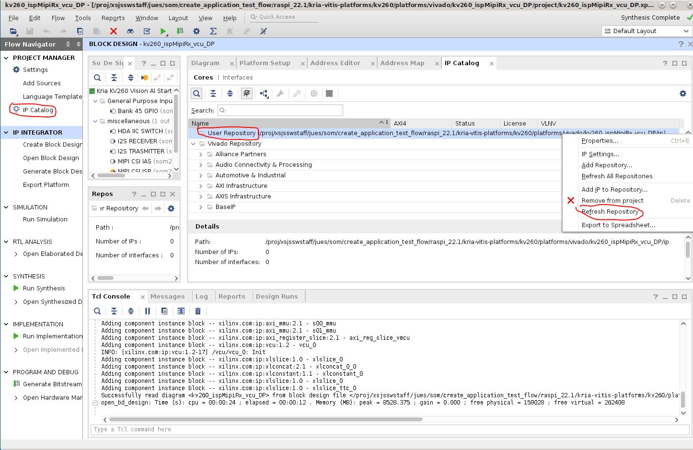
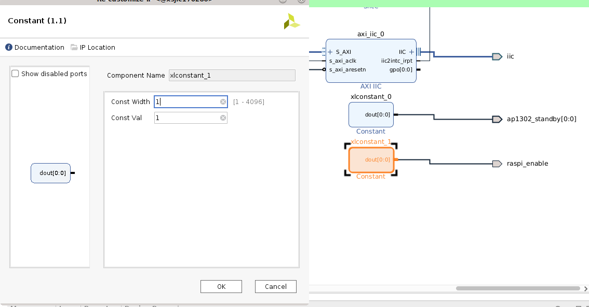
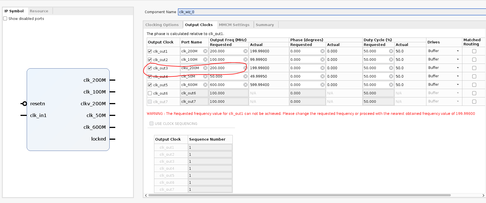

# Vitis Platform Flow Example - Adding Raspberry Pi Camera to SmartCam's Platform

This example will take smartcam's platform - kv260_ispMipiRx_vcu_DP, remove its MIPI ISP and audio IPs, and add Raspberry Pi support instead. Then we will add in the DPU accelerator overlay for smartcam application. Functionally, this will allow smartcam app to take image sensor input from Raspberry Pi Camera on J9 instead of the AP1305 sensors on J7.

The tutorial will first re-generate the platform with Raspberry Pi pipeline, creating its corresponding bitstream and device tree artifacts. We will then test those artifacts with Raspberry Pi Camera to display Raspberry Pi capture on the monitor without any accelerator functions. Then we will take the platform and add DPU accelerator, and re-test the firmware with accelerator function added in - the accelerator function will create a blue bounding box on faces detected.

This example is targeted for 22.1 release on Ubuntu 22.04 for KV260.

## Prerequisites and hardware setup

You must have gone through tutorial in running [smartcam](https://xilinx.github.io/kria-apps-docs/kv260/2022.1/build/html/docs/smartcamera/smartcamera_landing.html) on KV260 Ubuntu 22.04, based on tool version 2022.1, so that you understand how to program SD card, and basics of running an application on KV260. The example also uses Smartcam docker container to provide drivers needed.

The hardware setup is similar to that of [smartcam](https://xilinx.github.io/kria-apps-docs/kv260/2022.1/build/html/docs/smartcamera/docs/app_deployment.html#application-specific-hardware-setup), except you will not need the IAS sensor in J7, but a Raspberry Pi Camera on J9 instead. This tutorial has been tested with the [Rasberry Pi Camera V2 from element14](https://community.element14.com/products/raspberry-pi/w/documents/1502/new-pi-camera-and-pi-camera-noir-v2).

This example is based on 2022.1 releases, so be sure to use 22.1 for tools, bsps, repositories, etc.

## Generating platform

### Obtaining Platform

Since we are altering smartcam's platform kv260_ispMipiRx_vcu_DP, we will first need to get the platform. Detailed tutorial is at [Creating Vitis Platform](https://xilinx.github.io/kria-apps-docs/kv260/2022.1/build/html/docs/build_vitis_platform.html). Here are the specific commands to use to generate the platform:

```shell
git clone --recursive --branch xlnx_rel_v2022.1 https://github.com/Xilinx/kria-vitis-platforms.git
cd kria-vitis-platforms/kv260/
```

We will refer to the above directory as ```$kv260-vitis``` in this page.

```shell
make platform PFM=kv260_ispMipiRx_vcu_DP
cd $kv260-vitis/platforms/vivado/kv260_ispMipiRx_vcu_DP/project/
```

The vivado project will be at ```$kv260-vitis/platforms/vivado/kv260_ispMipiRx_vcu_DP/project/kv260_ispMipiRx_vcu_DP.xpr```

Open the .xpr project in Vivado.

### Obtaining isp_single IP

In this example, we use a Raspberry Pi pipeline that uses a ISP block. This is a custom IP that is not present in Xilinx IP catalog, so we will need to manually copy it to our project. This IP can be found in ```$kv260-vitis/platforms/vivado/kv260_ispMipiRx_rpiMipiRx_DP/ip/isp_single_kv260/```, this is the platform for nlp_smartvision app that has support for Raspberry Pi.

Do the following to generate ip:

```shell
cd $kv260-vitis/platforms/vivado/kv260_ispMipiRx_rpiMipiRx_DP/ip/isp_single_kv260/
make ip
```

This will generate a ```isppipeline.prj/``` folder - this is the ISP IP we will use in this project.

In Vivado project where you have kv260_ispMipiRx_vcu_DP.xpr opened, click on Project Manager -> IP Catalog, and note the user Repository. This is where you should copy the ip ```isp_single_kv260/``` to. It should be in ```$kv260-vitis/platforms/vivado/kv260_ispMipiRx_vcu_DP/ip/```

Copy the single_isp IP over:

```shell
cd $kv260-vitis/
cp platforms/vivado/kv260_ispMipiRx_rpiMipiRx_DP/ip/isp_single_kv260/ platforms/vivado/kv260_ispMipiRx_vcu_DP/ip/ -rf
```

Then refresh the repo:


### Importing Raspberry Pi Pipeline

Next, we will need to import the Raspberry Pi pipeline that will replace the original ISP pipeline in kv260_ispMipiRx_vcu_DP.

Download source [capture_pipeline_raspi.tcl](./example_src/raspi_example/capture_pipeline_raspi.tcl), and source it in the tcl console of Vivado.

```shell
source capture_pipeline_raspi.tcl
```

Next, click on Flow Navigator -> IP Integrator -> Open Block Design, and then in tcl Console, type in the following to instantiate the subblock of ISP pipeline for Raspberry Pi:

```shell
create_hier_cell_capture_pipeline_raspi ./ raspi_pipeline
```

This will create a new, unconnected block of Raspberry Pi ISP pipeline in the existing block design. You can double click on the block to see the component of this subblock. Note that you can find pin assignment for Raspberry Pi in mipi_csi2_rx_subsyst_0 by double clicking on the IP and going to Pin Assignment tab.

#### Optional - generating capture_pipeline_raspi.tcl

Below steps are how to generate capture_pipeline_raspi.tcl in the platform used for Raspberry Pi-supported NLP application. This is not needed as we have provided the file here, but we provide instruction to show you how it was imported from one project to another.

```shell
cd $kv260-vitis
make platform PFM=kv260_ispMipiRx_rpiMipiRx_DP
```

open ```platforms/vivado/kv260_ispMipiRx_rpiMipiRx_DP/project/kv260_ispMipiRx_rpiMipiRx_DP.xpr``` in Vivado. Click IP Integrator -> Open Block Design.

Double click "capture_pipeline_raspi, then double click mipi_csi2_rx_subsyst_0, select "Shared Logic" tab and change to "Include Shared Logic in Core" and click "okay". This will remove pll_lock_in and clkoutphy_in pins. remove the unconnected pins from capture_pipeline_raspi hirerarcy's pin list as well.

in vivado Tcl Console:

```write_bd_tcl -hier_blks [get_bd_cells capture_pipeline_raspi] capture_pipeline_raspi.tcl```

This generates ```capture_pipeline_raspi.tcl```

### Updating Block Design

Next, we will want to replace the capture_pipeline with this raspi_pipeline. Most of the signals can be replaced one to one - if its the same signal between capture_pipeline and raspi_pipeline, disconnect the signal/bus on capture_pipeline and connect other ip/interface to to raspi_pipeline instead. At the end, click on "capture pipeline" and press "delete" to remove it. You should have most of the raspi_pipeline connected by now:


You will notice that s_axi_CTRL and s_axi_ctrl_vpss are still not connected. We will need to create connections for them. Find  axi_ic_ctrl_300 - it currently only has 1 M00_AXI port connected to raspi_pipeline/s_axi_ctrl_frm_buf. Double click on  axi_ic_ctrl_300, and change Number of Master Interfaces from 1 to 3:


Now, connect the ACLK, ARRESETN signals on axi_ic_ctrl_300, and connect the M01_AXI and M02_AXI to the two s_axi ports on raspi_pipeline thats still unconnected.


Next, we need to free up an interrupt port because Raspi_pipeline has more interrupts than the "capture_pipeline" we deleted. We will not need the audio path in this experiment, so we can remove them. In block design, we can find "Audio_ss_0" block to delete them. Next, update "axi_ic_audio_mcu" to have 1 single slave port instead of 3; this interconnect is still needed because of address width difference between m_axi_vcu_mcu port of "axi_ic_audio_mcu" and s_axi_lpd port of "ps_0". This also frees up 3 ports on axi_ic_ctrl_100 - double click that and change from 6 master ports to 3 master ports.

Next, PS_0/S_AXI_HP0_FPD is currently 128 bit wide, but the new connection raspi_pipeline/m_axi_mm_video is only 64 bit. double click on PS_0, choose PS-PL  Configuration -> PS-PL Interfaces -> Slave Interfaces -> AXI HP -> AXI HP0 FPD -> change AXI HP0 FPD Data Width from 128 to 64.

It should look like below, click OK:


Next, connect the interrupts:


Raspberry Pi requires us to enable HDA09 via the F11 pin. Right Click -> Add IP "Constant" with "Const Val" = 1, right click -> create port with "Port name" = raspi_enable, Direction = Output, Type = other. Connect them.  This ensures that we enable HDA09.



### Constraint file

We can re-use the constraints for MIPI phy. Raspberry Pi requires us to enable HDA09 via the F11 pin.  To add raspi_enable constraint, add the following to ```prj/prj.srcs/constrs_1/imports/xdc/pin.xdc``` :

```shell
#Raspi Enable HDA09
set_property PACKAGE_PIN F11 [get_ports {raspi_enable}]
set_property IOSTANDARD LVCMOS33 [get_ports {raspi_enable}]
set_property SLEW SLOW [get_ports {raspi_enable}]
set_property DRIVE 4 [get_ports {raspi_enable}]
```

### Address map

Go to Address Editor tab and modify the address of the ones in green boxes of the snapshot below. you will want to first select all the unasigned address, right click, and click on assign. Then go back and modify their address and range to match below. (you can also leave the PS_0/raspi_pipeline* address at default, just matching the range, but you will then need to update .dtsi to match)


### Lower clock rate

Double click clk_wiz_0 and change clk_300M to clkv_200M and update output frequency. The Raspberry Pi IP will not meet timing at 300mhz.



Now go to Platform Setup tab, click on "Clock" and enable the new clkv_200M and set it as default clock:


### Platform setup

Go to Platform Setup tab - no changes are needed, but note that we are keeping the same ports for accelerator insertion in Vitis.

### Validate design

Tools (top tool bar) -> Validate Design - click "No" when it asks if you want to auto assign unassigned address segment.

### Generate wrapper

We need to re-generate the wrapper because we have added a raspi_enable signal.

Block Design -> sources -> Design Sources -> right click on kv260_ispMipiRx_vcu_DP_wrapper and select "Remove File from Project":


in pop-up select "Ignore and continue with invalid top module"

Block Design -> sources -> Design Sources -> right click on kv260_ispMipiRx_vcu_DP and select "Generate HDL wrapper":


In the pop-up, select "Let Vivado manage wrapper and auto-update" and press OK.

double click the kv260_ispMipiRx_vcu_DP_wrapper file and you should see raspi_enable as one of the outputs in the wrapper.

### Generate output products

Block Design -> sources -> Design Sources -> right click on kv260_ispMipiRx_vcu_DP_i and select "Reset Output Products". Then

Block Design -> sources -> Design Sources -> right click on kv260_ispMipiRx_vcu_DP_i and select "Generate Output Products", and choose "out of context per IP" and click Generate:


### Generate bitstream

Now we are ready to generate bitstream. To generate bitstream, click on Program and Debug -> Generate Bitstream. This process will take some time.

After .bit file has been generated, we need to convert it to .bit.bin file, a format that xmutil is expecting:

```shell
cd $kv260-vitis/platforms/vivado/kv260_ispMipiRx_vcu_DP/project/kv260_ispMipiRx_vcu_DP.runs/impl_1/
echo 'all:{kv260_ispMipiRx_vcu_DP_wrapper.bit}'>bootgen.bif
bootgen -w -arch zynqmp -process_bitstream bin -image bootgen.bif
mv kv260_ispMipiRx_vcu_DP_wrapper.bit.bin kv260-smartcam-raspi.bit.bin
```

## Creating dtsi file

We will base our .dtsi file from the [smartcam .dtsi file](https://github.com/Xilinx/kria-apps-firmware/blob/xlnx_rel_v2022.1/boards/kv260/smartcam/kv260-smartcam.dtsi). We will need to remove the isp and audio devices, as well as ap1302 on i2c port 0.

In their stead, we will need to add the imx devices and their associated support functions. The resulting dtsi file can be found in [kv260-smartcam-raspi.dtsi](./example_src/raspi_example/kv260-smartcam-raspi_2022.1.dtsi). There are a few things to correlate to the PL design:

### Base Address

Each device in the dtsi needs to have the correct address corresponding to what we had set in "Address Map" section. The provided .dtsi corresponds to the screenshot - make necessary changes if your address map is different.

- imx_isp0 in dtsi correspond to ISPPipeline_accel_0
- imx_csiss_1 in dtsi corresponds to mipi_csi2_rx_subsyst_0
- imx_scalar_1 in dtsi corresponds to v_proc_ss_0
- imx_fb_wr_csi corresponds to v_frmbuf_wr_0

### Interrupt

Please note that the interrupt numbers 104 through 111 is corresponding to ```pl_ps_irq1[0]``` through ```pl_ps_irq1[7]```. Thus, make sure that:

- imx_csiss_1 has interrupt 104, if csirxss_csi_irq is connected to In0 of xlconcat_0_0, which feeds to pl_ps_irq1[0]
- imx_isp0 has interrupt 105, if dem_irq is connected to In1 of xlconcat_0_0, which feeds to pl_ps_irq1[1]
- imx_fb_wr_csi has interrupt 108, if dem_irq is connected to In4 of xlconcat_0_0, which feeds to pl_ps_irq1[4]

### GPIO

This should not require any changes, but the ```reset-gpio[86:82]``` in dtsi is corresponding to ```PS_0/emio_gpio_o[8:4]```, you can see that the emio_gpio_o ius routed into raspi_pipeline to some rstn signals, and their position correspond to the gpio settings for each device in the .dtsi file.

### I2C

On the KV260 carrier card, Raspberry Pi is on I2c port 2, so imx219 is on i2x@2 in the dtsi file.

### AFI ports

Lastly, we have changed the S_AXI_HP0_FPD port from 128 bit to 62 bit, so we need to set the AFI device in dtsi, config 4, 5, to 1 to indicate 64 bits (0 = 128 bit, 1 = 64 bit, 2 = 32 bit):

```text
config-afi = <0 0>, <1 0>, <2 0>, <3 0>, <4 1>, <5 1>, <6 0>, <7 0>, <8 0>, <9 0>, <10 0>, <11 0>, <12 0>, <13 0>, <14 0x0>, <15 0x000>;
```

### Bitstream file name

change ```firmware-name``` to its corresponding .bit.bin file name. This part is optional - the reference is not being used by dfx-mgr.

```text
firmware-name = "kv260-smartcam-raspi.bit.bin";
```

### Clock Frequency

Since we changed one of the clocks from 300mhz to 200mhz, we need to change the corresponding clocks (misc_clk_2) in dtsi to 200mhz:

``` text
misc_clk_2: misc_clk_2 {
        #clock-cells = <0x0>;
        clock-frequency = <199998000>;
        compatible = "fixed-clock";
};
```

### Compile .dtsi to .dtbo

Your .dtsi file should look like [this](./example_src/raspi_example/kv260-smartcam-raspi_2022.1.dtsi) after you are done.

Now compile the .dtsi file into .dtbo binary:

```shell
dtc -@ -O dtb -o kv260-raspi.dtbo kv260-raspi.dtsi
```

There will be a lot of warning messages, it is okay to ignore them. You should see a ```kv260-smartcam-raspi.dtbo``` in the folder.

## Installing drivers on Ubuntu

This step assume that you have installed smartcam and are able to run smartcam application through docker container on Ubuntu. if not, follow the [smartcam app deployment](https://xilinx.github.io/kria-apps-docs/kv260/2022.1/build/html/docs/smartcamera/smartcamera_landing.html) instructions in Ubuntu 22.1 smartcam app deployment page to install smartcam.

## Testing the platform on target

Now we want to test the platform generated to make sure Raspberry Pi pipeline is working. Note that we have not yet addedd in the DPU accelerator, so we wont be able to test the Raspberry Pi with smartcam application itself until later.

First, scp the kv260-raspi.dtbo kv260-raspi.bit.bin over to target or copy them to SD card and finding them in `/boot/firmware/`, and we can re-use the shell.json in /lib/firmware/xilinx/kv260-smartcam/shell.json:

```shell
sudo mkdir /lib/firmware/xilinx/kv260-raspi
sudo mv kv260-raspi.dtbo kv260-raspi.bit.bin shell.json /lib/firmware/xilinx/kv260-raspi
sudo xmutil listapps
sudo xmutil unloadapp
sudo xmutil loadapp kv260-raspi
sudo xmutil desktop_disable
```

If the hardware and the device tree has been created correctly, you should be able to see Raspberry Pi in /dev/media0:

``` shell
root@kria:~# media-ctl -d /dev/media0 -p
Media controller API version 5.15.39

Media device information
------------------------
driver          xilinx-video
model           Xilinx Video Composite Device
serial
bus info
hw revision     0x0
driver version  5.15.39

Device topology
- entity 1: imx_vcap_csi output 0 (1 pad, 1 link)
            type Node subtype V4L flags 0
            device node name /dev/video0
        pad0: Sink
                <- "b0040000.scaler":1 [ENABLED]

- entity 5: b0040000.scaler (2 pads, 2 links)
            type V4L2 subdev subtype Unknown flags 0
            device node name /dev/v4l-subdev0
        pad0: Sink
                [fmt:RBG888_1X24/1920x1080 field:none colorspace:srgb]
                <- "b0000000.isp_accel":1 [ENABLED]
        pad1: Source
                [fmt:VYYUYY8_1X24/1920x1080 field:none colorspace:srgb]
                -> "imx_vcap_csi output 0":0 [ENABLED]

- entity 8: imx219 6-0010 (1 pad, 1 link)
            type V4L2 subdev subtype Sensor flags 0
            device node name /dev/v4l-subdev1
        pad0: Source
                [fmt:SRGGB10_1X10/1920x1080 field:none colorspace:srgb xfer:srgb ycbcr:601 quantization:full-range
                 crop.bounds:(8,8)/3280x2464
                 crop:(688,700)/1920x1080]
                -> "80002000.csiss":0 [ENABLED]

- entity 10: 80002000.csiss (2 pads, 2 links)
             type V4L2 subdev subtype Unknown flags 0
             device node name /dev/v4l-subdev2
        pad0: Sink
                [fmt:SRGGB10_1X10/1920x1080 field:none colorspace:srgb xfer:srgb ycbcr:601 quantization:full-range]
                <- "imx219 6-0010":0 [ENABLED]
        pad1: Source
                [fmt:SRGGB10_1X10/1920x1080 field:none colorspace:srgb xfer:srgb ycbcr:601 quantization:full-range]
                -> "b0000000.isp_accel":0 [ENABLED]

- entity 13: b0000000.isp_accel (2 pads, 2 links)
             type V4L2 subdev subtype Unknown flags 0
             device node name /dev/v4l-subdev3
        pad0: Sink
                [fmt:SRGGB10_1X10/1920x1080 field:none colorspace:srgb xfer:srgb ycbcr:601 quantization:full-range]
                <- "80002000.csiss":1 [ENABLED]
        pad1: Source
                [fmt:RBG888_1X24/1920x1080 field:none colorspace:srgb]
                -> "b0040000.scaler":0 [ENABLED]
```

Once we confirm that Raspberry Pi has been connected correctly, start the smartcam docker container so that we have the necessary dependencies for the next command.

```bash
docker run \
--env="DISPLAY" \
-h "xlnx-docker" \
--env="XDG_SESSION_TYPE" \
--net=host \
--privileged \
--volume="$HOME/.Xauthority:/root/.Xauthority:rw" \
-v /tmp:/tmp \
-v /dev:/dev \
-v /sys:/sys \
-v /etc/vart.conf:/etc/vart.conf \
-v /lib/firmware/xilinx:/lib/firmware/xilinx \
-v /run:/run \
-it xilinx/smartcam:2022.1 bash
```

 In the docker container, now we can use the gstreamer commands below to display Raspberry Pi sensor information onto as 1080p monitor:

```shell
gst-launch-1.0 mediasrcbin media-device=/dev/media0 v4l2src0::io-mode=mmap ! "video/x-raw, width=1920, height=1080, format=NV12, framerate=30/1" ! kmssink plane-id=39 fullscreen-overlay=true -v
```

## Exporting design

Now that we verified that the Raspberry Pi pipeline is working, you should export the block design in Vivado tcl:

```shell
write_bd_tcl config_bd.tcl
```

You can see a working version of this block design [here](./example_src/raspi_example/config_bd.tcl)

A working version of the constraint is [here](./example_src/raspi_example/pin.xdc).

## Adding Accelerator

In overlays/examples/smartcam/prj_conf/prj_config_1dpu, update clk since we had changed the 300mhz clock to 200mhz.

```text
freqHz=200000000:DPUCZDX8G_1.aclk
freqHz=400000000:DPUCZDX8G_1.ap_clk_2
freqHz=200000000:pp_pipeline_accel_1.ap_clk
```

Ensure that $kv260-vitis/platforms/vivado/kv260_ispMipiRx_vcu_DP/ip/ has isppipeline.prj/ from previous step. This is necessary if you had jumped in from the provided block design and pin constraints.

Copy the block design (config_bd.tcl), pin constraint(pin.xdc), and ip into smartcam's overlay area, note that they were generated in previous step.

```shell
cp  $kv260-vitis/platforms/vivado/kv260_ispMipiRx_vcu_DP/project/kv260_ispMipiRx_vcu_DP.srcs/constrs_1/imports/xdc/pin.xdc $kv260-vitis/platforms/vivado/kv260_ispMipiRx_vcu_DP/xdc/pin.xdc
cp config_bd.tcl  platforms/vivado/kv260_ispMipiRx_vcu_DP/scripts/config_bd.tcl 
```

Now in $kv260-vitis, do a make clean so that the scripts would regenerate platform with the updated artifacts when we call ```make overlay OVERLAY=smartcam``` in the next step

```shell
make clean
```

Now we can run the makefile that was provided for smartcam to put DPU overlay into this platform:

```shell
make overlay OVERLAY=smartcam
```

After the makefile completes, you should find:

```shell
$working_dir/overlays/examples/smartcam/binary_container_1/link/int/system.bit   
$working_dir/overlays/examples/smartcam/binary_container_1/dpu.xclbin
```

perform the following to convert system.bit to kv260-raspi-dpu.bit.bin:

```shell
cd $working_dir/overlays/examples/smartcam/binary_container_1/link/int/
echo 'all:{system.bit}' > bootgen.bif
bootgen -w -arch zynqmp -process_bitstream bin -image bootgen.bif
mv system.bit.bin kv260-raspi-dpu.bit.bin
```

## Test with Accelerator on Target

scp the kv260-raspi-dpu.bit.bin, kv260-raspi-dpu.dtbo (same file as kv260-raspi.dtbo - we can re-used the same .dtbo file across designs generated from the same platform in this flow), dpu.xclbin onto target. create a new app:

```shell
sudo mkdir /lib/firmware/xilinx/kv260-raspi-dpu
sudo mv  kv260-raspi-dpu.bit.bin /lib/firmware/xilinx/kv260-raspi-dpu/
sudo mv  kv260-raspi-dpu.dtbo /lib/firmware/xilinx/kv260-raspi-dpu/
sudo mv dpu.xclbin /lib/firmware/xilinx/kv260-raspi-dpu/kv260-raspi-dpu.xclbin
sudo cp /lib/firmware/xilinx/kv260-raspi/shell.json /lib/firmware/xilinx/kv260-raspi-dpu/
```

Next, find facedetect's preprocess.json using `sudo find / -iname preprocess.json | grep facedetect`, and then update the file found on target ```/var/lib/docker/overlay2/<id>/diff/opt/xilinx/kv260-smartcam/share/vvas/facedetect/preprocess.json``` to point to the correct xclbin ```/lib/firmware/xilinx/kv260-raspi-dpu/kv260-raspi-dpu.xclbin```. We do this outside of docker environment because the docker container doesn't have a text editor by default.
Alternatively, you can launch docker container, install vi using `apt-get install vim`, and edit `/opt/xilinx/kv260-smartcam/share/vvas/facedetect/preprocess.json` from docker container. Note that you must loadapp before launch docker as shown below.

Execute the application with gst-launch, so that smart cam uses the Raspberry Pi pipeline on /dev/media0:

```shell
sudo xmutil listapps
sudo xmutil unloadapp
sudo xmutil loadapp kv260-raspi-dpu
docker run \
--env="DISPLAY" \
-h "xlnx-docker" \
--env="XDG_SESSION_TYPE" \
--net=host \
--privileged \
--volume="$HOME/.Xauthority:/root/.Xauthority:rw" \
-v /tmp:/tmp \
-v /dev:/dev \
-v /sys:/sys \
-v /etc/vart.conf:/etc/vart.conf \
-v /lib/firmware/xilinx:/lib/firmware/xilinx \
-v /run:/run \
-it xilinx/smartcam:latest bash

check if above is true after release!!!!!!!!!!!!!!!!!!!!!!!!!!!! for now use:
sudo docker run --env="DISPLAY" -h "xlnx-docker" --env="XDG_SESSION_TYPE" --net=host --privileged --volume="$HOME/.Xauthority:/root/.Xauthority:rw" -v /tmp:/tmp -v /dev:/dev -v /sys:/sys -v /etc/vart.conf:/etc/vart.conf -v /lib/firmware/xilinx:/lib/firmware/xilinx -v /run:/run -it smartcam:latest bash
```

In docker container:

```shell
gst-launch-1.0 mediasrcbin name=videosrc media-device=/dev/media0  v4l2src0::io-mode=mmap v4l2src0::stride-align=256 !  video/x-raw, width=1920, height=1080, format=NV12, framerate=30/1  ! tee name=t ! queue ! vvas_xmultisrc kconfig="/opt/xilinx/kv260-smartcam/share/vvas/facedetect/preprocess.json" ! queue ! vvas_xfilter kernels-config="/opt/xilinx/kv260-smartcam/share/vvas/facedetect/aiinference.json" ! ima.sink_master                     vvas_xmetaaffixer name=ima ima.src_master ! fakesink t. ! queue max-size-buffers=1 leaky=2 ! ima.sink_slave_0 ima.src_slave_0 ! queue ! vvas_xfilter kernels-config="/opt/xilinx/kv260-smartcam/share/vvas/facedetect/drawresult.json"          ! queue ! kmssink driver-name=xlnx plane-id=39 sync=false fullscreen-overlay=true
```

Congratulations! You should be able to see Raspberry Pi capture on the display port monitor, with blue bounding box around faces detected. In case you do not and want to test with a known working set of firmware, you can find them [here](./example_src/raspi_example/smartcam-raspi_firmware_works/, be sure to update folder name or file names and commands to align with each other).

## License

Licensed under the Apache License, Version 2.0 (the "License"); you may not use this file except in compliance with the License.

You may obtain a copy of the License at
[http://www.apache.org/licenses/LICENSE-2.0](http://www.apache.org/licenses/LICENSE-2.0)

Unless required by applicable law or agreed to in writing, software distributed under the License is distributed on an "AS IS" BASIS, WITHOUT WARRANTIES OR CONDITIONS OF ANY KIND, either express or implied. See the License for the specific language governing permissions and limitations under the License.

<p align="center">Copyright&copy; 2021 Xilinx</p>
