# Vivado Accelerator Flow Example

This page walks you through an example adding a simple accelerator (in this case, a simple BRAM) application into the SOM infrastructure in the Vivado Accelerator Flow. Before trying this example, first read [Vivado Accelerator Flow](./vivado_accel_flow.md).

This example works with 2021.1 and newer tools and BSP. You need Vivado, XSTC, DTG and DTC. For information on how to install DTG and DTC, refer to [Generating DTSI and DTBO Overlay Files](./dtsi_dtbo_generation.md).

You need to generate three files: `.bit.bin` (PL bitstream), .dtbo (device tree overlay), and `shell.json` to load onto the SOM.

## Generate `.bit.bin`

There are two ways to start the Vivado project for Kria SOM Starter Kits. Because the [baremetal example](./baremetal.md) has an example for generating PL design in Vivado using board files, this example uses the base Vivado designs. There are two ways to get the base designs, either using [board files](./Generate_vivado_project_from_boardfile.md) or [example design](./Generate_vivado_project_from_CED.md).

1. Start Vivado, click **Open Project**, select **xilinx-<board>-<version>.xpr**, and the example project opens.
 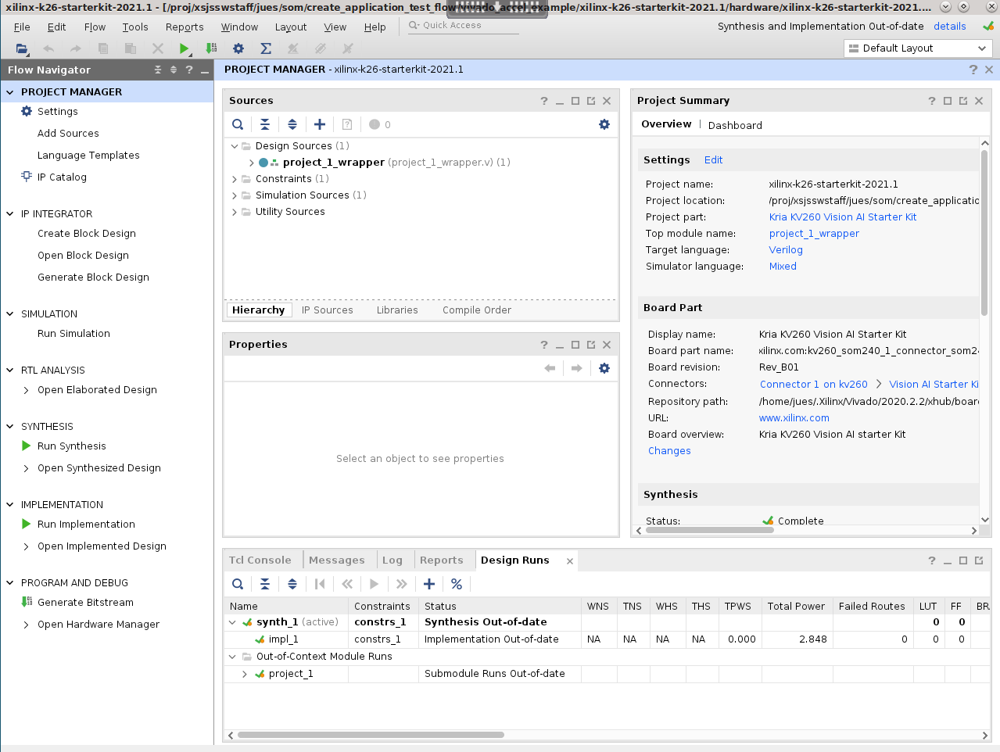

2. Click **Open Block Design**. A preconfigured ```zynq_ultra_ps_e_0``` block displays.
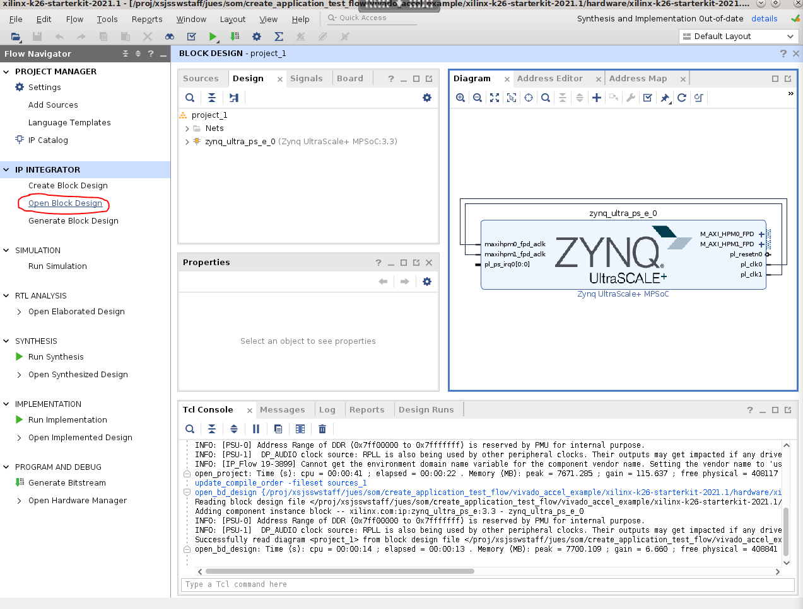

3. In block design, click on the **+** sign, and add an ```AXI BRAM Controller```.
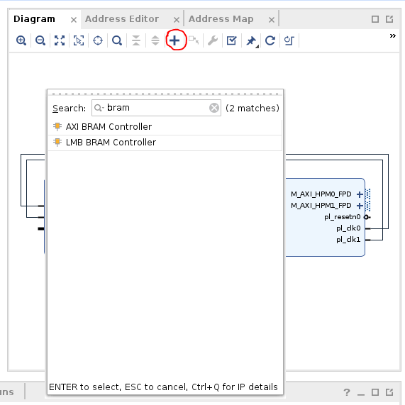

4. Click **Run Connection Automation**, and connect ```S_AXI``` of ```axi_bram_ctrl_0``` to ```M_AXI_HPM0_FPD``` of ```zynq_ultra_ps_e_0```.
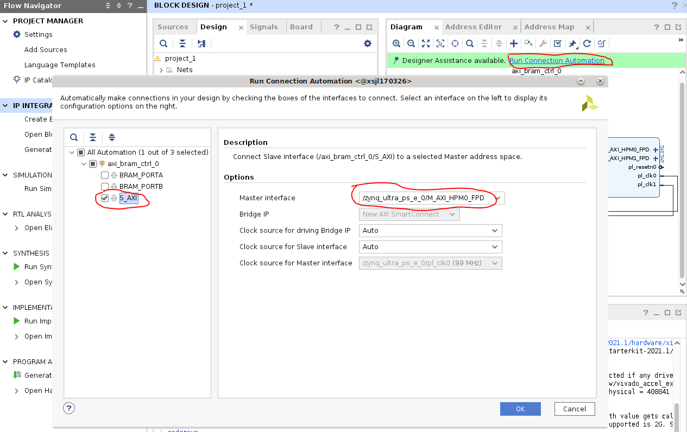

5. Double click the **```axi_bram_ctrl_0 block```**, and change the Number of BRAM interfaces to 1.
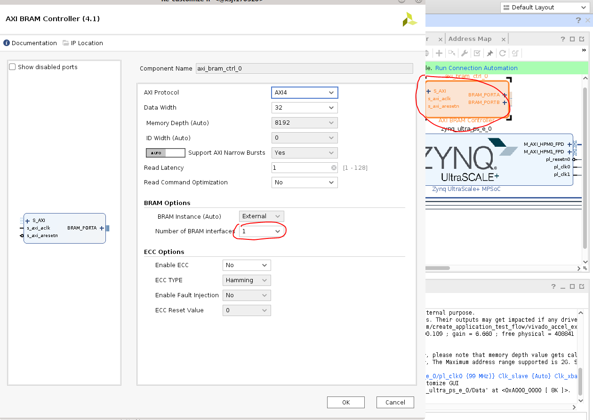

6. Double click the **```zynq_ultra_ps_e_0 block```**, navigate to ```PS-PL Configuration```, and deselect the **```AXI HPM1 FPD```** interface because it is unused.
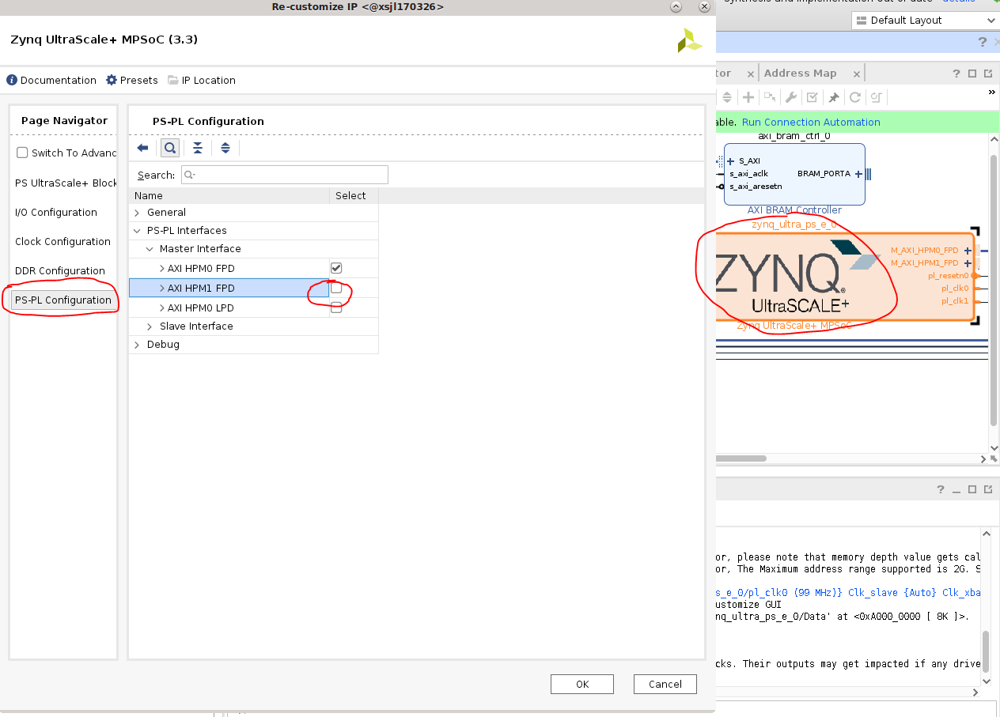

7. Click **Run Connection Automation** again, and connect ```BRAM_PORTA``` of ```axi_bram_ctrl_0``` to a new block RAM.
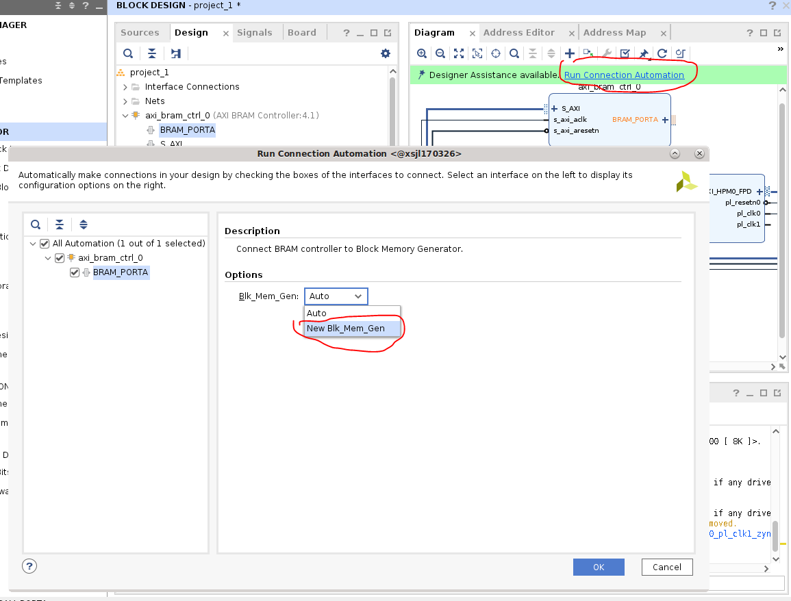

    Now your block design should look similar to the following screenshot:
    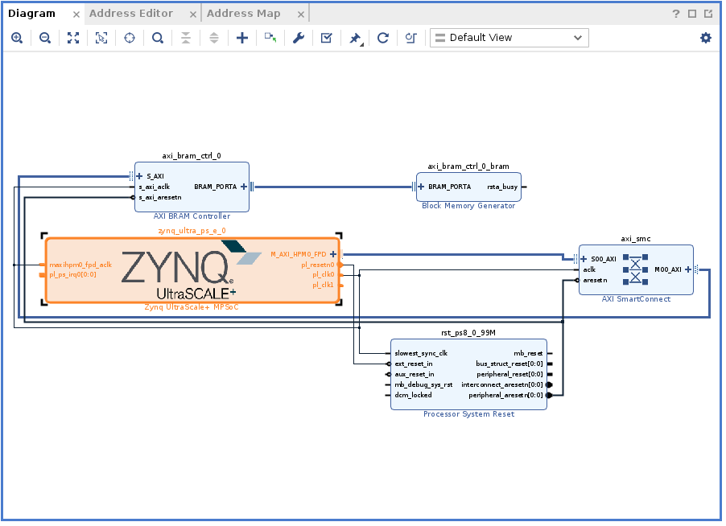

8. Check the address map to see that bram is mapped to 0xa0000000. Because you chose HPM0, you need this address to test access to bram later:
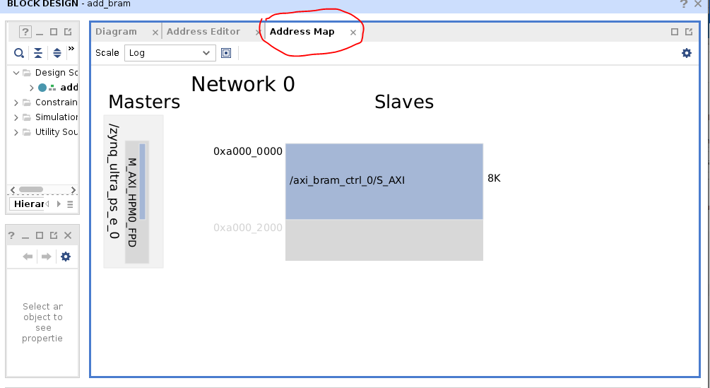

9. By default Vivado generates a .bit file. Select **Settings** -> **Bitstream** -> **-bin_file**, so a .bin file is also generated.
 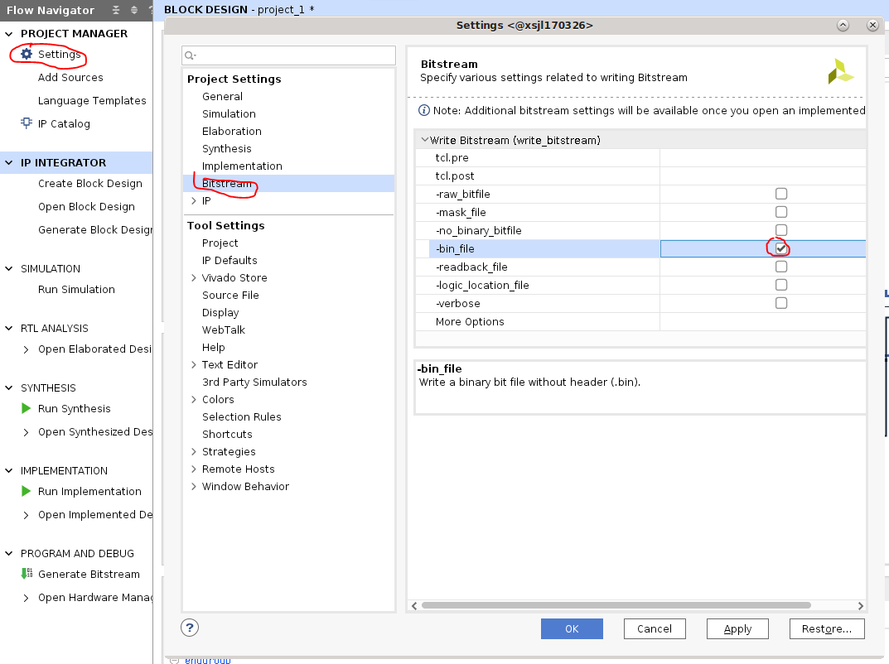

10. To generate the .bin file, click  **Generate Bitstream**.
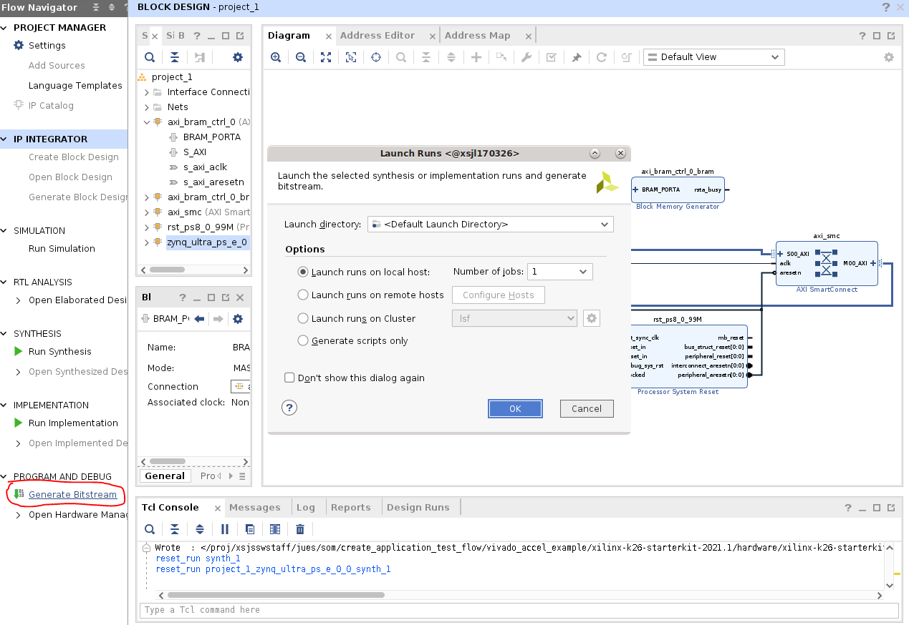

11. Copy the generated .bin file to top level. Use the name ```bram``` for this simple application:

    ```bash
    cp xilinx-<board>-<version>.runs/impl_1/project_1_wrapper.bin bram.bit.bin
    ```

## Generate .xsa file

A .xsa file is needed for generation of .dtbo device tree overlay file in the next step. This is also generated in Vivado by by selecting **File** -> **Export** -> **Export Hardware**. Make sure to select **include bitstream** in the generation.


## Generate .dtbo file

1. In this example, use the first method in [Generating DTSI and DTBO Overlay Files](./dtsi_dtbo_generation.md) to generate the .dtbo file needed.

    In XSCT, generate the dts files needed using ```project_1_wrapper.xsa``` created in the previous step:

    ```text
    xsct% hsi open_hw_design project_1_wrapper.xsa
    xsct% hsi set_repo_path <path to device-tree-xlnx repository>
    xsct% hsi create_sw_design device-tree -os device_tree -proc psu_cortexa53_0
    xsct% hsi set_property CONFIG.dt_overlay true [hsi::get_os]
    xsct% hsi generate_target -dir bram_dts
    xsct% hsi close_hw_design project_1_wrapper
    xsct% exit
    ```

2. Then compile .dtsi to binary .dtbo using DTC:

    ```bash
    cd bram_dts/
    dtc -@ -O dtb -o pl.dtbo pl.dtsi
    cd ../
    cp bram_dts/pl.dtbo bram.dtbo
    ```

## Create the `shell.json` file

To create a `shell.json XRT_FLAT` file, refer to [On-target Utilities and Firmware](./target.md).

## Test on SOM Target

Now you have `bram.bit.bin`, `bram.dtbo`, and `shell.json` files. You are ready to move them to SOM Starter Kit and test them. It is assumed that you already booted to Linux using the prebuilt .wic images provided [here](https://xilinx-wiki.atlassian.net/wiki/spaces/A/pages/1641152513/Kria+K26+SOM#Starter-Kit-Pre-Built-Binaries).

Move the files over using your preferred method; this example uses scp to move over the files to target.

 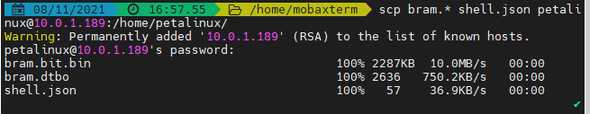

On SOM's Linux command prompt, create a folder, copy over the files, and check that the new application shows up in listapps:

```bash
sudo mkdir /lib/firmware/xilinx/bram
sudo cp bram.* shell.json /lib/firmware/xilinx/bram/
sudo xmutil listapps
```

 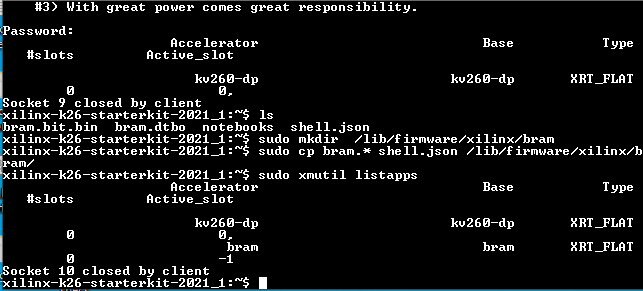

Observe that before the BRAM application is loaded, access to 0xa0000000 (the BRAM location that you obtained in Vivado) is not successful, but after loading the BRAM app, you are be able to read and write to 0xa0000000.

```bash
sudo xmutil unloadapp
sudo xmutil loadapp bram
sudo devmem 0xa0000000 32
sudo devmem 0xa0000000 32 0xdeadbeef
sudo devmem 0xa0000000 32
```

 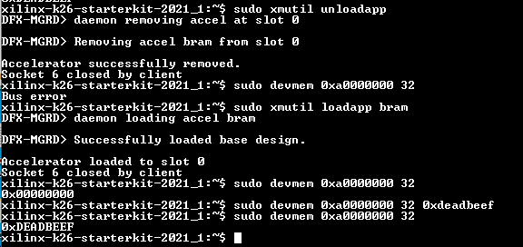

<hr class="sphinxhide"></hr>

<p class="sphinxhide" align="center"><sub>Copyright © 2023-2025 Advanced Micro Devices, Inc.</sub></p>

<p class="sphinxhide" align="center"><sup><a href="https://www.amd.com/en/corporate/copyright">Terms and Conditions</a></sup></p>