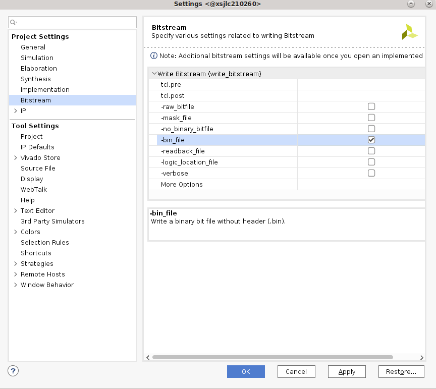

# Vivado Accelerator Flow

Developers prefer a traditional HW design flow can generate their PL designs using Vivado. In this flow developers start from the Kria SOM starter kit board files in Vivado and implements their own PL design in Vivado to generate a .xsa file and bitstream. The resulting .xsa file is used to generate the device tree overlay. Once the PL design (.bit.bin) and HW/SW interface definition (.dtbo) files are created, they can be copied into the target and managed by dfx-mgr.

* Assumption: AMD built carrier cards with corresponding SOM Starter Kit board file
* Input: SOM Starter Kit board files (in Vivado) or Vivado project released with SOM BSP, developer's own accelerator designs in Vivado
* Output: .dtbo, .bit.bin

A step by step example for adding a simple accelerator using this flow can be found [here](./vivado_accel_example.md) after developers have finished reading through this guide.


## Prerequisites and Assumptions

This document assumes that developers will use 2021.1 or later tools and SOM content releases. The tool versions should match - e.g. use the same tool versions for released BSP, Vivado, as well as PetaLinux and/or Ubuntu. For Ubuntu version, refer to table in [wiki](https://xilinx-wiki.atlassian.net/wiki/spaces/A/pages/1641152513/#Ubuntu-LTS).

1. Vivado tools installation
2. Tool for generating and/or compiling .dtbo file:

     a. PetaLinux tools installation or
     b. [XSCT](https://www.xilinx.com/html_docs/xilinx2021_1/vitis_doc/XSCT.html) (will be installed as part of Vivado or Vitis)
3. (Optional) PetaLinux [SOM Starter Kit BSP download](https://xilinx-wiki.atlassian.net/wiki/spaces/A/pages/1641152513/#PetaLinux-Board-Support-Packages)

## Step 1 - Aligning Kria SOM boot & SOM Starter Linux infrastructure

AMD built Kria SOM Starter Kit applications on a shared, application-agnostic infrastructure in the SOM Starter Linux including kernel version, Yocto project dependent libraries, and baseline BSP. When using this tutorial, make sure to align tools, git repositories, OS and BSP released versions.

### PetaLinux BSP Alignment

The SOM Starter Linux image is generated using the corresponding SOM variant multi-carrier card PetaLinux board support package (BSP). Developers creating applications on the Starter Kit are recommended to use this BSP as a baseline for their application development as it ensures kernel, Yocto project libraries, and baseline configuration alignment. The multi-carrier card BSP defines a minimalistic BSP that has the primary function of providing an application-agnostic operating system, and can be updated and configured dynamically at runtime.

## Step 2 - Generate a new custom PL design using Vivado

There are two ways to get started designing PL design for SOM Carrier cards. Developers can either start with the Vivado board file, or the released Vivado starter project in BSP.

### Vivado board file

This flows starts with Vivado board files containing information on K26, K24, KV260 CC, KR260 CC, KD240. The K26/K24 SOM is supported in Vivado with board files that automate the configuration of the SOM based peripherals. These board files are available in Vivado's board list in "Create Project" wizard.

Refer to [Wiki](https://xilinx-wiki.atlassian.net/wiki/spaces/A/pages/1641152513/#Vivado-Board-Support-Packages) for a list of board files required, tool versions that support them and how to download them from XHUB store correctly.

Details of how to generate a Vivado design from board file can be found [here](./Generate_vivado_project_from_boardfile.md).

### Vivado Starter Project in BSP

Alternatively, developers can start from the Vivado project provided in the BSP file.
First, download the SOM Starter Kit BSP from the [SOM Wiki](https://xilinx-wiki.atlassian.net/wiki/spaces/A/pages/1641152513/#PetaLinux-Board-Support-Packages)
Then create the project using BSP:

```shell
petalinux-create -t project -s xilinx-<board>-<version>.bsp
cd xilinx-<board>-<version>
```

The Vivado starter project can be found in ```hardware/``` folder, and developers can open the project using the .xpr file. If using a K26/K24 bsp, the project is a K26/K24 project only, and will not contain any information about the carrier card being used. However, it does have enough information to boot basic Linux. If using a KV260 Starter Kit, KR260 Starter Kit or KD240 Starter Kit bsp, then the project contains information on the CC.

In 2022.1 or later, those project will also be available in [github repo](https://github.com/Xilinx/kria-base-hardware) for those who do not wish to use PetaLinux.

### Generate .bit.bin and .xsa file

Please refer to Vivado documentation to add custom IP blocks into your design and generate a .xsa file and a binary bitstream (.bin file converted .bit.bin file). In order to generate a binary bitstream (.bin) file, go to Tools -> setting and enable -bin_file, and rename the generated .bin file to .bit.bin.



An updated .xsa file needs to be generated by using File -> Export -> Export Hardware , make sure to select "include bitstream" in the generation.


To access the example KV260 Vivado reference design, developers can follow the steps in the [Using Vivado to Build the Hardware Design](https://xilinx.github.io/kria-apps-docs/kv260/2022.1/build/html/docs/build_vivado_design.html) tutorial.

To access the example KR260 Vivado reference design, developers can follow the steps in the [Using Vivado to Build the Hardware Design](https://xilinx.github.io/kria-apps-docs/kr260/build/html/docs/build_vivado_design.html) tutorial.

To access the example KD240 Vivado reference design, developers can follow the steps in the [Using Vivado to Build the Hardware Design](https://xilinx.github.io/kria-apps-docs/kd240/build/html/docs/build_vivado_design.html) tutorial.

## Step 3 - Compile a device tree overlay blob (.dtbo)

If using PL loading post Linux boot, then a DT overlay is required to add the HW/SW interfaces to the initial Linux booted device tree. For creating the DT overlay please refer to [dtsi_dtbo_generation](./dtsi_dtbo_generation.md) page.

## Step 4 - Move user application to the target platform

After generating the PL design, developers will need to move the required files (.bit.bin, .dtbo, cred.json, and .xclbin for Vitis flow) to target platform into the proper area. Please see [On-target Utilities and Firmware](./target.md) for where to place the application firmware files.

## Step 5 - Run the user application

Once the required files are in place, developers can run their applications. They should:

* Use xmutil or dfx-mgr to load the application bitstream
* Start their application software

## Example

A step by step example for adding a simple accelerator using this flow can be found [here](./vivado_accel_example.md) after developers have finished reading through this guide.

## License

Licensed under the Apache License, Version 2.0 (the "License"); you may not use this file except in compliance with the License.

You may obtain a copy of the License at
[http://www.apache.org/licenses/LICENSE-2.0](http://www.apache.org/licenses/LICENSE-2.0)

Unless required by applicable law or agreed to in writing, software distributed under the License is distributed on an "AS IS" BASIS, WITHOUT WARRANTIES OR CONDITIONS OF ANY KIND, either express or implied. See the License for the specific language governing permissions and limitations under the License.

<p class="sphinxhide" align="center">Copyright&copy; 2023 Advanced Micro Devices, Inc</p>