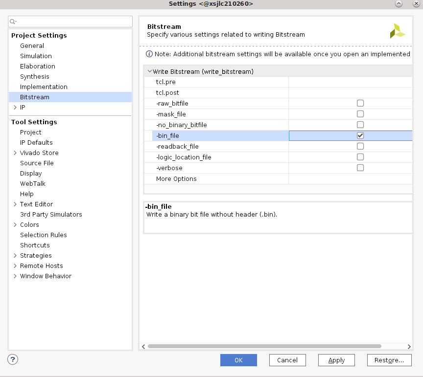

# Vivado Accelerator Flow

If you prefer a traditional hardware design flow, you can generate your PL designs using Vivado. In this flow, start from the Kria SOM starter kit board files in Vivado, and implement your own PL design in Vivado to generate a .xsa file and bitstream. The resulting .xsa file is used to generate the device tree overlay. Once the PL design (`.bit.bin`) and hardware/software interface definition (.dtbo) files are created, you copy them into the target and manage them with dfx-mgr.

* Assumption: AMD built carrier cards with corresponding SOM Starter Kit board file
* Input: SOM Starter Kit board files (in Vivado) or Vivado project released with SOM BSP, your own accelerator designs in Vivado
* Output: .dtbo, `.bit.bin`

A step by step example for adding a simple accelerator using this flow can be found [here](./vivado_accel_example.md).

## Prerequisites and Assumptions

This document assumes that you use 2021.1 or later tools and SOM content releases. The tool versions should match. that is, use the same tool versions for released BSP, Vivado, as well as PetaLinux and/or Ubuntu. For Ubuntu versions, refer to table in the [Wiki](https://xilinx-wiki.atlassian.net/wiki/spaces/A/pages/1641152513/#Ubuntu-LTS).

1. Vivado tools installation
2. Tool for generating and/or compiling .dtbo file:

     a. PetaLinux tools installation or
     b. [XSCT](https://docs.amd.com/go/en-US/ug1400-vitis-embedded/Software-Command-Line-Tool) (installed as part of Vivado or Vitis)
3. (Optional) PetaLinux [SOM Starter Kit BSP download](https://xilinx-wiki.atlassian.net/wiki/spaces/A/pages/1641152513/#PetaLinux-Board-Support-Packages)

## Step 1 - Aligning Kria SOM boot & SOM Starter Linux infrastructure

AMD built Kria SOM Starter Kit applications on a shared, application-agnostic infrastructure in the SOM Starter Linux including kernel version, Yocto project dependent libraries, and baseline BSP. When using this tutorial, make sure to align the tools, git repositories, OS, and BSP released versions.

### PetaLinux BSP Alignment

The SOM Starter Linux image is generated using the corresponding SOM variant multi-carrier card PetaLinux board support package (BSP). If you are creating applications on the Starter Kit, use this BSP as a baseline for your application development as it ensures kernel, Yocto project libraries, and baseline configuration alignment. The multi-carrier card BSP defines a minimalistic BSP that has the primary function of providing an application-agnostic operating system and can be updated and configured dynamically at runtime.

## Step 2 - Generate a New Custom PL Design Using Vivado

There are two ways to get started designing PL design for SOM Carrier cards. Start with either the Vivado board file, or the released Vivado starter project in BSP.

### Vivado Board File

This flows starts with Vivado board files containing information on K26, K24, KV260 CC, KR260 CC, and KD240. The K26/K24 SOM is supported in Vivado with board files that automate the configuration of the SOM based peripherals. These board files are available in Vivado's board list in the "Create Project" wizard.

For a list of board files required, tool versions that support them and how to download them from XHUB store correctly, refer to the [Wiki](https://xilinx-wiki.atlassian.net/wiki/spaces/A/pages/1641152513/#Vivado-Board-Support-Packages).

Details of how to generate a Vivado design from board file can be found [here](./Generate_vivado_project_from_boardfile.md).

### Vivado Starter Project in the Vivado Example Project

Alternatively, an example project from Vivado (2024.2 and later) can be used. For details about how to generate a Vivado design from a Vivado example design, refer to [this tutorial](./Generate_vivado_project_from_CED.md).

### Generate the .bit.bin and .xsa Files

To add custom IP blocks into your design and generate a .xsa file and a binary bitstream (.bin file converted `.bit.bin` file), refer to the Vivado documentation. To generate a binary bitstream (.bin) file, navigate to **Tools** -> **setting**, enable `-bin_file`, and rename the generated .bin file to `.bit.bin`.

Generate an updated .xsa file. Select *File* -> **Export** -> **Export Hardware**, and make sure to select **include bitstream** in the generation.

To access the example KV260 Vivado reference design, follow the steps in the [Using Vivado to Build the Hardware Design](https://xilinx.github.io/kria-apps-docs/kv260/2022.1/build/html/docs/build_vivado_design.html) tutorial.

To access the example KR260 Vivado reference design, follow the steps in the [Using Vivado to Build the Hardware Design](https://xilinx.github.io/kria-apps-docs/kr260/build/html/docs/build_vivado_design.html) tutorial.

To access the example KD240 Vivado reference design, follow the steps in the [Using Vivado to Build the Hardware Design](https://xilinx.github.io/kria-apps-docs/kd240/build/html/docs/build_vivado_design.html) tutorial.

## Step 3 - Compile a Device Tree Overlay Blob (.dtbo)

If using PL loading post Linux boot, then a DT overlay is required to add the hardware/software interfaces to the initial Linux booted device tree. For creating the DT overlay please refer to the [dtsi_dtbo_generation](./dtsi_dtbo_generation.md) page.

## Step 4 - Move the User Application to the Target Platform

After generating the PL design, you need to move the required files (`.bit.bin`, .dtbo, `cred.json`, and .xclbin for the Vitis flow) to target platform into the proper area. For information on where to place the application firmware files, refer to [On-target Utilities and Firmware](./target.md).

## Step 5 - Run the user application

Once the required files are in place,  run your application:

* Use xmutil or dfx-mgr to load the application bitstream
* Start your application software

## Example

A step by step example for adding a simple accelerator using this flow can be found [here](./vivado_accel_example.md) after developers have finished reading through this guide.

Copyright © 2023-2025 Advanced Micro Devices, Inc.

<a href="https://www.amd.com/en/corporate/copyright">Terms and Conditions</a>
