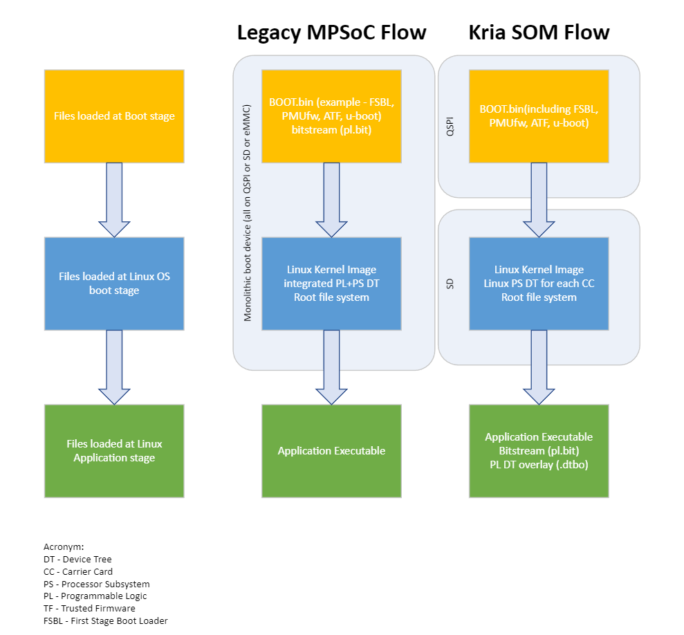

# Bitstream Management on Kria SOM

The Kria Starter Ktis are deployed with primary and secondary boot devices to isolate core boot FW and the operating system. In Kria multiple application bitstreams are enabled without forceing OS reboots by managing bitstreams as a dynamic SW component within the Linux OS. This approach is different from Xilinx legacy MPSoC evaluation platforms that have used a monolithic boot device and managing the bitstream as a boot time component. This page provides a comparison of the dynamic bitstream management in Kria Starter Kit Linux to the legacy MPSoC evaluation board flow.

The following diagram summarizes the difference, and the table that follows details the difference.

| Topic | Legacy MPSoC Flow | Kria SOM Flow |
|------------------------|--------------------------------------------------|--------------------------------------------------|
| Bitstream Management | The majority of previous MPSoC examples focused on bitstream being loaded prior to the boot of the operating system and maintaining a static HW/SW interface for all application within that booted OS. This means that the bistream is loaded prior to Linux booting and its device tree was loaded as part of the Linux boot device tree.                   | The Kria Starter Kit focuses on dynamic post-Linux boot bitstream management. This enables an application-agnostic boot FW that does not include any bitstream. The bitstream is instead managed within the Linux file system and swapped dynamically at runtime using xmutil/dfx-mgr. The loading of the bitstream needs to be accompanied by its HW/SW interface definition which is appended to the booted Linux device tree (DT) through a Linux DT-overlay.  Thus bitstreams being managed dynamically require both the bitstream (`*.bit.bin`) and DT-overlay (`*.dtbo`) files. The [on target utility](./target.md) has information and pointers to bitstream management by xmutil/dfx-mgr |
| Bitstream Generation | Majority of MPSoC legacy examples focused on generation of the MPSoC device configuration (e.g. PCW MIO configs) and the PL bitstream as a monolithic configuration generation. This was then used to generate entire set of boot FW artifacts (FSBL, PL, PMU, ...) with every build.  | Kria Starter Kit focuses on an incremental HW configuration. This means that at the time of a new PL design, the user only needs to generate the new bitstream (within the constraints of not changing other device configurations such as MIO assignments) and do not need to re-generate a new BOOT.BIN since the bitstream is managed outside the BOOT.BIN container. The user will use the resulting bitstream file and generate a corresponding DT overlay, both of which are later copied to the Linux file system to be loaded by xmutil/dfx-mgr. This [series of doc](https://xilinx.github.io/kria-apps-docs/creating_applications/2022.1/build/html/index.html) details the process to generate the overlay design, and [On-target Utilities](./target.md) have more information on xmutil/dfx-mgr.  |
| Boot Segmentation    | Legacy MPSoC examples focus on a monolithic boot device (e.g. QSPI or SD card or eMMC). In this flow all FW content is managed and searched by CSU ROM within the same physical device.                                                                                                | Kria Starter Kit uses a primary/secondary boot architecture to functionally segment the core boot FW from the OS image. They are detailed in [BootFW](https://xilinx.github.io/kria-apps-docs/bootfw/build/html/docs/bootfw_overview.html) page. The QSPI device serves as the primary boot device containing the platform BOOT.BIN which contains FSBL, PMU FW, and U-Boot. The SD card device serves as the secondary boot device containing the Linux OS artifacts include the kernel and rootfs. This allows for the platform to boot multiple Linux OS images without a user having to build or modify the core boot FW. A user can update the boot FW of QSPI with their own custom BOOT.BIN, and do this using the xmutil boot image update utility. U-Boot is used to support the hand-off between QSPI and the SD card based secondary boot device.  (See K26 SOM XSA & BSP Overview for reference) |
| Dynamic MIO          | Legacy MPSoC designs used a static MIO configuration which locks in the configuration of the PS subsystem physical I/O at device boot time.                | The Kria Starter Kit references use an incremental HW configuration capability of PMU in order to support dynamic configuration of carrier card specific MIO (KV260 vs. KR260). This allows for a common boot FW which identifies the carrier card via the BoardID EEPROM and then U-Boot incrementally configures the corresponding CC card specific MIOs. Read more in [PMU Overlay Config Object](https://xilinx.github.io/kria-apps-docs/bootfw/build/html/docs/bootfw_pmu_config_obj.html)                       |

Note that the dynamic bitstream managment described here is how AMD-Xilinx is deploying and managing the Kria Starter Kit pre-built OS and application designs. For production Kria SOM developers, they have full freedom to use the combination of boot partitioning and bitstream managment that matches their application requirements.

## License

Licensed under the Apache License, Version 2.0 (the "License"); you may not use this file except in compliance with the License.

You may obtain a copy of the License at
[http://www.apache.org/licenses/LICENSE-2.0](http://www.apache.org/licenses/LICENSE-2.0)

Unless required by applicable law or agreed to in writing, software distributed under the License is distributed on an "AS IS" BASIS, WITHOUT WARRANTIES OR CONDITIONS OF ANY KIND, either express or implied. See the License for the specific language governing permissions and limitations under the License.

Copyright&copy; 2021 Xilinx

