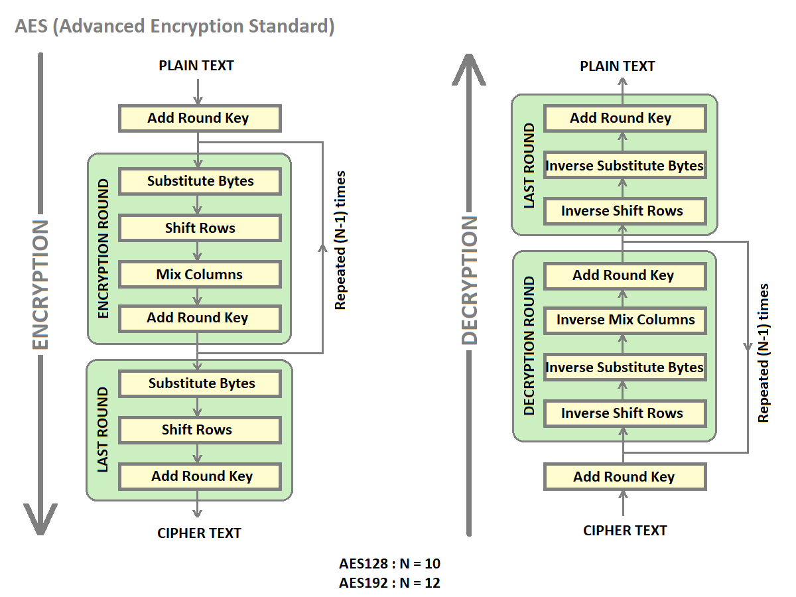
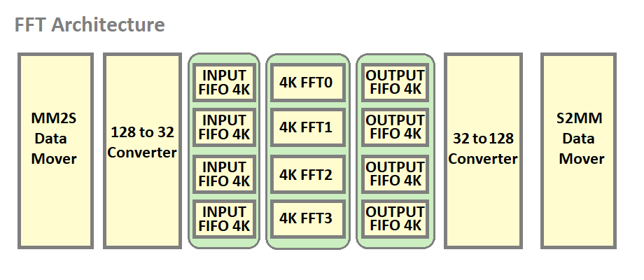
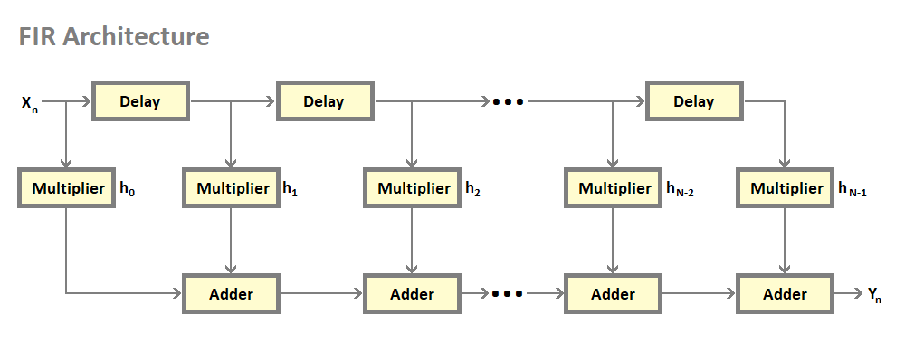
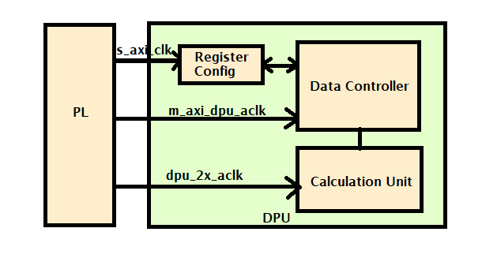
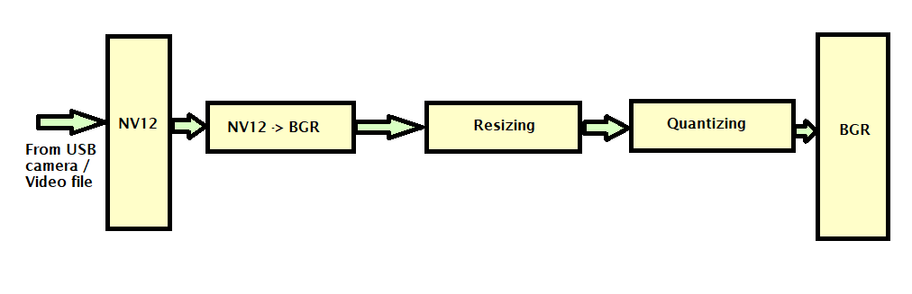

# Kria SOM DFX Accelerators

This page provides a technical overview of the Kria SOM DFX example accelerators and considerations to develop applications for these accelerators. The accelerators have an AXIS interface and make use of AXIS [virtual channels](./Kria_DFX_K26.html#rm_comm_box-virtual-channels), where TID = 0 is used for data packets and TID = 1 through 7 for control packets. When the accelerators have multiple AXIS input interfaces, each axis port is associated with a TID. [Data mover](./Kria_DFX_K26.html#rm_comm_box) transfers are set up using different TID values to feed data to the corresponding accelerator ports. [Accelconfig](./Kria_DFX_K26.html#accelconfig) IP that is part of the accelerator shell parses packets from data movers with different TID values and feeds to corresponding ports of the accelerator.

## AES

Two accelerators are provided for AES(Advanced Encryption Standard)- AES128 and AES192. AES accelerators provide both AES encryption and decryption engines in the same accelerator. The accelerator can work as an encryption or decryption engine based on the configuration of the software. They accept input data on an AXIS port and provide output data on an AXIS port.

## AES Application considerations

The accelerator uses two virtual channel IDs. The application should set up data transfers using the following TID values.

### AES Channel ID 0

The virtual channel with TID 0 is used to feed input data to the accelerator. This data is stored in DDR and data mover transfer with TID = 0 is used to feed it to the accelerator. The length of this transfer is equal to the size of the data file that needs encryption.

### AES Channel ID 1

The virtual channel with TID 1 is used to provide a key to the accelerator and also to select between the encryption and decryption engine.

AES128 uses 256 transfers on this virtual channel.

- Lower 128 bits constitute the key
- Least significant bit of the next 32 bits select between encryption and decryption engine.

AES192 uses 256 transfers on this virtual channel.

- Lower 192 bits constitute the key
- Least significant bit of the next 32 bits select between encryption and decryption engine.

### AES Features

- Single RM provides both Encrypt and Decrypt functionality.
- The encrypt or Decrypt function can be chosen by software configuration.
- The same key is used for both Encrypt and Decrypt engines.
- Built using the Vitis security AES library.
- In-built data mover uses two

## FFT4

FFT4(Fast Fourier transform) Application uses XFFT IP as a building block and creates a high throughput design catering to 1 GSPS sample rate. 4 FFT IPs are combined and wrapped with HLS data mover to achieve high bandwidth. 128 bit input data is scattered across 4 FFT IPs feeding 32-bit to each IP. Each FFT IP needs a unique AXIS port for configuration making a total of 4 configuration ports. The 32-bit output from each FFT IP is gathered and output on a 128-bit bus.

### FFT Accelerator Architecture Block Diagram

### FFT4 Features

- Channels: 4
- FFT Window: 4K
- Sampling Rate: 1GSPS
- Supported Sample resolution: 16 bit
- Support for the scaling factor
- Input Bus width: 128 bit
- Throughput: 22.32 Gbps

### FFT4 Application considerations

The FFT4 accelerator uses 5 virtual channel IDs. The application should set up data transfers using the following TID values.

### FFT4 Channel ID 0

The virtual channel with TID 0 is used to feed input data to the accelerator.

### FFT4 Channel ID 1

The virtual channel with TID 1 is used for the configuration of the first instance of FFT IP in the accelerator.

### FFT4 Channel ID 2

The virtual channel with TID 2 is used for the configuration of the second instance of FFT IP in the accelerator.

### FFT4 Channel ID 3

The virtual channel with TID 3 is used for the configuration of the third instance of FFT IP in the accelerator.

### FFT4 Channel ID 4

The virtual channel with TID 4 is used for the configuration of the fourth instance of FFT IP in the accelerator.

## FIR

FIR (Finite Impulse Response) accelerator makes use of Vivado catalog IP FIR compiler and provides various modes of operation like Low Pass Filter(LPF), High Pass Filter(HPF), and Band Pass Filter(BPF). The number of coefficients is set to 80 for the 159-order filter. For reload, with the inferred option only half of the coefficients are provided.

### FIR Features

- Single Rate FIR with four parallel 16bit input samples.
- Support for 12,13,14 and 15 binary point input data.
- Sampling Frequency supported - 1 GSPS.
- The Reload port enables to change the filter coefficients thereby filtering functionality.
- 174 cycle latency.
- 159 symmetric integer 16-bit coefficients support.

### FIR Application considerations

The FIR accelerator uses 4 virtual channel IDs. The application should set up data transfers using the following TID values.

### FIR Channel ID 0

The virtual channel with TID 0 is used to feed input data to the accelerator. Only 64 bits from inout data is fed to the accelerator. The number of input bits is decided upon by the clock frequency and sampling frequency ratio.

### FIR Channel ID 1

The virtual channel with TID 1 is used to feed RELOAD data to the FIR compiler.

### FIR Channel ID 2

The virtual channel with TID 2 is used to feed CONFIG data to the FIR compiler.

### FIR Channel ID 3

The virtual channel with TID 3 is used to configure the input data binary width of the FIR compiler.

## DPU 

### DPU Features

- DPU(Deep Learning Processor Unit) is a PL IP optimized for Convolutional neural networks.
- The DPU generates an interrupt to signal the completion of a task.
- DPU 512 Architecture is selected according to available URAMs & BRAMs in the slot.  
- Single-core is enabled because of resource limitations in the slot.
- The JSON file is used to generate the xmodel files used by 512 DPU arch.

Vitis AI 2.5.0 is the core underlying component to access the AI inference capability provided by Xilinx DPU.
The dfx-ml-inference pipeline uses both DPU and PP_PIPELINE RM. 
Pipeline flow steps are described below- '

- VCU decode the input H264 file to NV12 format. 
- PP_PIPELINE RM block resizes, quantizes, and converts the NV12 to BGR. The preprocessing processes the input as per the ML model selected.
- DPU does the AI inference based on the model selected and generates the bounding box data.
- The output of DPU goes to the metaaffixer plug-in.
- Meta Affixer scales the bounding box data received wrt the resolution of vcu decoded output.
- Bounding box draws the results around the objects of interest. The output is then sent to the display monitor. 

## PP Pipeline 

### PP Pipeline Features

- Cvtcolor, changing NV12 color format to BGR
- Resizing, scaling down original 1080p frame to at most 720x720
- Quantizing, and performing linear transformation to satisfy the DPU input requirement
- Vitis libraries used- cvtcolor, resize, and preprocess

- Different ML models used by the DPU have different preprocessing requirements.
- This pp_pipeline(Pre-processing pipeline) IP is used for the three models - facedetect, refinedet and ssd that have the same preprocessing functions requirement.
- Pp_pipeline accelerator IP performs resizing, scaling, and format conversion on the input file. 

## License

Licensed under the Apache License, Version 2.0 (the "License"); you may not use this file except in compliance with the License.

You may obtain a copy of the License at
[http://www.apache.org/licenses/LICENSE-2.0](http://www.apache.org/licenses/LICENSE-2.0)

Unless required by applicable law or agreed to in writing, software distributed under the License is distributed on an "AS IS" BASIS, WITHOUT WARRANTIES OR CONDITIONS OF ANY KIND, either express or implied. See the License for the specific language governing permissions and limitations under the License.

Copyright&copy; 2021 Xilinx

