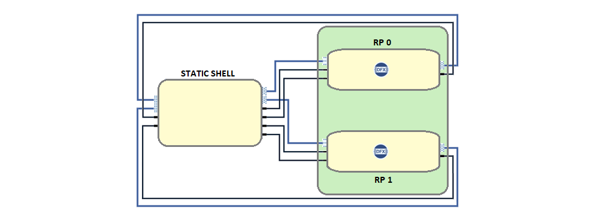

# Dynamic Function eXchange (DFX)

The AMD-Xilinx Dynamic Function eXchange (DFX) is a technology that enables an incremental and partitioned hardware configuration of a programmable device. Details on DFX capabilities within the Vivado tool are available at this [link](https://www.xilinx.com/products/design-tools/vivado/high-level-design.html#dfx). In PL/FPGA-based DFX this enables a concept of reconfigurable partitions (RP) and reconfigurable modules (RM). The RP provides a pre-provisioned HW space allocation within which different RMs can be loaded dynamically. The system and solution capabilities of the DFX incremental HW configuration enable:

• Partitioned designs allowing one part of the system to be changed (reconfigured) while another part of the system remains running.

• “Slotted” architecture allowing for dynamically composable HW systems without having to recompile a monolithic configuration bitstream file.

• Decoupled life cycles for PL-based functions, facilitating a reconfigurable module (RM) to be deployed to the field later without having to update or rebuild the base platform design.  

This Kria example design demonstrates the implementation of a dual slot (2 RP) design with multiple dynamic PL accelerated functions. In the design, the RP “slots” are homogenous in footprint allowing for any of the accelerated libraries to be loaded to any slot. In the 2-slot reference design, this provides an ability to dynamically compose any combination of PL accelerated functions based on the needs of the user without having to recompile the PL design.

This page outlines a user flow from initially getting started, a technical overview of the implementation, and steps for building both hardware and software components of the design from the source. Lastly, the example design base or shell is implemented with the intention for user to be able to create their own HW accelerator RM and application.

## DFX Hardware Design

Using DFX, the Kria K26 shell is carved into a static region and DFX regions called reconfigurable partitions(RP). The RP region(s) of the fabric can be dynamically reprogrammed with different functions, called reconfigurable modules(RMs), while the static region of the design cannot be modified or reprogrammed. The DFX example design consists of 2 RPs, with four RMs added to each RP. When the design is built in Vivado, the following bit files will be built:

- Full bitstream - Bit file for the entire design, consisting of static and reconfigurable modules.
- Partial Bitstreams - One partial bit file for every RM BD added to each RP.

## Orchestration of Dynamically interchangeable Accelerators on the K26 board

This example design provides a proof-of-concept reference for making use of the AMD-Xilinx dynamic function exchange (DFX) technology. The DFX technology enables the FPGA to be split into virtual “slots” that can be reconfigured while leaving other parts of the FPGA functionality in place. A partial reconfiguration of the FPGA introduces several interesting system-level use cases for swapping functionality based on a system's mode of operation/mission phase as well as an ability to dynamically compose unique combinations of functionality when using a multi-slot base design.

The DFX on Kria examples provides two base designs with one implementing a single DFX slot and one implementing two DFX slots. Both base designs are supported with a common set of pre-defined HW acceleration libraries that can be loaded in combination with available DFX slots. The runtime management of the HW accelerator libraries is provided by the DFX Manager daemon (dfx-mgrd) also used in other example designs.

## Getting Started with Pre-Built DFX Examples for KR260 and KV260

For reference, a set of pre-built DFX-based accelerators and the corresponding applications for the K26 2RP design are provided. These example accelerated applications are: AES128, AES192, FFT, and FIR. These pre-built applications are implemented on the K26 SOM and can run on either the KV260 or KR260 Starter Kits.

- The AES128/AES192 application takes a set of data that is moved over to the AES128/AES192 accelerator. This data is first decrypted on the hardware and the data is sent back from the accelerator which is then compared to a golden reference.
- FFT application uses XFFT IP as a building block and creates a high throughput design catering to 1 GSPS sample rate. Four similar IPs are combined and wrapped with HLS data mover to achieve high bandwidth.
- FIR application tests the Finite Impulse Response digital filter used in DSP applications.

A detailed description of the example HW accelerators and test applications is available [here](./Accelerators_On_K26.md).

To get started with the example designs follow the instruction [here](./run_application_on_target.md).

## Building the Designs

The following section focuses on enabling users to leverage the DFX example design for creating their own derivative HW and SW solutions.

### Building a new Application for an Accelerator

For details on building and customizing application SW follow the steps outlined in this [page](./creation_of_new_RM_application.md).

### Building a new RM Accelerator HW

For details on the example DFX shell design, see this [overview](./Kria_DFX_K26.md).

For details on building and customizing PL designs and custom RMs follow the steps outlined in this [page](./creation_of_new_RM.md).

## DFX Example Design Repositories

- [kria-dfx-hw](https://github.com/Xilinx/kria-dfx-hw/tree/xlnx_rel_v2022.1) - Hardware Example Design
- [kria-apps-firmware](https://github.com/Xilinx/kria-apps-firmware/tree/xlnx_rel_v2022.1/k26-dfx/2rp) - Firmware
- [kria-dfx-apps](https://github.com/Xilinx/kria-dfx-apps/tree/xlnx_rel_v2022.1) - Accelerator applications

## License

Licensed under the Apache License, Version 2.0 (the "License"); you may not use this file except in compliance with the License.

You may obtain a copy of the License at
[http://www.apache.org/licenses/LICENSE-2.0](http://www.apache.org/licenses/LICENSE-2.0)

Unless required by applicable law or agreed to in writing, software distributed under the License is distributed on an "AS IS" BASIS, WITHOUT WARRANTIES OR CONDITIONS OF ANY KIND, either express or implied. See the License for the specific language governing permissions and limitations under the License.

Copyright&copy; 2021 Xilinx
