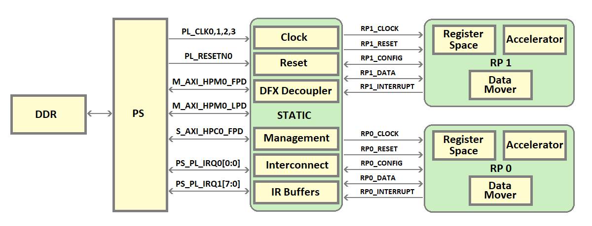
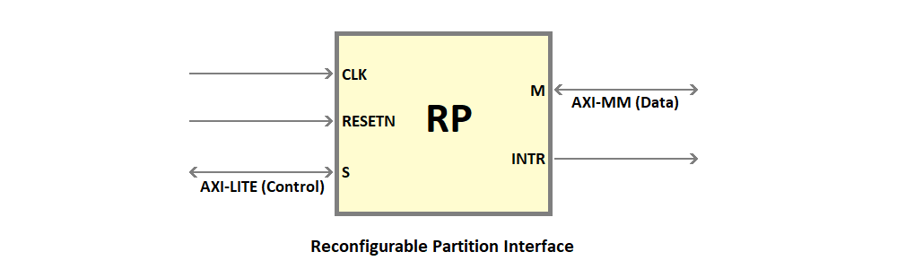
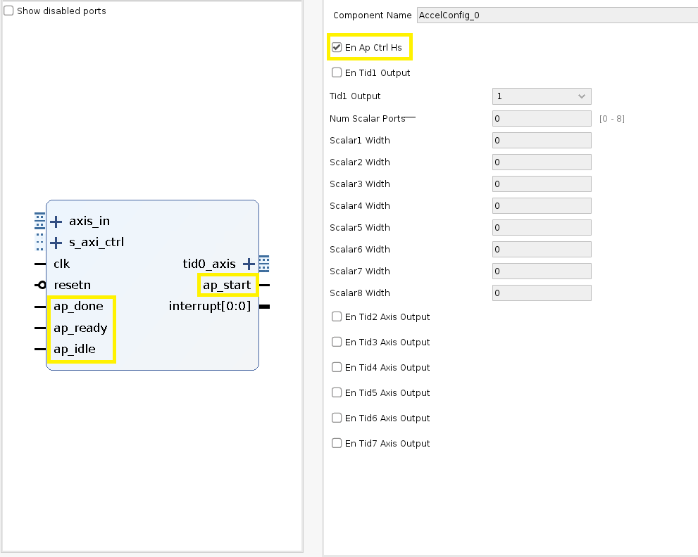
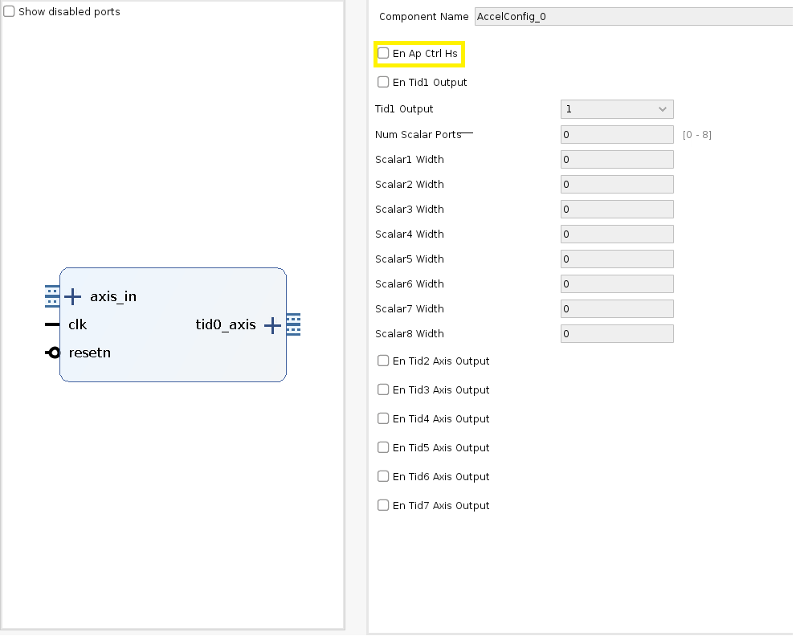
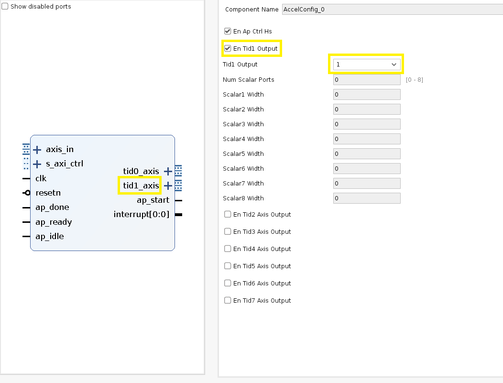
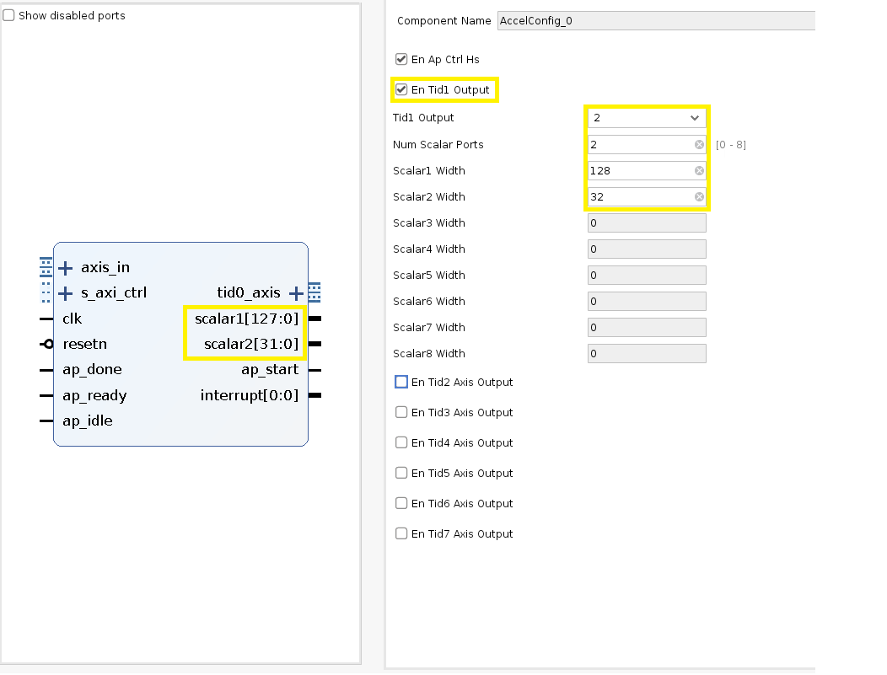
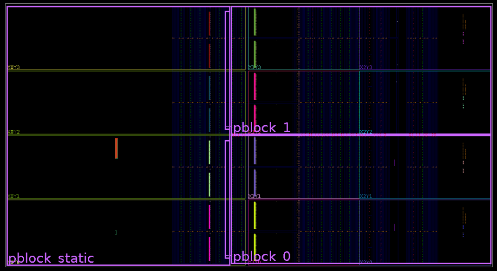

# Kria K26 DFX Example Hardware Design

This page provides an introduction to the Kria K26 DFX example hardware design.

## Overview


The shell in this example design uses a Xilinx solution called DFX, which allows for the reconfiguration of modules within an active design. Using DFX, the shell is carved into a static region and DFX regions called reconfigurable partitions(RP). The RP region(s) of the fabric can be dynamically reprogrammed with different functions, called reconfigurable modules(RMs), while the static region of the design cannot be modified or reprogrammed. A DFX region is carved out by drawing pblocks in Vivado.

The static region hosts the infrastructure blocks like PS, VCU, interconnect, reset, clocking, DFX decouplers, and platform management IPs. The reconfigurable partitions are used to host the accelerators, where each RP can run an accelerator. The static region acts as a bridge for accelerators to access PS resources. The RPs are carved out such that they are all homogeneous i.e., they have a similar area and the same number of logic resources.

The Vivado design uses Block Design Container(BDC), which allows one or more block designs(BDs) to be instantiated inside another block design. The number of BDCs depends on the number of reconfigurable partitions in the design, having a 1:1 correspondence.

When DFX is enabled on a BDC, the interface of all the BDs added to that BDC must be identical. A BD should be built for each RM and added to BDC.

The DFX example design shell consists of 2 reconfigurable partitions, hence 2 BDCs in the vivado design. This design can run two accelerators simultaneously.

4 accelerators are added to each BDC in the example design.
When the example design is built in Vivado, the following bit files are built.

- Full bitstream - Bit file for the entire design, consisting of static and the default reconfigurable modules.
- Partial Bitstreams - One partial bit file for every RM BD added to each BDC.
- XSA - The XSA of the HW design for software handoff.



## BDCs in DFX example design

In the DFX example design, 2 BDCs are corresponding to the 2 RPs on the device. 4 RM BDs(AES192, AES128, FFT, FIR) are loaded into each BDC. DFX rules are enabled on the BDC. When the hardware design is built, 4 partial bit file for each slot is built.

## Static Region

The static region is part of the device which will not be reconfigured. This portion of the shell is expected to remain programmed while different accelerators are programmed in the reconfigurable partitions of the DFX reference design shell.

The static region includes the PS, VCU, clocking, reset, DFX decoupling, and platform management IPs.

### Static Region Interfaces

The PL fabric of the static region acts as a bridge for RP regions to access PS resources and has interfaces with both PS and RPs.

#### PS - Fabric Interface in the static region

  | Port | Description |
  |----------|------------------------------------------------------|
  |pl_ps_irq0[0:0]|Interrupt input to PS. Driven by vcu_host_interrupt in the static region.|
  |pl_ps_irq1[7:0]| Interrupt input to PS. Driven from the RP. pl_ps_irq1[3:0] is driven by RP_0 and pl_ps_irq1[7:4] driven by RP_1.|
  |M_AXI_HPM0_FPD|32-bit AXI interface. PS is the master. Runs at 250 MHz. Used to configure bus.|
  |pl_clk0|250 MHz clock output from PS. Used to clock the logic in the static region of the design.|
  |pl_clk1|60 MHz clock output from PS. Used as VCU clock.|
  |pl_clk2|250 MHz clock output from PS. Used as input clock for reconfigurable partition RP_0.|
  |pl_clk3|250 MHz clock output from PS. Used as input clock for reconfigurable partition RP_1.|
  |pl_resetn0|Active low reset output from PS.|
  |S_AXI_HPC0_FPD|128-bit AXI-MM interface. Used by the reconfigurable partitions to access DDR/OCM memory. RP_0 and RP_1 are the master and PS is the slave. Runs at 250 MHz.|
  
#### Static - RP Interface

The static region has the following interface with each of the RPs (RP0 and RP1)

  | Port | Description |
  |----------|------------------------------------------------------|  
  |RP<0/1>_clk|The clock input to RP<0/1>.|
  |RP<0/1>_resetn|Active low reset input to RP<0/1>.|
  |RP<0/1>_config|32-bit AXI-lite port for configuration of RP<0/1>. RP is the slave. The traffic on these ports comes from M_AXI_HPM1_FPD.|
  |RP<0/1>_data|128-bit AXI4-MM port for data transfer from RP<0/1>. RP is the master, PS is the slave. The traffic from these ports goes to S_AXI_HPC0_FPD ports.|
  |RP<0/1>_interrupt|4-bit interrupt output from RP<0/1>.|

### Clocking

For most FPGA designs, a reference input clock is used to generate other required clocks in the design using PLL/MMCMs. The PLL/MMCMs are usually part of the static region. In this DFX example design, no PLL/MMCM is available in the static region. So, this design uses four clock outputs from PS.

- pl_clk0 drives the static region of the design @ 250 MHz.
- pl_clk1 drives the VCU block in the static region @ 60 MHz.
- pl_clk2 drives the reconfigurable partition RP_0 @ 250 MHz.
- pl_clk3 drives the reconfigurable partition RP_1 @ 250 MHz.

The clocks to the reconfigurable partitions are gated to reduce power utilization. The RP clocks are gated when the RM in the RP is not being used or during reconfiguration. The clock is ungated only after the RP is programmed with a partial bitstream. There are no BUFGCE cells in the static region of this example design shell. So, the BUFGCE_HDIO cell which is generally used to provide IO clock gating is used in the design for RP clock gating.

For more information on RP clock management, refer to [SIHA manager](#management-ip---siha-manager).

### Reset

The reset for the static region of the design is derived from pl_resetn0. Processor System reset modules are used to synchronize pl_resetn0 to each clock domain in the static region.

The reset for Reconfigurable partitions is controlled using the SIHA manager IP. The resets are controlled by programming registers in the SIHA manager IP. The RPs are kept under reset when the RM in the RP is not being used or during reconfiguration. After the RM is configured in the RP, the reset to the RP is released. For more information on RP reset management, refer to [SIHA manager](#management-ip---siha-manager).

### DFX Decoupler

DFX decoupler IP is used to provide logical isolation between static and RP regions during reconfiguration. A DFX decoupler is instantiated for each RP instance. The RP decoupling is handled by the SIHA manager IP by controlling the decouple input of the DFX Decoupler. For more information on RP decoupling, refer to [SIHA Manager](#management-ip---siha-manager).

The following signals between static and RPs are decoupled using a DFX decoupler.

- AXI-Lite bus used for configuration
- AXI4-MM bus used for data transfer
- Interrupts from RP to static
- Reset from static to RP.

### Management IP - SIHA manager

SIHA HW manager provides a standardized HW interface for a configurable number of DFX regions, allowing for a standardized SW driver (dfx-mgrd) to be created. SIHA HW manager controls the DFX decoupler IP, which provides a safe and managed boundary between static logic and reconfigurable partition during reconfiguration, configurable clock control for each partition, and standard control interface via AXI-Lite.

The IP can control up to 9 DFX slots. A set of registers are available for control of each slot. The base addresses of control registers associated with each slot are listed in the table below.

|Slot | Offset |
|-----|--------|
|Slot 1| 0x4000|
|Slot 2| 0x5000|
|Slot 3| 0x6000|
|Slot 4| 0x7000|
|Slot 5| 0x8000|
|Slot 6| 0x9000|
|Slot 7| 0xA000|
|Slot 8| 0xB000|
|Slot 9| 0xC000|

The details of the control registers associated with each slot is listed in the below table.

| Register | Offset | Description|
|-----------------|-------------------|----------------------------|
|Release slot decoupling | 0x0 |	RW	Control clock enable and decoupling of RP0. Writing '1' to this register will release RM clock isolation and disable the DFX decoupling of RP0.|
|Reset Control | 0x4 |	RW	Control reset for the slot. Writing '1' to this register will release the RM reset of RP0.|
|Cache-Control | 0x8	| RW	Control AXI AxCache attributes for the RP0 slot. Program the register with the required AxCache value.|
|Prot Control	 | 0xC	| RW	Control AXI AxPROT attributes for the RP0 slot. Program the register with the required AxProt value.|

### RM communication

DDR buffers are used by the RMs for reading and writing data. RMs can communicate with each other by sharing the DDR buffers.

## Reconfigurable partition

The regions in PL fabric where DFx is enabled. There are two reconfigurable partitions in the K26 Kria DFX shell.
Reconfigurable modules (RMs) can be programmed to this region of the PL fabric.
All RPs are homogeneous. They have the same size, area, and resources.
All RPs have a similar interface.


### RP Interface

| Port | Description |
|----------|------------------------------------------------------|  
|clk|The clock input to RP<0/1>.|
|resetn|Active low reset input to RP<0/1>.|
|A_AXI_CTRL|32-bit AXI-lite port for configuration of RP<0/1>. RP is the slave. The traffic on these ports comes from M_AXI_HPM1_FPD.|
|M_AXI_GMEM|128-bit AXI4-MM port for data transfer from RP<0/1>. RP is the master, PS is the slave. The traffic from these ports goes to S_AXI_HPC0_FPD ports.|
|interrupt|4-bit interrupt output from RP<0/1>.|  

### RP addressing

Each RP has fixed address apertures. When an RM is being created for an RP it should only use the addresses relevant to that RP.

#### RP_0 Addressing

| Port| Addresses| Range| Description|
|-----|----------|------|------------|
| S_AXI_CTRL | 0x8000_0000-0x81FF_FFFF| 32MB| AXI_lite slave interface|
| M_AXI_GMEM | 0x0000_0000-0x7FFF_FFFF <br> 0xC000_0000-0xDFFF_FFFF <br> 0xFF00_0000-0xFFFF_FFFF <br> 0x2_0000_0000-0x2_3FFF_FFFF <br> 0x2_8000_0000-0x2_BFFF_FFFF <br> 0x8_0000_0000-0xF_FFFF_FFFF | 2GB <br> 512MB <br> 16MB <br> 1G <br> 1G <br> 32G| AXI4-MM master interface|

#### RP_1 Addressing

| Port| Addresses| Range| Description|
|-----|----------|------|------------|
| S_AXI_CTRL | 0x82000000-0x83FFFFFF | 32MB| AXI_lite slave interface|
| M_AXI_GMEM | 0x0000_0000-0x7FFF_FFFF <br> 0xC000_0000-0xDFFF_FFFF <br> 0xFF00_0000-0xFFFF_FFFF <br> 0x2_0000_0000-0x2_3FFF_FFFF <br> 0x2_8000_0000-0x2_BFFF_FFFF <br> 0x8_0000_0000-0xF_FFFF_FFFF | 2GB <br> 512MB <br> 16MB <br> 1G <br> 1G <br> 32G| AXI4-MM master interface|

### RP Clocking

Each RP has a single clock input. The clock output(s) from the PS is the clock source.
The default RP clock frequency is 250 MHz. If a different clock frequency is required, the user can use SW functions to change the PS output clock frequency. If more clock frequencies are required, an MMCM/PLL can be instantiated in the RP.

On target run the following command to change the RP clock frequency

#### Set RP_0 clock frequency

```sudo sh -c 'echo RequiredFrequencyValue > /sys/devices/platform/fclk2/set_rate'```

Ex: ```sudo sh -c 'echo 300000000 > /sys/devices/platform/fclk2/set_rate'```

#### Set RP_1 clock frequency

```sudo sh -c 'echo RequiredFrequencyValue > /sys/devices/platform/fclk3/set_rate'```

### RP Reset

Each RP has a single active low reset input signal. The signal is passed to a 'Processor System Reset' IP to generate reset signals inside the RP.

### rm_comm_box

rm_comm_box is a data mover IP that has:

- AXI4-MM interface to read/write data from DDR/BRAM etc
- AXI-Stream output port to provide input to AXIS accelerators
- AXIS input to read data from AXIS accelerators.

It consists of two engines:

- mm2s - Reads data from a memory address using AXI-MM and provides the data on AXIS streaming output.
- s2mm - Reads data from AXIS input interface and writes to a destination address using AXI-MM interface.

#### rm_comm_box Interface

|Port | Description |
|-----|-------------|
|Clk  | Clock input|
|resetn | Active low reset input|
|s2mm_axis | AXIS input. The data read from this port is written to memory|
|s_axi_control| AXI-Lite control interface. Used to program the mm2s and s2mm engines|
|mm2s_axis | AXIS output. The data read from memory is forwarded on this port|
|m_axi_gmem| AXI-MM master interface. Connected to memory.|
|interrupt_s2mm| Interrupt associated with s2mm engine. Will be asserted when an s2mm transfer finishes|
|interrupt_mm2s| Interrupt associated with the mm2s engine. Will be asserted when an mm2s transfer finishes|
  
#### rm_comm_box Addressing

s2mm and mm2s engines each have a 64KB address range. The offset address of the s2mm engine is 0x0 and that of mm2s is 0x10000.

| Engine | Offset Address|
|--------|---------------|
|s2mm    | 0x0 |
|mm2s    | 0x10000 |
  
#### rm_comm_box Virtual channels

On the mm2s path, rm_comm_box supports 8 Virtual AXIS channels differentiated by tid value on the AXIS bus. Using the virtual channels, users can perform different functions with the same AXIS port. The DFX example design uses TID = 0 to indicate a data packet and TID = 1 for a control packet. When an mm2s transfer is initiated, the value of TID on the AXIS port will not change from the start to the end of the transfer. The virtual channels can be controlled from the SW by programming the Virtual ID register in the mm2s engine.

#### rm_comm_box mm2s register map

| Register| Offset| Description|
|---------|-------|----------------------------------|
|Control register| 0x0| Implements ap_ctrl_hs interface. <br> bit 0 - ap_start (Read/Write/COH) <br> bit 1 - ap_done (Read/COR)  <br> bit 2 - ap_idle (Read)  <br> bit 3 - ap_ready (Read)  <br> bit 7 - auto_restart (Read/Write)|
|GIE | 0x4 | Global Interrupt Enable Register.|
|IE| 0x8 | Interrupt Enable Register |
|IS | 0xC | Interrupt Status Register|
|Source Addr Low| 0x10 | Lower 32-bit address of the source address for mm2s transfer|
|Source Addr High| 0x14 | Higher 32-bit address of the source address for mm2s transfer|
|Transfer size | 0x1C | The size of the mm2s data transfer in the number of beats. The value programmed should be transfer_size_in_bytes/16|
|Virtual ID | 0x24| The virtual ID associated with the data transfer. The value programmed in this register will appear on the TID port of the m2s_axi bus. The TID value on this bus will not change from the start to the end of the packet|

#### rm_comm_box s2mm register map

| Register| Offset| Description|
|---------|-------|----------------------------------|
|Control register| 0x0| Implements ap_ctrl_hs interface. <br> bit 0 - ap_start (Read/Write/COH) <br> bit 1 - ap_done (Read/COR)  <br> bit 2 - ap_idle (Read)  <br> bit 3 - ap_ready (Read)  <br> bit 7 - auto_restart (Read/Write)|
|GIE | 0x4 | Global Interrupt Enable Register.|
|IE | 0x8 | Interrupt Enable Register|
|IS | 0xC | Interrupt Status Register |
|Destination Addr Low| 0x10 | Lower 32 bit address of the destination address for s2mm transfer|
|Destination Addr High| 0x14 | Higher 32 bit address of the destination address for s2mm transfer|
|Transfer size | 0x1C | The size of the s2mm data transfer in the number of beats. The value programmed should be transfer_size_in_bytes/16|

#### rm_comm_box Limitations

The data mover does not support narrow transfers. The size of the data transfer should be in multiple of 128-bit.

### AccelConfig

The AccelConfig IP provides two important functions to the RM.

1) Provides ap_ctrl_hs interface to accelerators that do not have a memory-mapped control interface. For accelerators that have a control interface, this can be disabled. It is controlled by the parameter EN_AP_CTRL_HS. When EN_AP_CTRL_HS is '1', a set of memory-mapped registers are implemented and the ap_ctrl_hs signals - ap_start, ap_done, ap_ready, and ap_idle are implemented.

ap_ctrl_hs port is enabled:


ap_ctrl_hs port is disabled:


2) Parses AXIS packets received from the mm2s channel of the RM data mover and provides 8 separate outputs based on the input TID value. TID values 0 through 7 are supported. For a TID value of 1, based on the parameter TID1_OUTPUT AXIS output or scalar output can be chosen. For all other TID values, AXIS output ports are implemented.
TID1_OUTPUT = 1 chooses an AXIS output; TID1_OUTPUT = 2 chooses a scalar output. When a scalar output is chosen, the number of scalar ports(between 1 and 8) and the width of each scalar port can be selected. The IP splits the incoming AXIS stream with TID=1 into the specified scalars starting with the first AXIS beat going to scalar 1. The width of all scalar ports should be 32-bit aligned.

TID1 output is AXIS port:


TID1 output is scalar port(s):
Two scalar ports. Scalar 1 is 128-bit wide and scalar 2 is 32-bit wide.


#### Interface

|Port | Description|
|-----|------------|
|s_axi_ctrl| Optional port. Enabled when EN_AP_CTRL_HS = 1|
|axis_in| AXIS input port. Connected to AXIS output of rm_comm_box.|
|clk | Clock input|
|resetn| Active low reset input |
|ap_done| Input signal. Connected to the accelerator. Part of ap_ctrl_hs interface. Enabled when EN_AP_CTRL_HS = 1|
|ap_ready| Input signal. Connected to the accelerator. Part of ap_ctrl_hs interface. Enabled when EN_AP_CTRL_HS = 1|
|ap_idle| Input signal. Connected to the accelerator. Part of ap_ctrl_hs interface. Enabled when EN_AP_CTRL_HS = 1|
|ap_start| Output signal. Connected to the accelerator. Part of ap_ctrl_hs interface. Enabled when EN_AP_CTRL_HS = 1|
|tid0_axis| AXIS output where packets with TID =0 from  axis_in port are forwarded. This port is always enabled on the IP.|
|tid1_axis| AXIS output where packets with TID =1 from  axis_in port are forwarded. When TID = 1, the output can be AXIS ports or scalar ports. Enabled when TID1_OUTPUT = 1|
|tidn_axis| AXIS output where packets with TID =n from  axis_in port are forwarded. The range of n is 2-7|
|interrupt| Interrupt signal. Part of ap_ctrl_hs interface. Enabled when EN_AP_CTRL_HS = 1|
|Scalar<n>| Scalar outputs. When TID = 1, the output can be AXIS ports or scalar ports. Enabled when TID1_OUTPUT = 2. A Total of 8 scalar outputs(1-8) is supported. The width of each scalar output should be aligned to 32-bit width|

### RM Accelerator

Accelerators with AXI-Stream interface are supported inside the RM. The accelerator can have multiple AXIS inputs, multiple scalar inputs, and one AXIS output. Use the data mover, rm_comm_box to move data in/out of the RM. On the mm2s path of the data mover i.e., the path on which data is fed to the accelerator, AccelConfig IP is present. Configure the AccelConfig IP based on the accelerator's interface requirements. The AXIS output of the accelerator should be connected to the s2mm AXIS port of the data mover, rm_comm_box.
  
## Device floorplan

The device is partitioned into three pblocks - pblock_static, pblock_0 and pblock_1.

### pblock_static

Usually, the static region of the design does not need a pblock. However, in this DFX example design, a pblock is drawn for the static region to prevent nets in the static region from bleeding over to RPs. Apart from the FPGA fabric, the static pblock also consists of PS and VCU blocks.
There are also chances that nets at the static-RP interface can bleed into adjacent RP regions. To avoid this, a shim pblock per RP is drawn such that the shim pblock falls within the routing footprint of that RP. The shim pblock is a child pblock of pblock_static and helps prevent static-RP interface nets from bleeding into adjacent RPs.

### pblock_0

Pblock for reconfigurable partition 0.

### pblock_1

Pblock for reconfigurable partition 1.

The pblocks of reconfigurable partitions are drawn such that they have a homogenous resource footprint.



## Resource Allocation

The following table captures some key resource allocation to different pblocks in the design.

  | Resource Availability | Static | pblock_0 | pblock_1 |
  |----------|--------|--------|--------|
  |LUT|32640|41888|41888|
  |FF|65280|84480|84480|
  |BRAM|0|72|72|
  |URAM| 0| 32| 32|
  |DSP|384|432|432|

- No PLL/MMCM is available in the static region. All clocks are sourced from PS.
- No BUFGCE is available in the static region. BUFGCE_HDIO is used for gating clocks going to RPs.
- The static region does not have BRAM cells

## License

Licensed under the Apache License, Version 2.0 (the "License"); you may not use this file except in compliance with the License.

You may obtain a copy of the License at
[http://www.apache.org/licenses/LICENSE-2.0](http://www.apache.org/licenses/LICENSE-2.0)

Unless required by applicable law or agreed to in writing, software distributed under the License is distributed on an "AS IS" BASIS, WITHOUT WARRANTIES OR CONDITIONS OF ANY KIND, either express or implied. See the License for the specific language governing permissions and limitations under the License.

<p align="center">Copyright&copy; 2021 Xilinx</p>