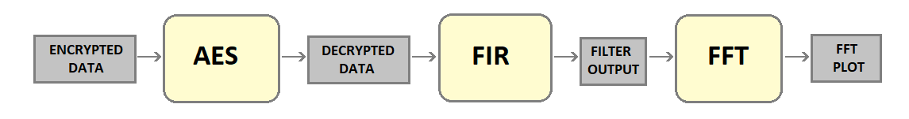
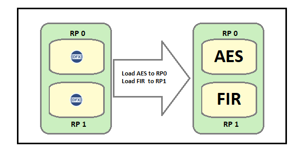
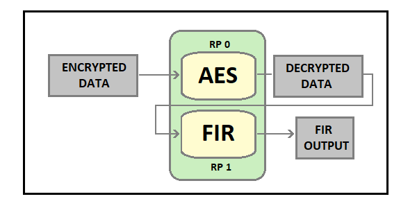
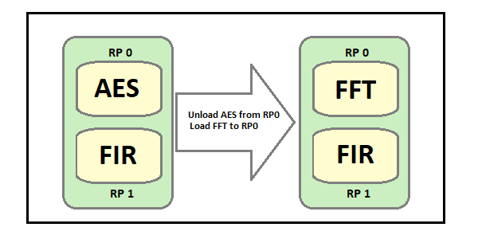
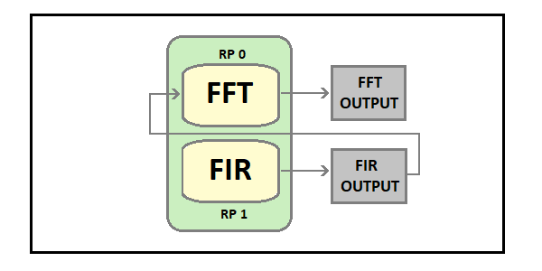

# Orchestration of AES, FFT, and FIR accelerators

The flow described below shows how DFX can be used to orchestrate multiple accelerators within a DFX-based system. As the Kria K26 SOM design provides 2RPs the scenarios shown here focus on two PL-based accelerators, but the concepts can extend to a larger number of DFX slots.  

Use Case:
Decrypt a signal that contains data of three different frequencies, Run FIR to get filtered output, and on the result of FIR, run FFT to get final output data.

1. Both Reconfigurable Partitions are empty to start with. So, we can load two accelerators to them using the "xmutil loadapp" command. Load AES accelerator to RP0 and FIR accelerator to RP1

2. Run AES decryption on the input encrypted signal and send the decrypted output to the FIR accelerator for further processing

3. We need to load the FFT accelerator but both Reconfigurable partitions are programmed with AES and FIR. We need to unload one accelerator using "xmutil unloadapp" command and load the FFT accelerator in the Reconfigurable Partition. Unload the AES accelerator from RP0 and Load FFT in its place

4. Pass the output of the FIR accelerator from Step 2 as an input to the FFT accelerator loaded in RP0 and run FFT on it

## License

Licensed under the Apache License, Version 2.0 (the "License"); you may not use this file except in compliance with the License.

You may obtain a copy of the License at
[http://www.apache.org/licenses/LICENSE-2.0](http://www.apache.org/licenses/LICENSE-2.0)

Unless required by applicable law or agreed to in writing, software distributed under the License is distributed on an "AS IS" BASIS, WITHOUT WARRANTIES OR CONDITIONS OF ANY KIND, either express or implied. See the License for the specific language governing permissions and limitations under the License.

Copyright&copy; 2021 Xilinx
