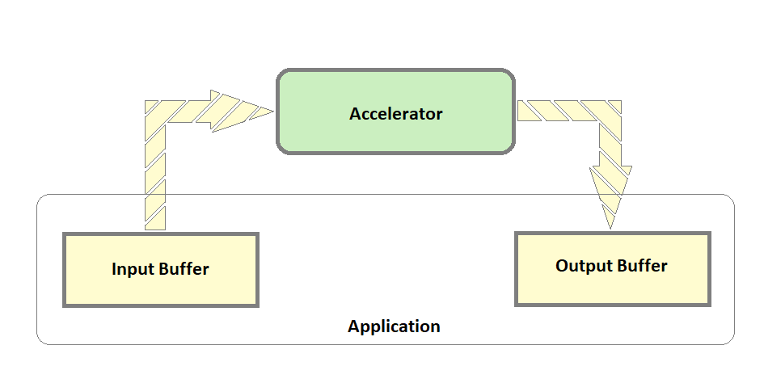

# Creating a new Application

## Introduction

This section provides an details to create applications for accelerators on DFX example design. It also provides steps to install and run new accelerator firmware on the target. Usually, an accelerator takes input data, processes it, and produces the output data. This output data can be consumed by the user or passed further to another accelerator for processing. On the DFX uexample design, the input and output data are stored on DDR. An IP with virtual AXI stream channel support is provided for data movement between DDR and the accelerators. The virtual channels are realized on a single AXI Stream Bus by using different TID Values. Data Packets use TID value 0 and Control packets use TID values 1 through 7.
The application can differentiate between control and data packets based on the TID. A total of 8 TID values, 0 to 7, are supported.
The data movement APIs use UIO drivers to map the custom IPs like data movement IP etc. The APIs are described in the following section.

## Pre-Requisites and Assumptions

- Accelerators are configured with streams with TIDs ranging from 1 to 7 on the data mover.
- Data is provided to accelerators with TID = 0 on the data mover.
- Streaming accelerator functions by reading data from the input stream and writing data on the output stream. Data mover API DataToAccel reads data from DDR and provides it to the Accelerator input stream.  Data mover API DataFromAccel reads data from the accelerator’s output stream and writes the data to DDR. In cases when data needs to be read from DDR for processing and written to DDR after processing, both the APIs - DataToAccel and DataFromAccel, need to be called. Calling only DataToAccel will stall the pipe after sometime as the accelerator’s output data is not read.
 
- In the two-slot design, the user can load different accelerators in each of the slots and run the applications in paralell. The max limit of DDR that the users can allocate for each application is 256MB.
- For buffer allocation using XRT, the pre-requisite is that zocl must be loaded. The dtsi file should have a zyxclmm_drm entry which ensures that zocl will be loaded when the device tree overlay is applied.

## Data Movement APIs

All the APIs take one common argument called slot number which denotes the reconfigurable partition where the accelerator is loaded. The RMs have an inbuilt AXIS data mover to take care of data movement between the AXIS accelerators and DDR. The in-built data mover reads data from a source address in DDR and provides an input stream to Accelerator; reads data from the output stream of an accelerator and writes to a destination address on DDR.

**InitializeMapRMs** - Initialize and Map the data mover IPs using UIO drivers.

```cpp
InitializeMapRMs(slot); // Possible slot values 0 or 1 based on which slot is being Initialized and Mapped.
```

**DataToAccel** - DDR to accelerator data movement 

Code example:
```cpp
#define DKB_OFFSET_MEM		0x0 
#define EB_OFFSET_MEM		  0x100
#define KEYBUFF_SIZE		  0x2
#define TID_0				      0x0
DataToAccel(slot,DKB_OFFSET_MEM,KEYBUFF_SIZE,TID_1);
DataToAccel(slot,EB_OFFSET_MEM,BUFF_SIZE,TID_0);
```

**DataToAccelDone** – Check whether the previous DataToAccel function finished execution. Call to this API will wait until the last DataToAccel API has finished its operation.

Code example:
```cpp
int status = DataToAccelDone(slot);
```

**DataFromAccel** - Data movement from accelerator to DDR.

Code example:
```cpp
#define RESULT_OFFSET_MEM	0x300
#define BUFF_SIZE			0x10	
DataFromAccel(slot, RESULT_OFFSET_MEM, BUFF_SIZE);
```

**DataFromAccelDone** - Check whether the previous DataFromAccel function finished execution. Call to this API will wait until the last DataFromAccel API has finished its operation.

Code example:
```cpp
int status = DataFromAccelDone(slot);
```
**FinaliseUnmapRMs** - Unmap the data mover IPs that were mapped as part of the call to initializeMapRMs(int slot).

Code example:
```cpp
FinaliseUnmapRMs(slot);
```

## Buffer Allocation for the Application 
Every application needs buffer allocation for providing input data to Accelerator and storing the output data from the accelerator. XRT Native APIs are used for buffer allocation and deallocation.

Code example:
```cpp
//Allocate XRT buffer to be used for input and output of the application
auto device = xrt::device(0);
auto bufferObject = xrt::bo(device, SIZE_IN_BYTES, 0);
uint32_t *vptr = (uint32_t *)bufferObject.map<int*>(); //Use vptr to work with the allocated xrt buffer
mapBuffer(bufferObject);
```

XRT takes care of deallocating the buffer when the application exits. 

## Application Example Template

```cp
//Includes
//Functions
int main(int argc,char *argv[])
{
  //Set slot from argv[1]
  //Initialize and Memory map RMs
  //Allocate memory Buffer using XRT
  //Application access to the allocated buffer 
  //Accelerator access to allocated buffer differentiated by TIDs
  //Application Logic
  //Unmap RMs
 }
```

## Application Example for Accelerator doing Addition/Subtraction

```cpp
/*
 * Copyright (C) 2022, Advanced Micro Devices, Inc. All rights reserved.
 * SPDX-License-Identifier: MIT
 */

#include <string.h>
#include <stdint.h>
#include <stdlib.h>
#include <stdio.h>
#include <unistd.h>
#include <sys/mman.h>
#include <fcntl.h>

// XRT includes
#include "experimental/xrt_bo.h"
#include "experimental/xrt_device.h"
#include "experimental/xrt_kernel.h"

#define SIZE_IN_BYTES       0x4000000	//64MB


#define A_OFFSET			0 		//Decryption Key Offset at 0
#define B_OFFSET			8 		//Encryption Key Offset at 32
#define OPERATION_OFFSET	64 		        //Encrypted Buffer Offset at 256
#define RESULT_OFFSET		128		        //Decryped Buffer Offset at 512
#define A_OFFSET_MEM		0x0 	                //Decryption Key Mem Offset in Hex
#define B_OFFSET_MEM		0x20	                //Encryption Key Mem Offset in Hex
#define OPERATION_OFFSET_MEM		0x100 	        //Encrypted Buffer Mem Offset in Hex
#define RESULT_OFFSET_MEM	0x200	                //Result Buffer Mem Offset in Hex
#define INPUT_SIZE			0x2		//Size of Input Data
#define OPERATION_SIZE		0x1		        //Size of Operation
#define TID_0				0x0		//TID 0
#define TID_1				0x1		//TID 1
#define TID_2				0x2		//TID 2

int InitializeMapRMs(int slot);
int StartAccel(int slot);
int FinaliseUnmapRMs(int slot);
void mapBuffer(xrt::bo boa);
int DataToAccel(int slot, uint64_t data, uint64_t size, uint8_t tid);
int DataFromAccel(int slot, uint64_t data, uint64_t size);
int DataToAccelDone(int slot);
int DataFromAccelDone(int slot);

// A Input Buffer
uint32_t A[] = {
	0x55555555, 0x44444444, 0x33333333, 0x22222222,
	0x55555555, 0x44444444, 0x33333333, 0x22222222
};

// B Input Buffer 
uint32_t B[] = {
	0x11111111, 0x11111111, 0x11111111, 0x11111111,
	0x11111111, 0x11111111, 0x11111111, 0x11111111
};

// Operation
uint32_t OperationAdd[] = {
	0x00000001, 0x00000000, 0x00000000, 0x00000000
};

uint32_t OperationSub[] = {
	0x00000000, 0x00000000, 0x00000000, 0x00000000
};


int main(int argc, char *argv[])
{
	//Default slot Set to 0 unless passed as an argument
	int slot =0;
	if(argc>1)
	{
		//Updating slot number provided as command line argument
		slot = atoi (argv[1]);
		if (slot != 1 && slot != 0)
		{
			printf("- Invalid slot number provided %s. Valid values : 0 or 1\n",argv[1]);
			return 0;
		}
	}
	//Initialize and memory map RMs
	if(InitializeMapRMs(slot) == -1)
	{
		printf("- Check the slot number where the accelerator is loaded and run the test on the specific slot.\n");
		return 0;
	}
	//Allocate XRT buffer to be used for input and output of the application
	auto device = xrt::device(0);
	auto bufferObject = xrt::bo(device, SIZE_IN_BYTES, 0);
	uint32_t *vptr = (uint32_t *)bufferObject.map<int*>();
	mapBuffer(bufferObject);

	// Write A of Size 32 bytes (4bytes x 8 )
	std::memcpy(vptr+A_OFFSET, &A, sizeof(A));
	// Write B of Size 32 bytes (4bytes x 8 )
        std::memcpy(vptr+B_OFFSET, &B, sizeof(B));
	// Write Add Operation
        std::memcpy(vptr+OPERATION_OFFSET, &OperationAdd, sizeof(OperationAdd));
	// Write Sub Operation 
	//std::memcpy(vptr+OPERATION_OFFSET, &OperationSub, sizeof(OperationSub));
	
	//Initialize RM
	StartAccel(slot);
	//Program A to Accelerator - Size 32 bytes (16bytes x 2 ) to Offset 0 (0x0)
	DataToAccel(slot,A_OFFSET_MEM,INPUT_SIZE,TID_0);
	int status = DataToAccelDone(slot);
	//Program B to Accelerator - Size 32 bytes (16bytes x 2 ) to Offset 8 (0x20)
	if(status)
	{
		DataToAccel(slot,OPERATION_OFFSET_MEM,OPERATION_SIZE,TID_1);
		status = DataToAccelDone(slot);
	}
	//Program Operation to Accelerator - Size 16 bytes (16bytes x 1 ) to Offset 64 (0x100)
	if(status)
	{
		DataToAccel(slot,B_OFFSET_MEM,INPUT_SIZE,TID_2);
		status = DataToAccelDone(slot);
	}
	if(status)
	{
		//DataFromAccel - Size 16 bytes (16bytes x 1 ) to Offset 128 (0x200)
		DataFromAccel(slot, RESULT_OFFSET_MEM, INPUT_SIZE);
		status = DataFromAccelDone(slot);
		printf("\t Success: Selected Operation Done !.\n");
	}
	if(status)
	{
		FinaliseUnmapRMs(slot);
	}
	return 0;
}
```


## Building apps for new accelerators

- The applications shoukld be built on the target.
- Copy the above application example from the localhost as main.c to the target
- Run the below steps to build an application on the target

```shell
sudo apt install uuid-dev libdfx-dev libdfx-mgr-dev #Installing required libraries 
sudo git clone --branch xlnx_rel_v2022.1 --recursive  https://github.com/Xilinx/kria-dfx-apps.git #Cloning Application Git Repo that has siha APIs
cd kria-dfx-apps/src
sudo mkdir ADD #Create directory to copy/create application source code
sudo scp user@localhost:<path to directory containing main.c on localhost>/main.c ./ADD #Copy application source code
cd ..
INC='-I/usr/include/xrt -I/usr/include/dfx-mgr' #Setting up Include files
LNK='-luuid -lxrt_coreutil -lxrt++ -ldfx-mgr' #Setting up Library dependencies
sudo g++ -Wall -g -std=c++1y $INC lib/siha.c src/ADD/main.c $LNK -o testADD #Compile application
```

## Run new accelerator RM application on the target

This section provides details to install new custom RM firmware on target and run its corresponding application.

### Prerequisites

Clone the kria-apps-firmware repository on target

```shell
git clone --branch xlnx_rel_v2022.1 --recursive https://github.com/Xilinx/kria-apps-firmware.git
```

### Steps to install firmware for new RMs

- Copy the new RM firmware directory created [here](./creation_of_new_RM.html#new-rm-output-files) to the directory kria-apps-firmware/k26-dfx/2rp on the target.
- Navigate to the directory kria-apps-firmware/k26-dfx/2rp
- Run Makefile to install new accelerator RM firmware on the target.

```shell
cd kria-apps-firmware/k26-dfx/2rp/
sudo apt install bootgen-xlnx
sudo make install
```

### Load new accelerator RM on the target

- Check if free slots are available on target using xmutil listapps.

```shell
sudo xmutil listapps
```

- If all slots on target are full, free up a slot

```shell
sudo xmutil unloadapp 
```

- Load the new accelerator RM on the target

```shell
sudo xmutil loadapp NewRMName
```

### Run applications for new RM

- On the target, navigate to the directory where the new RM application is present.

```shell
cd ~/kria-dfx-apps
```

- Run the new RM application built by providing the slot number where the RM was loaded.

```shell
sudo ./NewRMApplication SlotNumber
```

## References

- [xrt native APIs](https://xilinx.github.io/XRT/2022.1/html/xrt_native_apis.html)

## License

Licensed under the Apache License, Version 2.0 (the "License"); you may not use this file except in compliance with the License.

You may obtain a copy of the License at
[http://www.apache.org/licenses/LICENSE-2.0](http://www.apache.org/licenses/LICENSE-2.0)

Unless required by applicable law or agreed to in writing, software distributed under the License is distributed on an "AS IS" BASIS, WITHOUT WARRANTIES OR CONDITIONS OF ANY KIND, either express or implied. See the License for the specific language governing permissions and limitations under the License.

<p align="center">Copyright&copy; 2021 Xilinx</p>
