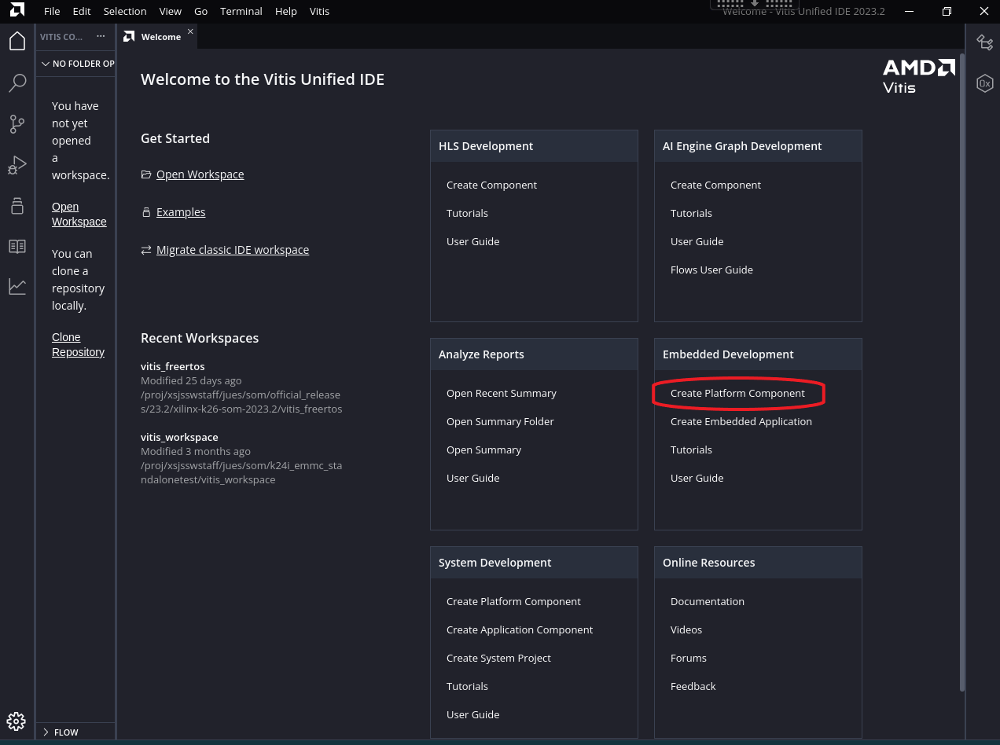
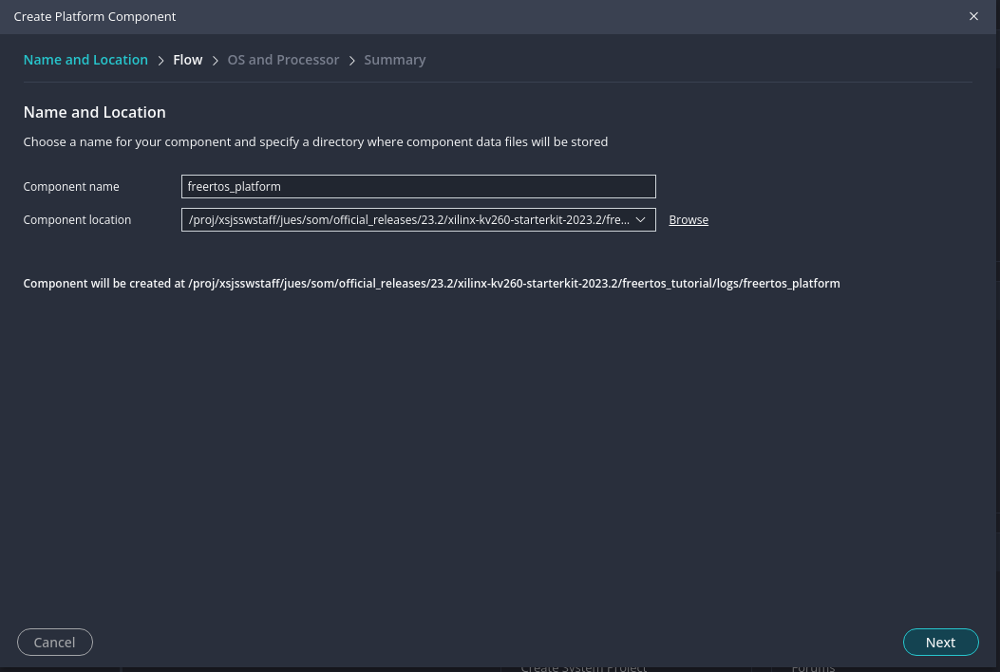
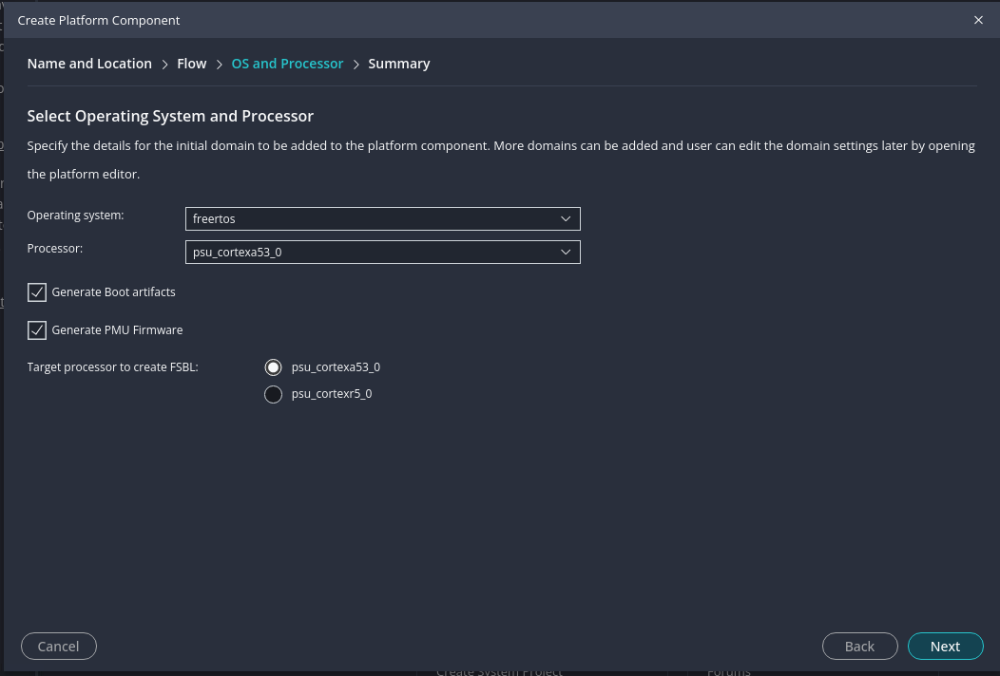
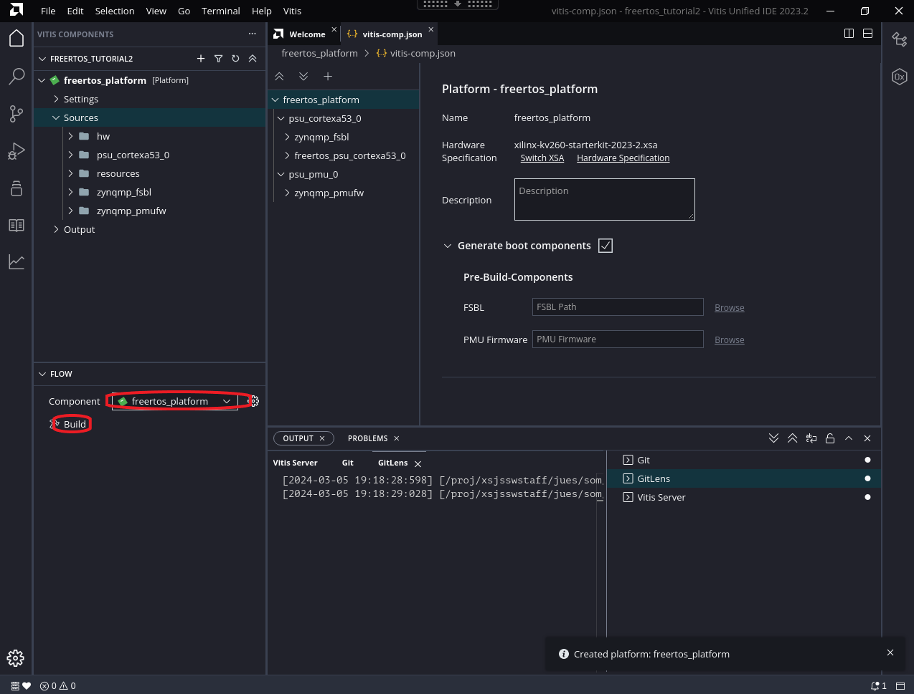
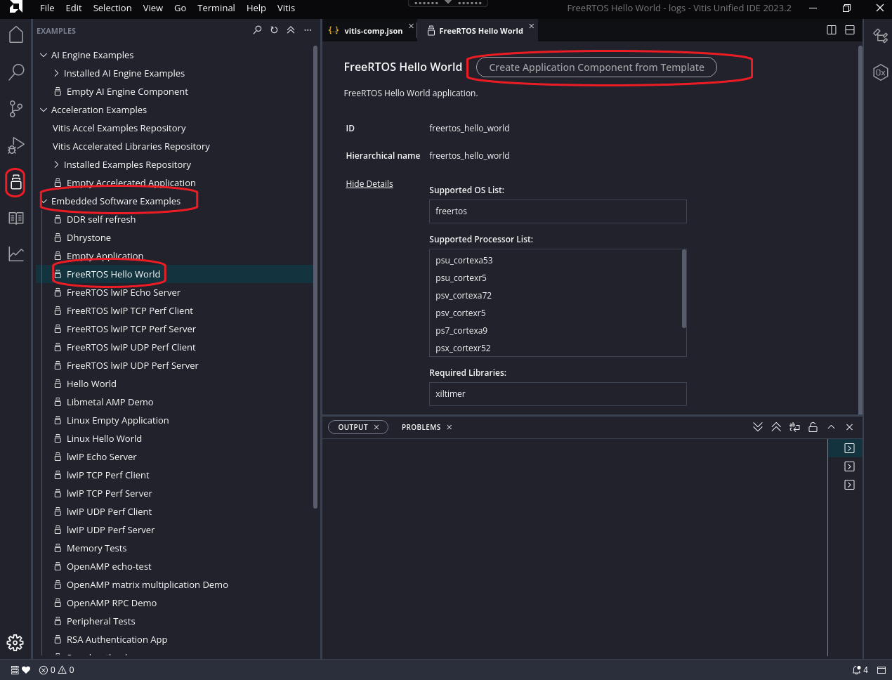
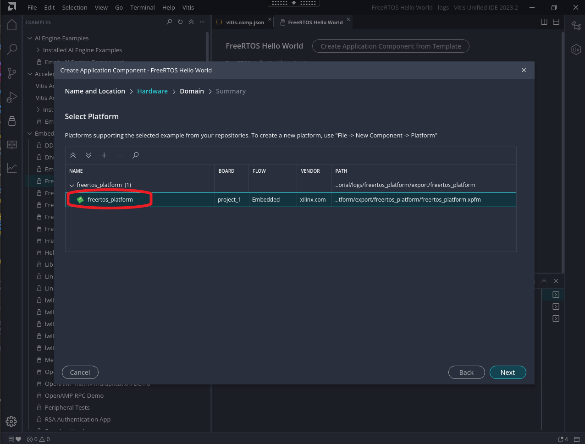
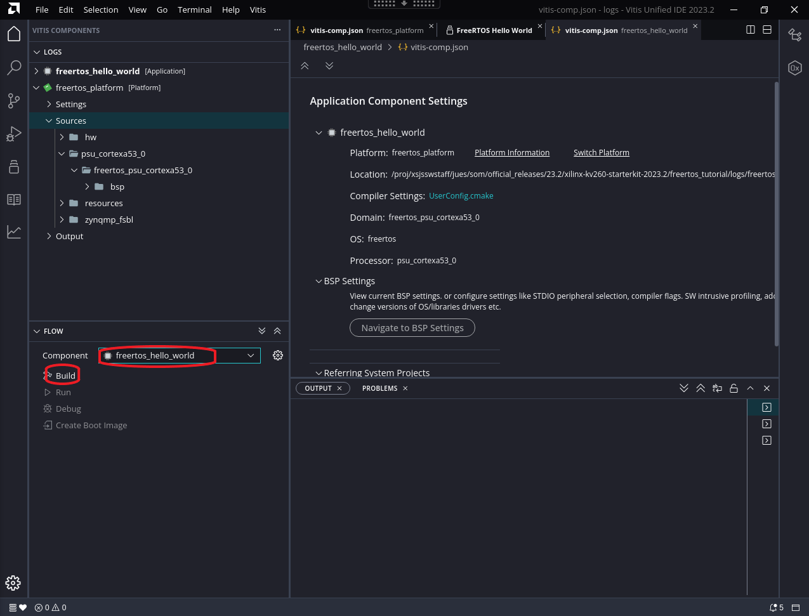
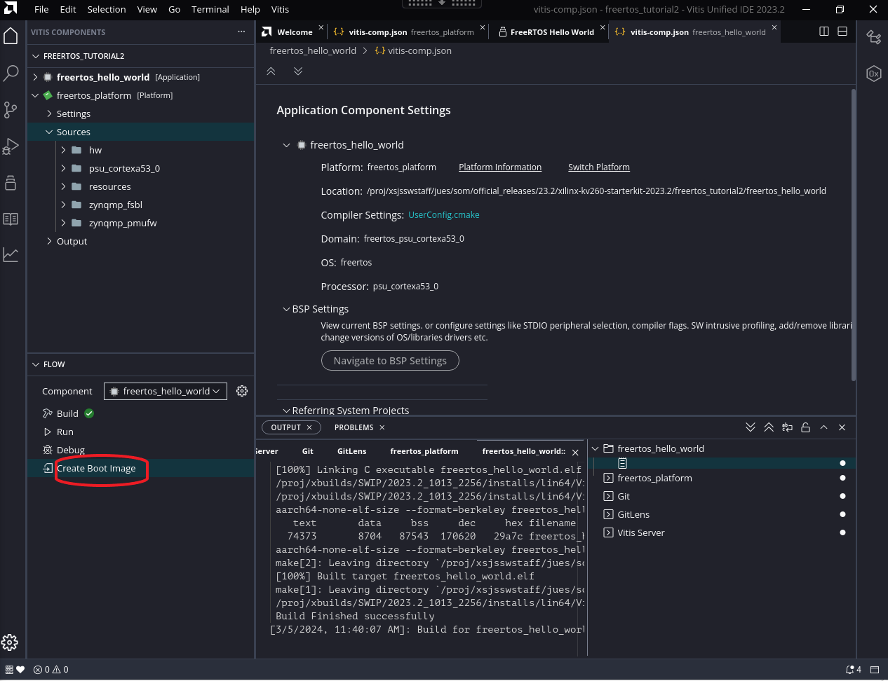

# FreeRTOS Kria SOM Starter Kits Support

[FreeRTOS](https://xilinx-wiki.atlassian.net/wiki/spaces/A/pages/18842141/FreeRTOS) is a real-time operating system (RTOS) kernel designed for embedded systems. It provides scheduling, multitasking, and various other services for applications running on microcontrollers and small microprocessors. FreeRTOS is open-source, allowing developers to use, modify, and distribute it freely under the MIT license.

Booting FreeRTOS on Kria Starter Kits mirrors the process on a standard ZynqMPSoC platform. This document offers a detailed, step-by-step procedure for running FreeRTOS on a Kria SOM APU processor.

To boot FreeRTOS, the initial step involves acquiring or generating a .xsa file. Next, the .xsa file is imported into Vitis to establish a FreeRTOS platform and application, and to create artifacts required to boot on target. Finally, various methods for booting FreeRTOS on Kria SOM are outlined.

In this tutorial, we employ the KV260 as a demonstration and utilized tool version 2023.2.

## Prerequisites

1. Vitis Installation
2. (Optional) Vivado installation

### Obtain or Generate .xsa file

A .xsa file corresponding to target Kria Starter Kit can be found in [petalinux.xilinc.com](https://petalinux.xilinx.com/sswreleases) in ```hdf-examples/``` folder, or from PetaLinux BSP's hardware/ folder. These are base .xsa file containing support for various PS peripherals, and has minimal PL contents.

Alternatively, you can generate a .xsa file by utilizing board files as outlined in the tutorial provided [here](https://xilinx.github.io/kria-apps-docs/creating_applications/2022.1/build/html/docs/Generate_vivado_project_from_boardfile.html).

### Create FreeRTOS platform Application in Vitis

Please note that this tutorial is crafted using the 2023.2 version of Vitis, featuring the newly introduced interface GUI.

In Vitis welcome page, select "Create Platform Component" under "Embedded Development"



Follow the prompt to enter Vitis Workspace location and platform component name. In this case we used ```freertos_platform``` as platform name.



Select the .xsa generated in [previous step](#generate-xsa-file-using-vivado-and-board-file).

Select "freertos" as OS, and "psu_cortex53_0" as Processor. Also make sure to select "Generate Boot artifacts" and "Generate PMU Firmware":



Click through "next" and "finish", and Vitis will create a freertos platform project (it may take a few minutes). In the created project, in "FLOW" tab, click "Build" to build the platform:



Now navigate to example applications with the icons on the left, select "Embedded Software Examples" -> "FREERTOS Hello World" and click on  "Create Application Component from Template":



Select Component name and location, in our case we used ```freertos_hello_world``` as component name. Then select the ```freertos_platform``` that we created:



Click through next and finish. Now Vitis will generate an application component. In "FLOW" tab, select the application in "Component" pull down menu, and select "Build"



You can find the generated artifacts in ```<vitis workspace>/freertos_hello_world/build/freertos_hello_world.elf```,  ```<vitis workspace>/freertos_platform/zynqmp_fsbl/build/fsbl.elf``` and ```<vitis workspace>freertos_platform/zynqmp_pmufw/build/pmufw.elf```

Lastly, for QSPI booting options in later sections, click on "Create Boot Image":


In the window that pops up, leave everything on default and click "Create Image", you will find the generated artifact in ```freertos_hello_world/_ide/bootimage/boot.bin```.

### Boot FreeRTOS on platform

There are many ways one can boot FreeRTOS with the artifacts created - we provide a few ideas here but there are more ways such as USB, eMMC, ethernet - all of which are not specific to Kria implementation.

#### Boot FreeRTOS vis JTAG

To boot freeRTOS via JTAG, we will use XSDB. Create a folder with ```freertos_hello_world.elf```, ```fsbl.elf``` and ```pmufw.elf``` in the folder. Create a boot.sh in the same folder with the following content:

``` bash
puts stderr "Starting the script..."
connect
targets -set -nocase -filter {name =~ "PSU"}
# update multiboot to ZERO
mwr 0xffca0010 0x0
# change boot mode to JTAG
mwr 0xff5e0200 0x0100
# reset
rst -system
after 2000

targets -set -nocase -filter {name =~ "PSU"}
mwr  0xffca0038 0x1ff
targets -set -nocase -filter {name =~ "MicroBlaze PMU"}
catch {stop}; after 1000
puts stderr "INFO: Downloading zynqmp_pmufw ELF file to the target."
dow -force "pmufw.elf"
after 2000
con

after 5000
targets -set -nocase -filter {name =~ "Cortex-A53*#0"}
rst -proc -clear-registers
after 2000
puts stderr "INFO: Downloading zynqmp_fsbl ELF file to the target."
dow -force "fsbl.elf"
after 2000
con
after 4000; stop; catch {stop};

targets -set -nocase -filter {name =~ "*A53*#0"}
puts stderr "INFO: Downloading u-boot ELF file to the target."
after 2000
dow -force "freertos_hello_world.elf"
after 2000
con
```

In XSDB, source boot.sh, this will execute the three elfs and execute the example freeRTOS hello world application. You will freeRTOS Hello World application prints on UART.

#### Boot FreeRTOS Using QSPI in A/B update

If your Starter Kit has the locked QSPI image with A/B boot sections, you can also test the generated boot.bin (renamed to freertos_boot.bin here) by loading it to A or B boot partition and test.

For an example, you can boot to Ubuntu/PetaLinux and load the freertos_boot.bin into one of the image partition using xmutil:

``` shell
ubuntu@kria:~$ sudo xmutil bootfw_update -i freertos_boot.bin
Marking last booted image as bootable
Reading Image file
Updating Image B
Marking target image as non bootable
Writing Image to Image B partition
Marking target image as non bootable and requested image
Clearing multiboot register value
freertos_boot.bin successfully updated to Image B partition
```

Perform a power cycle - on the first power cycle, image selector will choose the newly updated partition  - you will see hello freeRTOS program printouts on UART. However, note that in this state, on every other power cycle, the image selector will choose the other partition and try to boot Linux. For detailed logics on how image selector chooses which partition to use, see [a/b boot concept](https://xilinx.github.io/kria-apps-docs/bootfw/build/html/docs/bootfw_overview.html#a-b-boot-concept) section.

## Next Step

Try the lwIP TCP Performance Server application in [this tutorial](./freertos_kria_lwip_tcpperfserver.md)

<hr class="sphinxhide"></hr>

<p class="sphinxhide" align="center"><sub>Copyright © 2024 Advanced Micro Devices, Inc.</sub></p>

<p class="sphinxhide" align="center"><sup><a href="https://www.amd.com/en/corporate/copyright">Terms and Conditions</a></sup></p>
