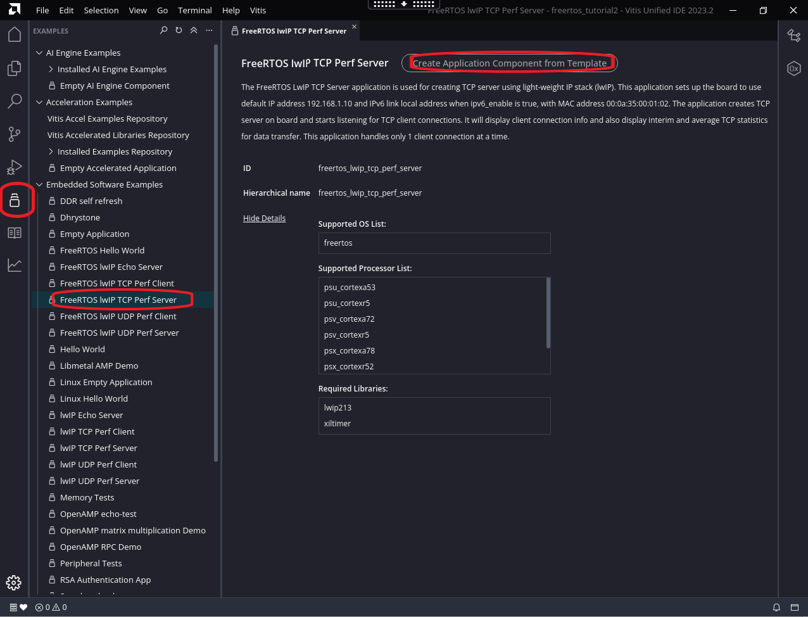
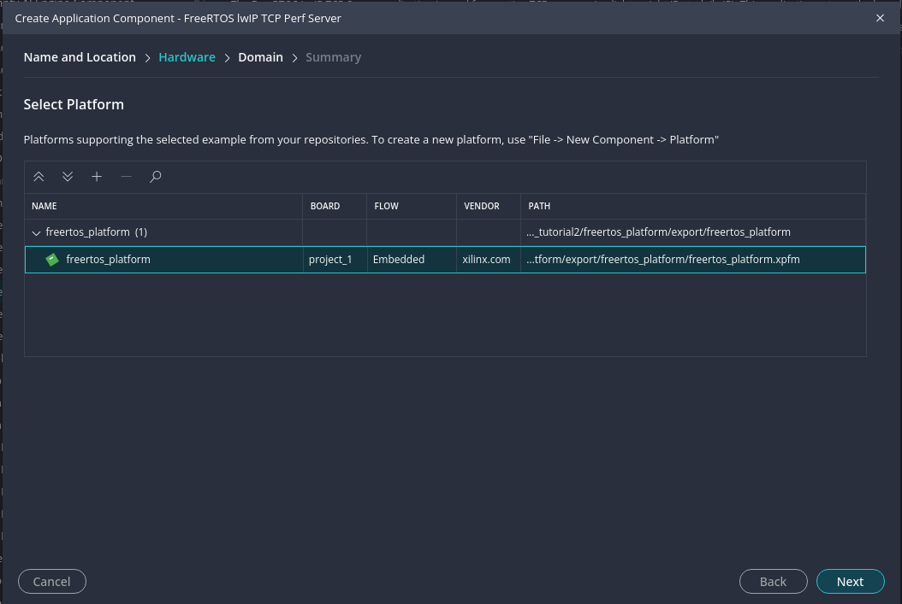
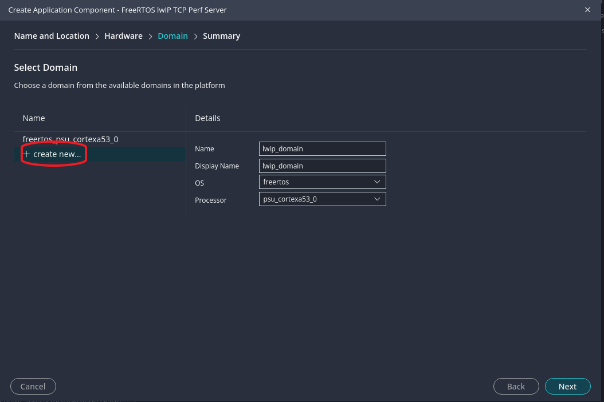
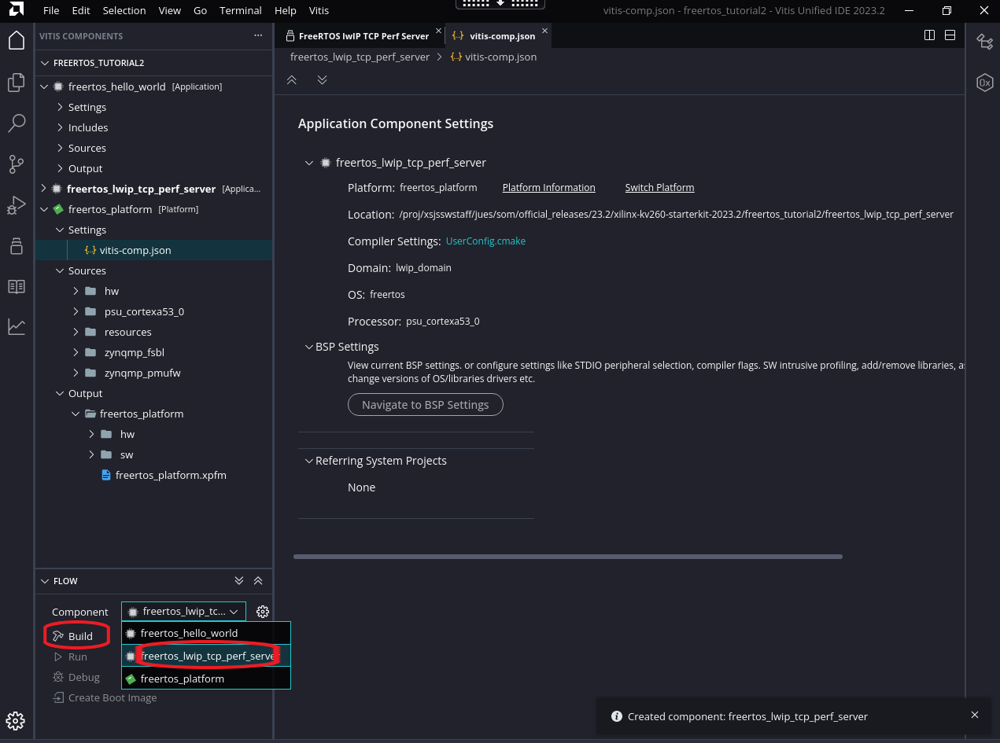
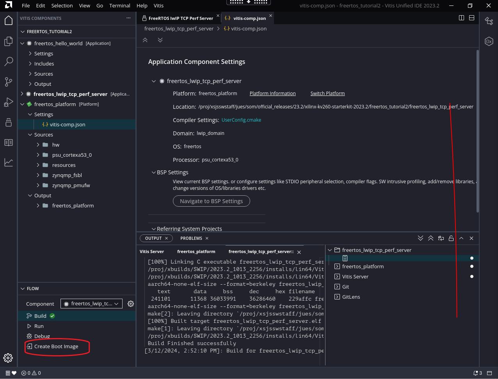

# FreeRTOS Kria SOM Starter Kits lwIP TCP Performance Server

In this tutorial, we show step by step process to generate a lwIP TCP Performance Server for FreeRTOS on Kria SOM.

## Prerequisites

Completion of [FreeRTOS Hello World Example](./freertos_kria.md), as this example assumes you have the required tools installed and have already created a Vitis workspace with ```freertos_platform``` platform.

### Create LWIP Application in Vitis

With the Vitis Workspace open and ```freertos_platform``` platform created, navigate to example applications with the icons on the left, select "Embedded Software Examples" -> "FREERTOS lwIP TCP Perf Server" and click on  "Create Application Component from Template":



Select Component name and location, in our case we used ```freertos_lwip_tcp_perf_server``` as component name. Then select the ```freertos_platform``` that we already created in [FREERTOS Hello World Example](./freertos_kria.md).



Click next, in "Domain" tab, click on "Create new". and fill in the appropiate details, we used "lwip_domain" as the Domain name. This is required so that we generate a new BSP with lwIP library support.



Click next through finish. Now Vitis will generate an application component. In "FLOW" tab, select the application in "Component" pull down menu, and select "Build"



You can find the generated artifacts in ```<vitis workspace>/freertos_lwip_tcp_perf_server/build/freertos_lwip_tcp_perf_server.elf```,  ```<vitis workspace>/freertos_platform/zynqmp_fsbl/build/fsbl.elf``` and ```<vitis workspace>freertos_platform/zynqmp_pmufw/build/pmufw.elf```

Lastly, for QSPI booting options in later sections, click on "Create Boot Image":


In the window that pops up, leave everything on default and click "Create Image", you will find the generated artifact in ```freertos_hello_world/_ide/bootimage/boot.bin```.

Now you can follow the same steps in [Boot FreeRTOS on platform](./freertos_kria.md#boot-freertos-on-platform) to boot this application.

## Interacting with the Application

After the application starts, you will see these prints on uart:

```
-----lwIP Socket Mode TCP Server Application------
Start PHY autonegotiation
Waiting for PHY to complete autonegotiation.
autonegotiation complete
Using default Speed from design
link speed for phy address 5: 1000
DHCP request success
Board IP:       10.0.1.158
Netmask :       255.255.255.0
Gateway :       10.0.1.1

TCP server listening on port 5001
On Host: Run $iperf -c 10.0.1.158 -i 5 -t 300 -w 2M
```

on host computer do ```iperf -c 10.0.1.158 -i 5 -t 300 -w 2M``` as instructed and you should see performance numbers printing out from both sides:

```text
[  1] local 10.0.1.158 port 5001 connected with 10.0.1.110 port 5001
[ ID] Interval    Transfer     Bandwidth
[  1]  0.0- 5.0 sec  78.7 MBytes   132 Mbits/sec
[  1]  5.0-10.0 sec  76.6 MBytes   129 Mbits/sec
[  1] 10.0-15.0 sec  61.7 MBytes   104 Mbits/sec
[  1] 15.0-20.0 sec  73.7 MBytes   124 Mbits/sec
[  1] 20.0-25.0 sec  73.6 MBytes   123 Mbits/sec
[  1] 25.0-30.0 sec  73.4 MBytes   123 Mbits/sec
[  1] 30.0-35.0 sec  73.2 MBytes   123 Mbits/sec
[  1] 35.0-40.0 sec  72.4 MBytes   121 Mbits/sec
[  1] 40.0-45.0 sec  61.9 MBytes   104 Mbits/sec
```


<hr class="sphinxhide"></hr>

<p class="sphinxhide" align="center"><sub>Copyright © 2024 Advanced Micro Devices, Inc.</sub></p>

<p class="sphinxhide" align="center"><sup><a href="https://www.amd.com/en/corporate/copyright">Terms and Conditions</a></sup></p>