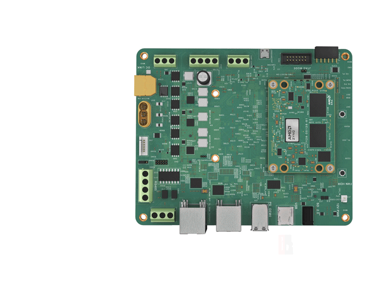

# Step 2: Connect Everything

First, mount the KD240 Carrier Card onto the KD240 Motor Accessory Kit assembly plate.

Begin by removing the four rubber feet from the bottom of the KD240 board in order to attach it to the assembly plate of the motor accessory pack. Then use the 4 mounting screws to securely attach the KD240 Carrier Card onto the assembly plate. By doing so, the connectors on the KD240 Carrier Card are close to the 24V motor & encoder solution.

When finished with assembly, your KD240 hardware plus motor accessory hardware should look like following.

The following are the key connections for the AMD Kria™ KD240 Drives Starter Kit:

1. Insert the microSD card containing the boot image into the microSD card slot (J11) on the starter kit.
2. Connect the Ethernet cable to the PS ETH ports (J24) for required internet access to download factory loaded firmware.
3. Get the USB-A to micro-B cable (a.k.a. micro-USB cable), which supports data transfer.* Do not connect the USB-A end to your computer yet. Connect the micro-B end to J4 on the starter kit.
4. Connect the motor quadrature encoder cable to the KD240 single-ended (SE) encoder input port (J42). Connect the motor 3-phase connector to the KD240 motor connection port (J32).
5. Connect the motor XT60 adapter to the KD240 DC link port (J39). Connect the motor 24V DC adapter to the XT60 adapter and attach the wall adapter to an AC wall supply.
6. Connect the KD240 power supply to the DC jack (J12) on the starter kit. Do not insert the other end to the AC plug yet.

* Note that not all micro-USB cables support data transfer—some micro-USB cables are for charging only and will not work with the starter kit.

## Next Step

Jump to [Step 3: Connect to UART Serial Port](./uart.md).

Copyright&copy; 2023 Advanced Micro Devices, Inc

