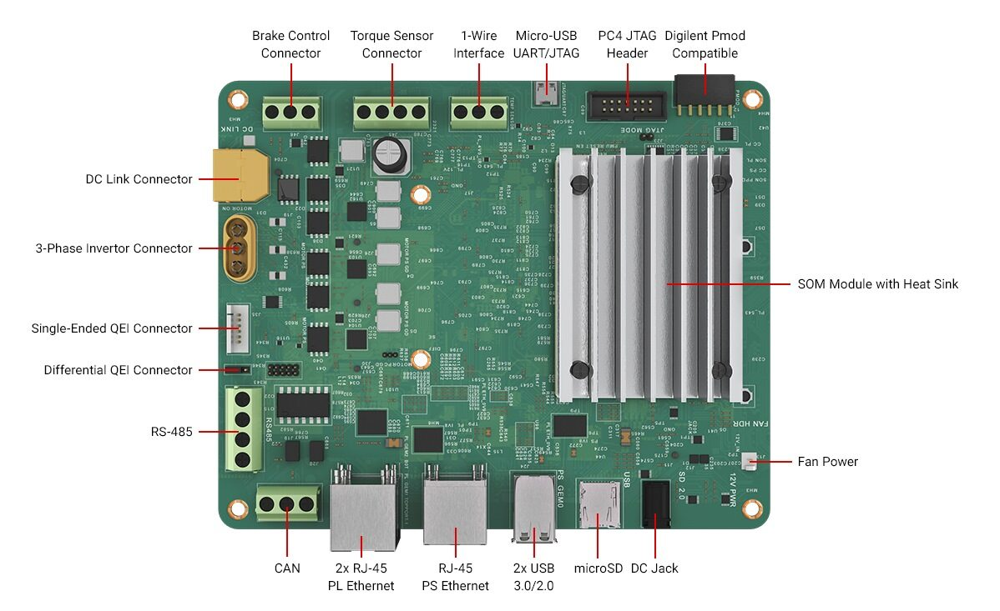

# Boot Kria Starter Kit Linux on KD240

## Introduction

The AMD Kria™ KD240 Drives Starter Kit is the ideal platform to evaluate applications requiring low-latency digital signal processing (DSP), industrial communications, or motor control capabilities. Try all our accelerated applications and get started within minutes by following all the steps. Have fun!



## What's Inside the Box

* [Kria KD240 Drives Starter Kit](https://www.amd.com/en/products/system-on-modules/kria/k24/kd240-drives-starter-kit.html) (Kria K24 SOM + carrier card + thermal solution)
* KD240 power supply and adapter (12V, 3A)
* MicroSD card 16 GB or more
* USB-A to micro-B cable
* Ethernet cable
* Getting Started doc
* Developer stickers

## What You’ll Need to Provide

You will need to provide the following in order to take full advantage of the fact that the KD240 provides a command line-only interface that will be very familiar to embedded developers:

* Host PC running Windows, MacOS, or Linux
* Ability to write a microSD card image (through integrated PC slot or USB card reader)
* Local area network with internet connection used for software and application updates

## Important:  Perform Shutdown Command Before Removing Power

Running the shutdown command enables OS to bring the system down in a secure manner, ensuring that disk writes complete before storage devices are unmounted.
For best practice, this should be performed each time before removing power to KD240

```sudo shutdown -h now```


## Ubuntu Server

Ubuntu Server is the best choice for getting started with the KD240.

### Ubuntu Server LTS

* Full access to Kria SOM accelerated apps and hardware overlays designed specifically to run on the K24 SOM and KD240 Starter Kit
* Access to a rich set of third-party software libraries in the Ubuntu community
* Run the Field-Oriented Control (FOC) with Position Sensor Accelerated App (more accelerated apps from the Kria App Store will be made available over time) to evaluate the KD240.

[Access Booting Kria Starter Kit Linux on KD240 tutorial HERE](./sdcard.md)

### Additional Embedded Developer Assets and Resources

For embedded developers looking to directly use PetaLinux BSPs for application development and deployment rather than Ubuntu, the latest PetaLinux BSPs are available on the [Kria SOM Wiki](https://xilinx-wiki.atlassian.net/wiki/spaces/A/pages/1641152513/Kria+SOMs+Starter+Kits#K24-Embedded-Linux-(Yocto))

## Next Step

Jump to [Step 1: Set up the SD Card Image](./sdcard.md).


<p class="sphinxhide" align="center">Copyright&copy; 2023 Advanced Micro Devices, Inc</p>
