<table class="sphinxhide">
 <tr>
   <td align="center"><h1> Kria&trade; KR260 Robotics Starter Kit <br>ROS 2 Multi-Node Communications via TSN Tutorial</h1>
   </td>
 </tr>
 <tr>
 <td align="center"><h1>Setting up the Board and Application Deployment</h1>

 </td>
 </tr>
</table>

# Board Setup and Application Deployment

## Introduction

This document shows how to set up the board and run the TSN ROS application.

## Revision History

### Version - v0.3

Refreshed app for AMD EDF 26.06 compatibility with updates across apps and documentation

#### Change Log

Apps:

* Application is now deployed as a docker container.

Tests:

* Updated scripts to add support for dfx-mgr to replace xmutil.
* Modified tftpd start/status service-manager to be agnostic.
* Test update to auto-detect TSN module name for sysfs parameter path.
* Fixed st_pcp detection for missing or renamed kernel parameter.
* Validate ROS Setup via ROS_PREFIX instead of ROS_VERSION.

Documentation:

* Updated for compatibility with AMD EDF 26.06

### Version - v0.2

Refreshed app for Ubuntu 24.04 compatibility with updates across the documentation.

#### Change Log

Documentation:

* Added ROS2 Jazzy installation instructions.
* Added instructions to add user to the `dialout` group to access `/dev/tty` devices for RS485 Temp-Humidity sensor test.

### Version - v0.1.1

Added support for CAN Communication between board to board.

#### Change Log

Apps:

* Provides seamless communication between devices through the CAN interface, enabling efficient data exchange for various applications.

Tests:

* Example to support CAN communication using the PMOD CAN between board to board.

Documentation:

* Added steps and instructions to demonstrate CAN Communication.

## Pre-requisite

### Hardware Requirements

* Two Kria SOM starter kits which can be two KR260 Robotics Starter Kit or two KD240 Drive Starter Kits, or one KR260 and one KD240

* Two KR260 Power Supply & Adapter or two KD240 Power Supply & Adapter

* Cat 5e Ethernet Cable

* USB-A to micro-B Cable

* 16GB MicroSD Cards

* CNC - Optional (KV260/KR260/KD240 or Linux Running Standalone machine)

* Ethernet Switch - Optional

* [Digilent TPH2 Pmod - 12-pin Test Point Header](https://digilent.com/shop/pmod-tph2-12-pin-test-point-header/) - Optional (Sold Separately)

* [I210-T1 Network Adapter](https://www.amazon.com/gp/product/B00ESFF2JC/) installed on a PC host machine - Optional (Sold Separately)

* [Oscilloscope or Analog Discovery 2](https://digilent.com/reference/test-and-measurement/analog-discovery-2/start) – Minimum 100MS/s USB Oscilloscope - Optional (Sold Separately)

* RS485 Modbus Temperature Humidity Sensor - Optional (Sold Separately at [aliexpress.com](https://www.aliexpress.com/item/33054683552.html) or [amazon.com](https://www.amazon.com/Temperature-Humidity-Sensor-Display-Modbus/dp/B078NRYBVZ))

* Digilent RS485 Pmod - High-speed Isolated Communications - Optional (Sold Separately at [digilent.com](https://digilent.com/reference/pmod/pmodrs485/start))

* [12VDC Power Supply](https://digilent.com/shop/12v-3a-power-supply/) with Prototyping or Bare Terminals – Optional (Sold Separately)

* Two Digilent Pmod CAN devices - Optional for KR260 CAN testing only (Sold Separately at [digilent.com](https://digilent.com/reference/pmod/pmodcan/start))

* Wireshark tools installed on host machine (Ubuntu 22.04 Linux used for documentation)

> _**Note:**_ This tutorial can be run with one KD240 and one KR260 configuration as well

### Tested Artifact versions

Testing was performed with the following artifacts:

#### KR260 Platform artifacts

| Components                           | Versions             |
| ------------------------------------ | -------------------- |
| Linux Kernel(xlnx)                   | 6.18.10              |
| Boot Firmware                        | K26-BootFW-01.07.bin |
| kr260-tsn-rs485pmod-firmware         | v1.2                 |

#### KD240 Platform artifacts

| Components                           | Versions             |
| ------------------------------------ | -------------------- |
| Linux Kernel(xlnx)                   | 6.18.10              |
| Boot Firmware                        | K24-BootFW-01.06.bin |
| kd240-motor-ctrl-qei-firmware        | v1.2                 |

#### Repositories Information

| Component           | Repository                                    | Tag/Commit                                                                                                    |
|---------------------|-----------------------------------------------|---------------------------------------------------------------------------------------------------------------|
| TSN Utils           | https://github.com/Xilinx/tsn-utils           | [main:1db91b0](https://github.com/Xilinx/tsn-utils/commit/1db91b04d98927a05f868e6365899b13657e76d5)           |
| TSN Talker Listener | https://github.com/Xilinx/tsn-talker-listener | [main:b55887e](https://github.com/Xilinx/tsn-talker-listener/commit/b55887eaf939399868c17a2e7f1fb7684a6be980) |
| ROS TSN PubSub      | https://github.com/Xilinx/ros-tsn-pubsub      | [v0.3](https://github.com/Xilinx/ros-tsn-pubsub/releases/tag/v0.3)                                            |
| PMOD RS485 Test     | https://github.com/Xilinx/pmod-rs485-test     | [v0.2](https://github.com/Xilinx/pmod-rs485-test/releases/tag/v0.2)                                           |
| Container Recipe    | https://github.com/Xilinx/meta-kria-apps      | [rel-v2026.1](https://github.com/Xilinx/meta-kria-apps/tree/rel-v2026.1)                                                                                           |

### Initial Setup

1. Go through the minimum setup required to boot Linux before continuing with instructions in this page:
    * [Kria Starter Kit Linux Boot on KR260](https://pages.gitenterprise.xilinx.com/techdocs/SOM/kr260/linux_boot.html)
    * [Kria Starter Kit Linux Boot on KD240](https://pages.gitenterprise.xilinx.com/techdocs/SOM/kd240/linux_boot.html)

2. Download TSN Docker Image

    * Pull the docker image

        ```bash
        sudo docker pull xilinx/kria-tsn-rs485pmod:0.3-edf-26.06
        ```

    * The storage volume on the SD card can be limited with multiple docker
    images installed. If there are space issues, use the following command
    to remove existing docker images.

        ```bash
        sudo docker rmi --force <image>
        ```

    * You can find the images installed with the following command:

        ```bash
        sudo docker images
        ```

    * This docker image is common across both boards which contains TSN application, board firmwares, dependent packages and kernel modules.
        * [Container Recipe](https://github.com/Xilinx/meta-kria-apps/blob/rel-v2026.1/recipes-containers/container-tsn/container-tsn-rs485pmod.bb)

3. Install TSN PL Firmware on the Host

    Copy and install the application firmware from the container into the host system (in /lib/firmware Xilinx). This installation only needs to be performed once per target board.

    * Export the FW_NAME Environment Variable. Set FW_NAME variable to correct firmware for desired board

        ```bash
        export FW_NAME=kr260-tsn-rs485pmod      #For kr260 TSN Firmware
        export FW_NAME=kd240-motor-ctrl-qei     #For kd240 TSN Firmware
        ```

    * Create Firmware directory on target Host

        ```bash
        sudo mkdir -p /lib/firmware/xilinx/${FW_NAME}
        ```

    * Install TSN firmware

        ```bash
        sudo docker run --rm \
            -v /lib/firmware/xilinx/${FW_NAME}:/opt/firmware/xilinx/${FW_NAME} \
            xilinx/kria-tsn-rs485pmod:0.3-edf-26.06 sh -c "
            dfx-fw-install     --fw-name ${FW_NAME}"
        ```

## Run Out Of Box Applications

The TSN example applications demonstrate Network Time Synchronization and Network Time Shaper Function that can be achieved through TSN based network infrastructure across a distributed system, which are two key features of the FPGA based TSN capabilities.

Two different configurations are shown below for deterministic communication. After completing the initial setup from above, you can navigate to the following subsections to evaluate the desired features:

* Master - Slave deterministic communication with 2 KR260/KD240 boards : Network Configuration 1
* KRS based DDS implementation on ROS 2 pub/sub definition : Network Configuration 1
* CNC(KV260/KR260/KD240 or Linux Running Machine) and Master - Slave with 2 KR260/KD240 boards : Network Configuration 2
* Master - Slave deterministic communication with I210 card : Network Configuration 3
* RS485 Temperature/humidity sensor demo : Communicating using RS485

> _**Note:**_ RS485 Temperature/humidity sensor demo is not applicable to KD240

### Network Configuration 1 : Two KR260/KD240 boards

> _**Note:**_ This turotial can be run with one KD240 and one KR260 configuration as well.

This configuration requires two KR260/KD240 units; TSN subsystem is connected to form a network where one of the units is configured to be master and the other one as slave. The following figure represents this configuration:

KR260-KR260 Setup:

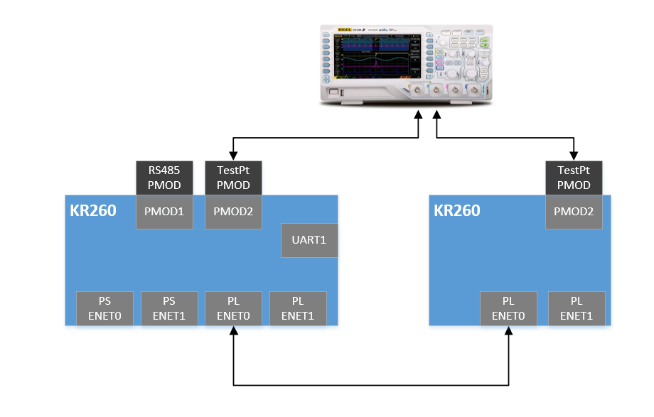

KD240-KD240 Setup:

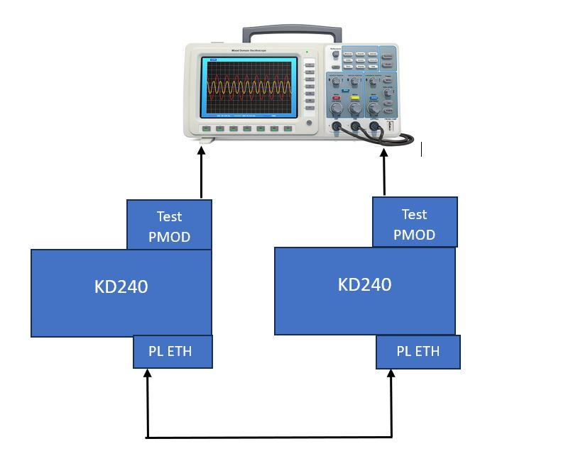

> _**Note:**_ For KD240 J24 is PS Eth, J25B top is PL Eth. For KR260 J10D is PS Eth, J10B top is PL Eth

#### Two KR260 boards: Board setup

* Connect Ethernet cable from PL ETH1 of Board1 (J10 top of KR260)/(J25B top of KD240) to PL ETH1 of  Board2.
* Connect JTAG/UART ports of both boards to your PC.
* Connect Digilent TPH2 Pmod into the PMOD2 connector on the KR260/KD240 board.
* The Analog Discovery 2  or Oscilloscope can be connected to Board1 and Board2 for observing the PTP clock synchronization, Qbv scheduling, and measuring latency.
* Power on both the boards with the prebuilt wic image in the sd_card that was prepared in the prerequisite section.

 KR260-KR260 Setup

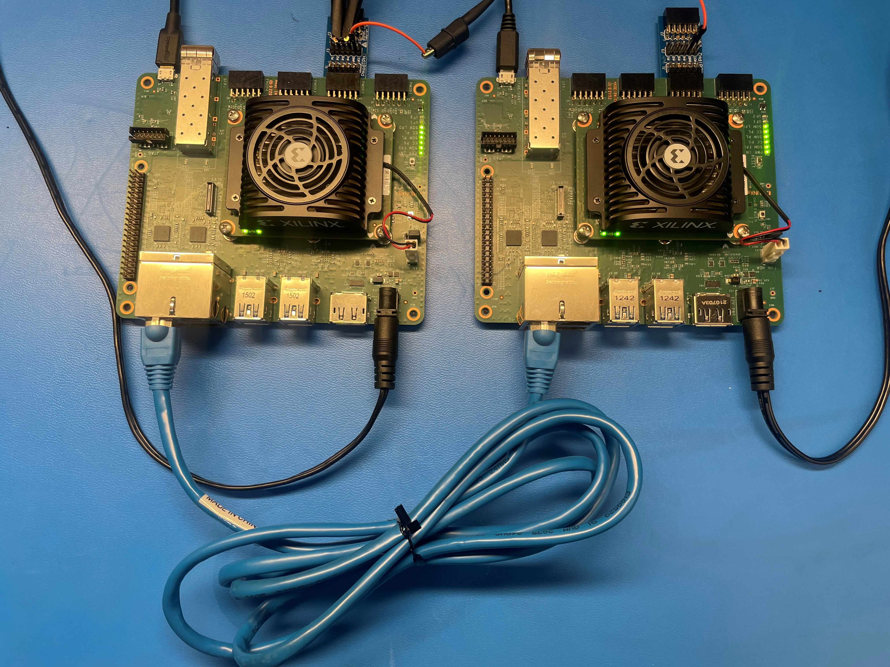

KD240-KD240 Setup

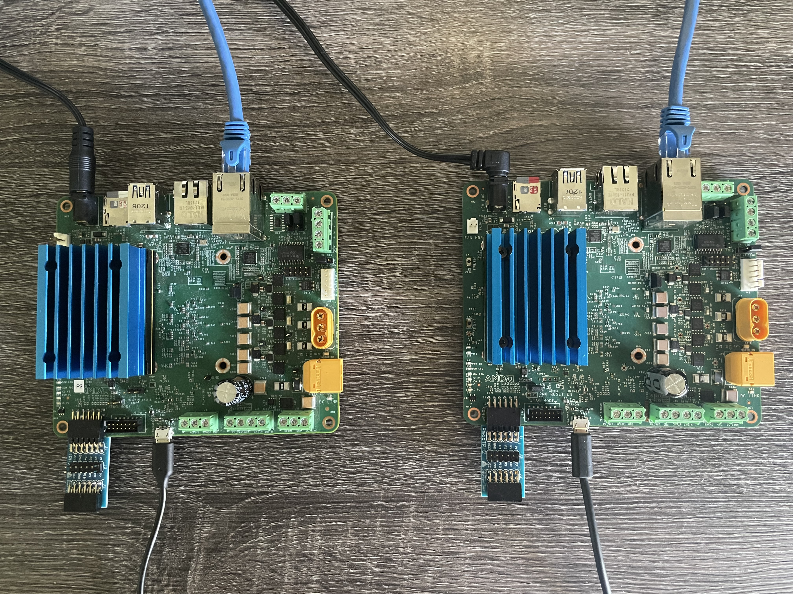

## Run TSN Docker Image

* Launch the docker container using the following command:

    ```bash
    sudo docker run --rm -it --privileged \
        --net=host \
        -v /dev:/dev \
        -v /sys:/sys \
        -v /var/run/dfx-mgrd.socket:/var/run/dfx-mgrd.socket \
        xilinx/kria-tsn-rs485pmod:0.3-edf-26.06 \
        /bin/bash
    ```

* It launches the TSN image in a new container and drops the user into a bash shell.

    When there is already another accelerator/firmware being activated apart from xlnx-app-kr260-pmod-rs485-test, unload it first and then switch to xlnx-app-kr260-pmod-rs485-test.

    ```bash
    bash-5.2#
    ```

> _**Note:**_ Unless otherwise specified, the commands in the following sections are intended to be
executed from within the running TSN container.

## Load TSN Firmware and Modules

* Before running the test suite, load TSN application firmware and the required kernel modules from as shown below.

* Export the FW_NAME Environment Variable

    ```bash
    export FW_NAME=kr260-tsn-rs485pmod      #For kr260 TSN Firmware
    export FW_NAME=kd240-motor-ctrl-qei     #For kd240 TSN Firmware
    ```

* List the installed application firmware binaries.

    ```bash
    bash-5.2# dfx-mgr-client -listPackage
  
    Example output:
    ID accelType   Base        slotLoc Accelerator
    -- ----------- ----------- ------- -----------
    1 RPU         rpu         -1      k26-r5-0-proxy-freertos
    2 RPU         rpu         -1      k26-r5-0-matrix-freertos
    3 RPU         rpu         -1      k26-r5-0-echo-freertos
    4 XRT_FLAT    k26-star... 0       k26-starter-kits
    ```

* Load Kernel Modules

    ```bash
    bash-5.2# kria-modules-load  --fw-name ${FW_NAME}
    ```

* Load Application Firmware

  * When there is already another accelerator/firmware being activated, unload it
    first, then load the desired TSN firmware.

    ```bash
    bash-5.2# dfx-mgr-client -unload 4                    #Previous FW ID(in above case)
    bash-5.2# dfx-mgr-client -loadByName ${FW_NAME}       #Load desired TSN Firmware
    ```

    > _**Note:**_ The firmware consists of bitstream, device tree overlay (dtbo) file. The firmware is
    loaded dynamically on user request once Linux is fully booted.

### Run TSN-ROS Out of Box Applications

* Setup Ethernet ports by running the following commands on the serial terminal. This sets the MAC/IP/VLAN on the EP and ETH ports of the TSN switch IP.

  * _KR260/KD240 Board1 interface setup_

    ```bash
    source /usr/bin/net_setup.sh -b1
    ```

  * _KR260/KD240 Board2 interface setup_

    ```bash
    source /usr/bin/net_setup.sh -b2
    ```

  * _Setup ros env on both KR260/KD240 Board 1 & Board2_

    ```bash
    source /opt/ros/jazzy/setup.sh
    ```

  > _**Note:**_ Set MAC filters when using both TSN ethernet ports in the loopback mode. Refer to net_setup.sh script for setting MAC filters.

#### Network Time Synchronization KR260-KR260 (PTP Demo)

In this demo, Board1 sets its clock as master. Board2 is the slave. Board2 clock syncs with Board1 clock after a brief synchronization period.
Oscilloscope or Analog Discovery 2 Setup (optional)

* Connect P1 on the Test Pmod of Board1 to Channel1 of the oscilloscope - Monitors PTP clock on Board1
* Connect P1 on the Test Pmod of Board2 to Channel2 of the oscilloscope - Monitors PTP clock on Board2
* There are also additional signals exposed to the test Pmod if you want to observe them with additional oscilloscope channels:

    

* _Start ptp on Board1 in master mode_

  ```bash
  source /usr/bin/start_ptp.sh -m
  ```

* _Start ptp on Board2 in slave mode_

  ```bash
  source /usr/bin/start_ptp.sh -s
  ```

  > _**Note:**_ Ensure to run PTP master before starting PTP slave as slave fails to sync when the grandmaster clock is not set. The sync takes about 30 seconds to complete.

**Observe Results:**

* The file ptplog saves the ptp4l output on Board2. The rms value starts out high and goes down to a single-digit value showing the clocks are now in sync.

  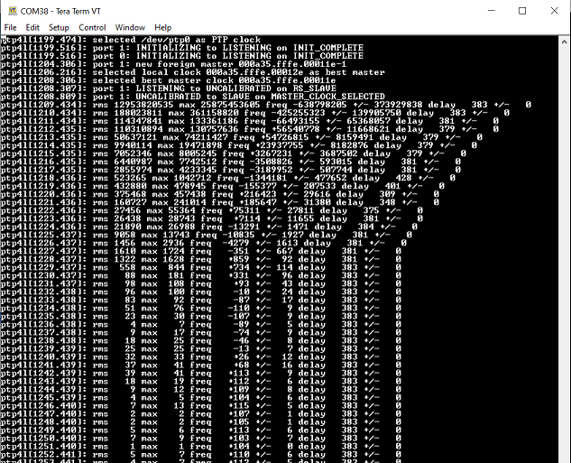

* To see the current status of PTP, run the following command:

  ```bash
  tail -f ~/.local/log/ptplog
  ```

* Using an Oscilloscope, or the Analog Discovery 2 and the WaveForms application, the clocks do not start out in sync but begin to sync with each other and this can be observed by the phase alignment between Channel1 and Channel2.

  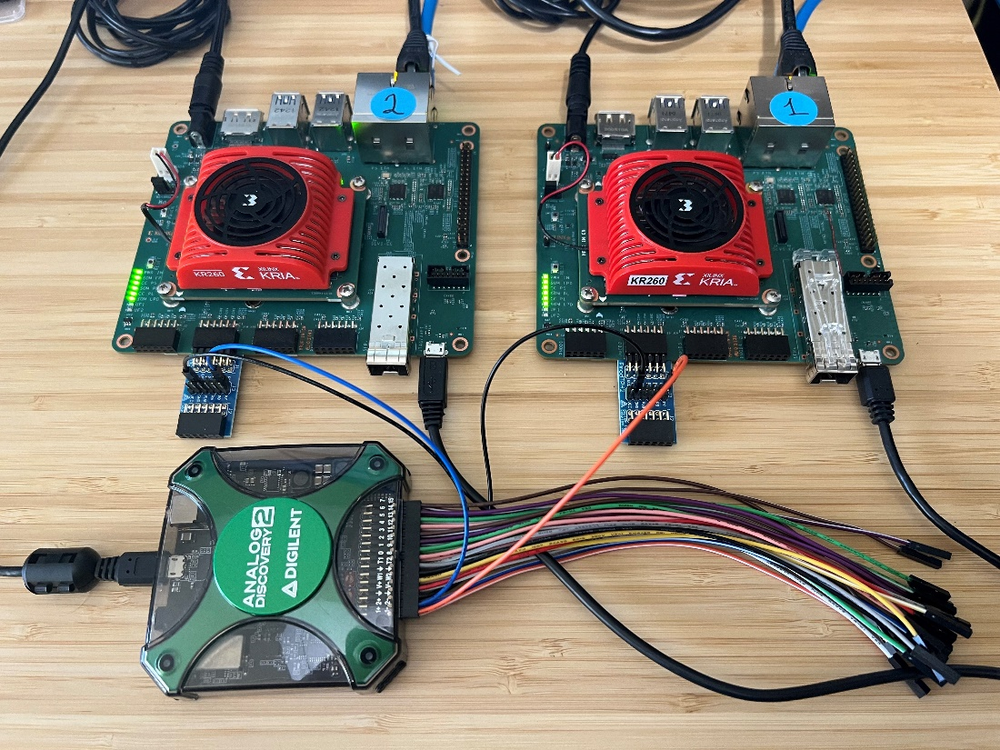

  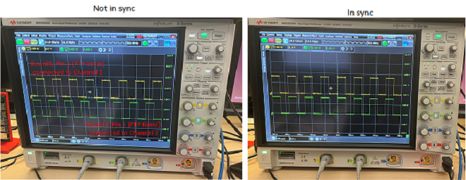

##### ROS Publisher and Subscriber Demo

* Start the Subscriber (listener) first on Board2 so that it is ready to receive messages from the Publisher once it has begun sending messages.

  ```bash
  source /opt/xilinx/ros-tsn-example/bin/start_ros_test.sh -l
  ```

* Start Publisher (talker) next on Board1 to begin sending messages to boards that are Subscribed to the topic.

  ```bash
  source /opt/xilinx/ros-tsn-example/bin/start_ros_test.sh -t
  ```

###### Observe Results

* The xlnx-pubsub talker generates a packet of schedule traffic type every second.
* The xlnx-pubsub listener prints a message when it receives a packet.

    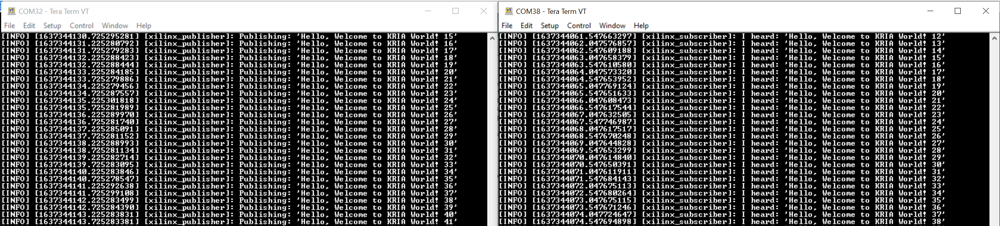

##### Latency measurement Demo

To measure latency, an oscilloscope or Analog Discovery 2 device is required. This demo measures the latency between packet transmitted from Board1 and received on Board2. It includes the latency of the software stack as well.

#### Oscilloscope or Analog Discovery 2 Setup

* Connect P7 on the Test PMOD of Board1 to Channel1 of the oscilloscope - Monitors TX packet from Publisher1. Publisher1 can transmit a Scheduled Traffic (ST) packet or a Best effort (BE) packet.

* Connect P8 on the Test PMOD of Board2 to Channel2 of the oscilloscope - Monitors RX packet from Listener1. Listener 1 receives a ST packet or BE packet.

* Set up triggers on Channel1 and Channel2 with an OR condition and set the time scale interval to 50us.

    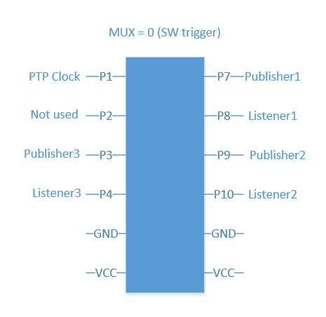

    Figure: Test PMOD pins when MUX is set to SW trigger

The talker application generates a packet, which triggers the Publisher1 pin in the previous figure. When the packet is received on Board2, the listener application triggers the Listener1 pin. Measure the time difference between Channel1 and Channel2 of the scope to find out the latency. It is ideally found to be between 80us to 160us.

* _Start listener on Board2_

  ```bash
  source /opt/xilinx/tsn-examples/bin/start_latency_test.sh -l
  ```

* _Start talker on Board1 with best effort traffic class_

  ```bash
  source /opt/xilinx/tsn-examples/bin/start_latency_test.sh -b
  ```

* _Start talker on Board1 with scheduled traffic class_

  ```bash
  source /opt/xilinx/tsn-examples/bin/start_latency_test.sh -s
  ```

* To exit the Listener mode, on Board2, press **Enter**.

##### Observe Results

* The next steps measure the time difference between Channel1 and Channel2 of the scope to find out the latency. It is ideally found to be between 80us to 160us. The latency numbers are similar between Best Effort and Scheduled Traffic. If you set the Qbv priority, the latency might increase depending on the order of the slot (BE first or ST first) and Time allotted for each slot.

  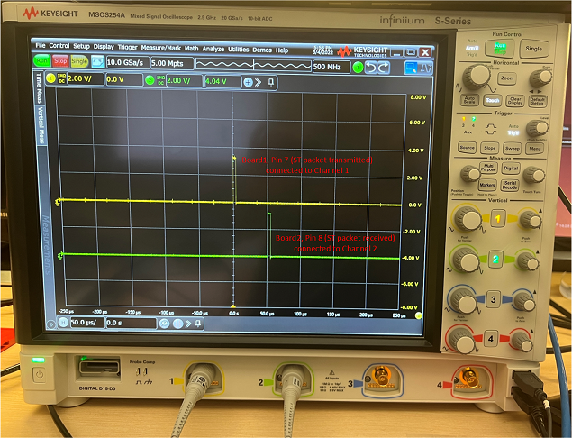

> _**Note:**_ The latency  measurement on the oscilloscope is from a software trigger. This includes the processing time of the processor to read the packet received over the network stack and initiates a trigger signal to the PMOD. When work load on the processor is high, latency measurements could reflect a higher value.

##### Network Time Shaper Function (802.1Qbv Demo)

This demo allots a time slot for scheduled traffic and best effort and it can be visualized on an oscilloscope. For a cycle time period of 1ms, ST traffic is sent for 700us and BE traffic for 300us.

##### Oscilloscope or Analog Discovery 2 Setup

* Connect P8 on the Test PMOD of **Board2** to Channel1 of the oscilloscope - ST packet Rx
* Connect P10 on the Test PMOD of **Board2** to Channel2 of the oscilloscope - BE packet Rx
* Set up triggers on Channel1 and Channel2 with an OR condition and set the time scale interval to 1 millisecond.

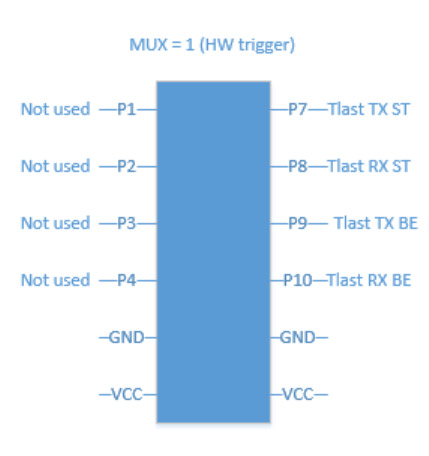

**Board2** listens for packets. On Board1, the application sets up time slots for the traffic classes.  It generates packets in continuous mode for both traffic types. The oscilloscope monitors the tlast signal of scheduled packets and best effort packets exposed by the TSN IP.

* _Start Receive on Board2_

  ```bash
  source /usr/bin/start_qbv_test.sh -rx
  ```

* _Start Transmit on Board1_

  ```bash
  source /usr/bin/start_qbv_test.sh -tx
  ```

    The talker on Board1 runs for 30 seconds and exits.

###### Observe Results

The scope shot shows a 70% Scheduled traffic 30 % Best Effort traffic distribution.

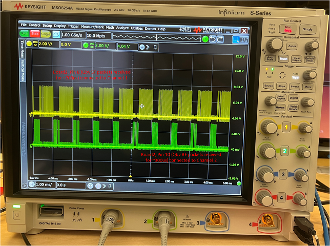

> _**Note:**_ You can also monitor Tlast TX ST (P7) and  Tlast TX BE (P9) on Board1, but the distribution is not as clean as the RX because we are monitoring the data going into the TSN IP before it is scheduled to go out on the Ethernet MAC.

##### No Oscilloscope Setup

* No connections to the Pmods are required in this case since the oscilloscope is not used.  Instead, the Wireshark application is used to analyze traffic types.

* _Start Receive mode on Board2 and use tcpdump to begin capturing received packets_

  ```bash
  source /usr/bin/start_qbv_test.sh -rx
  tcpdump -i ep -w qbv.pcap
  ```

* _Start Transmit mode on Board1_

  ```bash
  source /usr/bin/start_qbv_test.sh -tx
  ```

    The talker on Board1 runs for 30 seconds and exits automatically.

* Exit tcpdump using CTRL-c key combination to end capture on Board2.
* Move the qbv.pcap capture file to the SD card located under the /boot directory.
* Move the qbv.pcap file from the SD card to the host PC to analyze the packet distribution within Wireshark.

##### Observe Results

Wireshark trace shows a 70% Scheduled traffic 30 % Best Effort traffic distribution.

* Start Wireshark on the host PC. Use the one available under Ubuntu.

  ```bash
  wireshark &
  ```

* In the Wireshark GUI, select File → Open → Browse and select the qbv.pcap file.

* Observe that there are two sets of packets within the capture, one set with packet length=900, another set with packet length=800, which when plotted against time forms a 70:30 distribution. The packet length is based on the setting from the talker script. Below is an example of lengths 900 and 800 for Scheduled and Best Effort traffic, respectively.

  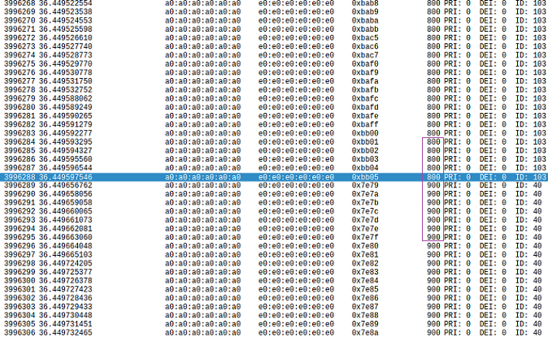

* Click on a packet with length=900 bytes and observe the vlan ID=10, Priority (PCP/PRI=4) where a packet with PCP=4 indicates that it is Scheduled traffic.

  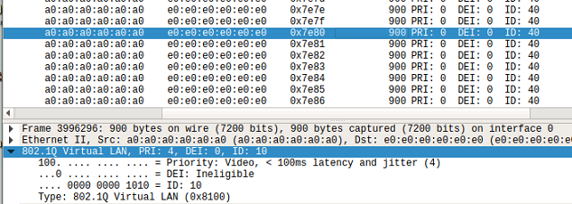

* Click on a packet with length=800 bytes and observe the vlan ID=20, Priority (PCP/PRI=1) where a packet with PCP=1 indicates that it is Best Effort traffic.

  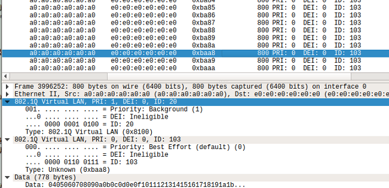

### Network Configuration 2 : Network Manager(CNC) and Two KR260/KD240 Boards

This configuration requires either two KR260/KD240 units and one KV260/KR260/KD240 unit(CNC) or two KR260/KD240 units and one Linux Running Machine(CNC). The following images represent these configurations:

> _**Note:**_ This tutorial can be run with one KD240 and one KR260 configuration as well.

#### Two KR260/KD240 and one KV260/KR260/KD240(CNC)

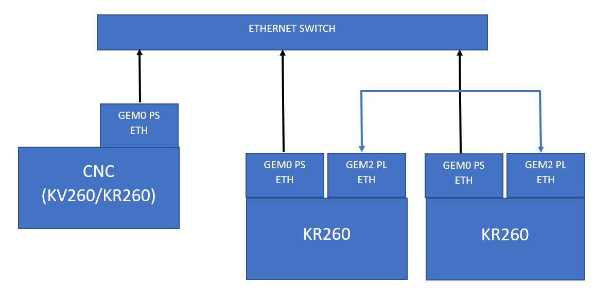

#### Two KR260/KD240 and one Linux Running Machine(CNC)

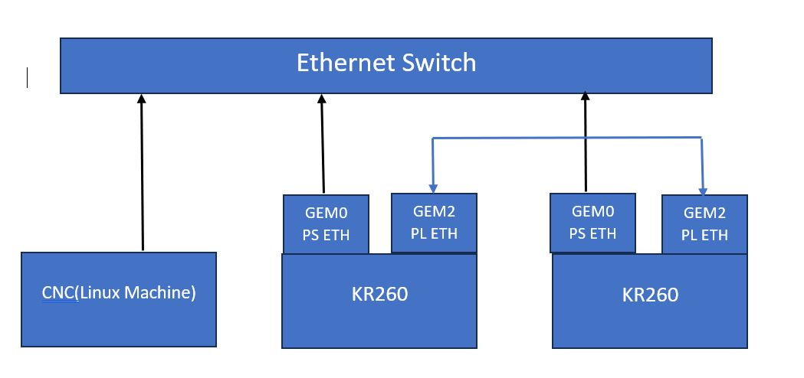

> _**Note:**_ For KD240 J24 is PS Eth, J25B top is PL Eth. For KR260 J10D is PS Eth, J10B top is PL Eth

#### Run TSN-ROS Out of Box Applications

* Ensure to load TSN docker and accelerator/firmware (refer to [Run Docker](#run-tsn-docker-image) and [Load Firmware and Modules](#load-tsn-firmware-and-modules) sections) before testing example application. If the firmware is already loaded, ignore this step and proceed.

* Setup Ethernet ports by running the following commands on the serial terminal. This sets the MAC/IP/VLAN on the EP and ETH ports of the TSN switch IP.

  * _KR260/KD240 Board1 interface setup_

    ```bash
    source /usr/bin/net_setup.sh -b1
    ```

  * _KR260/KD240 Board2 interface setup_

    ```bash
    source /usr/bin/net_setup.sh -b2
    ```

##### Run Instructions

1. Run parser on the both KR260/KD240 units.

    * Setup one board as Master and one as Slave. Run the following:

      ```bash
      source /usr/bin/network-manager/tsn-parsers/xnm.sh -m &          #On Board1/Master
      source /usr/bin/network-manager/tsn-parsers/xnm.sh -s &          #On Board2/Slave
      ```

2. Setup Network Manager

    * Download and Run TSN Docker image on CNC as well.

    * Discover the two nodes by pinging them.

      ```text
      bash-5.2# ping -c 3 10.0.0.106                                            #Board1 or Master
      PING 10.0.0.106 (10.0.0.106) 56(84) bytes of data.
      64 bytes from 10.0.0.106: icmp_seq=1 ttl=64 time=0.242 ms
      64 bytes from 10.0.0.106: icmp_seq=2 ttl=64 time=0.200 ms
      64 bytes from 10.0.0.106: icmp_seq=3 ttl=64 time=0.203 ms

      --- 10.0.0.106 ping statistics ---
      3 packets transmitted, 3 received, 0% packet loss, time 2047ms
      rtt min/avg/max/mdev = 0.200/0.215/0.242/0.019 ms

      bash-5.2# ping -c 3 10.0.0.208                                            #Board2 or Slave
      PING 10.0.0.208 (10.0.0.208) 56(84) bytes of data.
      64 bytes from 10.0.0.208: icmp_seq=1 ttl=64 time=0.242 ms
      64 bytes from 10.0.0.208: icmp_seq=2 ttl=64 time=0.200 ms
      64 bytes from 10.0.0.208: icmp_seq=3 ttl=64 time=0.203 ms

      --- 10.0.0.208 ping statistics ---
      3 packets transmitted, 3 received, 0% packet loss, time 2047ms
      rtt min/avg/max/mdev = 0.200/0.215/0.242/0.019 ms
      ```

    * Run the CNC setup script from the install location to create/modify nodes:

      ```bash
      bash-5.2# /usr/bin/network-manager/xcnc_setup
      ```

    * If a node is not already created, navigate through the options and create two new nodes using Master's and Slave's MAC Address(eth1).

      ```text
      bash-5.2# /usr/bin/network-manager/xcnc_setup

                                    Hi!
                Welcome to the TSN Network Management Engine

      Please choose one of the options below:
      Option 1: Create new node
      Option 2: Modify existing node
      Option 3: Show current nodes
      Option 4: Exit
      Please enter a number:
      1
      Please enter the node's MAC address
      00:0a:35:10:37:fa                           #Board1 or Master
      Creating new node
      Please choose one of the options below:
      Option 1: Create new node
      Option 2: Modify existing node
      Option 3: Show current nodes
      Option 4: Exit
      Please enter a number:
      1
      Please enter the node's MAC address
      00:0a:35:10:39:c2                           #Board2 or Slave
      Creating new node
      Please choose one of the options below:
      Option 1: Create new node
      Option 2: Modify existing node
      Option 3: Show current nodes
      Option 4: Exit
      Please enter a number:
      2
      Nodes currently added:
      node_000a351037fa                           #Board1 or Master
      node_000a351039c2                           #Board2 or Slave
      ```

      > _**Note:**_ Do not exit and follow next steps.

    * On CNC, set qbv configs for swp0 for Board1/Master(70% Scheduled traffic and 30% Best Effort traffic)
      * cycle_time in to be entered nS. Max cycle time is 1sec.
      * cycle start time. Should be '0,' which starts traffic as soon as the talker is running.
      * gate list length can have MAX 256 entries. (gate list length > 0).
      * time for gate list entry to be entered in nS, should not be more the 8000000nS. Sets the time for which gate-state-value that is set will occupy (time > 0).

      ```text
      bash-5.2# /usr/bin/network-manager/xcnc_setup

                                    Hi!
                Welcome to the TSN Network Management Engine
      Please choose one of the options below:
      Option 1: Create new node
      Option 2: Modify existing node
      Option 3: Show current nodes
      Option 4: Exit
      Please enter a number:
      2

      Please enter the node's MAC address
      00:0a:35:10:37:fa                                   #Board1 or Master
      /etc/tsn-networkmanager/node_000a351037fa
      Qbv/fdb?
      qbv
      Enter the switch port whose qbv schedule needs to be modified:
      swp0
      Enter cycle time in nanoseconds, Maximum cycle time is 1 sec
      1000000
      Enter cycle start time (base time)
      0
      Enter gate list length:
      2
      Entry 1
      To open BE use state : 1
      To open ST use state : 4
      To open RES use state : 2
      Open both ST & BE state: 5(1+4)
      Enter gate state value
      4
      Enter time for the gate list entry
      700000
      Entry 2
      To open BE use state : 1
      To open ST use state : 4
      To open RES use state : 2
      Open both ST & BE state: 5(1+4)
      Enter gate state value
      1
      Enter time for the gate list entry
      300000
      10.0.0.106               ether   00:0a:35:10:37:fa   C                     end0

      Sending /etc/tsn-networkmanager/node_000a351037fa/node_000a351037fa_qbv.json

      curl -T /etc/tsn-networkmanager/node_000a351037fa/node_000a351037fa_qbv.json tftp://10.0.0.106
      % Total    % Received % Xferd  Average Speed   Time    Time     Time  Current
                               Dload  Upload   Total   Spent    Left  Speed
      100  9374    0     0  100  9374      0   767k --:--:-- --:--:-- --:--:--  767k
      100  9374    0     0  100  9374      0   746k --:--:-- --:--:-- --:--:--  746k
      ```

      > _**Note:**_ Do not exit and set fdb configs.

    * On CNC, set fdb configs for both the nodes.
        * While creating "fdb," configs destmac should be "e0:e0:e0:e0:e0:e0", vlan ID should be 10, port should be swp1 for Master configs, and swp0 for Slave configs.

      **Example configuration for Board1/Master:**

      ```text
      bash-5.2# /usr/bin/network-manager/xcnc_setup

                                    Hi!
                Welcome to the TSN Network Management Engine
      Please choose one of the options below:
      Option 1: Create new node
      Option 2: Modify existing node
      Option 3: Show current nodes
      Option 4: Exit
      Please enter a number:
      2
      Nodes currently added:
      node_000a351037fa                           #Board1 or Master
      node_000a351039c2                           #Board2 or Slave

      Please enter the node's MAC address
      00:0a:35:10:37:fa                           #Board1 or Master
      /etc/tsn-networkmanager/node_000a351037fa
      Qbv/fdb?
      fdb
      Please enter a destination MAC address for the CAM entry
      e0:e0:e0:e0:e0:e0
      Please enter a vlan ID(s)/range of vlan's for the CAM Entry
      10
      Please specify destination switch port/s:
      swp0: 3, swp1: 1, swp2: 2
      Multiple ports can be specified using a comma separated string
      1
      Static CAM entry added locally, Want to add more entries [Y/N]? If you enter N/n, device will be programmed immediately
      n
      10.0.0.106               ether   00:0a:35:10:37:fa   C                     end0

      Sending /etc/tsn-networkmanager/node_000a351037fa/node_000a351037fa_fdb.json

      curl -T /etc/tsn-networkmanager/node_000a351037fa/node_000a351037fa_fdb.json tftp://10.0.0.106
      % Total    % Received % Xferd  Average Speed   Time    Time     Time  Current
                               Dload  Upload   Total   Spent    Left  Speed
      100  2574    0     0  100  2574      0   440k --:--:-- --:--:-- --:--:--  440k
      100  2574    0     0  100  2574      0   414k --:--:-- --:--:-- --:--:--  414k

      ```

      **Example configuration for Board2/Slave:**

      ```text
      bash-5.2# /usr/bin/network-manager/xcnc_setup

                                    Hi!
                Welcome to the TSN Network Management Engine
      Please choose one of the options below:
      Option 1: Create new node
      Option 2: Modify existing node
      Option 3: Show current nodes
      Option 4: Exit
      Please enter a number:
      2
      Nodes currently added:
      node_000a351037fa                           #Board1 or Master
      node_000a351039c2                           #Board2 or Slave

      Please enter the node's MAC address
      00:0a:35:10:39:c2                           #Board1 or Master
      /etc/tsn-networkmanager/node_000a351037fa
      Qbv/fdb?
      fdb
      Please enter a destination MAC address for the CAM entry
      e0:e0:e0:e0:e0:e0
      Please enter a vlan ID(s)/range of vlan's for the CAM Entry
      10
      Please specify destination switch port/s:
      swp0: 3, swp1: 1, swp2: 2
      Multiple ports can be specified using a comma separated string
      3
      Static CAM entry added locally, Want to add more entries [Y/N]? If you enter N/n, device will be programmed immediately
      n
      10.0.0.208               ether   00:0a:35:10:39:c2   C                     end0

      Sending /etc/tsn-networkmanager/node_000a351037fa/node_000a351037fa_fdb.json

      curl -T /etc/tsn-networkmanager/node_000a351037fa/node_000a351037fa_fdb.json tftp://10.0.0.208
      % Total    % Received % Xferd  Average Speed   Time    Time     Time  Current
                               Dload  Upload   Total   Spent    Left  Speed
      100  2574    0     0  100  2574      0   440k --:--:-- --:--:-- --:--:--  440k
      100  2574    0     0  100  2574      0   414k --:--:-- --:--:-- --:--:--  414k
      ```

      > _**Note:**_ Exit after setting fdb configs.

3. Run Traffic
   * Verify if the schedule is set for ep(swp0) on Board1/Master.

     ```bash
     bash-5.2# qbv_sched -g ep

     List length: 2
     Cycle time: 1000000
     Base time: 1684277666s 0ns
     List 0: Gate State: 4 Gate Time: 700000ns
     List 1: Gate State: 1 Gate Time: 300000ns
     ```

   * Start talker on Board1/Master

     ```bash
     bash-5.2# tsn_talker -n -1 -l 900 -v 10 -p 4 &       #for ST Traffic
     bash-5.2# tsn_talker -n -1 -l 900 -v 10 -p 1 &       #for BE Traffic
     ```

   * Start capture of received packets on Board2/Slave

     ```bash
     bash-5.2# tcpdump -i ep -w qbv.pcap -vvv

     tcpdump: listening on ep, link-type EN10MB (Ethernet), snapshot length 262144 bytes
     ^C696566 packets captured
     768225 packets received by filter
     71379 packets dropped by kernel
     ```

    > _**Note:**_ Packet count should increment quickly as soon as you run the tcpdump command.

   * Exit out of tcpdump after a few seconds using the CTRL-c key combination to end capture on Board2.

   * qbv.pcap file saved in the current directory shows packet distribution.

   * Move the qbv.pcap file from the SD card to the host PC to analyze the packet distribution within Wireshark.

   * Kill talker on Board1/Master

     ```bash
     bash-5.2# killall tsn_talker
     ```

4. Analyze the packet distribution on wireshark

    Wireshark trace shows a 70% Scheduled traffic 30 % Best Effort traffic distribution

    * Start Wireshark on the host PC

      ```bash
      # For Linux

      wireshark &
      ```

    For Windows, download [Wireshark](https://www.wireshark.org/download.html).
    * In the Wireshark GUI, select File → Open → Browse and select the qbv.pcap file.

    * Observe that there are packets within the capture, with packet length=900
    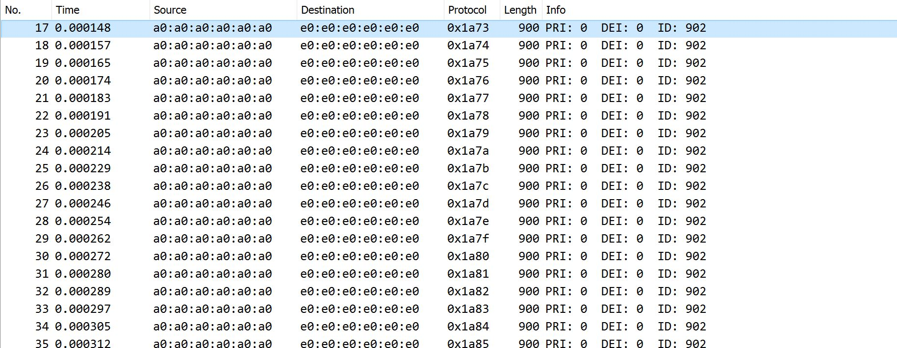.

    * Type the filter as 'vlan.priority == 4' in "Apply display filter" in Wireshark.

    * Click on a packet and observe the vlan ID=10, Priority (PCP/PRI=4) where a packet with PCP=4 indicates it is Scheduled traffic
    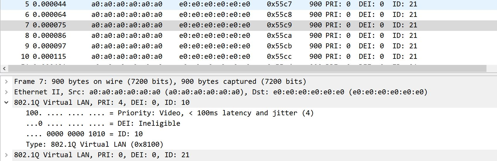.

    * Select the following from Wireshark Tab Statistics -> Capture File Properties. You can see ~70% distribution for ST traffic
    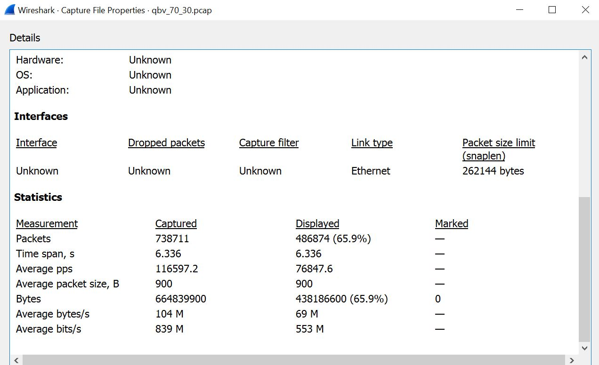.

    * Type the filter as 'vlan.priority == 1' in "Apply display filter" in Wireshark.

    * Click on a packet and observe the vlan ID=4, Priority (PCP/PRI=1) where a packet with PCP=1 indicates it is Best Effort traffic
    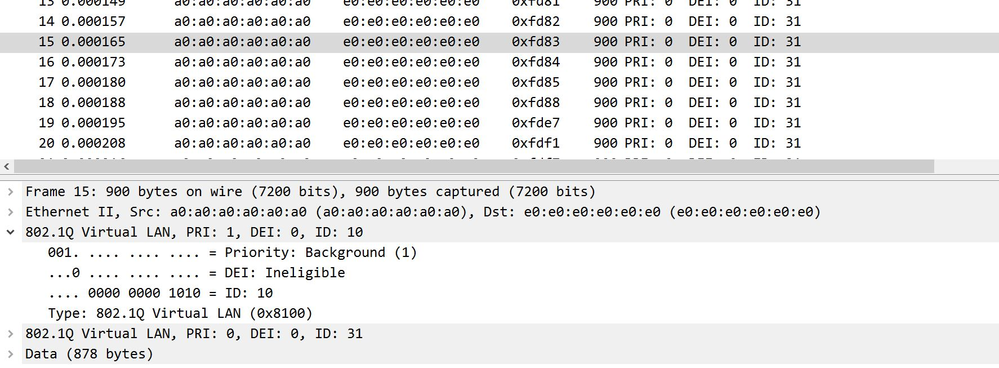.

    * Select the following from Wireshark Tab Statistics -> Capture File Properties. You can see ~30% distribution for BE traffic
    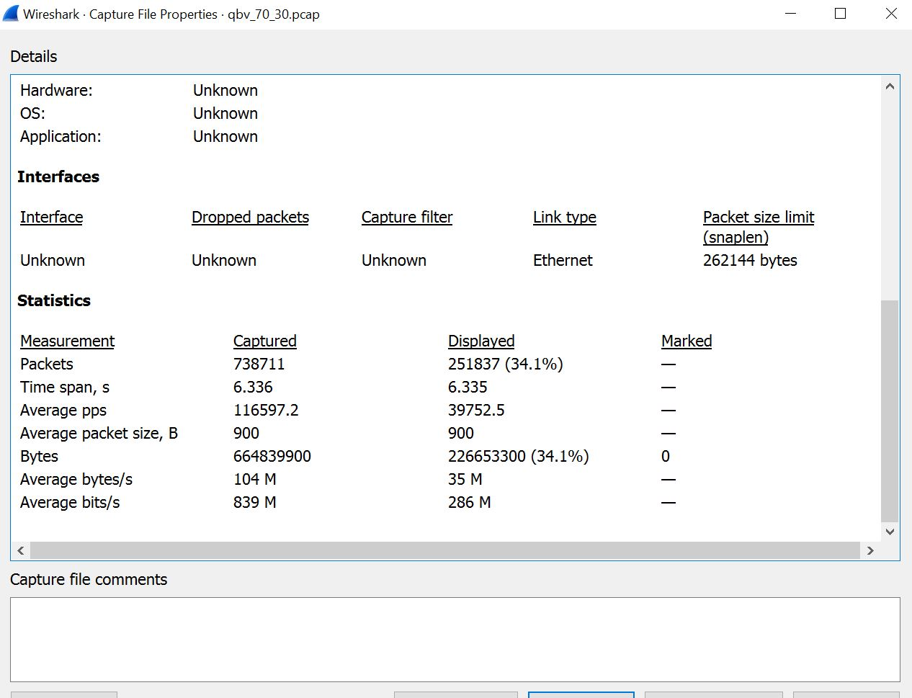.

5. Notice frame-premption - Optional (if preemption was enabled)

    * On CNC, set qbv configs for swp0 for Master(70% Mixed traffic and 30% Scheduled traffic)
        * cycle_time in to be entered nS. Max cycle time is 1sec.
        * cycle start time. Should be '0,' which starts traffic as soon as the talker is running.
        * gate list length can have MAX 256 entries. (gate list length > 0).
        * time for gate list entry to be entered in nS, should not be more the 8000000nS. Sets the time for which gate-state-value that is set will occupy (time > 0).

      ```bash
      # Example

      bash-5.2# /usr/bin/network-manager/xcnc_setup

                          Hi!
             Welcome to the TSN Network Management Engine
      Please choose one of the options below:
      Option 1: Create new node
      Option 2: Modify existing node
      Option 3: Show current nodes
      Option 4: Exit
      Please enter a number:
      2

      Please enter the node's MAC address
      00:0a:35:10:37:fa
      /etc/tsn-networkmanager/node_000a351037fa
      Qbv/fdb?
      qbv
      Enter the switch port whose qbv schedule needs to be modified:
      swp0
      Enter cycle time in nanoseconds, Maximum cycle time is 1 sec
      1000000
      Enter cycle start time (base time)
      0
      Enter gate list length:
      2
      Entry 1
      To open BE use state : 1
      To open ST use state : 4
      To open RES use state : 2
      Open both ST & BE state: 5(1+4)
      Enter gate state value
      5
      Enter time for the gate list entry
      700000
      Entry 2
      To open BE use state : 1
      To open ST use state : 4
      To open RES use state : 2
      Open both ST & BE state: 5(1+4)
      Enter gate state value
      4
      Enter time for the gate list entry
      300000
      10.0.0.106               ether   00:0a:35:10:37:fa   C                     end0

      Sending /etc/tsn-networkmanager/node_000a351037fa/node_000a351037fa_qbv.json

      curl -T /etc/tsn-networkmanager/node_000a351037fa/node_000a351037fa_qbv.json tftp://10.0.0.106
      % Total    % Received % Xferd  Average Speed   Time    Time     Time  Current
                       Dload  Upload   Total   Spent    Left  Speed
      100  9374    0     0  100  9374      0   767k --:--:-- --:--:-- --:--:--  767k
      100  9374    0     0  100  9374      0   746k --:--:-- --:--:-- --:--:--  746k
      ```

    * Verify if the schedule is set for ep(swp0) on Board1/Master

      ```bash
      bash-5.2# qbv_sched -g ep
      List length: 2
      Cycle time: 1000000
      Base time: 1684357652s 0ns
      List 0: Gate State: 3 Gate Time: 700000ns
      List 1: Gate State: 4 Gate Time: 300000ns
      ```

    * Start listener on Board2/Slave

      ```bash
      bash-5.2# tsn_listener &
      ```

    * Start talker on Board1/Master

      ```bash
      bash-5.2# tsn_talker -n -1 -l 900 -v 10 -p 4 &
      bash-5.2# tsn_talker -n -1 -l 1200 -v 10 -p 1 &
      ```

    * Kill listener/talker after a few seconds

      ```bash
      bash-5.2# killall tsn_listener       #Board2
      bash-5.2# killall tsn_talker         #Board1
      ```

    * Check the ethtool stats

      ```bash
      # Board1
      bash-5.2# ethtool --include-statistics --show-mm eth0
      MAC Merge layer state for eth0:
      pMAC enabled: on
      TX enabled: on
      TX active: on
      TX minimum fragment size: 60
      RX minimum fragment size: 60
      Verify enabled: on
      Verify time: 127
      Max verify time: 127
      Verification status: SUCCEEDED
      Statistics:
          MACMergeFrameAssErrorCount: 0
          MACMergeFrameSmdErrorCount: 3
          MACMergeFrameAssOkCount: 0
          MACMergeFragCountRx: 0
          MACMergeFragCountTx: 13808
          MACMergeHoldCount: 1

      # Board2
      bash-5.2# ethtool --include-statistics --show-mm eth0
      MAC Merge layer state for eth0:
      pMAC enabled: on
      TX enabled: on
      TX active: on
      TX minimum fragment size: 60
      RX minimum fragment size: 60
      Verify enabled: on
      Verify time: 127
      Max verify time: 127
      Verification status: SUCCEEDED
      Statistics:
          MACMergeFrameAssErrorCount: 0
          MACMergeFrameSmdErrorCount: 10
          MACMergeFrameAssOkCount: 13488
          MACMergeFragCountRx: 13808
          MACMergeFragCountTx: 0
          MACMergeHoldCount: 0
      ```

      > _**Note:**_ MACMergeFragCountTx on board1/master and MACMergeFragCountRx on board2/slave should match on both sides.

### Enable frame Preemption - Optional

1. Check the current status.

   ```bash
   bash-5.2# ethtool --include-statistics --show-mm eth0
   ```

   > _**Note:**_ Verify pMAC enabled: on. This means preemption is available. TX Enable and Active will be off at this point as boards are not communicating yet.

2. Restart lldpad service

   ```bash
   bash-5.2# pkill -x lldpad 2>/dev/null
   bash-5.2# lldpad -d -t
   ```

3. Enable transmit capabilities

   ```bash
   bash-5.2# lldptool -i eth0 set-lldp adminStatus=rxtx
   bash-5.2# lldptool -i eth0 set-tlv -V addEthCaps enableTx=yes
   ```

   > _**Note:**_ Now TX Enable and Active should be ON automatically on both sides.

4. Check status

   ```bash
   bash-5.2# ethtool --include-statistics --show-mm eth0
   ```

   > _**Note:**_ Notice TX Enable and TX Active are "on" now.
   > Once preemption is enabled, it remains enabled on subsequent reboot as the configuration is stored in lldpad.conf. Delete `/var/lib/lldpad/lldpad.conf` to reset the configuration.

### Network Configuration 3 : KR260/KD240 and PC Workstation

A single KR260/KD240 board communicating with a PC workstation capable of TSN networking.  The PC workstation is using an I210 Ethernet Controller interface card to demonstrate functionality and features of TSN.

#### KR260/KD240 and PC Workstation: Board Setup

* Insert the microSD card containing the boot image into the microSD card slot (J11) on the Starter Kit.
* Connect JTAG/UART port (J4) of the KR260 carrier board to the development PC.
* Connect the TPH2 Pmod to the PMOD2 expansion connector (J18) of the KR260 carrier board.
* Connect Ethernet cable from PL ETH1 (J10 top for KR260)/(J25B top for KD240) Carrier Board  to Intel I210 NIC Ethernet port of the Linux host machine.
* Connect Power Supply to the 12V PWR DC barrel jack (J12) on the KR260/KD240 carrier board.

    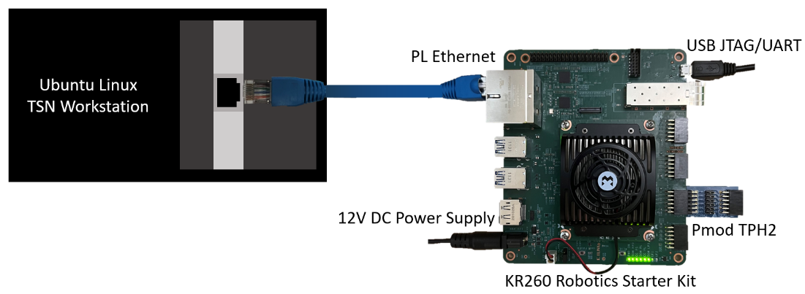

* Ensure to load TSN docker and accelerator/firmware (refer to [Run Docker](#run-tsn-docker-image) and [Load Firmware and Modules](#load-tsn-firmware-and-modules) sections) before testing example application. If the firmware is already loaded, ignore this step and proceed.
* Setup Ethernet port on the target KR260/KD240 board by running the following commands within the USB-UART connected serial terminal, this sets the MAC/IP/VLAN on the EP and ETH port of the TSN switch IP.

  ```bash
  source /usr/bin/net_setup.sh -b2
  ```

##### Workstation Configuration

* To find out the device name of the I210 interface on the Linux host workstation, use the `lshw` utility.

  ```bash
  ubuntu@kria:~$ sudo lshw -class network -short
  H/W path        Device          Class          Description
  ==========================================================
  /0/100/1f.6     enp0s31f6       network        Ethernet Connection (3) I219-LM
  /0/101/0        ens4            network        I210 Gigabit Network Connection
  ```

* The TSN networking interface (I210 interface) on the Linux host workstation must be brought up and linuxptp needs to be installed to demonstrate PTP. To do this, on the Linux workstation, use `sudo ifconfig <i210 interface> up` command as shown in this example usage:

  ```bash
  sudo ifconfig ens4 up
  ```

* _Install ptpt4l on Workstation_

  ```bash
  sudo apt install -y linuxptp
  ```

#### Network Time Synchronization Workstation-KR260/KD240 (PTP Demo)

In this demo, KR260/KD240 sets its clock as slave and the Linux host workstation serves as the clock master. The KR260/KD240 clock syncs with the Linux host workstation clock after a brief synchronization period.

Using a text editor on the Linux TSN host workstation, create a new ptp4l configuration file with the following settings needed to launch ptp4l as the network clock master.

```text
[global]

transportSpecific       1
priority1               248
priority2               249
ptp_dst_mac             01:80:C2:00:00:0E
p2p_dst_mac             01:80:C2:00:00:0E
logAnnounceInterval     1
logSyncInterval         -3
follow_up_info          1
announceReceiptTimeout  3
syncReceiptTimeout      3
neighborPropDelayThresh 800
min_neighbor_prop_delay -20000000
network_transport       L2
delay_mechanism         P2P
tx_timestamp_timeout    10
```

* _Start ptp4l on the Linux TSN host workstation and specify_

  ```bash
  sudo ptp4l -P -2 -H -i <i210 interface> -p <ptp_device> -m -f ptp4l_master.conf >& ptplog &
  ```

> _**Note:**_ In cases where there is more than one PTP device available, specify which one is to be used with the -p argument.

* To find out the correct PTP device on Linux TSN Host Workstation, use the ethtool utility `sudo ethtool -T <i210_interface>`

  ```bash
  #Example
  ubuntu@kria:~$ sudo ethtool -T ens4
  Time stamping parameters for ens4:
  Capabilities:
          hardware-transmit     (SOF_TIMESTAMPING_TX_HARDWARE)
          software-transmit     (SOF_TIMESTAMPING_TX_SOFTWARE)
          hardware-receive      (SOF_TIMESTAMPING_RX_HARDWARE)
          software-receive      (SOF_TIMESTAMPING_RX_SOFTWARE)
          software-system-clock (SOF_TIMESTAMPING_SOFTWARE)
          hardware-raw-clock    (SOF_TIMESTAMPING_RAW_HARDWARE)
  PTP Hardware Clock: 0
  Hardware Transmit Timestamp Modes:
          off                   (HWTSTAMP_TX_OFF)
          on                    (HWTSTAMP_TX_ON)
  Hardware Receive Filter Modes:
          none                  (HWTSTAMP_FILTER_NONE)
          all                   (HWTSTAMP_FILTER_ALL)
  ```

* From the output above, the PTP device for the I210 interface is /dev/ptp0 and the example command on Linux TSN Workstation will be:

  ```bash
  sudo ptp4l -P -2 -H -i ens4 -p /dev/ptp0 -m -f ptp4l_master.conf >& ptplog &
  ```

* _Start ptp on KR260/KD240 in slave clock mode_

  ```bash
  source /usr/bin/start_ptp.sh -s
  ```

> _**Note:**_ Ensure to run the ptp master before starting ptp slave as slave fails to sync when the grandmaster clock is not set. The sync takes about 30 seconds to complete.

##### Observe Results

* The file ptplog contains the saved ptp4l output to the file system on KR260/KD240. The rms value starts out high and trend downward to a single-digit value showing that the clocks are now in sync.

    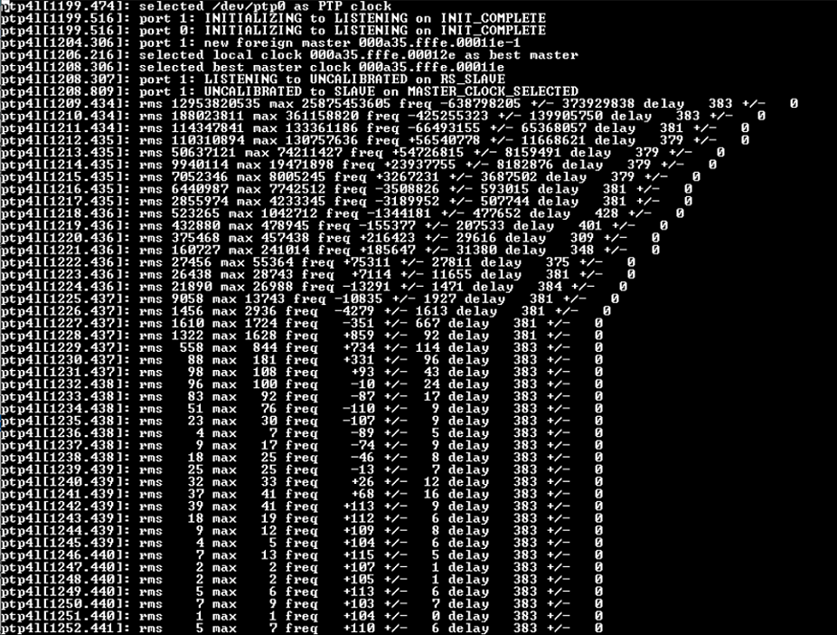

* To see the current status of PTP, run the following command to exit log view when finished.

  ```bash
  tail -f ~/.local/log/ptplog
  ```

#### Network Time Shaper Function (other 802.1Qbv Demo)

This demo allots a time slot for Scheduled Traffic (ST) and Best Effort (BE) traffic and it can be visualized on an oscilloscope.  For a cycle time period of 1ms, ST traffic is sent for 700us and BE traffic for 300us.  Wireshark on the Linux host workstation listens for packets.  On the KR260 board, the application sets up time slots for the traffic classes.  Packets are generated in continuous mode for both traffic types.  Wireshark monitors the incoming packets for scheduled and best-effort traffic exposed by the TSN IP.

An oscilloscope or Analog Discovery 2 device can also be used to monitor Tlast Tx ST (P7) and Tlast Tx EP (P9) on KR260/KD240 board to view the distribution.
Oscilloscope Setup (optional)

* Connect P7 on the Test Pmod of KR260 to Channel1 of the oscilloscope - Tlast Tx ST
* Connect P9 on the Test Pmod of KR260 to Channel2 of the oscilloscope - Tlast Tx EP
* Set up triggers on Channel1 and Channel2 with an OR condition and set the time scale interval to 1 millisecond:

    
* The Analog Discovery 2 can be connected to KR260 using these connections for observing the scheduled traffic:

    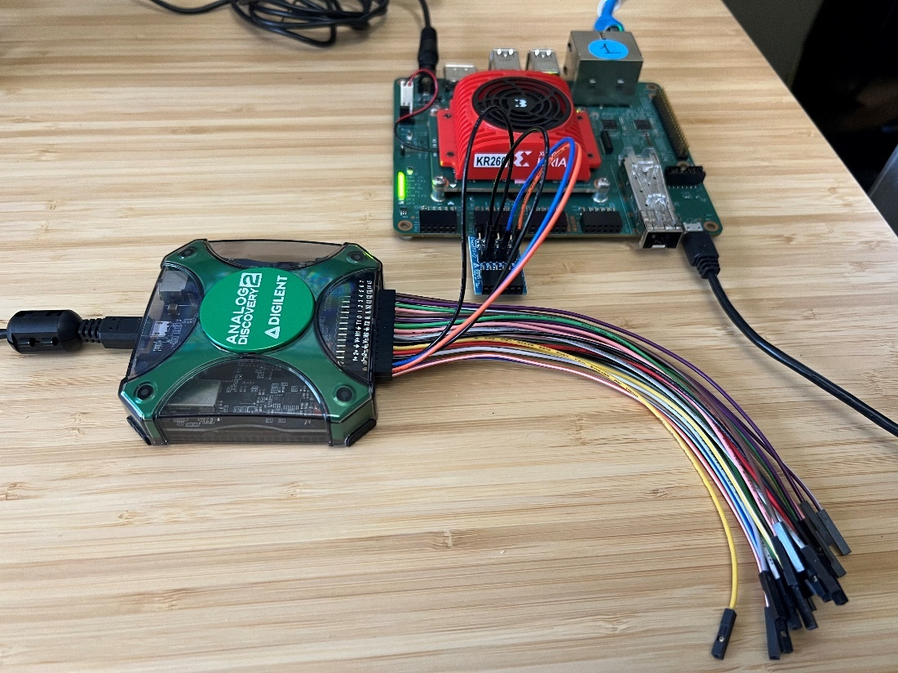

* Start Wireshark on the Linux host machine and select I210 interface to see traffic data

  ```bash
  wireshark &
  ```

* Start transmitting packets from the KR260 board

  ```bash
  source /usr/bin/start_qbv_test.sh -tx
  ```

* The talker on KR260 runs for 30 seconds and exits automatically

##### Observe Results

* The scope shot shows an approximate Scheduled traffic (Channel 1 yellow) and Best Effort traffic (Channel 2 green) distribution.

    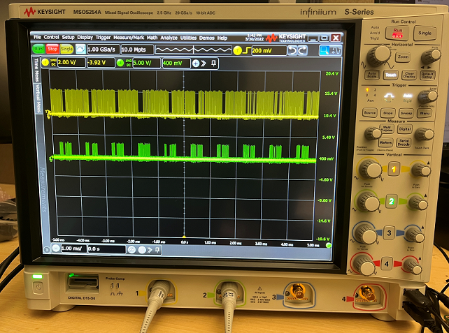

> _**Note:**_  The distribution will not be clean because this is monitoring the data going into the TSN IP before it is scheduled to go out on the Ethernet MAC.

* Observe that there are two sets of packets within the capture, one set with packet length=900, another set with packet length=800.

    

* Click on a packet with length=900 bytes and observe the vlan ID=10, Priority (PCP/PRI=4) where a packet with PCP=4 indicates it is Scheduled traffic.

    

* Click on a packet with length=800 bytes and observe the vlan ID=20, Priority (PCP/PRI=1) where a packet with PCP=1 indicates it is Best Effort traffic.

    

    Wireshark trace shows a traffic distribution of 70% Scheduled traffic and 30% Best Effort traffic.

### Communication using RS485

The K26 SOM has the capability to perform as an advanced and highly integrated gateway for legacy industrial networking protocols (those using RS485/Modbus) to more modern industrial networking infrastructure (such as TSN) and this application serves as an example of how to interface to a remote temperature sensor for capturing data.  This is analogous to integrating in legacy, but still functional, capital equipment to reduce total replacement costs within factory retrofits and technology upgrades.

> _**Note:**_ This test is not applicable for KD240 via PMOD-RS485

#### RS485: Board Setup

KR260:

* Connect the Pmod RS485 to the PMOD1 expansion connector (J2) of the KR260 carrier board. Be sure to connect this to the bottom row of pins (ones labeled 2,4,6,8,10, and 12) since the module is a 1x6 header connecting to a 2x6 connector on KR260.

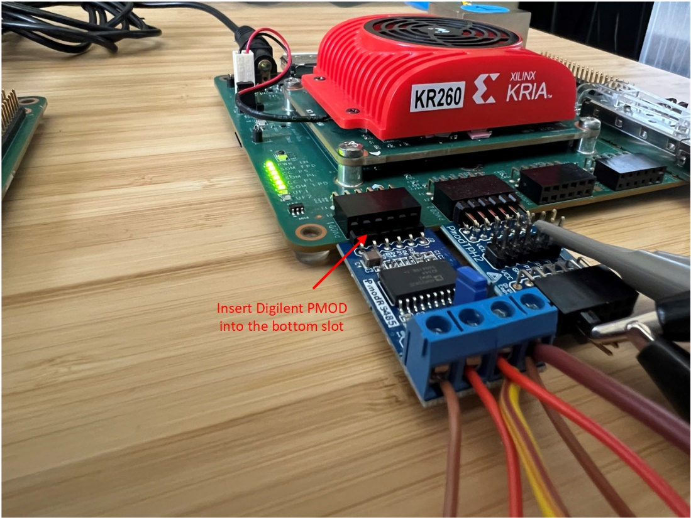

* Connect the Temperature sensor and PMOD RS485 using prototyping wire (18 AWG works well) as shown in the following figure:

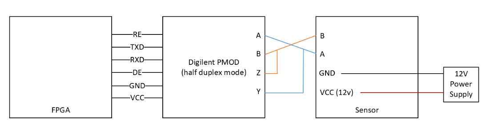

* Connect a 12 VDC supply to power the RS485 temperature sensor using GND and VIN terminals.

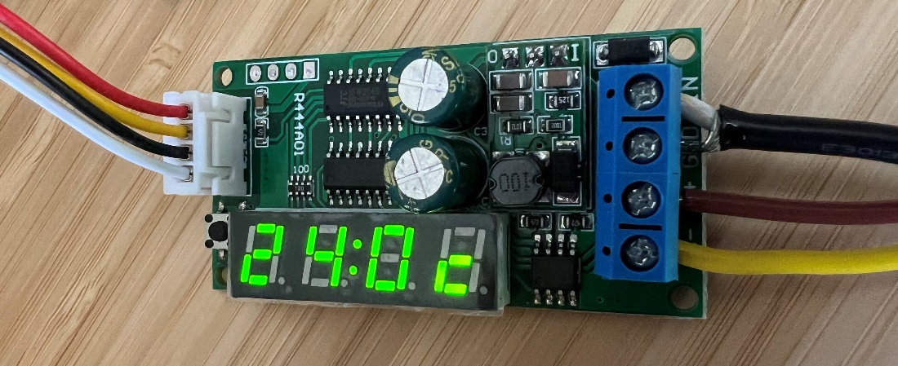

* Connect Power Supply to the 12V PWR DC barrel jack (J12) on the KR260 carrier board.

KD240:

* Connect the RS485 Temperature and Humidity sensor as below on the J22 Connector on the KD240. Obtain a separate 12V power supply to connect the two loose jumpers as shown in the following image, one to GND(black wire in image) and the other to 12V Supply (white wire in image).

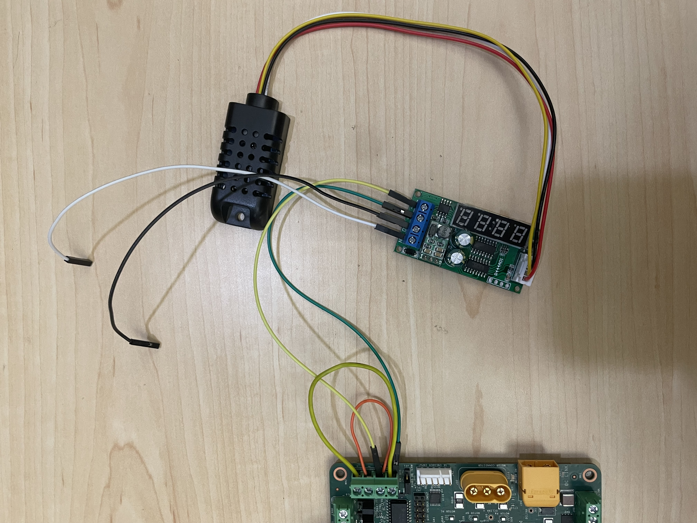

* Connect the Temperature and humidity sensor to the J22 euromag connector as shown below

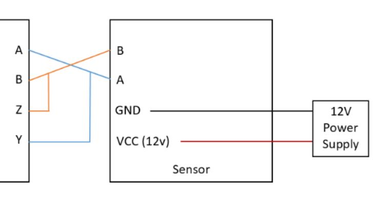

### RS485 Temperature/Humidity Sensor Demo

In this demo, the pmod-test application probes the temperature sensor connected and displays the captured values on the serial terminal.

* Ensure to load TSN docker and accelerator/firmware (refer to [Run Docker](#run-tsn-docker-image) and [Load Firmware and Modules](#load-tsn-firmware-and-modules) sections) before testing example application. If the firmware is already loaded, ignore this step and proceed.

* Probe sensor via RS485 interface.

* Execute binary:
  * KR260 command - `/opt/xilinx/pmod-rs485-test/bin/pmod-rs485-test`
  * KD240 command - `/opt/xilinx/pmod-rs485-test/bin/pmod-rs485-test /dev/ttyPS0`

#### Observe Results

The output on the serial terminal should match the value displayed on the seven-segment LED display of the sensor.

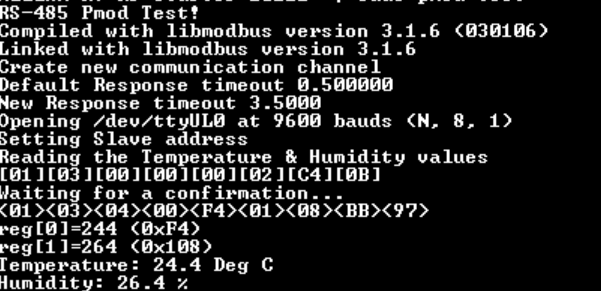

> _**Note:**_  Occasionally, erroneous values (for example 3276.8) are reported for temperature/humidity sensor data and this is due to error in the sensor itself, which can be ignored and the test reruns to clear the error.
>
> ```bash
> reg[0]=32768 (0x8000)
> reg[1]=32768 (0x8000)
> Temperature: 3276.8 Deg C
> Humidity: 3276.8 %
> ```
>
> For reference, here is the register map of the sensor:
> 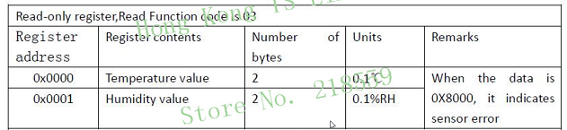

### CAN Communication Setup and Demonstration

The application extends its functionality to support CAN communication by interfacing with
[PMOD CAN](https://digilent.com/reference/pmod/pmodcan/start) devices. This additional feature
allows seamless communication between devices through the CAN interface, enabling efficient
data exchange for various applications.

#### CAN: Board Setup

The configuration requires a setup involving two Kria boards, either for communication between
two KR260 boards or between a KR260 board and a KD240 board.

1. KR260-KR260 Setup

   Connect the PMOD-CAN test point headers to the J19 (PMOD 3) connector on both KR260 boards.
   Connect the PMOD-CAN devices on both boards using jumper wires as shown below:

   * Connect GND on J19 (KR260 board 1) to GND on J19 (KR260 board 2)
   * Connect CANH on J19 (KR260 board 1) to CANH on J19 (KR260 board 2)
   * Connect CANL on J19 (KR260 board 1) to CANL on J19 (KR260 board 2)

   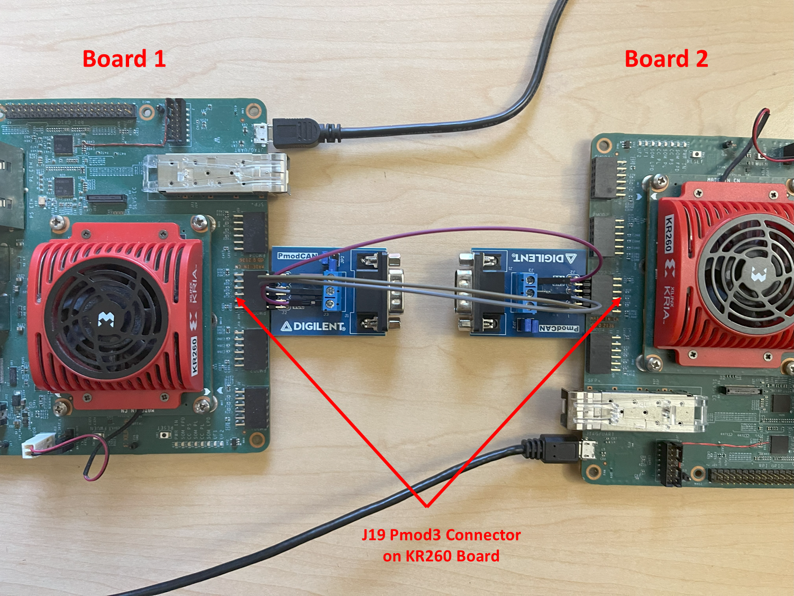

2. KR260-KD240 Setup

   Connect the PMOD-CAN test point headers to the J19 (PMOD 3) connector on KR260 board.
   Connect the PMOD-CAN device on KR260 board to the CAN 2.0 J18 connector on KD240 board
   using jumper wires as shown below:

   * Connect GND on J19 (KR260 board 1) to GND on J18 (KD240 board 2)
   * Connect CANH on J19 (KR260 board 1) to CANH on J18 (KD240 board 2)
   * Connect CANL on J19 (KR260 board 1) to CANL on J18 (KD240 board 2)

   > _**Note:**_ PMOD CAN device is required for KR260 only. For KD240, the PS CAN port J18 is
   used.

    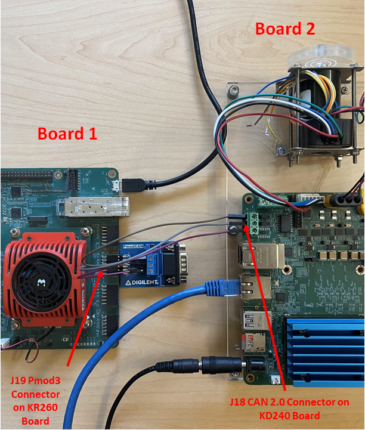

#### CAN Communication Demo

This tutorial provides a step-by-step guide to run a demo of CAN communication between two
Kria boards using the CAN interface. It details the necessary packages and commands
to establish communication, send, and receive messages.

> _**Note:**_ This feature is an additional capability provided by the application to support CAN communication.

* Ensure to load TSN docker and accelerator/firmware (refer to [Run Docker](#run-tsn-docker-image) and [Load Firmware and Modules](#load-tsn-firmware-and-modules) sections) before testing example application. If the firmware is already loaded, ignore this step and proceed.

* Verify CAN device enumeration on both the boards:

  ```bash
  ip link show
  ```

  Ensure that `can0` node is listed to confirm that the CAN device is recognized.
  An example output when run on KR260:

  ```bash
  bash-5.2# ip link show
  1: lo: <LOOPBACK,UP,LOWER_UP> mtu 65536 qdisc noqueue state UNKNOWN mode DEFAULT group default qlen 1000
  link/loopback 00:00:00:00:00:00 brd 00:00:00:00:00:00
  2: sit0@NONE: <NOARP> mtu 1480 qdisc noop state DOWN mode DEFAULT group default qlen 1000
  link/sit 0.0.0.0 brd 0.0.0.0
  3: can0: <NOARP,ECHO> mtu 16 qdisc noop state DOWN mode DEFAULT group default qlen 10
  link/can
  4: end0: <NO-CARRIER,BROADCAST,MULTICAST,UP> mtu 1500 qdisc mq state DOWN mode DEFAULT group default qlen 1000
  link/ether 00:0a:35:18:80:83 brd ff:ff:ff:ff:ff:ff
  5: docker0: <NO-CARRIER,BROADCAST,MULTICAST,UP> mtu 1500 qdisc noqueue state DOWN mode DEFAULT group default
  link/ether 02:42:64:fe:bb:20 brd ff:ff:ff:ff:ff:ff
  8: ep: <BROADCAST> mtu 1500 qdisc noop state DOWN mode DEFAULT group default qlen 1000
  link/ether 00:0a:35:00:01:05 brd ff:ff:ff:ff:ff:ff
  9: eth0: <NO-CARRIER,BROADCAST,UP> mtu 1500 qdisc mq state DOWN mode DEFAULT group default qlen 1000
  link/ether 00:0a:35:00:01:0e brd ff:ff:ff:ff:ff:ff
  10: eth1: <NO-CARRIER,BROADCAST,UP> mtu 1500 qdisc mq state DOWN mode DEFAULT group default qlen 1000
  link/ether 00:0a:35:00:01:0f brd ff:ff:ff:ff:ff:ff
  ```

* Setup the CAN interface on both the boards:

  ```bash
  bash-5.2# ip link set can0 type can bitrate 100000
  bash-5.2# ip link set can0 txqueuelen 1000
  bash-5.2# ip link set can0 up
  ```

* Verify CAN communication:

  Start monitoring messages on board 2

  ```bash
  bash-5.2# candump can0
  ```

  Send CAN message from board 1

  ```bash
  bash-5.2# cansend can0 123#1122334455667788
  ```

  An example output on receiving the message on board 2 is shown below:

  ```bash
  bash-5.2# candump can0

  can0  123   [8]  11 22 33 44 55 66 77 88
  ```

  Similarly, repeat the above steps by sending the message on board 2 and monitoring on board 1.
  This ensures that both sending and receiving functionality is verified on both devices.

* Bring down the CAN interfaces on both boards after testing:

  ```bash
  bash-5.2# ip link set can0 down
  ```

The demo provides users with a foundation to explore and develop CAN-based applications, leveraging
the communication capability provided by the platform. Integrating this with ROS applications allows
for efficient and reliable real-time data exchange, enhancing performance and communication.

## Known issues

Following known issues and their remedies that can be encountered and implemented while testing the above application.

* Repeated broadcast on ping

* PTP timeouts with heavy traffic

For the above two issues, refer to the documentation provided under the _Known issues and troubleshooting_ section from the [AMD TSN solution wiki page](https://xilinx-wiki.atlassian.net/wiki/spaces/A/pages/25034864/Xilinx+TSN+Solution).

## Next Steps

* [Software Architecture of the Platform](sw_arch_platform.md)
* Go back to the [KR260 design start page](../ros2_multinode_communication_via_tsn_landing)

<!---

Licensed under the Apache License, Version 2.0 (the "License"); you may not use this file except in compliance with the License.

You may obtain a copy of the License at http://www.apache.org/licenses/LICENSE-2.0.

Unless required by applicable law or agreed to in writing, software distributed under the License is distributed on an "AS IS" BASIS, WITHOUT WARRANTIES OR CONDITIONS OF ANY KIND, either express or implied. See the License for the specific language governing permissions and limitations under the License.

-->

<p class="sphinxhide" align="center">Copyright&copy; 2023 Advanced Micro Devices, Inc.</p>
