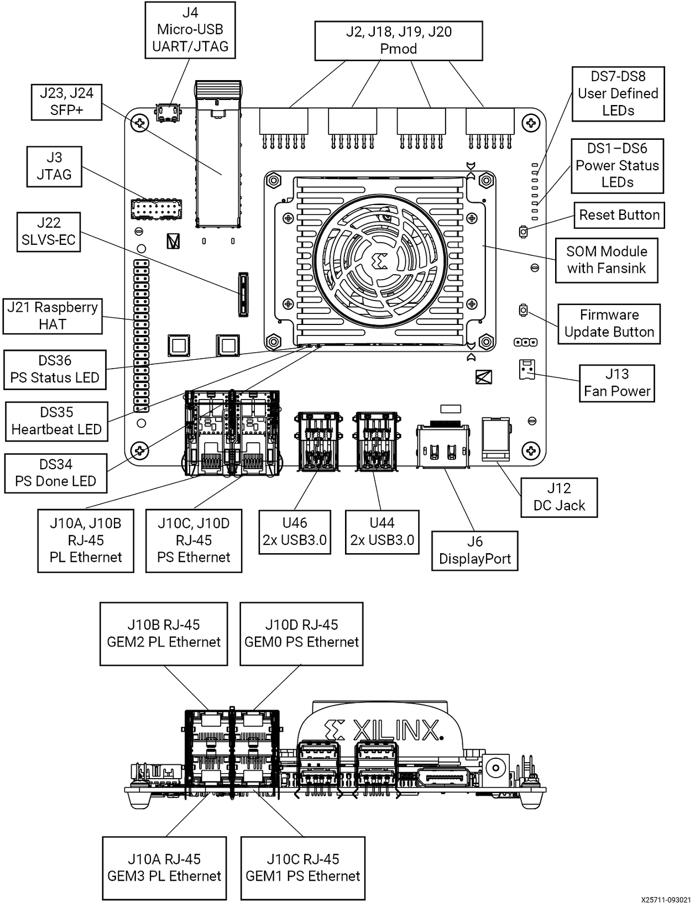
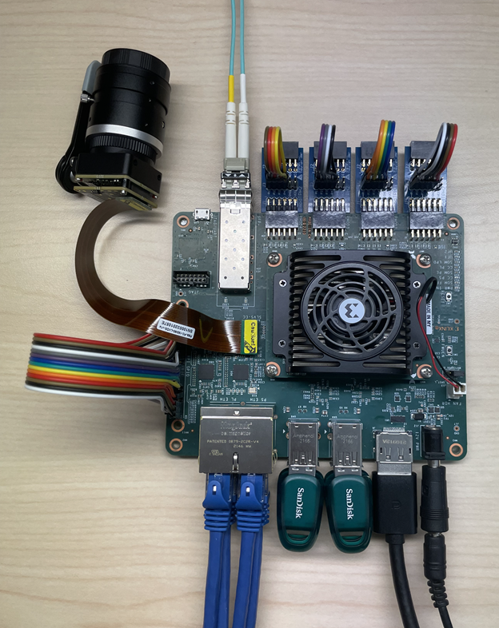
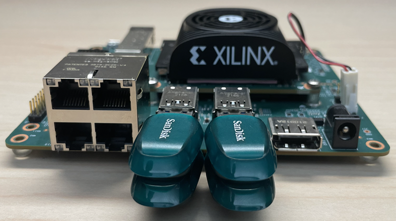
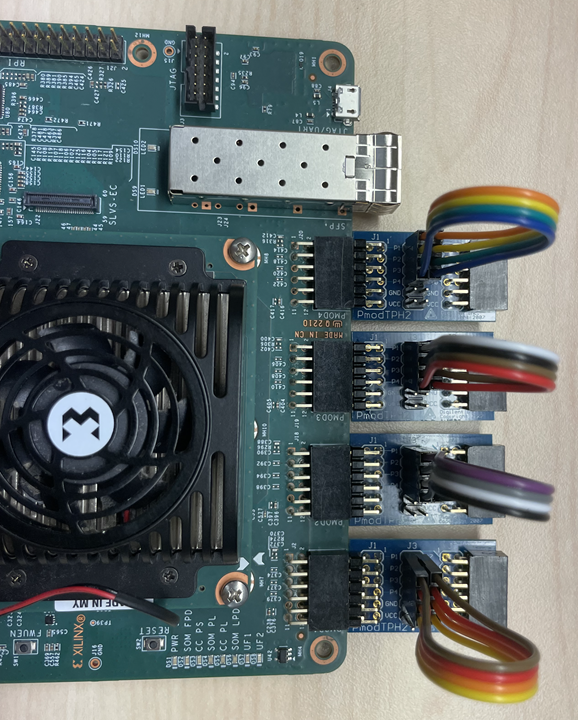
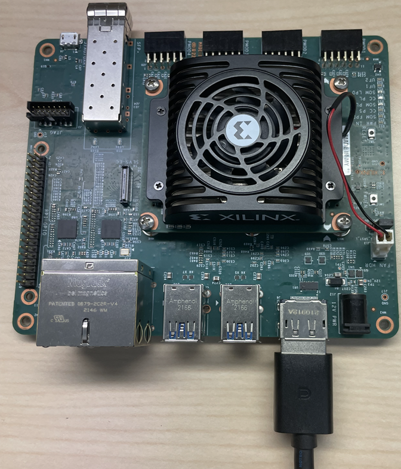
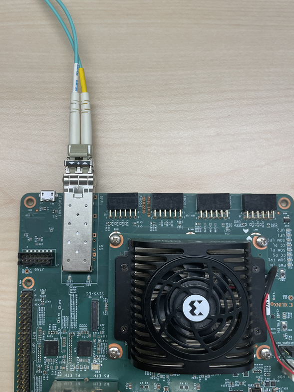
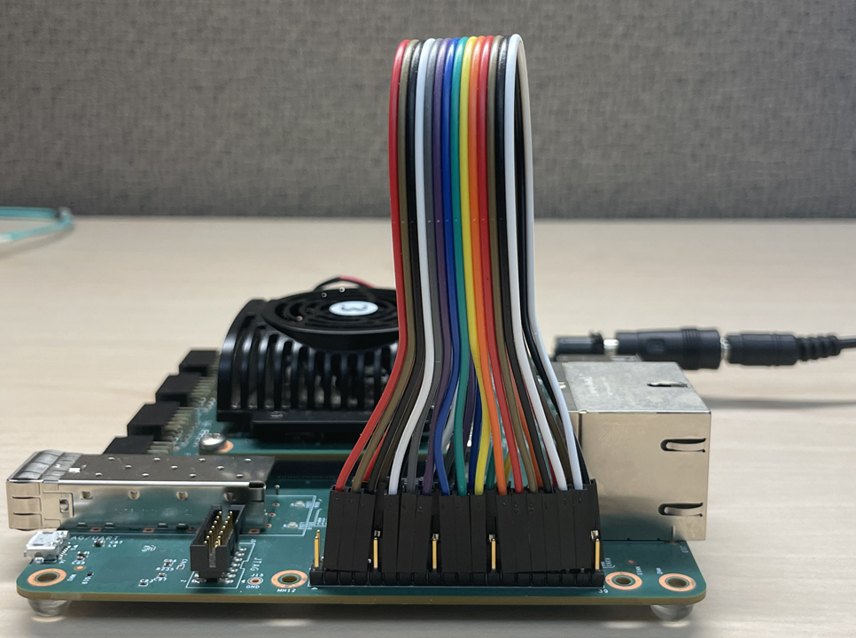
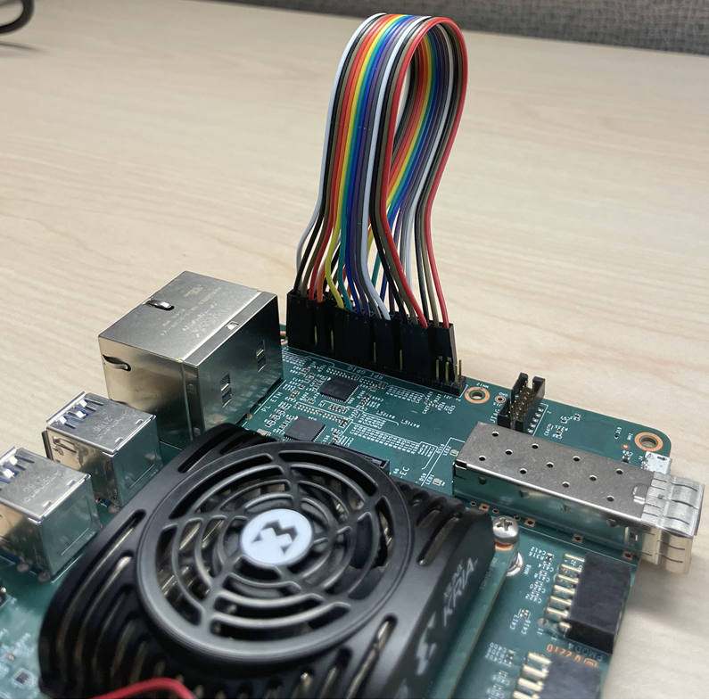

# KR260 BIST Board Setup

## Hardware Requirements

1. KR260 Robotics Starter Kit
2. KR260 Power Supply & Adapter
3. MicroSD Card
4. Host Machine (Widows or Ubuntu)
5. Four USB Flash Drives
6. Five Ethernet Cables
7. Ethernet Switch
8. Four [PMOD TPH2 Test Point Headers](https://digilent.com/reference/pmod/pmodtph2/)
9. 30 Female to Female Jumper Wires
10. 1080P/4K Monitor and Power Supply
11. DisplayPort Cable
12. [Sony IMX547 Monochrome Camera Sensor Module](https://www.xilinx.com/products/som/kria/kr260-robotics-starter-kit/imx547-camera-kit-monochrome.html)
13. [Fiber Optic Cable](https://www.amazon.com/dp/B089K3VYZ1)
14. [Two 10G SFP+ Transceivers](https://www.amazon.com/dp/B08BP55663)
15. [10G NIC Card](https://www.amazon.com/dp/B06X9T683K)

## Board Setup

This page shows how to set up the KR260 before running the BIST application.

Refer to the KR260 Board and the Interface layout below for connector reference numbers:

The following image shows a KR260 with all the hardware connected.

The BIST application requires the following hardware setup to run
the full suite of hardware tests:

* USB Flash Drive (x4)

  

  Connect a USB Flash Drive to each of the 4 USB ports.

* Ethernet Cable (x4)

  

  Connect an Ethernet cable from each of the 4 Ethernet ports on the KR260 to
  the host machine via a switch.

* PMOD (x4)

  

  Connect the PMOD test point headers to the PMOD ports (J2, J18, J19, J20) on
  the KR260. Connect the pins on J3 on each of the four PMOD test point headers
  using jumper wires as described below.
  - Connect P1 to P7
  - Connect P2 to P8
  - Connect P3 to P9
  - Connect P4 to P10

  

* Monitor

  

  Before booting, connect a 1080P/4K monitor to the board via the DP port.

* IMX547 SLVS-EC Sensor Module

  

  Connect the IMX547 Sensor Module to J22 on the KR260.

* SFP+ Module

  

  Connect an SFP+ Transceiver to both ends of the fiber optic cable.
  Install the NIC card in the host machine.
  Connect one end of the fiber optic cable to the KR260 SFP+ connector.
  Connect the other end to the NIC card in the host machine.

* Raspberry Pi GPIO Header

  

  

  Connect the Raspberry Pi GPIO pins on J21 using jumper wires as described
  below.
  - Connect P3 to P8
  - Connect P5 to P10
  - Connect P7 to P12
  - Connect P11 to P16
  - Connect P13 to P18
  - Connect P15 to P22
  - Connect P19 to P24
  - Connect P21 to P26
  - Connect P23 to P28
  - Connect P27 to P32
  - Connect P29 to P36
  - Connect P31 to P38
  - Connect P33 to P40
  - Connect P35 to P37

  

## Next Steps

* [Run the BIST Application](run.md)

Copyright © 2023 Advanced Micro Devices, Inc

<a href="https://www.amd.com/en/corporate/copyright">Terms and Conditions</a>

