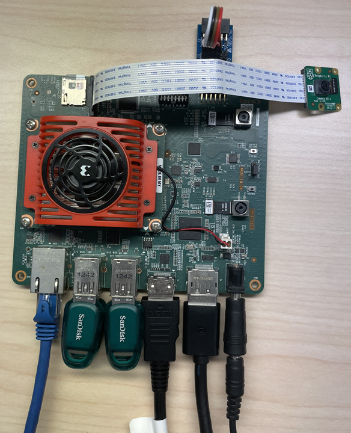
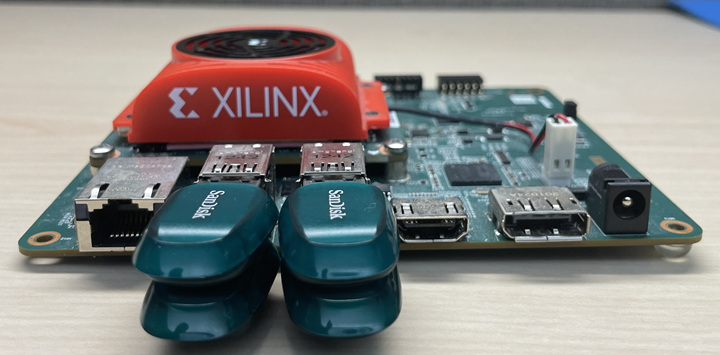
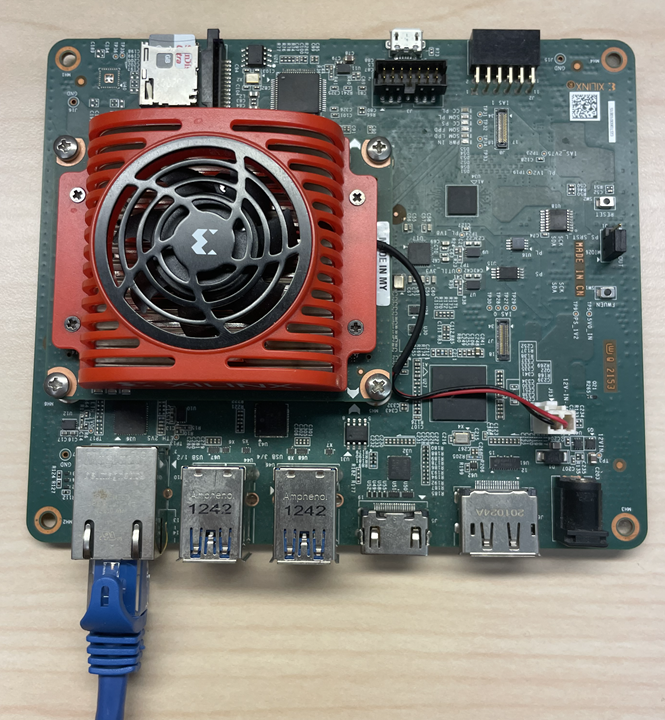
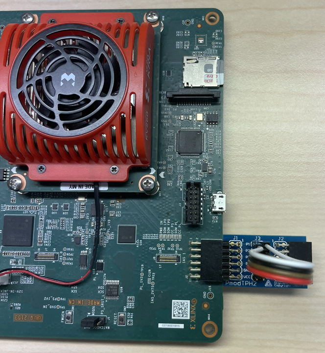
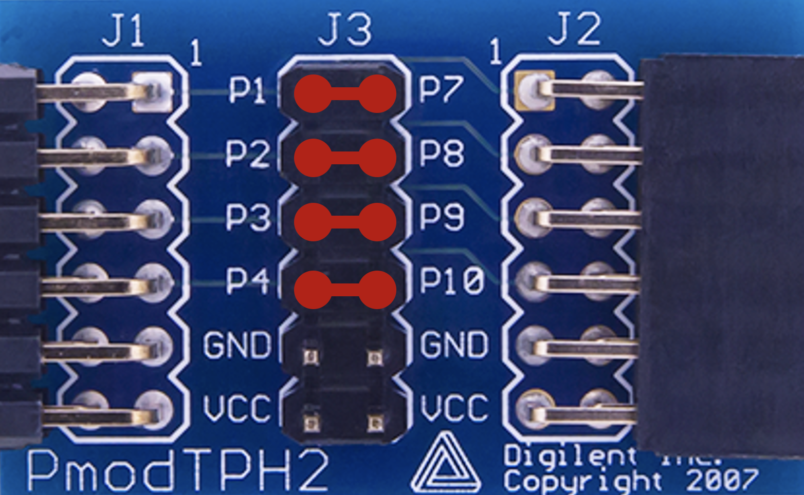
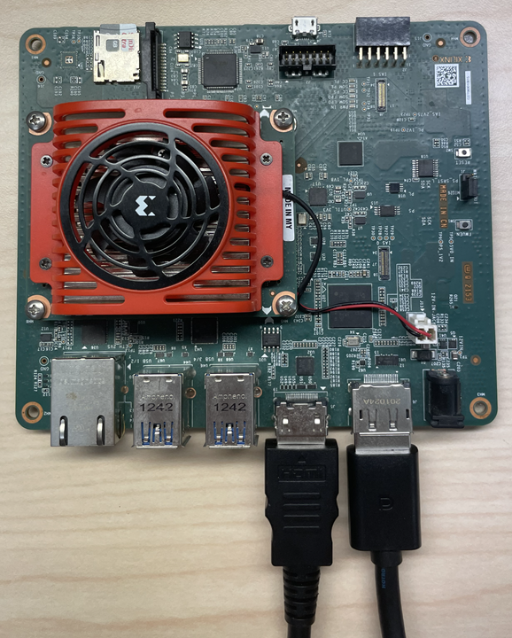
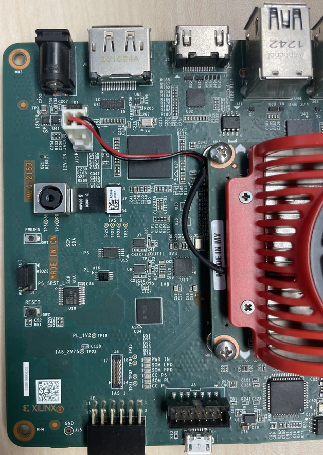
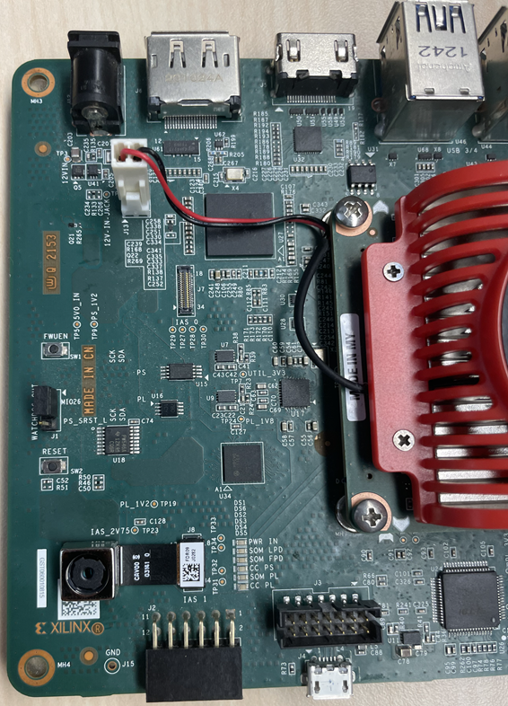
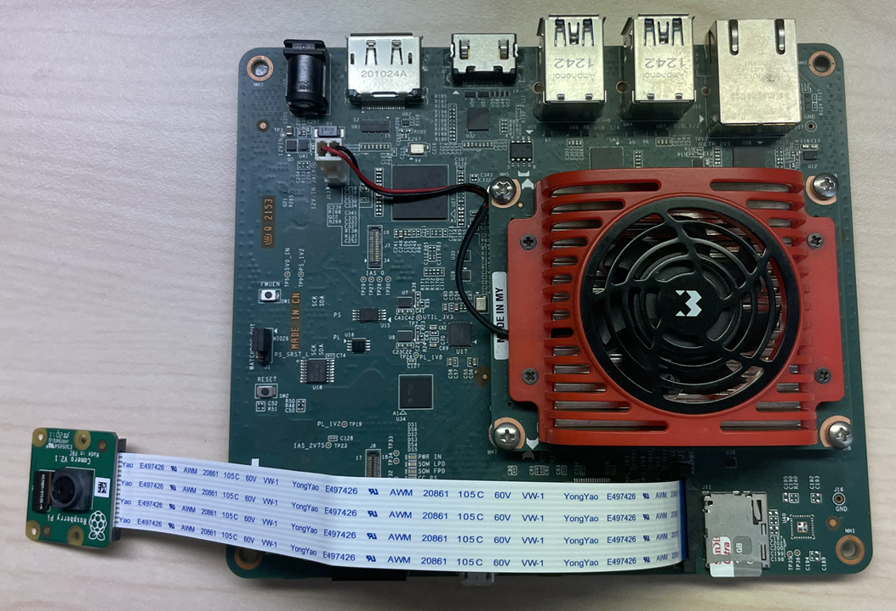

# KV260 BIST Board Setup

## Hardware Requirements

1. KV260 Vision AI Starter Kit
2. KV260 Power Supply & Adapter
3. MicroSD Card
4. Host Machine (Windows or Ubuntu)
5. Four USB Flash Drives
6. One Ethernet Cable
7. One [PMOD TPH2 Test Point Headers](https://digilent.com/reference/pmod/pmodtph2/)
8. Four Female to Female Jumper Wires
9. One [Raspberry Pi Camera Module](https://www.raspberrypi.com/products/camera-module-v2/)
10. Two [Ar1335 Camera Sensors](https://www.xilinx.com/products/som/kria/kv260-vision-starter-kit/basic-accessory-pack.html)
11. 1080P/4K Monitor and Power Supply
12. DisplayPort/HDMI Cable

## Board Setup

This page shows how to set up the KV260 before running the BIST application.

Refer to the KR260 Board and the Interface layout below for connector reference numbers:

The following image shows a KV260 with all the hardware connected.

The BIST application requires the following hardware setup to run
the full suite of hardware tests:

* USB Flash Drive (x4)

  

  Connect a USB Flash Drive to each of the four USB ports.

* Ethernet Cable (x1)

  

  Connect an Ethernet cable from the Ethernet port on the KV260 to
  the host machine.

* PMOD (x1)

  

  Connect Test PMOD on J2 on the KV260. Connect the pins on PMOD as described below.
  - Connect P1 to P7
  - Connect P2 to P8
  - Connect P3 to P9
  - Connect P4 to P10

  

* Monitor

  

  Before booting, connect a 1080P/4K monitor to the board via either DP and/or
  HDMI port.

* AR1335 IAS-ISP Image Sensor Module

  

  Connect the AR1335 Camera Sensor to J7/IAS0 on the KV260.

* AR1335 IAS-direct Image Sensor Module

  

  Connect the AR1335 Camera Sensor to J8/IAS1 on the KV260.

* RaspberryPi Camera v2 module

  

  Connect the Raspberry Pi Camera Module to J9 on the KV260.

## Next Steps

* [Run the BIST Application](run.md)

Copyright © 2023 Advanced Micro Devices, Inc

<a href="https://www.amd.com/en/corporate/copyright">Terms and Conditions</a>

