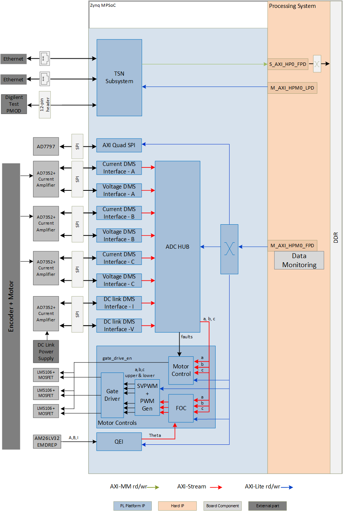
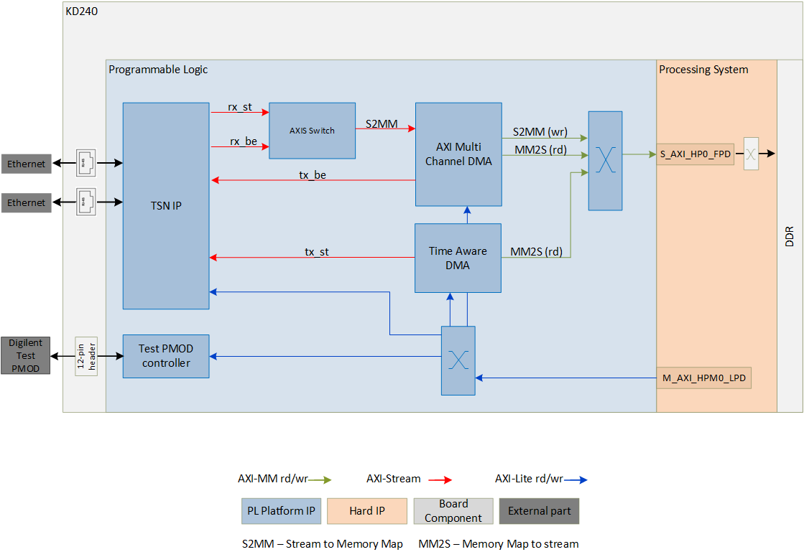
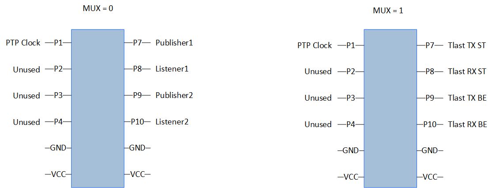

<table class="sphinxhide">
 <tr>
   <td align="center"><h1> Kria&trade; KD240 Motor Control Starter Kit   Motor Control Tutorial</h1>
   </td>
 </tr>
 <tr>
 <td align="center"><h1> Hardware Architecture of the Platform </h1>

 </td>
 </tr>
</table>

# Hardware Architecture of the Platform

## Introduction

 This section describes the design implemented in Programmable Logic (PL). The following figure shows the top level hardware architecture of the reference design.

 At a high level, the design comprises a motor control system, a data monitoring system, a data processing system, and a communication system.

Motor Control System: These are the blocks that control the motor speed and direction.  All but the Gate Driver are High Level Synthesis (HLS) blocks from the Vitis Motor Control Library.

* Quadrature Encoder Interface (QEI)
* Field-Orientated Control (FOC)
* Space Vector Pulse Width Modulation (SVPWM)
* Pulse Width Modulation Generation (PWM Gen)
* Gate Driver

Data Monitoring System: These are the blocks that monitor data from the motor and DC power supply.

* ADC Sample Control
* Current & Voltage Analog to Digital Controller (ADC) Interface for Motor phases A, B, C and DC Link
* Unicode Straight Binary (USB) to Binary Two's Complement (BTC) Conversion
* Bipolar Offset Binary (BOB) to BTC Conversion

Data Processing System: This is the block that controls the ADC interface and decides when to sample the ADCs.  It also does basic filtering, scales the data, and formats it in Q-Scale format.

* ADC Hub

Time-Sensitive Networking (TSN) System: This system support transmission of Ethernet traffic based on traffic shaping protocols. The traffic can be control information to be passed between different nodes in a Robotics system or between various Industrial Field devices. The requirement in these systems would be that the traffic is deterministic.

* TSN IP
* AXI Multi Channel DMA (MCDMA)
* Time Aware DMA (TADMA)
* Test PMOD controller

## Motor Control System

### QEI

The QEI module from the Vitis Motor Control Library reads the encoder on the motor and provides the data to the FOC block.

For more information, visit [Vitis Libraries Documentation](https://docs.xilinx.com/r/en-US/Vitis_Libraries/motor_control/index.html).

### FOC

The FOC module from the Vitis Motor Control Library implements sensor-based field-orientated control.  The eight control modes it supports cover basic speed and torque control modes, as well as field-weakening control.

For more information, visit [Vitis Libraries Documentation](https://docs.xilinx.com/r/en-US/Vitis_Libraries/motor_control/index.html).

### SVPWM

The SVPWM module from the Vitis Motor Control Library implements the front-end for Space Vector Pulse Width Modulation to calculate phase ratios for the motor.

For more information, visit [Vitis Libraries Documentation](https://docs.xilinx.com/r/en-US/Vitis_Libraries/motor_control/index.html).

### PWM Gen

The PWM Gen module from the Vitis Motor Control Library implements the back-end for Space Vector Pulse Width Modulation to generate output signals based on the ratios from SVPWM.

For more information, visit [Vitis Libraries Documentation](https://docs.xilinx.com/r/en-US/Vitis_Libraries/motor_control/index.html).

### Motor Control

The motor control block collects all the fault information generated from ADC Hub and uses this information along with its own phase balance calculations on the Phase A, B, and C data to decide whether to allow the gate drivers to drive the motors.

## Data Monitoring System

### ADC Sample Control

This custom IP converts the motor pwm_sync pulse from the HLS module hls_pwm_gen to an update signal that initiates the ADC capture cycle at regular intervals.  The ADC Sample Control module acts much like a PLL, in that it trys to align the ADC captures to the pwm_sync pulse and keep the ADC samples to an integer number of samples during the pwm_sync cycle.

### ADC7352 Interface

The voltage and current for DC Link and Motor Phase A, B, and C, are captured by the ADC7352 Interface IP.  The IP can be configured for up to 16 channels, each with its own bit resolution.  Each channel can control one ADC7352, with its own Chip Select (CS).  The KD240 Motor Control Kit uses 8 channels at 12 bits resolution.  DC Link ADC uses one chip select, and the Phase A/B/C Motor ADCs share another chip select for simultaneous data collection.

### ADC Encoding Conversions

The KD240 Motor Control Kit makes use of the AD7352 which is a unipolar ADC using USB encoding.  The DC link and stator voltages are measured and encoded without any analog offsets while the current measurements require direction.  For current measurements an instrumentation amplifier with an analog offset output is used to be able to make use of the unipolar ADC to encode both positive and negative measured currents. The following table outlines the expected mapping.

| KD240 Measurement     | -FS Input | -FS Code | Midpoint  | Midpt Code | +FS Input | +FS Code  |
| --------------------- |:---------:|:--------:|:---------:|:----------:|:---------:|:---------:|
| DC Link Voltage       | 0V        | b0000    | +18.432V  | b1000      | +36.864V  | b1111     |
| Motor Stator Voltages | 0V        | b0000    | +18.432V  | b1000      | +36.864V  | b1111     |
| DC Link Current       | 0A        | b0000    | +10.24A   | b1000      | +20.48A   | b1111     |
| Motor Stator Current  | -10.24A   | b0000    | 0A        | b1000      | +10.24A   | b1111     |

For DC Link voltage & current and for motor voltages, the conversion is done in USB to BTC IP.

For motor currents, the conversion is done in BOB to BTC IP.

## Data Processing System

### ADC Hub

This custom IP is the center of the processing for ADC data.  It is parameterizable up to 16 channels, and each channel can be a different width.  Each channel can also be treated as BTC or USB individually, and can be customized to use DSP blocks or logic to implement the multipliers used for scaling the ADC data.  There is also a choice for whether the channel is a Current or Voltage channel.  This information is only to help the software understand what units to use for the data it reads from the ADC Hub.  The KD240 Motor Control Kit uses 8 channels, 12-bits, BTC encoding, and all channels are using the DSP for multipliers.

Inside the ADC Hub are several functions, which are described in the next few sections.

#### Simple Moving Average

The data from the ADCs comes into the ADC Hub and goes into the Simple Moving Average (SMA) block.  If there is an offset programmed by the software, first the offset is subtracted from the raw data coming in from the ADC.  The offset can be positive or negative, which will result in either a smaller or larger value, respectively.

After the offset is applied, then the data is entered into a FIFO, implemented in a Block RAM (BRAM).  Software can program the number of taps to use for the SMA, from 1 to 128 in powers of 2.  The SMA function adds each new data to the sum of the previous data until the number of samples reaches the number of taps programmed by the software.  At that time, the newest sample is added to the sum, and the oldest sample is read out of the BRAM and subtracted from the sum.  The new sum is then shifted by the log2 of the tap count, and becomes the output of the SMA module.

There is no output from the SMA until the number of sammples has reached the number of taps.  If the number of taps changes while the SMA is running, the whole datapath is reset, and the BRAM and adders are cleared.  Once again, there will be no output until the new number of taps matches the number of samples received.

#### Q-Scaler

The ADC Hub scales the averaged data in the Q-Scaler module.  Software programs the scaling factor, which is then multiplied with the averaged data.  This multiplier can be implemented by a DSP or by logic in the configuration of the ADC Hub, on a per-channel basis.  The scaled data is converted to Q-format, with 24 total bits.  The integer portion is 7 bits, the fractional portion is 16 bits, and one sign bit.  This scaled value is passed to the rest of the system as an AXI Stream interface, with no dependence on Tready so that the data is always the most recent value.

The scaling factors used in the KD240 Motor Control Kit are in the following table.

| KD240 Measurement     | ADC Scale Multiplier | ADC Scale (V/cnt) |  Q-Format   |
| --------------------- |:--------------------:|:-----------------:|:-----------:|
| DC Link Voltage       |      1179.6480       |        0.018      |  0x00_049C  |
| Motor Stator Voltages |      1179.6480       |        0.018      |  0x00_049C  |
| DC Link Current       |       655.3600       |        0.010      |  0x00_028F  |
| Motor Stator Current  |       327.6800       |        0.005      |  0x00_0148  |

#### Motor Fault Generation

The averaged and scaled data is compared against limits set by the software to determine whether a fault has occurred.  Software can program over-limits and under-limits per channel.  If such limits are enabled, and the scaled data exceeds these limits, then a fault will be generated.  There are over-faults and under-faults, and if enabled and triggered will result in an error being generated.

Errors can only be cleared by writing a specific value to the associated clear register (one for over-fault and one for under-fault).  These faults are used to generate interrupts for the ADC Hub, if interrupts are enabled.  They are also used by the Motor Control module to generate the gate drive enable signal to the Gate Driver.

#### Register Map

The AXI Interface in the ADC Hub allows the software to control and monitor the hardware.  The register map is below.

Address Decode

| 31:12 |   11:08   |      07:00      |
| ------|:---------:|:---------------:|
|  n/a  | Channel   | Register Offset |

Channel: Up to 16 Channels supported

Register: Up to 64 channels supported

| Offset | Register Name                         | Signed | R/W | Bits Used | Reset Value   |
| -------|:-------------------------------------:|:------:|:---:|:---------:|:-------------:|
| 0x00   | Over Limit Value (Q8.16 Format)       |    Y   | R/W |   23:0    |  0x0000_0000  |
| 0x04   | Under Limit Value (Q8.16 Format)      |    Y   | R/W |   23:0    |  0x0000_0000  |
| 0x08   | Scaling Factor (Q8.16 Format)         |    Y   | R/W |   23:0    |  0x0000_0320  |
| 0x0C   | Number of Taps for Averaging          |    N   | R/W |    8:0    |  0x0000_0004  |
| 0x10   | Raw ADC Value                         |    Y   |  R  |   15:0    |  0x0000_0000  |
| 0x14   | Scaled ADC Value (Q8.16 Format)       |    Y   |  R  |    1:0    |  0x0000_0000  |
| 0x18   | Error Status                          |    N   |  R  |   15:0    |  0x0000_0000  |
| 0x1C   | Clear Over Limit Error (0x0BAD00FF)   |    N   | R/W |   31:0    |  0x0000_0000  |
| 0x20   | Clear Under Limit Error (0x0BAD00FF)  |    N   | R/W |   31:0    |  0x0000_0000  |
| 0x24   | Over Limit Error Enable               |    N   | R/W |    0:0    |  0x0000_0000  |
| 0x28   | Under Limit Error Enable              |    N   | R/W |    0:0    |  0x0000_0000  |
| 0x2C   | Signed (1) or Unsigned (0) Data       |    N   |  R  |    0:0    |   HW Value    |
| 0x30   | Voltage (1) or Current (0) Channel    |    N   |  R  |    0:0    |   HW Value    |
| 0x34   | Total Number of Channels used in Hub  |    N   |  R  |    3:0    |   HW Value    |
| 0x38   | IRQ Disable                           |    N   | R/W |    0:0    |  0x0000_0000  |
| 0x3C   | ADC Offset                            |    N   | R/W |   31:0    |  0x0000_0000  |

## TSN System
 The following figure shows the blocks in the TSN System.

#### TSN IP
The LogiCORE™100M/1G TSN Subsystem IP  implements IEEE 802.1 Time Sensitive Networking (TSN) Standards and provides a low latency Bridged Endpoint. The bridged endpoint solution consists of a 3-port switch, two ports connects to the network and one port connects to an internal Endpoint. In this design RGMII interfaces connects to a Marvel physical-side interface (PHY) supporting a maximum bandwidth of 1 Gbps. The TSN IP is configured to support:

* Network Time Synchronization- 1588 Precision Time Protocol (PTP)
* Scheduled and Best Effort traffic types
* Time aware scheduling (IEEE 802.1 Qbv)
* Frame replication and elimination (IEEE 802.1 CB)
* Per Stream Filtering and Policing (IEEE 802.1 Qci)

For more information on the IP refer to [PG275](https://www.xilinx.com/content/dam/xilinx/member/1gtsn_doc/2020_1/pg275-tsn-endpoint-ethernet-mac.pdf).

Note: You will need access to [1GTSN Documentation Lounge](https://www.xilinx.com/member/1gtsn_doc.html) to view the above document.

#### MCDMA
The AXI MCDMA provides high-bandwidth direct memory access between memory (AXI Memory Mapped) and stream (AXI Stream) target peripherals. It supports both Memory Mapped to Stream (MM2S) and Stream to Memory Mapped (S2MM) transfers. The AXI MCDMA core provides Scatter Gather (SG) interface with multiple channel support with independent configuration. In this design, the MCDMA is responsible to fetch Best Effort traffic for transmission by TSN IP. It reads frames from the DDR memory and passes the data to the TSN IP on AXI Stream interface. It is also responsible for writing the Schedule traffic and Best Effort traffic frames received from the TSN IP to the memory. The IP uses the S_AXI_HP0_FPD on the Zynq UltraScale+ MPSoC Processing System (PS) IP to read/write from/to DDR memory.

For more information on the IP refer to [PG288](https://docs.xilinx.com/v/u/en-US/pg288-axi-mcdma).

#### TADMA
TADMA is aware of QBV schedule cycles, stream time slots and by using PTP
generated time it is capable of fetching frames for different streams/traffic classes from system memory (DDR) at precisely required time, providing excellent time precision for TSN traffic. In this design, TADMA fetches scheduled traffic from memory, based on the Qbv programming and passed it to the TSN IP for transmission.

For more information on the IP refer to [PG316](https://www.xilinx.com/content/dam/xilinx/member/1gtsn/2018_2/pg316-tadma.pdf).

Note: You will need access to [1GTSN Documentation Lounge](https://www.xilinx.com/member/1gtsn_doc.html) to view the above document.

#### Test PMOD Controller
The Test PMOD controller is a user IP that drives the [Digilent Test PMOD](https://digilent.com/shop/pmod-tph2-12-pin-test-point-header/) pins. The IP implements registers detailed below.

| Register offset | Register name | Description  |
|    :----  | :---      |    :----  |
|0x00 |slv_reg0| Bit0 is a MUX enable. If 1 then drive Qbv signals on PMOD. If 0 drive TSN publisher/subscriber 8-bit signatures|
|0x04 |slv_reg1| 8-bit signature when publisher 1 transmits  a TSN frame |
|0x08 |slv_reg2| 8-bit signature when subscriber 1 receives  a TSN frame |
|0x0c |slv_reg3| 8-bit signature when publisher 2 transmits  a TSN frame |
|0x10 |slv_reg4| 8-bit signature when subscriber 2 receives  a TSN frame |

The TSN application can support multiple publishers and subscribers. When the publisher queues up a packet for transmission, it writes a unique 8-bit word to slv_reg*, which is then transmitted on the PMOD pins. Similarly when the subscriber receives a packet, it writes a unique 8-bit word to slv_reg* which is then transmitted on the PMOD pins. The PMOD pins of the publisher and subscriber are hooked up to a scope and are used to measure end to end application latency. The TSN pub sub application sets the MUX (slv_reg0) to 0 before writing the signature value. The figure below shows the mapping on the PMOD pins when MUX is set to 0 and 1.

To view scheduled and best effort traffic the MUX value is set to 1. If Qbv schedule is set, for example a time slot is programmed with 70% scheduled traffic and 30% best effort traffic, then viewing tlast signal of received scheduled traffic and tlast signal of received best effort traffic on a scope will confirm that Qbv is working as expected. Tlast indicates the end of a packet. Transmit signals can also be monitored, but note these signals are the on the outside of the TSN IP and the traffic is yet to be scheduled.

The other signal which is monitored to see if the Transmitter and Receiver clocks are in sync is the PTP clock.

For more information on how to use PMOD signals to check clock synchronization, to measure latency and confirm Qbv programming refer to [application deployment page](./app_deployment.md).

## Clocks, Resets and Interrupts

### Clocks

The following table identifies the main clocks of the PL design, their source, their clock frequency, and their function.

| Clock        | Clock Source  | Clock Frequency | Function |
| :---         |    :----:     |    :---:       | :-----  |
| pl_clk0      |  PS           | 100 MHz | Clock source for clocking wizard (clk_wiz_0)                                       |
| clk_out_100M | clk_wiz_0     | 100 MHz | Clock for data on CIPS port M_AXI_HPM0_FPD and most of the system                  |
| clk_out_48M  | clk_wiz_0     | 48 MHz  | Clock for SCLK to ADC and ADC7352 Interface Module                                 |
| CLK_IN_gem   | External Pin  | 25 MHz  | Clock for TSN Subsystem clocking wizard (clk_wiz_0) generating clocks              |
| clk_out1     | TSN clk_wiz_0 | 200 MHz | TSN IP fifo clock, TADMA IP and MCDMA IP data transactions clock                   |
| clk_out2     | TSN clk_wiz_0 | 125 MHz | TSN IP and TADMA IP Real Time clock (RTC) for internal timers for time sensitivity |
| clk_out3     | TSN clk_wiz_0 | 300 MHz | reference clock for IDELAY control block for PHY operation on TSN IP               |
| clk_out4     | TSN clk_wiz_0 | 100 MHz | AXI-Lite clock to configure TSN IP, MCDMA IP, and Register interface IP            |

### Resets

The following table summarizes the resets used in this design.

| Reset Source     | Function  |
| :---             |    :----  |
| pl_resetn0       | PL reset for proc_sys_reset modules and TSN Subsystem |
| proc_sys_reset_0 | Synchronous resets for clk_out_100M clock domain      |
| proc_sys_reset_1 | Synchronous resets for clk_out_48M clock domain       |
| TSN Phy_reset_n  | Reset for External Phy (tied high)                    |
| TSN rst_clk_wiz_0_100M  | Synchronous Reset for clk_out100M clock domain |
| TSN rst_clk_wiz_0_125M  | Synchronous Reset for clk_out125M clock domain |
| TSN rst_clk_wiz_0_200M  | Synchronous Reset for clk_out200M clock domain |
| TSN rst_clk_wiz_0_300M  | Synchronous Reset for clk_out300M clock domain |

### Interrupts

The following table lists the PL-to-PS interrupts used in this design.

| Interrupt ID | Instance  |
| :---        |    :----  |
|pl_ps_irq0[0]| ADC Hub IP         |
|pl_ps_irq0[1]| Motor Control IP   |
|pl_ps_irq0[2]| AXI Quad SPI 0 IP  |
|pl_ps_irq0[3]| HLS QEI IP         |
|pl_ps_irq0[4]| HLS FOC IP         |
|pl_ps_irq0[5]| HLS SVPWM Duty IP  |
|pl_ps_irq0[6]| HLS PWM Gen IP     |
|pl_ps_irq0[7]| TSN Subsystem      |

The TSN Subsystem interrupts are itemized in the following table.

| Interrupt ID | Instance  |
| :---        |  :----  |
|intr[0-7]| TSN IP    |
|intr[8]| TADMA IP    |
|intr[9-14]| MCDMA IP |

## Resource Utilization

The resource utilization numbers on this platform post implementation is reported in the table below.

| Resource  | Utilization  | Available  | Utilization %  |
| :---      |    :----     | :---       |    :----       |
| LUT       | 57895        | 70560      | 82.05 |
| LUTRAM    | 4098         | 28800      | 14.23 |
| FF        | 84715        | 141120     | 60.03 |
| BRAM      | 116          | 216        | 53.70 |
| DSP       | 133          | 360        | 36.94 |
| IO        | 63           | 81         | 77.78 |
| BUFG      | 21           | 196        | 10.71 |
| MMCM      | 2            | 3          | 66.67 |
| PLL       | 0            | 6          | 0.00  |

## Next Steps

* [Software Archicture](./sw_arch.md)

