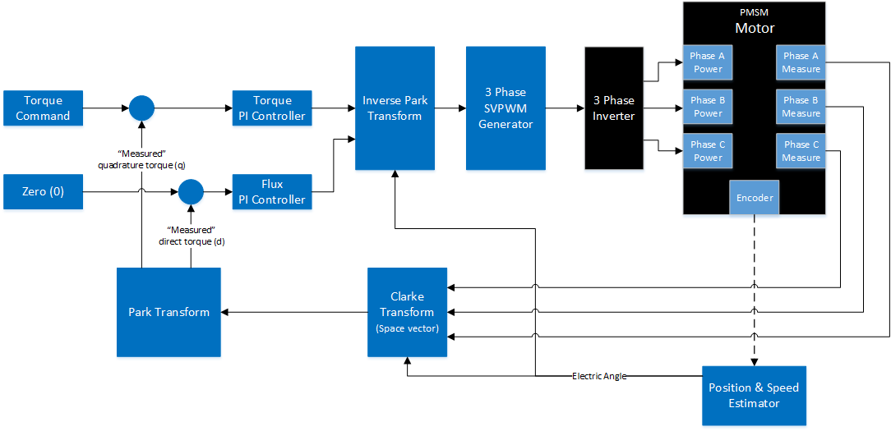
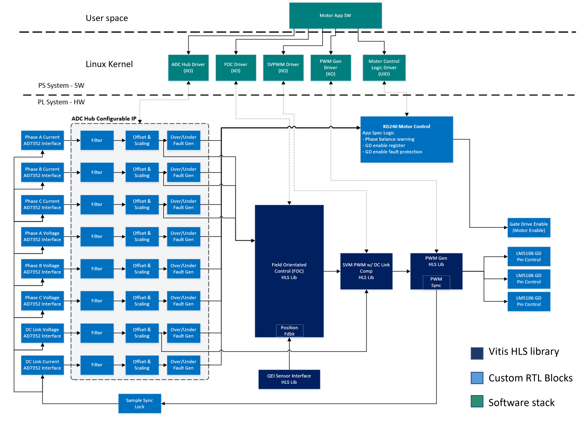

<table class="sphinxhide">
 <tr>
   <td align="center"><h1>Kria&trade; KD240 Drives Starter Kit  FOC Motor Control Application Tutorial</h1>
   </td>
   </td>
 </tr>
 <tr>
 <td align="center"><h1> Introduction </h1>

 </td>
 </tr>
</table>

# Introduction

The KD240 Field Oriented Control (FOC) Motor Control Application is intended to
 capture general inverter and motor control examples using AMD-Xilinx standard
IP/libraries. The IPs, libraries, and drivers serve as a design example
demonstrating the K24 SOMs capabilities in implementing applications that
require precise control of the motor's speed and torque while minimizing energy
losses and reducing system noise. The IPs, libraries and drivers created are to
be general in the sense they do not assume specific board level hardware for
implementing the necessary cyber-physical boundaries around a given application.

An overview of the motor field orientated control library functionality is
summarized in the following three types of FOC based motor control that are
to be implemented for supporting the KD240. Each focuses on either controlling
the torque or speed of the motor.

* Torque Control - Default FOC control is focused on maximizing the torque output
of a motor by optimizing the quadrature (q) vector which represents the useful
motor torque and minimizing the direct (d) vector component. In this mode of
operation the goal is to keep motor torque constant by adjusting motor speed.

* Speed Control - Speed control is implemented through an additional PI control
that adjusts the motor torque to the motor to maintain a constant speed.

* Field Weakening Control - The field weakening control method trades off optimal
torque in order to increase the speed of the motor. This is accomplished by
adjusting the relationship of the q-vector and d-vector in FOC.

## Design and Implementation

The following provide more detailed definitions around the defined motor control
modes of operation.

### Torque Control
Torque control implements a closed loop control focused on maintaining a specified
torque value. In this mode of operation the q-vector provides the useful torque output
of the motor and the d-vector the force that is parallel to the rotor. The d-vector
represents non-useful force and thus any non-zero value is considered an error.

### Speed Control
Constant speed control is achieved through a PI controller that adjusts the motor
torque to maintain a specified motor speed.

## Sensored FOC Application

The block diagram below shows the implementation of the Sensored FOC application.

Motor Voltage and Current Feedbacks are provided by the ADC-HUB. QEI Encoder
provides the measured RPM from the BLDC motor as a feedback to the FOC control
block. The generic PWM block is to provide a series of commands for each
switch of a three leg inverter, with discrete on/off commands for each device.
 The Gate drive Pin control (GD Pin Control) & enable block is intended to
implement the translation from PWM functionality provided by the SVM PWM HLS
IP to the KD240 specific gate drive circuit implementation. The gate drive
enable signal is used to enable the power stage. This signal is shared across
all three power bridge phases. The KD240 Motor Control block provides motor
fault generation and system fault protection logic, which is used to check for
gross failures in the system such as shorted motor winding or failed phase leg.

As seen by the block diagram in the kernel space, All the soft IPs are supported
by kernel drivers using the industrial I/O framework. The drivers provide a
number of features that make the HW easier to configure and use these devices.
It has support for buffers, common sysfs interface and integration with libiio
framework in the user-space. A Motor Control application library is integrated
with the device drivers to seamlessly operate different modes set by the user.
User can control various set points and gain parameters using the Dashboard GUI,
as well as observe live plots of important metrics such as speed, feedback
current/voltages and torque. Instructions to test demo application is presented
in the next section.

## Next Steps

* [Application Deployment](app_deployment.md)
* Go back to the [KD240 FOC Motor Control application start page](../foc_motor_control_landing)

<!---

Licensed under the Apache License, Version 2.0 (the "License"); you may not use
this file except in compliance with the License.

You may obtain a copy of the License at http://www.apache.org/licenses/LICENSE-2.0.

Unless required by applicable law or agreed to in writing, software distributed
under the License is distributed on an "AS IS" BASIS, WITHOUT WARRANTIES OR
CONDITIONS OF ANY KIND, either express or implied. See the License for the
specific language governing permissions and limitations under the License.

-->

Copyright&copy; 2023 Advanced Micro Devices, Inc

