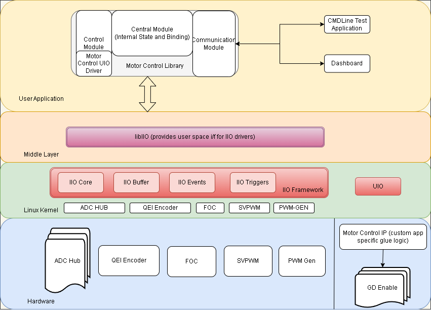
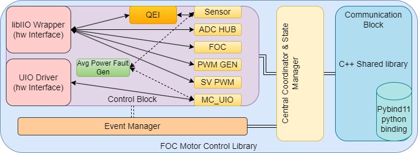

<table class="sphinxhide">
 <tr>
   <td align="center"><h1> Kria&trade; KD240 Drive Starter Kit</h1>
   </td>
 </tr>
 <tr>
 <td align="center"><h1> Software Architecture </h1>

 </td>
 </tr>
</table>

# Software Architecture of the Platform

## Introduction

This section describes software components involved in the design and their relation with each other. The application requires a hardware platform as described in [Hardware Architecture of the Platform](./hw_description.md) for the stack explained in this section to work.

The software stack here provides a comprehensive library that can be interfaced using various user interfaces and efficiently drive the motor through the Kria Drive SOM board.

The following diagram illustrates the top-level architecture and arrangement of various software components:



- Kernel: Ubuntu Linux kernel
  - Drivers:
    - `xilinx_adc_hub`: IIO driver for analog-to-digital converter (ADC) HUB
    - `hls_qei_axi`: IIO driver for the QEI sensor
    - `hsl_foc_periodic`: IIO driver for the sensor based field oriented controller
    - `hls_pwm_gen`: IIO driver for PWM GEN
    - `hsl_svpwm_duty`: IIO driver for SVPWM
- Middleware
  - IIO Framework and libiio library
  - Generic UIO framework
- Application and library
  - Motor Control Library (includes UIO driver for the custom Motor Control IP)
  - Bokeh dashboard

## Kernel Drivers

All the kernel drivers developed for the platform hardware are Industial I/O (IIO) based and adhere to the IIO kernel framework. The IIO subsystem covers many sensor and ADC devices in the industry. It provides the following features to fetch and control various parameters:

- Divide the stream and type of data into logical channels.
- Each channel can have specific attributes along with device attributes to fine-tune the behavior.
- Efficient data collection using buffers to get deterministic data with timestamps and sync with other channels.
- Interrupt handling to provide user side event handling.

The following drivers are added to support this app:

- ADC Hub (`xilinx_adc_hub`): Provides an interface to monitor current, voltage, and related faults that occur during the operation of the motor.
- QEI Encoder (`hls_qei_axi`): External encoder to monitor the real-time speed and position of the motor.
- FOC (`hsl_foc_periodic`): Field oriented controller driver to support various operational modes and state of the motor.
- PWM_GEN (`hls_pwm_gen`): PWM_GEN provides PWM signal generation for motor control.
- SVPWM_GEN (`hsl_svpwm_duty`): SVPWM provides space vector PWM to calcualte phase ratio for the motor.

There is also custom Motor control IP, which is responsible for the design specific glue logic and driving the motor's Gate Driver. The driver for this IP is a UIO based and the device will instantiate the UIO device for this IP. The userspace driver for this is implemented inside the motor control library in the control block.

### Device and Channel Attributes

As explained in the [next section](#userspace-access-to-iio-drivers), the attributes exposed by each drivers can be accessed through sysfs interface or through libraries like libIIO.

Most of the attribute names are self-explanatory. If a channel attribute is named `input`, it indicates that the device requires raw data for processing, and the final processed data can be read from the `input` channel attribute. If the `input` channel attribute is not present, the raw data itself represents the final value from the device.

A couple of common device attributes accross IIO drivers in this application are:

- `sample_interval_us`: This parameter represents the time period in microseconds. It determines the rate at which data is sampled and stored into the buffer. Only channel data is captured within the buffer.
- `ap_ctrl`: This attribute conforms to the standard AMD HLS interface for IP, enabling the initiation of its operation.

The device attributes applies to entire device for all the channels. The channel attributes are per channel configurations or data. Here are some of the attributes exposed by above drivers:

#### Xilinx ADC Hub Channels

List of available channels for the device `xilinx_adc_hub`.

```bash
ubuntu@kria:# iio_attr -c xilinx_adc_hub
dev 'xilinx_adc_hub', channel 'voltage0' (input, index: 0, format: le:S32/32>>0), found 9 channel-specific attributes
dev 'xilinx_adc_hub', channel 'current1' (input, index: 1, format: le:S32/32>>0), found 9 channel-specific attributes
dev 'xilinx_adc_hub', channel 'voltage2' (input, index: 2, format: le:S32/32>>0), found 9 channel-specific attributes
dev 'xilinx_adc_hub', channel 'current3' (input, index: 3, format: le:S32/32>>0), found 9 channel-specific attributes
dev 'xilinx_adc_hub', channel 'voltage4' (input, index: 4, format: le:S32/32>>0), found 9 channel-specific attributes
dev 'xilinx_adc_hub', channel 'current5' (input, index: 5, format: le:S32/32>>0), found 9 channel-specific attributes
dev 'xilinx_adc_hub', channel 'voltage6' (input, index: 6, format: le:U32/32>>0), found 9 channel-specific attributes
dev 'xilinx_adc_hub', channel 'current7' (input, index: 7, format: le:U32/32>>0), found 9 channel-specific attributes
dev 'xilinx_adc_hub', channel 'timestamp' (input, index: 16, format: le:S64/64>>0), found 0 channel-specific attributes
```

Individual Channel Properties for Voltage0 in `xilinx_adc_hub`:

```bash
ubuntu@kria:# iio_attr -c xilinx_adc_hub voltage0
dev 'xilinx_adc_hub', channel 'voltage0' (input), attr 'calibrate',
dev 'xilinx_adc_hub', channel 'voltage0' (input), attr 'fault_clear',
dev 'xilinx_adc_hub', channel 'voltage0' (input), attr 'input', value '0.865447998'
dev 'xilinx_adc_hub', channel 'voltage0' (input), attr 'offset', value '0.000000000'
dev 'xilinx_adc_hub', channel 'voltage0' (input), attr 'over_range_fault_status', value '0'
dev 'xilinx_adc_hub', channel 'voltage0' (input), attr 'raw', value '47'
dev 'xilinx_adc_hub', channel 'voltage0' (input), attr 'scale', value '0.018814086'
dev 'xilinx_adc_hub', channel 'voltage0' (input), attr 'set_filter_tap', value '4'
dev 'xilinx_adc_hub', channel 'voltage0' (input), attr 'under_range_fault_status', value '0'
```

- `calibrate`: One-time calibration at the very start to offset any residual value in the system.
- `fault_clear`: Clears all faults on the channel.
- `input`: Final voltage value read by the ADC in volts (raw * scale factor).
- `offset`: Automatically populated after calibration.
- `over_range_fault_status`: Status indicating if an over-range fault occurred (0 - for no fault).
- `raw`: The ADC raw value.
- `scale`: The scaling factor.
- `set_filter_tap`: Number of filter taps.
- `under_range_fault_status`: Status indicating if an under-range fault occurred (0 for no fault).

The attributes for the currentX channel would be similar to `voltage0`, but the readings are in amperes (amps).

#### HLS PWM Generator Channels

List of available channels for the device `hls_pwm_gen`.

```bash
ubuntu@kria:# iio_attr -c hls_pwm_gen
dev 'hls_pwm_gen', channel 'voltage0', id 'Va_duty_ratio' (input, index: 0, format: le:U32/32>>0), found 3 channel-specific attributes
dev 'hls_pwm_gen', channel 'voltage1', id 'Vb_duty_ratio' (input, index: 1, format: le:U32/32>>0), found 3 channel-specific attributes
dev 'hls_pwm_gen', channel 'voltage2', id 'Vc_duty_ratio' (input, index: 2, format: le:U32/32>>0), found 3 channel-specific attributes
dev 'hls_pwm_gen', channel 'timestamp' (input, index: 3, format: le:S64/64>>0), found 0 channel-specific attributes
```

Individual Channel Properties for Va_duty_ratio in the HLS PWM Generator:

```bash
ubuntu@kria:# iio_attr -c hls_pwm_gen voltage0
dev 'hls_pwm_gen', channel 'voltage0' (input), id 'Va_duty_ratio', attr 'label', value 'Va_duty_ratio'
dev 'hls_pwm_gen', channel 'voltage0' (input), id 'Va_duty_ratio', attr 'raw', value '0.000000000'
dev 'hls_pwm_gen', channel 'voltage0' (input), id 'Va_duty_ratio', attr 'scale', value '1'
```

- `label`: The label of the channel is 'Va_duty_ratio'.
- `raw`: The raw value for this channel is '0.000000000', and in this case, it represents the final reading for the channel.
- `scale`: The scaling factor for this channel is '1'.

The attributes are similar to the other channels from the PWM-GEN driver.

#### HLS SVPWM Duty Channels

List of available channels for the device `hls_svpwm_duty`.

```bash
ubuntu@kria:# iio_attr -c hls_svpwm_duty
dev 'hls_svpwm_duty', channel 'voltage0', id 'Va_cmd' (input, index: 0, format: le:U32/32>>0), found 3 channel-specific attributes
dev 'hls_svpwm_duty', channel 'voltage1', id 'Vb_cmd' (input, index: 1, format: le:U32/32>>0), found 3 channel-specific attributes
dev 'hls_svpwm_duty', channel 'voltage2', id 'Vc_cmd' (input, index: 2, format: le:U32/32>>0), found 3 channel-specific attributes
dev 'hls_svpwm_duty', channel 'timestamp' (input, index: 3, format: le:S64/64>>0), found 0 channel-specific attributes
```

Individual Channel Properties for `Va_cmd` in HLS SVPWM Duty:

```bash
ubuntu@kria:# iio_attr -c hls_svpwm_duty voltage0
dev 'hls_svpwm_duty', channel 'voltage0' (input), id 'Va_cmd', attr 'label', value 'Va_cmd'
dev 'hls_svpwm_duty', channel 'voltage0' (input), id 'Va_cmd', attr 'raw', value '0.000000000'
dev 'hls_svpwm_duty', channel 'voltage0' (input), id 'Va_cmd', attr 'scale', value '1'
```

- `label`: The label of the channel is `Va_cmd`.
- `raw`: The raw value for this channel is `0.000000000`, and in this case, it represents the final reading for the channel.
- `scale`: The scaling factor for this channel is `1`.

The attributes are similar to the other channels from the SVPWM driver.

#### QEI Channels

List of available channels for the device `hls_qei_axi`.

```bash
ubuntu@kria:# iio_attr -c hls_qei_axi
dev 'hls_qei_axi', channel 'rot0', id 'rpm' (input, index: 0, format: le:U32/32>>0), found 3 channel-specific attributes
dev 'hls_qei_axi', channel 'rot1', id 'theta_degree' (input, index: 1, format: le:U32/32>>0), found 3 channel-specific attributes
dev 'hls_qei_axi', channel 'timestamp' (input, index: 2, format: le:S64/64>>0), found 0 channel-specific attributes
```

Individual Channel Properties for RPM in QEI:

```bash
ubuntu@kria:# iio_attr -c hls_qei_axi rot0
dev 'hls_qei_axi', channel 'rot0' (input), id 'rpm', attr 'label', value 'rpm'
dev 'hls_qei_axi', channel 'rot0' (input), id 'rpm', attr 'raw', value '0'
dev 'hls_qei_axi', channel 'rot0' (input), id 'rpm', attr 'scale', value '1'
```

- `label`: The label of the channel is 'rpm'.
- `raw`: The raw value for this channel is '0', and in this case, it represents the final reading for the channel.
- `scale`: The scaling factor for this channel is '1'.

The attributes are similar to the other channels from the QEI driver.

#### FOC Channels

List of available channels for the device `hls_foc_periodic`.

```bash
ubuntu@kria:# iio_attr -c  hls_foc_periodic
dev 'hls_foc_periodic', channel 'current0', id 'Id' (input, index: 0, format: le:U32/32>>0), found 3 channel-specific attributes
dev 'hls_foc_periodic', channel 'current1', id 'Iq' (input, index: 1, format: le:U32/32>>0), found 3 channel-specific attributes
dev 'hls_foc_periodic', channel 'current2', id 'I_alpha' (input, index: 2, format: le:U32/32>>0), found 3 channel-specific attributes
dev 'hls_foc_periodic', channel 'current3', id 'I_beta' (input, index: 3, format: le:U32/32>>0), found 3 channel-specific attributes
dev 'hls_foc_periodic', channel 'current4', id 'I_homopolar' (input, index: 4, format: le:U32/32>>0), found 3 channel-specific attributes
dev 'hls_foc_periodic', channel 'rot5', id 'speed_pi_out' (input, index: 5, format: le:U32/32>>0), found 3 channel-specific attributes
dev 'hls_foc_periodic', channel 'rot6', id 'torque_pi_out' (input, index: 6, format: le:U32/32>>0), found 3 channel-specific attributes
dev 'hls_foc_periodic', channel 'intensity7', id 'flux' (input, index: 7, format: le:U32/32>>0), found 3 channel-specific attributes
dev 'hls_foc_periodic', channel 'rot8', id 'speed' (input, index: 8, format: le:U32/32>>0), found 3 channel-specific attributes
dev 'hls_foc_periodic', channel 'angl9' (input, index: 9, format: le:U32/32>>0), found 2 channel-specific attributes
dev 'hls_foc_periodic', channel 'timestamp' (input, index: 10, format: le:S64/64>>0), found 0 channel-specific attributes
```

Individual Channel Properties for current0 in FOC:

```bash
ubuntu@kria:~$ iio_attr -c hls_foc_periodic current0
dev 'hls_foc_periodic', channel 'current0' (input), id 'Id', attr 'label', value 'Id'
dev 'hls_foc_periodic', channel 'current0' (input), id 'Id', attr 'raw', value '0.000000000'
dev 'hls_foc_periodic', channel 'current0' (input), id 'Id', attr 'scale', value '1'
```

- `label`: The label of the channel is 'Id'.
- `raw`: The raw value for this channel is '0.000000000', and in this case, it represents the final reading for the channel.
- `scale`: The scaling factor for this channel is '1'.

The attributes are similar to the other channels from the FOC driver.

For detailed information on other device attributes, consult the [hardware documentation](./hw_description.md).

For more details of IIO subsystem, refer to [Analog Devices Wiki](https://wiki.analog.com/software/linux/docs/iio/iio).

For more details on kernel drivers for IIO, refer to [Kernel Documentation](https://static.lwn.net/kerneldoc/driver-api/iio/core.html).

## Middleware

### Userspace Access to IIO Drivers

The driver exposes the IIO devices through the sysfs interface. The drivers can be accessed from the path `/sys/bus/iio/devices/iio\:deviceX`, where `X` is the numeric enumeration of the IIO device.

libIIO is the userspace library to easily access the kernel IIO subsystem. It also provides various methods and command line interfaces, packaged in libiio-utils, to access the IIO devices. There are other Python wrappers around this library, but the motor control library uses a native C/C++ library.

For example, to list all the available IIO devices:

```
ubuntu@kria:~$ iio_attr -c
IIO context has 7 devices:
        iio:device0, ams: found 30 channels
        iio:device1, ina260-u14: found 6 channels
        iio:device2, hls_foc_periodic: found 11 channels
        iio:device3, hls_qei_axi: found 3 channels
        iio:device4, xilinx_adc_hub: found 9 channels
        iio:device5, hls_svpwm_duty: found 4 channels
        iio:device6, hls_pwm_gen: found 4 channels
```

For more details, refer to the [libIIO Documentation](https://analogdevicesinc.github.io/libiio/v0.23/index.html).

### Userspace Access to UIO

The custom motor control IP is accessed from the motor control library using the UIO interface. A device tree node with compatible string as `generic-uio` is added to connect this hardware to the UIO subsystem.

The device is now accessible in the userspace through the `/dev/uioX` device. Information about the device is obtained by scanning `/sys/class/uio/uioX`, where `X` is the UIO device id automatically assigned by the kernel.

For more information on the UIO interface, refer to the kernel [documentation](https://www.kernel.org/doc/html/v4.18/driver-api/uio-howto.html).

## Application and Library

The motor control library is a C++ library that provides APIs for the front end application to control and fetch motor parameters. It also has a pybind11 wrapper to support the library APIs through python front end. The front end GUI included with this application is based on a python bokeh server, which can be accessed in a web browser in the network.

### Motor Control Library

The library can be divided into four blocks:

- Communication
- State Management and Coordination
- Event/Fault Management
- Control



#### Communication

The external user interfacing exposes the supported APIs through the C++ shared library and Python module.

The library allows the user application to fetch following values:

- Speed
- Position
- Current (Phase A, Phase B, Phase C, DC Link)
- Voltage (Phase A, Phase B, Phase C, DC Link)
- Fault status
  - Over current for A, B, C, DC
  - Over and under voltage for DCLink
  - RMS power fault
  - Phase imbalance fault
- Intermediate FOC calculations (example: iq, id, i_alpha, etc)

The library allows the user application to set following motor controls:

- Clear faults
- Speed
- Torque
- Open loop parameters (vq and vd)
- Gain P/I gains (for current, speed and flux controller)

For details list of APIs, refer to the [motor-control.hpp](https://github.com/xilinx/foc-motor-ctrl/blob/main/lib/include/motor-control/motor-control.hpp) file.

Python binding for the application is provided using the pybind11 library.

#### State Management and Coordination

This is the central part of the library, which receives and processes all the request from the communication block and is responsible for:

- Executing the initialization sequence for the motor.
- Maintaining the current state of the platform and handling the state transitions.
- Splitting, merging, and coordinating the request with various handlers in the control block.

#### Event/Fault Management

The Event Manager is responsible for configuring and monitoring events/faults from various hardware blocks. This block is aware of event capabilities of various control blocks and configures the events accordingly.

It caches the event status in realtime and returns that to user when requested. The event is monitored in a separate thread which waits on epoll events for the registered events. Optionally, it also provides callback function registration in case additional action is expected when a realtime event occurs.

#### Control

This block is responsible for hardware access. There are interface classes which implement common interfaces for all the IIO based control handlers and all the UIO based control handlers. It also provides abstraction for the sensor interface to support more than one sensor (only one used at a given time).

The following various handlers are for controlling the respective hardware:

- FOC: For controlling and fetching data from the FOC hardware through the libiio framework.
- ADCHub: For controlling and fetching data from the ADCHub hardware through the libiio framework.
- Sensor: Abstraction for controlling and fetching data from the sensor hardware through the libiio framework (QEI in this case).
- PWM_Gen: For controlling the PWM_GEN hardware through the libiio framework.
- SVPWM: For controlling the SVPWM hardware through the libiio framework.
- MC_UIO: For controlling custom Motor Control IP hardware through the UIO framework.
- SW_AvgPower: Software based average power calculator to generate fault and control gate driver through MC_UIO.

#### Additional Threads

The following additional threads are implemented in the library:

- Speed Ramp: When a new *speed* set point is set, the speed is ramped up or down in the FOC control handler using the constant ramp rate defined in `default_config.h`.
- Torque Ramp: When new *torque* set point is set, the speed is ramped up or down in the FOC control handler using the constant ramp rate defined in `default_config.h`.
- Event Monitor: The event manager waits on any event using epoll_wait in its own thread.

### Bokeh Server (GUI)

A python based bokeh server is implemented to provide a GUI interface to the application. It imports the motor control python library. The plot updates are handled by an update function which is called at the interval specified in the Refresh Interval text box. For each update, the function requests the number of samples specified in the Sample Size text box and update the plots with new data.

For more details on the GUI usage, refer the [Application Deployment](./app_deployment.md) page for the details on the components and its usage.

## Next Steps

- [Application Deployment](./app_deployment.md)
- Go back to the [KD240 FOC Motor Control Landing Page](../foc_motor_control_landing)


